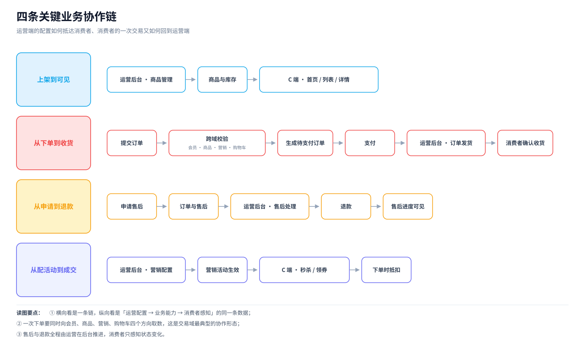
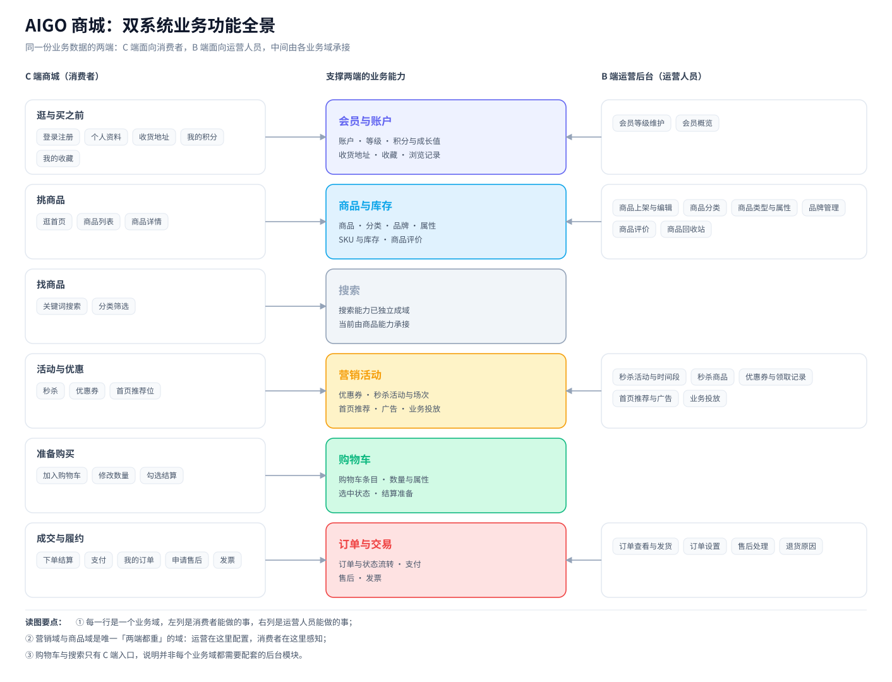

## 写在前面

爱购商城（AIGO）项目，业务和架构的拆解，这个项目是一个什么项目，分为消费者商城端（C端）和运营管理端（B端）；

## 一、参与者与系统边界

系统的参与者和所对应的功能的关系如下：

| 参与者 | 关注点 | 使用的系统 |
| --- | --- | --- |
| 消费者 | 浏览商品、加购、下单、支付、售后、发票、会员权益 | 商城用户端（C 端） |
| 运营人员 | 商品与分类、营销活动、订单与售后、数据看板 | 运营管理后台（B 端） |
| 测试与运维 | 负载验证、日志、指标、链路追踪、部署 | 与业务并行的保障工作 |

对于C端用户端和B端运营端，它们的关系是：

1. **C 端商城不是后台的一个模块**：它承载消费者完整的购物链路，并有自己的账户体系；
2. **B 端运营后台也不是 C 端的子页面**：它面向运营人员，有自己的账号体系与操作范围。

两端在业务上各自独立，却又作用于同一份业务数据。

## 二、C 端商城：消费者能做什么

### 2.1 一条完整的消费者旅程

消费者在商城里做的事情，可以串成一条主线：

> 注册 / 登录 → 逛商品 → 找商品 → 加购物车 → 结算下单 → 支付 → 收货 → 售后 / 开票

这条主线之外，还有两条贯穿始终的支线：

- **账户与会员**：维护收货地址、查看积分与等级；
- **营销参与**：逛秒杀、领优惠券，并在结算时用掉它们。

### 2.2 业务功能清单

| 阶段 | 消费者能做的事 | 对应页面 |
| --- | --- | --- |
| 账户 | 注册、登录 | 登录、注册 |
| 进入商城 | 浏览首页推荐、广告位与活动入口 | 首页 |
| 挑商品 | 按分类浏览商品列表、查看商品详情 | 商品列表、商品详情 |
| 找商品 | 按关键词搜索、按分类筛选 | 搜索结果 |
| 参与活动 | 查看秒杀商品、进入秒杀下单流程 | 秒杀详情、秒杀下单确认 |
| 准备购买 | 加入购物车、修改数量与规格、勾选结算 | 购物车 |
| 下单 | 确认收货地址、商品、优惠与最终金额 | 结算确认 |
| 支付 | 选择支付方式并完成支付 | 支付页、支付宝收银台、默认收银台、支付回跳 |
| 查订单 | 查看订单列表与订单状态 | 订单列表、订单状态 |
| 收货 | 确认收货 | 订单列表 |
| 售后 | 提交售后申请、查看售后进度 | 售后列表 |
| 开票 | 提交发票申请、查看与下载发票 | 发票申请、发票列表 |
| 会员中心 | 维护个人资料与收货地址、查看我的积分 | 个人资料、收货地址、我的积分 |

这份清单本身就是一份业务需求说明：**登录 →浏览 → 加购 → 结算 → 支付 → 履约 → 售后 → 发票**，外加会员中心这一条贯穿始终的支线。

## 三、B 端运营后台：运营人员能做什么

后台并没有把所有业务都做成管理页面，而是围绕**商品、订单、营销**三块业务加一个**数据看板**来组织。

| 模块 | 运营人员能做的事 |
| --- | --- |
| 商品 | 商品的新增、修改、上下架、回收站、评价管理；商品分类维护；商品类型与属性维护；品牌管理 |
| 订单 | 订单列表与详情；发货；订单设置；售后订单处理；退货原因维护 |
| 营销 | 秒杀活动与时间段配置；秒杀商品关联；优惠券创建与领取记录；首页的新品、人气、品牌、专题推荐；广告位；业务投放 |
| 数据看板 | 顶部指标、待办事项、商品概览、会员概览、订单汇总、订单趋势 |

## 四、模块之间怎么协作

两端的模块不是各管一段，而是围绕同一份业务数据互相接力。下面四条链路覆盖了绝大部分协作场景。

### 4.1 上架到可见：运营配置，消费者感知

运营在商品模块维护商品、分类、品牌与属性，商品上架后，消费者立刻能在首页、商品列表和商品详情看到它。

协作的关键点是：**商品的状态由运营决定，消费者看到的只是状态的结果**。同一个商品身上挂着上架、新品、推荐等多个标记，运营在后台点一次，消费者侧就变一次。

### 4.2 从下单到收货：交易模块向四个方向取数

这是协作面最广的一条链路。消费者点下「提交订单」之后，交易模块需要同时向四个方向确认：

| 协作方 | 要确认的内容 |
| --- | --- |
| 会员 | 下单人是谁、享受什么等级权益、可用积分有多少 |
| 商品 | 商品与规格是否有效、当前价格、库存是否充足 |
| 营销 | 优惠券能不能用、是否在秒杀场次内、这一单优惠多少 |
| 购物车 | 本次结算选了哪些商品、各买几件 |

四个方向都确认通过，才生成订单；订单生成后进入支付，支付成功后由运营在订单模块发货，消费者确认收货，一次交易才算闭环。

### 4.3 从配活动到成交：营销模块的双重角色

运营在营销模块配置秒杀活动、时间段与参与商品，或者创建优惠券；消费者在 C 端看到秒杀入口、领取优惠券；到了下单那一刻，营销模块的规则会再次参与计算，决定这一单实际付多少钱。

也就是说，**营销模块同时参与「展示」和「结算」两个环节**：展示决定消费者会不会买，结算决定消费者付多少。

### 4.4 从申请到退款：售后由运营推进

消费者提交售后申请后，接力棒交到运营手里：运营在售后模块查看申请、做出处理结论，退款随之发生，消费者侧只感知到状态变化。

与这条人工链路相邻的，还有两条完全自动的链路：**订单超时未支付会自动关闭、收货到期会自动确认收货**。这两条规则的参数由后台的订单设置决定，属于"运营配置、系统执行"。

### 4.5 会员：等级与积分如何参与交易

会员模块不只是"存用户信息"：等级决定会员权益，积分可以参与抵扣，成长值记录会员的活跃轨迹。交易模块在下单时会向会员模块核对可用积分，交易完成后又会产生新的积分与成长值变化。

## 五、两个系统的业务分工与数据关系

两个系统的职责分工如下表所示：

| 维度 | C 端商城 | B 端运营后台 |
| --- | --- | --- |
| 面向谁 | 消费者 | 运营 / 管理员 |
| 负责什么 | 发生交易：浏览、下单、支付、收货、售后 | 组织供给：商品、活动、订单处理、售后 |
| 数据角色 | 业务数据的产生者与消费者 | 业务数据的配置者与处理者 |
| 账户体系 | 消费者账户 | 运营账户，与消费者账户互不相通 |

它们之间最关键的一点是：**两端操作的是同一份业务数据，不存在「同步」这个概念**。

于是就有了这样一条规律：

> 运营在后台把商品上架，消费者下一秒钟在详情页就能买到；运营在后台配好一场秒杀，消费者在活动时段内就能以活动价下单。

好处很直接：运营的改动即时生效，不需要任何数据同步机制，也不会出现「后台改了前台看不到」的问题。

## 六、业务功能全景

把前面所有信息画在一张图上：

每一行是一个业务域：左列是消费者能做的事，右列是运营人员能做的事，中间是承接这两端的业务能力。

## 七、小结

- 这是一套「**一个 C 端商城 + 一个 B 端运营后台**」的双系统体系，两者不是主从关系，而是同一份业务数据的两端；
- C 端负责「发生交易」：浏览 → 加购 → 结算 → 支付 → 收货 → 售后 → 发票，外加会员这条支线；
- B 端负责「组织供给」：商品、订单、营销三大模块加一个数据看板，且**只给运营提供需要人工决策的入口**；
- 两端靠**模块之间的接力**协作：下单要同时向会员、商品、营销、购物车取数，售后由运营推进，活动配置由营销模块贯穿展示与结算两个环节；
- 两条链路最终落在**同一份业务数据**上，运营改动即时生效，这是理解整个项目的前提。