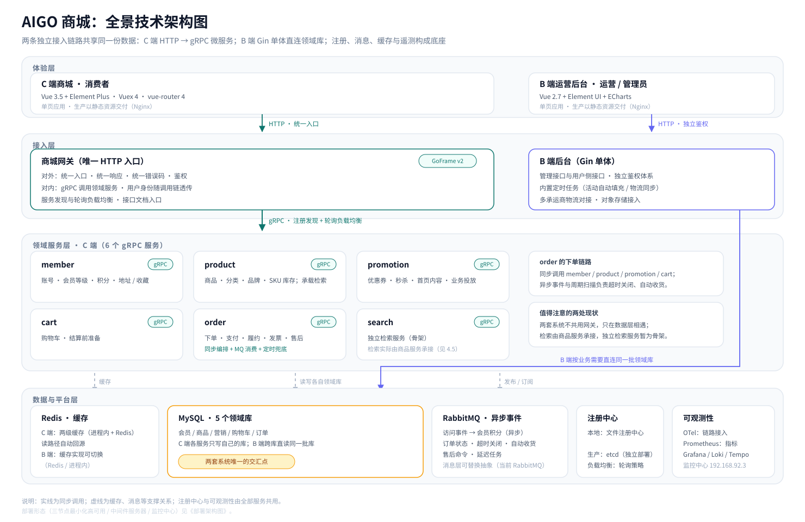
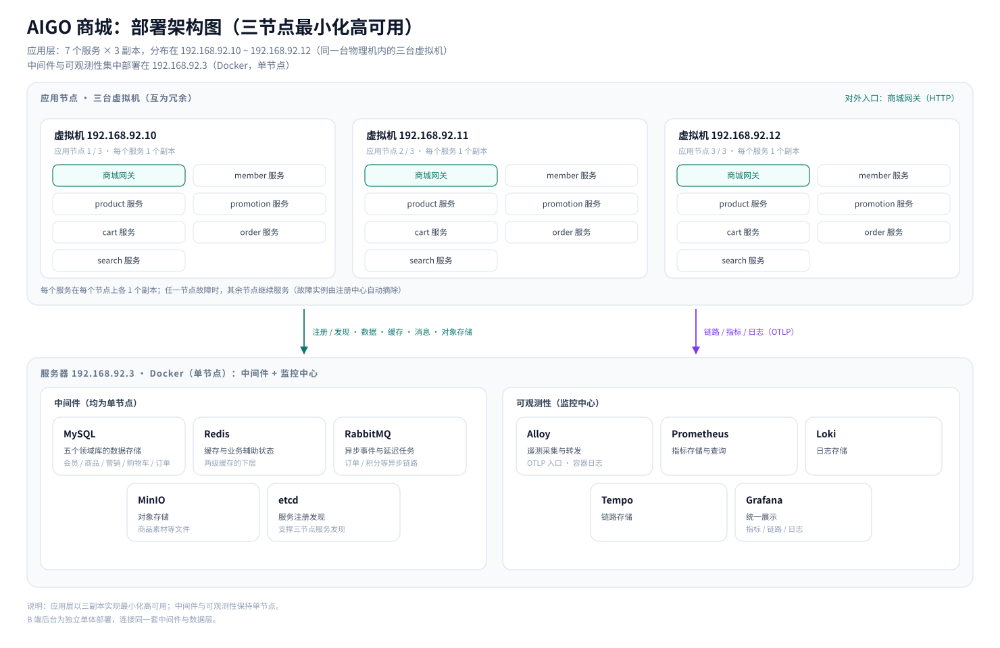

## 写在前面

第 01 篇从业务视角看了这两套系统「做什么」，后续文章还会拆开它们的页面与接口面。这一篇先补上两者中间的「地基」：**这些系统是用什么技术搭起来的、为什么这么选、在整体上怎样分层，以及它们实际上被部署成了什么样子**。

这一篇只讲架构：不引用任何代码，也不展开工程目录里的实现细节；文中的判断都可以在两套系统的配置与文档中得到印证。

- C 端后端：GoFrame v2 + gRPC 微服务 + HTTP 网关；
- B 端后端：Gin + GORM 单体；
- 两端前端：Vue 3 与 Vue 2.7 的两套技术栈；
- 数据与中间件：MySQL、Redis、RabbitMQ、MinIO、文件注册中心 / etcd；
- 可观测性：OpenTelemetry + Prometheus + Grafana，配 Loki / Tempo / Alloy；
- 部署形态：三节点最小化高可用 + 独立中间件服务器。

## 一、C 端后端：GoFrame v2 + gRPC + HTTP 网关

### 1.1 为什么是 GoFrame v2

C 端是一个由网关和 6 个领域服务组成的微服务系统。这类系统的难点往往不在业务代码，而在"配套"：服务如何互相发现、调用如何治理、配置与日志如何统一、指标与链路如何接入。

GoFrame v2 的选型逻辑，就是用一套框架一次性解决这些配套问题：gRPC、注册发现、负载均衡、配置、日志、数据库与 Redis 访问、指标与链路接入，都在同一套框架与它的扩展体系之内。由此带来的直接好处是——**业务之外的部分不需要"拼装"**：注册中心可以按环境切换实现（本地文件注册中心 / 生产 etcd），链路与指标有统一的装配入口，每个服务都保持同一套分层与启动约定。

一个很好的对照就在隔壁：B 端后台是单进程应用，用的是更轻的 Gin + GORM；C 端是多进程微服务，才需要"配套完整"的方案。这不是"哪个框架更好"，而是"哪个匹配当前的系统形态"。

### 1.2 HTTP 对外、gRPC 对内

C 端对外只有**一个 HTTP 入口**——商城网关；服务与服务之间则全部使用 gRPC。这个组合是 BFF（Backend For Frontend）模式的典型形态：

- 对前端友好：前端只面对一个地址、一套响应结构，不需要知道背后有几个服务；
- 对内强契约：gRPC 接口由协议定义，服务边界清晰、性能好，也保留了多语言与流式能力的空间；
- 职责分离：网关负责"接入"（鉴权、响应封装、错误码），领域服务只负责"领域"。

### 1.3 网关的横切能力

网关不只是一台反向代理，它承接了整个 C 端的横切关注点：

- **统一响应与分域错误码**：所有接口返回同一种响应结构；错误码按业务域划分，让错误从领域服务 → 网关 → 前端一路保持可诊断；
- **鉴权与用户上下文**：登录态在网关校验，用户身份随调用链透传到每个领域服务——领域服务不需要自己解析 Token，就能知道"当前是谁"；
- **负载均衡**：通过服务发现拿到实例列表后，以轮询策略分发请求（三节点部署时，请求自然分摊到各个副本）；
- **接口文档入口**：网关对外提供统一的接口文档，作为前后端联调的契约。

## 二、B 端后端：Gin + GORM 单体

B 端后台的技术选型与 C 端刻意不同：**Gin + GORM 的单体应用**。原因不在技术偏好，而在业务形态：

- 后台面向运营人员，**并发低、请求形态简单**，不需要 RPC 与服务治理这一整套基础设施；
- 后台的核心诉求是"**看得全**"：数据看板、商品与订单管理都需要跨会员、商品、营销、交易多个业务域做聚合查询——一个进程直连多个领域库，比拆成服务再互相调用更直接；
- 管理后台与商城有各自的账号体系与操作边界，作为两个独立系统部署，更利于隔离与演进。

虽说是"单体"，它内部并不简单：除了业务接口，还内置了定时任务（如活动的自动填充、物流信息同步）、多承运商的物流对接能力，以及对象存储（商品素材等文件）与运行指标的接入——它是一个能独立站起来的应用，而不是商城网关后面的一个下游。

## 三、两端前端：Vue 3 与 Vue 2.7

两端前端的技术栈对照：

| 维度 | C 端商城 | B 端运营后台 |
| --- | --- | --- |
| 框架 | Vue 3.5 | Vue 2.7 |
| 组件库 | Element Plus | Element UI |
| 路由 / 状态 | Vue Router 4 / Vuex 4 | Vue Router 3 / Vuex 3 |
| 图表 | — | ECharts + v-charts |

部署上，两个前端最终都以**静态资源**的形式交付，由 Nginx 承载并转发对后端接口的请求——这也是前后端分离项目最常见的交付形态。

## 四、数据与中间件

### 4.1 MySQL

C 端的领域服务按业务域各自拥有一个数据库——会员、商品、营销、购物车、订单共五个领域库（网关负责接入、检索由商品服务承接，它们不持有独立数据库）。

这里最重要的架构事实是：**B 端运营后台连接的是同一批领域库**。于是就有了贯穿整个系列的那句话——两套系统没有共用网关、没有互相调用，它们只在**数据层**相遇；运营在后台做的改动，消费者端立刻可见，不存在"数据同步"这个环节。

### 4.2 Redis 与两级缓存

Redis 在两端的角色不完全一样：

- C 端：承担热点数据的缓存，采用**两级缓存**设计——进程内缓存（L1）挡住绝大部分重复读，Redis（L2）作为跨实例共享的缓存层，读路径自动回源；
- B 端：缓存被设计成一层可切换的抽象，Redis 与进程内缓存两种实现可以按部署环境选择。

两端共同的设计取向是：**缓存是可替换的实现，而不是硬编码的依赖**。

### 4.3 RabbitMQ：异步事件与延迟任务

消息队列在系统里承担"解耦异步"的角色，几条典型链路：

- 用户访问事件：网关把用户的访问行为异步发布，会员服务消费后发放积分——一条跨服务的异步链路；
- 订单相关：订单状态变化、支付状态、超时关闭、自动收货、售后命令都通过消息投递；
- 延迟与兜底：**延迟消息负责在精确到期点推进状态，周期扫描负责覆盖服务重启或消息投递失败的窗口**——一个管"准时"，一个管"兜底"，这是订单链路上一条重要的设计。

消息层同样做了**可替换抽象**（生产者、消费者、订阅与消费结果模型），当前落地实现是 RabbitMQ；接口足够克制，未来更换或增加实现时不影响业务代码。

### 4.4 注册中心：本地文件注册中心，生产 etcd

服务注册发现按环境采用两种形态：

- 本地开发：使用**文件注册中心**——注册信息落在共享目录里，不需要任何外部组件就能把整套微服务跑起来；
- 生产环境：使用 **etcd**，独立部署在中间件服务器上，7 个服务都向它注册，调用方按服务名解析实例。

选择哪种形态由配置决定。对三节点部署来说，注册中心是"高可用"能够成立的关键——节点故障时，实例被摘除，流量自动流向其余副本。

### 4.5 配置与日志的统一约定

- 配置：同一套服务代码，通过**替换配置**适配本地、容器与生产环境，而不是改代码；
- 日志：两端各自统一了日志的落盘与滚动策略（按天滚动、限制单文件大小与保留数量），便于统一采集进日志系统（见下一节）。

## 五、可观测性：OTel + Prometheus + Grafana 体系

项目采用如下常见的可观测性组合：

| 信号 | 采集 | 存储 | 展示 |
| --- | --- | --- | --- |
| 指标 | 各服务暴露指标端点 | Prometheus | Grafana |
| 链路 | OpenTelemetry（C 端 OTLP/gRPC、B 端 OTLP/HTTP） | Tempo | Grafana |
| 日志 | Alloy 采集容器日志 | Loki | Grafana |

- **OpenTelemetry 作为采集标准**：两端用不同的传输方式接入（C 端走 OTLP gRPC、B 端走 OTLP HTTP）；
- **Grafana 作为统一入口**：指标、链路、日志三种数据都汇入 Grafana，排障时可以在同一个界面里从指标下钻到链路、再跳到日志；
- **环境开关**：本地开发默认关闭链路与指标上报，联调与部署环境才打开——避免开发流量污染监控数据。

## 六、整体分层：四层视角

根据一个请求走过的组件，整个系统可以分成以下四层：

| 层 | C 端 | B 端 |
| --- | --- | --- |
| 前端交互层 | Vue 3 商城用户端 | Vue 2.7 运营后台 |
| 接入层 | 商城网关（HTTP 唯一入口） | Gin 单体（管理接口 + 用户侧接口） |
| 领域服务层 | member / product / promotion / search / cart / order（gRPC） | 无（业务逻辑在单体内部） |
| 数据与平台层 | MySQL×5、Redis、RabbitMQ、注册中心、可观测性 | 同一个数据层 + 自有缓存 |

再往下看一层，每个 C 端领域服务内部遵循同一套分层约定：**接口层 → 业务层 → 数据访问层**，职责自上而下收敛；而横切能力（统一响应、错误码、用户上下文、缓存、消息）则被收敛到一个**共享的公共库**里，避免在每个服务里重复实现、各自演化。

## 七、全景架构图

## 八、实际部署架构：三节点最小化高可用

讲完逻辑架构，再看它实际跑在哪里——这套环境追求的是一种"**最小化的高可用**"：应用层做多副本冗余，中间件与观测保持精简。

### 8.1 应用层：每个服务三副本

7 个服务（网关 + 6 个领域服务）都部署为 **3 副本**，分布在三台虚拟机上（192.168.92.10 ~ 192.168.92.12，这三台虚拟机运行在同一台物理机内）：

- 每个服务在每个节点上各有一个副本，任一节点故障时，故障实例被注册中心摘除，流量由其余两个节点继续承接；
- 发布时可以逐个节点进行，保持整体可用；
- 三副本是"最小的高可用形态"——允许单节点故障，又不需要太多的机器。

### 8.2 中间件：独立服务器 + Docker 单节点

中间件全部集中部署在一台独立服务器（192.168.92.3）上，通过 Docker 以**单节点**形态提供：

| 组件 | 角色 |
| --- | --- |
| MySQL | 五个领域库的数据存储 |
| Redis | 缓存与业务辅助状态 |
| RabbitMQ | 异步事件与延迟任务 |
| MinIO | 对象存储（商品素材等文件） |
| etcd | 生产环境的服务注册发现中心 |

把中间件集中到独立服务器，与业务节点解耦：业务节点可以自由扩缩容，中间件则是"共享底座"。需要注意的是：这套环境用应用层的三节点冗余来验证高可用形态，数据层与消息层的冗余等待后续有足够的机器再去验证。

### 8.3 可观测性：监控中心

可观测性组件以监控中心的形式集中部署（与中间件同在这台服务器上）：

| 组件 | 角色 |
| --- | --- |
| Alloy | 遥测采集与转发（OTLP 入口、容器日志采集） |
| Prometheus | 指标存储与查询 |
| Loki | 日志存储 |
| Tempo | 链路存储 |
| Grafana | 统一展示（指标 / 链路 / 日志） |

业务节点上的每个服务把链路、指标与日志统一上报到监控中心——应用只负责"产生遥测"，监控中心负责"收集与展示"，这正是标准的可观测性分工。

### 8.4 部署视图

读图提示：

1. 上半部分是应用层：三台虚拟机、每个服务三副本，任一副本故障不影响整体；
2. 下半部分是 192.168.92.3 服务器：中间件（Docker 单节点）与监控中心；
3. 应用节点与中间件之间是注册发现与数据、缓存、消息的日常流量；到监控中心则是遥测数据；
4. B 端后台是独立单体部署，连接同一套中间件与数据层。

## 九、小结

| 维度 | 选型 | 关键理由 |
| --- | --- | --- |
| C 端后端框架 | GoFrame v2 | 微服务配套完整（gRPC、注册发现、配置日志、指标链路），不需要拼装 |
| 服务通信 | gRPC（内部）+ HTTP（网关对外） | BFF 模式：前端简单，内部强契约 |
| B 端后端 | Gin + GORM 单体 | 运营侧低频、要跨库聚合，"单体直连"比服务化更直接 |
| 数据 | MySQL 五个领域库 | 一服务一库；两套系统共享同一批库，是唯一的交汇点 |
| 缓存 | 两级缓存（进程内 + Redis） | 抵御热点读；实现可替换 |
| 消息 | RabbitMQ + 可替换抽象 | 异步解耦、延迟任务；核心接口不绑定具体实现 |
| 注册中心 | 文件注册中心（本地）/ etcd（生产） | 本地零依赖起步，生产支撑三节点高可用 |
| 可观测性 | OTel + Prometheus + Grafana（Loki / Tempo / Alloy） | 事实标准组合，三种信号统一汇入 Grafana |
| 部署形态 | 三节点最小化高可用 | 应用三副本冗余 + 独立中间件服务器（单节点） |

- C 端选了一套"自带微服务配套"的框架（GoFrame v2），把所有服务治理收进统一的装配流程；
- 两端前端的分裂是**生态成本**的决定，不是随意为之；
- 数据层是两套系统唯一的交汇点；缓存、消息、注册中心都做了"实现可替换"的抽象；
- 部署上采用"**三节点最小化高可用**"：应用层每个服务三副本，中间件与可观测性集中在独立服务器；