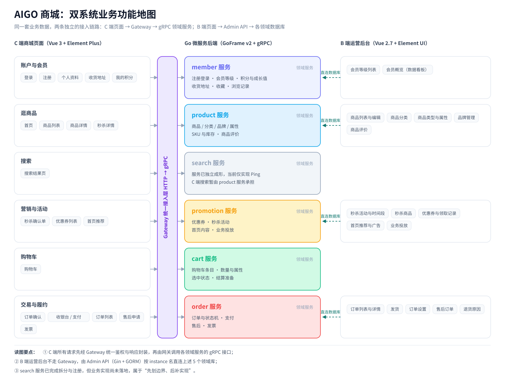

## 写在前面

第 01 篇我们从业务视角看了这两套系统「对外提供什么能力」，这一篇换一个视角：**这些能力在工程上是怎样被组织和暴露出来的**。

具体回答四个问题：

1. C 端的页面与接口面长什么样？
2. B 端的模块与接口面长什么样？
3. 两套系统的技术栈与鉴权体系差在哪里？
4. 两个仓库的工程是怎么组织的？

这一篇是全系列的**技术底座**：后面讲网关、服务拆分、订单与部署时，会反复回到这里的几张表。

## 一、C 端商城：页面与接口面

### 1.1 页面清单

C 端前端是 Vue 3 应用，路由定义在 `frontend/src/router.js`。把路由按业务动作归类，可以得到这样一张表：

| 业务动作 | 页面 | 路由 |
| --- | --- | --- |
| 进入商城 | 首页 | `/index` |
| 浏览商品 | 商品列表 | `/productList/:type` |
| 浏览商品 | 商品详情 | `/detail/:id` |
| 营销活动 | 秒杀详情 | `/secKillDetail/:id` |
| 营销活动 | 秒杀下单确认 | `/secKillOrderConfirm/:id/:token` |
| 查找商品 | 搜索结果 | `/searchResult/:keywords` |
| 准备购买 | 购物车 | `/cart` |
| 下单支付 | 结算确认 | `/order/confirm` |
| 下单支付 | 支付页 | `/order/pay` |
| 下单支付 | 支付宝收银台 | `/order/alipay` |
| 下单支付 | 默认收银台 | `/payment/default/cashier` |
| 下单支付 | 支付回跳 | `/payment/:method/:outTradeNo` |
| 订单履约 | 订单列表 | `/order/list` |
| 订单履约 | 订单状态轮询 | `/order/status/:id` |
| 订单履约 | 售后列表 | `/user/after-sale` |
| 发票 | 发票申请 | `/invoice/apply` |
| 发票 | 发票列表 | `/invoice/list` |
| 会员中心 | 个人资料 | `/user/profile` |
| 会员中心 | 收货地址 | `/user/address` |
| 会员中心 | 我的积分 | `/user/points` |
| 账户 | 登录 / 注册 | `/login`、`/register` |

这份清单本身就是一份业务需求说明：**浏览 → 加购 → 结算 → 支付 → 履约 → 售后 → 发票**，外加会员中心这一条贯穿始终的支线。

### 1.2 网关接口面

C 端所有请求都先进入商城网关（gateway），网关对外的 HTTP 路由注册在 `backend/app/gateway/internal/cmd/cmd.go`：

```go
s.Group("/api", func(group *ghttp.RouterGroup) {
    group.Middleware(middleware.UserContext, middleware.Response)
    group.Group("/v1", func(group *ghttp.RouterGroup) {
        registerPing(group)

        // 微服务健康探测：gateway 通过 gRPC 调用各下游服务的 Ping
        group.Bind(ping.NewV1())

        // 公开接口：无需登录
        group.Bind(memberpublic.NewV1()) // 注册、登录、获取验证码、修改密码
        group.Bind(portal.NewV1())
        group.Bind(search.NewV1())
        group.Bind(paymentpublic.NewV1()) // 支付回跳与异步通知（由支付平台签名校验）

        // 需要登录的接口
        group.Group("/", func(group *ghttp.RouterGroup) {
            group.Middleware(middleware.Auth, middleware.FirstAccess)

            group.Bind(memberauth.NewV1()) // 刷新Token、会员中心、地址、收藏、浏览记录
            group.Bind(cart.NewV1())
            group.Bind(order.NewV1())
            group.Bind(order.NewInvoiceV1())
            group.Bind(promotion.NewV1())
        })
    })
})
```

这段注册代码透露了三件事，后面第 05 篇会展开讲：

- 网关只暴露 **一个前缀 `/api/v1`**，所有业务能力都挂在这一个入口下；
- 路由天然分成 **公开组** 与 **登录组** 两级，登录组统一挂 `Auth` 与 `FirstAccess` 中间件；
- 网关是 **BFF（Backend For Frontend）模式**：对外是 HTTP，对内调用各领域服务的 gRPC 接口。

把网关暴露的路径按业务域归一下类，就能量出 C 端的能力面：

| 能力 | 网关路径（节选） | 归属领域服务 |
| --- | --- | --- |
| 账户与登录 | `/sso/register`、`/sso/login`、`/sso/refreshToken`、`/sso/getCurrentMember` | member |
| 会员中心 | `/member/center/getMemberInfo`、`/member/address/*`、`/member/collection/*`、`/member/readHistory/*` | member |
| 商品与首页 | `/pms/productInfo/{id}`、`/pms/cartProduct/{productId}`、`/home/*` | product / promotion |
| 搜索 | `/search/searchList` | 由 product 承担（见第 02 篇） |
| 营销与秒杀 | `/coupon/*`、`/seckill/*`、`/seckillOrder/*`、`/pms/flashPromotion/*` | promotion |
| 购物车 | `/cart/add`、`/cart/list`、`/cart/update/quantity`、`/cart/clear` | cart |
| 订单与支付 | `/order/generateOrder`、`/order/payOrder`、`/order/queryOrderList`、`/order/confirmReceipt` | order |
| 发票 | `/invoice/apply`、`/invoice/list`、`/invoice/download` | order |
| 售后 | `/afterSale/create`、`/afterSale/list`、`/afterSale/logistics` | order |
| 支付回跳 | `/payment/notify/{methodCode}/{outTradeNo}`、`/payment/status/{methodCode}/{outTradeNo}` | order |

### 1.3 走一条真实链路：打开商品详情

把上面两张表串起来，一次「打开商品详情」的完整路径是：

```
浏览器访问 /detail/:id
  → 前端调用 GET /api/v1/pms/productInfo/{id}
    → Gateway 校验登录态、注入用户上下文
      → 通过 gRPC 调用 product 服务的商品详情接口
        → product 服务读取 micro_mall_product 库并返回
```

这条链路上没有一次跨库 JOIN，也没有一次前端直连数据库——这正是微服务拆分的意义所在，第 08 篇会把整条主链路（下单 + 支付）画成时序图。

## 二、B 端运营后台：模块与接口面

### 2.1 前端模块

B 端前端是 Vue 2.7 + Element UI 工程，路由分组的命名直接沿用了电商领域里很常见的表名前缀惯例：`pms`（商品）、`oms`（订单）、`sms`（营销）。

| 一级模块 | 二级功能 |
| --- | --- |
| 商品（`/pms`） | 商品列表、添加/修改商品、商品详情、商品回收站、商品评价、商品分类、商品类型与属性、品牌管理 |
| 订单（`/oms`） | 订单列表、订单详情、发货列表、订单设置、售后订单、售后详情、退货原因设置 |
| 营销（`/sms`） | 秒杀活动列表、秒杀时间段列表、秒杀商品列表、优惠券列表与领取详情、品牌推荐、新品推荐、人气推荐、专题推荐、广告列表、业务投放 |
| 首页（`/home`） | 数据看板 |

### 2.2 后端接口面与独立鉴权

B 端后端是 Gin 应用，路由注册在 `backend/api/router/router.go`：

```go
func RegisterRouter(router *gin.Engine) {
	router.GET("/health", func(c *gin.Context) {
		c.JSON(http.StatusOK, gin.H{"status": "ok"})
	})
	router.GET("/metrics", gin.WrapH(promhttp.Handler()))

	router.Use(middleware.Context)
	router.Use(observability.GinMiddleware())
	router.Use(middleware.AccessLogger)
	router.GET("/swagger/*any", ginSwagger.WrapHandler(swaggerFiles.Handler))
	// 管理后台相关路由
	admin := router.Group("/admin")
	RegisterAdminRouter(admin)
	// 用户侧路由
	api := router.Group("/api")
	RegisterApiRouter(api)
}
```

可以看到 B 端后端除了业务路由，还自带 `/health`、`/metrics`（Prometheus 采集端点）与 `/swagger` 文档——这是一个"能自己站起来"的独立服务，而不是 C 端网关后面的一个下游。

鉴权也完全是另一套。C 端走网关的 `middleware.Auth`，B 端走自己的 `CheckLogin`：

```go
func CheckLogin(c *gin.Context) {
	token := c.GetHeader(constant.TOKEN_HEADER_NAME)
	if token == "" || !strings.HasPrefix(token, constant.TOKEN_PREFIX) {
		c.AbortWithStatusJSON(http.StatusOK, httputils.Error(httputils.UserNotLogin))
		return
	}
	token = strings.TrimPrefix(token, constant.TOKEN_PREFIX)
	userMap, err := service.ParseAPIToken(token)
	if err != nil {
		c.AbortWithStatusJSON(http.StatusOK, httputils.Error(httputils.UserNotLogin))
		return
	}
	userId := cast.ToString(userMap[constant.USER_ID_KEY])
	// 设置上下文userId
	c.Set(constant.USER_ID_KEY, userId)
}
```

顺带一个在拆解时值得记下的观察：B 端后端里除 `/admin` 之外，还注册了一组 `/api` 前缀的用户侧接口（`/api/healthCheck`、`/api/users/login`、`PUT /api/users`）。它们同样受 `CheckLogin` 保护，属于后台服务里保留的另一条入口，读代码时不要和 C 端网关的 `/api/v1` 混淆。

### 2.3 数据看板接口

B 端后台首页是一组聚合查询接口：

| 接口 | 含义 |
| --- | --- |
| `GET /admin/home/dashboard/top` | 顶部指标 |
| `GET /admin/home/dashboard/todo` | 待办事项 |
| `GET /admin/home/dashboard/product-overview` | 商品概览 |
| `GET /admin/home/dashboard/member-overview` | 会员概览 |
| `GET /admin/home/dashboard/order-summary` | 订单汇总 |
| `GET /admin/home/dashboard/order-trend` | 订单趋势 |

一个有趣的细节：`AdminPageListMember`（会员列表）这个接口已经实现，但**没有注册到路由上**——也就是说 B 端目前能看会员概览和会员等级，却看不到会员明细列表。这类"代码写了但没接线"的地方，在拆解老项目时经常会遇到，第 09 篇会集中讨论。

## 三、双系统技术对照

把两边摆在一起，差异一目了然：

| 维度 | C 端商城（`micro-mall`） | B 端后台（`micro-mall-admin`） |
| --- | --- | --- |
| 使用者 | 消费者 | 运营 / 管理员 |
| 前端技术栈 | Vue 3.5 + Element Plus + Vuex 4 + vue-router 4 | Vue 2.7 + Element UI + Vuex 3 + vue-router 3 + ECharts |
| 前端路由模式 | Hash 路由（`createWebHashHistory`） | History 路由 + NProgress |
| 后端技术栈 | GoFrame v2 + gRPC 微服务 + HTTP 网关 | Gin + GORM 单体应用 |
| 进程数量 | 网关 + 6 个领域服务 | 1 个后端进程 |
| 对外协议 | HTTP（`/api/v1`）→ 内部 gRPC | HTTP（`/admin`、`/api`） |
| 鉴权 | 网关中间件 `Auth` + `FirstAccess` | 中间件 `CheckLogin` + 独立 Token |
| 文档 / 监控 | 网关自带 OpenAPI 文档 UI | Swagger + `/metrics` |
| 数据访问 | 各服务只访问自己的库 | 按 `instance` 名直连 5 个领域库 |
| 部署形态 | 7 个容器 + 前端（`deploy/compose/docker-compose.yml`） | 单后端 + 前端 |

这张表里有两个值得注意的地方：

- **两端的前端技术栈是分裂的**：Vue 3 + Element Plus 与 Vue 2.7 + Element UI 并存。这不是随意为之——B 端后台大量复用了现成的后台模板与组件生态，生态迁移成本高于收益；C 端没有历史包袱，直接上了 Vue 3。
- **没有"统一网关"**：B 端不走 C 端的 gateway，而是自己的 Gin 进程直接对外。两套系统只在数据层相遇（见第 02 篇）。

## 四、仓库与工程组织

两个仓库都用了 Git 子模块来组织工程，根仓库本身只放协调性的内容（文档、部署编排、脚本）。

`micro-mall/.gitmodules`：

```ini
[submodule "backend"]
	path = backend
	url = https://github.com/Payne1993/micro-mall-backend.git
[submodule "frontend"]
	path = frontend
	url = https://github.com/Payne1993/go-mall-front.git
[submodule "locust"]
	path = locust
	url = https://github.com/Payne1993/micro-mall-locust.git
```

`micro-mall-admin/.gitmodules`：

```ini
[submodule "micro-mall-admin-backend"]
	path = backend
	url = https://github.com/huangpei1993/micro-mall-admin-backend.git
[submodule "micro-mall-admin-frontend"]
	path = frontend
	url = https://github.com/huangpei1993/aigo-admin-backend.git
```

克隆之后需要初始化子模块：

```bash
git submodule update --init --recursive
```

各目录的职责：

| 目录 | 职责 |
| --- | --- |
| `backend/app/{gateway,member,product,promotion,cart,order,search}` | 商城网关与 6 个领域服务 |
| `backend/db/` | 各领域库的表结构与备份快照 |
| `backend/docs/` | 分模块的架构与流程文档 |
| `frontend/` | C 端 Vue 3 用户端 |
| `locust/` | Python 压测工程（场景、测试数据、配置） |
| `deploy/compose/` | docker-compose 编排（7 服务 + 前端） |
| `devlog/` | 开发过程中的设计与踩坑记录 |

`locust` 被单独拆成一个子模块是很有意思的一点：**压测工程和业务工程是平级的**，而不是藏在某个目录的角落里。它的场景是按业务动作组织的（登录、商品、健康检查等），第 20 篇会专门讲压测与可观测性。

## 五、双系统结构地图

把这一篇的所有信息画在一张图上：



这张图按业务域分行，每一行同时给出「C 端用什么页面触达」和「B 端用什么模块维护」，中间是承接这套能力的领域服务。

## 六、小结

- C 端的所有请求先经网关、归一到一个 `/api/v1` 前缀下，并在路由层面天然分成公开组与登录组；
- B 端是一套自带 `/health`、`/metrics`、`/swagger` 的独立 Gin 服务，走 `/admin` 前缀与自己的 `CheckLogin` 鉴权；
- 两端前端技术栈分裂（Vue 3 + Element Plus 与 Vue 2.7 + Element UI），后端一个是微服务 + 网关，一个是单体；
- 两个仓库都以 Git 子模块组织工程，`locust` 压测工程与业务工程平级；
- 两套系统没有共用网关，只在**数据层**相遇——这是理解整套架构的关键前提，第 02 篇已经展开。

下一篇进入主线 A 的第四个问题：**为什么选 GoFrame v2 + gRPC，而不是继续用 Gin？分层又是怎么落的？**我们会画一张完整的全景架构图，把消息、缓存、注册中心、可观测性都摆进去。

