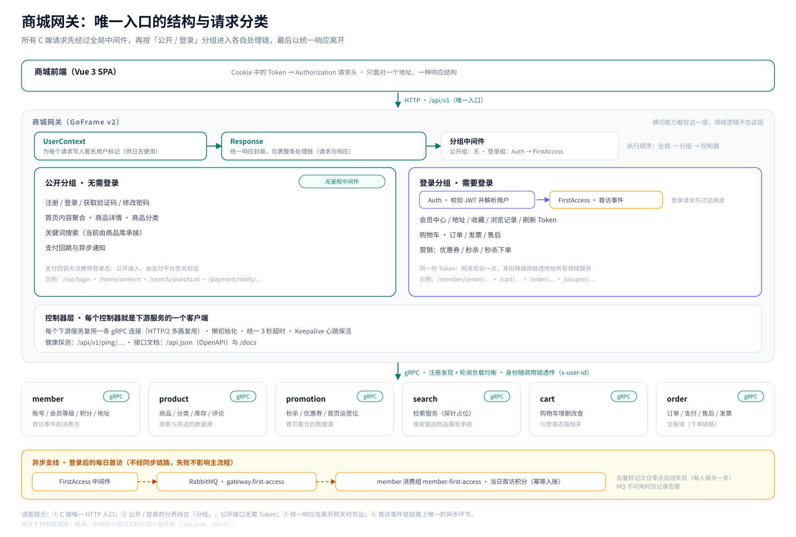
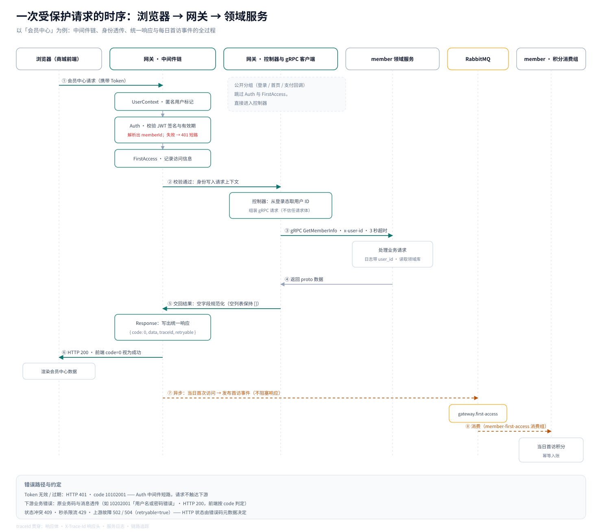

## 写在前面

第 01 篇从业务视角看了这两套系统「做什么」，第 02 篇讲完了「用什么搭、怎么分层、怎么部署」。从这一篇开始，镜头推到结构更细的地方——第一站是 C 端所有流量的入口：**商城网关**。

在整套微服务体系里，网关是一个「什么都碰一点、但什么领域逻辑都不做」的服务：它不持有数据库，不承载业务规则，却决定了所有请求以什么方式进入系统、以什么姿态离开系统。这一篇回答三个问题：

- 为什么所有 C 端请求都必须先经过它；
- 它替领域服务承接了哪些横切关注点；
- 一次请求在它内部究竟经历了什么。

与上一篇相同：本文不贴代码，只讲设计与机制；文中的每个结论，都能在网关的实现与配置里找到对应依据。

## 一、为什么要有网关：BFF 的两副面孔

C 端对外只有一个 HTTP 入口：**商城网关**（监听 8000 端口）。理解它的价值，可以先看它的两副面孔。

**对前端，它是唯一「看得见」的服务端。** 商城前端不知道背后有几个服务：它只面对一个地址前缀（/api/v1）、一种响应结构；Token 从 Cookie 取出后放进 Authorization 请求头；成功与失败都按同一套约定判断。至于背后有多少个领域服务、每个服务部署了几个副本、请求最终落在哪台机器上——前端统统不需要知道。

**对内，它是一组 gRPC 客户端的集合。** 网关自己不实现任何领域逻辑：注册登录、商品、购物车、订单、营销，每一类能力背后都对应着 gRPC 领域服务。网关通过服务发现解析出实例列表、按轮询分发请求，把 HTTP 语义「翻译」成 gRPC 调用。

这种「为前端裁剪、替前端组装」的角色，就是 **BFF（Backend For Frontend）**。它带来两个直接的结果：

1. **横切关注点被收敛到一处**：鉴权、响应格式、错误码、访问事件只在网关实现一次，六个领域服务不需要各自处理——与第 02 篇呼应：服务内部的横切能力收敛进公共库，而整个 C 端的「公共入口」就是网关；
2. **网关保持很薄**：它**不持有数据库**。会员、商品、营销、购物车、订单五个领域库分别属于各自的服务，网关没有自己的库，也不直接读写任何库；所有数据都通过下游接口获得。

顺带对照 B 端：管理后台没有网关，Gin 单体自己就是入口。原因同样在第 02 篇：B 端只有一个进程、一套账号体系，「给入口做减法」没有收益；而 C 端是多服务多副本，才需要这样一层统一入口，把六个服务的差异挡在门外。

## 二、入口的结构：两条全局中间件 + 两个路由分组

网关的处理结构可以概括为一句话：**一条全局中间件链，一条按登录态划分的路由分界线**。

所有业务接口都挂在 /api 下，最先经过两条全局中间件：

- **UserContext**：给每个请求的上下文写入一个「用户标记」占位（匿名），保证任何请求在日志里都有统一的用户维度；
- **Response**：包裹整条处理链——请求进来时「挂起」等待，无论后续发生了什么（正常返回、业务报错、参数校验失败），离开网关的响应都会在这里被写成同一种结构。

在 /api/v1 之下，路由被分成两组（另有健康探测接口，见第七节）：

| 分组 | 前置中间件 | 代表接口 | 说明 |
| --- | --- | --- | --- |
| 公开分组 | 无 | 注册 / 登录 / 获取验证码 / 修改密码；首页内容 / 商品详情 / 商品分类；关键词搜索；支付回跳与异步通知 | 无需登录态 |
| 登录分组 | Auth、FirstAccess | 会员中心 / 地址 / 收藏 / 浏览记录 / 刷新 Token；购物车；订单 / 发票 / 售后；优惠券 / 秒杀 | 需要登录态 |

这条分界线不只是「要不要 Token」这么简单：

- **Auth 中间件**（登录分组的第一道）：校验 JWT 并把身份写进上下文；校验不通过立即返回 401，请求**不会触达任何下游服务**；
- **FirstAccess 中间件**（登录分组的第二道）：在处理请求的同时记录一次访问事件（谁、何时、访问了什么），请求结束后异步送出——它是会员「每日首访」积分的触发源（第六节展开）。

有一个细节值得一提：**公开分组里的支付回跳与异步通知**。支付平台回调既没有登录态、也不会携带商城 Token，所以它们放在公开分组；但它们的安全校验并不在网关，而在下游订单服务里由**支付平台签名**完成——网关只负责把它们接进来。

另外，路由与文档是「同源」的：每个接口在定义处就声明了路径、方法与说明，路由注册、OpenAPI 文档（/api.json）和在线文档页（/docs）都由同一份声明生成——不存在「文档与实现两张皮」。

读图提示：

1. 所有请求先经过全局中间件（UserContext、Response），再按分组进入各自的处理链；
2. 公开分组无需 Token；登录分组先过 Auth（鉴权）与 FirstAccess（访问事件）；
3. 控制器层是「每个控制器即一个下游客户端」，每个服务复用一条 gRPC 连接；
4. 底部的异步支线（首访事件）不属于同步链路，失败不影响任何请求。

## 三、统一响应：让所有接口长成一样

Response 中间件是网关最重要的「外观」约定：**无论成功还是失败，离开网关的响应体都是同一种结构**。

| 字段 | 含义 |
| --- | --- |
| code | 业务码：成功为 0；失败为分域错误码（见第四节） |
| message | 提示信息 |
| data | 业务数据（成功时）；失败时通常为空 |
| traceId | 本次请求的链路 ID，可直接用于查日志与链路 |
| retryable | 本次失败是否「可以重试」（由错误码元数据决定） |

几个容易被忽略、但很关键的细节：

- **空列表也要是列表**。领域服务返回的是 protobuf 数据，网关写出前会做一次规范化：某个列表字段即使为空，也会以空数组的形式保留，而不是整个字段消失——前端列表渲染代码因此不需要到处判空；
- **特殊响应直接放行**。文件流、SSE 事件流、PDF 等类型不套统一信封；比如支付平台只认回调接口返回的纯文本 success，网关会在订单状态持久化成功后原样写出，不会包装成 JSON；
- **HTTP 状态不等于业务结果**。业务类失败（如「用户名或密码错误」）同样是 HTTP 200，前端按 code 判断；真正的状态码（400、401、409、429、5xx）由错误码元数据决定——这就引出下一节的错误码体系；
- **traceId 有三级来源**：优先沿用上游传入的 X-Trace-Id / X-Request-Id（请求头或响应头里已有的），其次是本次链路追踪的 span ID，最后兜底自动生成；无论来源是哪个，都会回写到响应头并放进响应体——一个 traceId 就能把前端、网关与领域服务的日志串起来。

## 四、统一错误码：一种能被「念出来」的编码空间

C 端的错误码集中定义在公共库里、按业务域分文件维护。每个错误码是一个 8 位数字，四段各有含义：

| 段位 | 含义 |
| --- | --- |
| 第 1 位 | 级别：1 = 业务类（HTTP 200）；2 = 系统类（5xx）；3 = 限流类（429） |
| 第 2-3 位 | 服务：01 网关、02 会员、03 商品、04 订单、05 购物车、06 营销、07 搜索 |
| 第 4-5 位 | 类别：01 参数、02 认证、03 状态冲突、04 不存在、05 依赖失败、06 业务规则、07 限流、08 并发冲突、09 未实现、10 内部错误 |
| 第 6-8 位 | 序号 |

例如：10102001 = 业务级（1）· 网关（01）· 认证类（02）· 001 号，即「未登录或 Token 已过期」；20408001 = 系统级（2）· 订单（04）· 并发冲突类（08）· 001 号，即「订单状态更新版本冲突」。

每个错误码还注册了**元数据**：对应的 HTTP 状态，以及是否可重试；没有显式注册的错误码，则按编码规律推断出大致的 HTTP 状态。于是同一套错误码同时服务三拨使用者：

| 使用方 | 拿到什么 |
| --- | --- |
| 前端 | code 判断业务结果（成功 = 0）；401 / 403 视为登录态失效并跳转登录；其余情况弹出 message |
| 调用方 | retryable = true 的失败（如库存锁定失败、秒杀限流）可以安全重试 |
| 排障者 | 错误码 + traceId，直接定位到具体服务与类别 |

**错误码是怎么跨服务传回来的？** 领域服务内部抛出的是带错误码的业务错误；经过 gRPC 这一跳时，业务码会作为 gRPC 状态码随响应一起传输、消息原样携带；网关侧再把它还原成业务码，交给 Response 中间件写进统一响应。也就是说，一次「用户名或密码错误」从会员服务出发，经过 gRPC 与网关抵达前端时，code 与消息是一路保真的——这正是第 02 篇所说的「错误从领域服务到网关再到前端保持可诊断」。

几个典型对照：

| 场景 | code | HTTP 状态 |
| --- | --- | --- |
| 请求参数解析失败 | 10101001 | 400 |
| 未登录 / Token 过期 | 10102001 | 401 |
| 无权限访问 | 10102002 | 403 |
| 用户名或密码错误（业务失败） | 10202001 | 200 |
| 订单状态版本冲突 | 20408001 | 409 |
| 秒杀请求触发限流 | 30607001 | 429（可重试） |
| 购物车写入失败 | 20505001 ~ 20505004 | 503（可重试） |

另外，网关域的错误码里还预留了上游故障语义：下游服务不可用（20105001，502）与下游调用超时（20105002，504），两者都标记为可重试——这是错误码词汇表为「上游异常」准备的位置。

## 五、鉴权与用户上下文：一次解析，全程携带

登录分组的鉴权由 Auth 中间件完成，流程可以拆成五步：

1. **取 Token**：从 Authorization 请求头读取（支持「Bearer 前缀 + Token」的写法，也接受裸 Token）；
2. **验签名**：只接受 HMAC 类签名方式，密钥来自网关配置；
3. **验有效期**：解析失败或已过期一律拒绝；
4. **解析用户身份**：从 Token 的 memberId 声明解析出用户 ID——这里有一个细节：解析过程保持长整型精度、不经过浮点数，避免大整数会员 ID 出现精度丢失；
5. **写入上下文**：把用户 ID 同时写入请求上下文（供控制器使用）与用户标记（供日志使用）。

任何一步失败，结果都是同一个：立即返回 401 + 10102001，请求不再继续。对前端来说，「没带 Token」「Token 过期」「Token 内缺少用户信息」是同一种可处理状态——跳登录页；对下游服务来说，非法请求根本不会到达。

**用户上下文不止活在这一跳。** 认证通过后，用户 ID 会继续向整条链路传递：

- 控制器从上下文读取用户 ID，而不是从请求参数里取——这条约束是修复过线上问题后固化下来的：曾有更新接口漏传会员 ID，导致下游按 id = 0 更新而静默失败；修复方式就是让每个控制器都从登录态取 ID（目前全站 40 余处调用，只有个别早期接口的路径参数里还保留着 memberId 的形态）；
- gRPC 客户端拦截器把用户 ID 放进调用 metadata（键为 x-user-id），并统一施加 3 秒超时；领域服务的服务端拦截器再把它还原进上下文——**用户在网关登录一次，跨服务日志里每一跳都带着同一个 user_id**；
- 日志组件把 user_id 作为上下文键追加到日志行上，配合 traceId，一个用户、一次请求的轨迹在日志中可检索。

**信任边界也在这里。** 网关明确不信任「客户端自报」的数据：登录审计使用的客户端 IP 由网关自己从连接中提取（请求体里就算带 IP 字段也不采信）；唯一标识身份的信息只认 Token；支付回调因为没有身份，改用支付平台签名校验。这些取舍背后是同一句话：**凡是能由服务端自己得出的，绝不接受客户端提交**。

## 六、每日首访：一条被异步化的访问事件

FirstAccess 中间件是登录分组里很值得单独讲的角色——它是「业务奖励」从同步动作变为事件驱动的产物。

按时间顺序展开它的行为：

1. **请求阶段只做记录**：认证通过后，它只记录三样东西——访问的 URL、用户 ID、当前时间；
2. **放行请求**：把请求交给后面的控制器，访问记录先「存着」；
3. **请求结束后异步处理**：启动后台任务，先做**当天去重**——用原子写入检查「今天是否已经为该用户发过事件」，去重标记在次日零点自动失效；只有当天第一次访问才会真正发布消息，主题是 gateway.first-access；
4. **失败降级**：消息队列不可用时只记一条告警日志，**不影响请求的任何处理**。

为什么是「当天第一次」？因为它的下游是**会员的每日积分**：会员服务以 member-first-access 消费组订阅该主题，把消息换算成一笔「当日首访积分」，并做幂等入账——同一用户同一天即使收到重复消息，积分也只入账一次。在这个链路里，网关只负责「如实上报事实」（谁在什么时候来过），积分怎么算、账怎么记是会员服务的事——这正是第 02 篇里「用户访问事件 → 会员服务消费发积分」那条跨服务异步链路的完整形态。

这条支线的设计取向可以总结为一句：**把奖励发放从登录请求里拆出去**。登录接口只负责登录，奖励交给事件；而在会员服务侧的 v2 链路里，登录流程也确实不再同步发放这笔积分，改为由首访消息触发。事件链路失败不拖累登录，MQ 短暂不可用最多让积分「晚一点到账」。

## 七、控制器与下游：网关如何真正调用领域服务

网关的控制器层是「每个控制器就是一个下游服务的客户端」。关于这层调用，有几个工程取舍值得记录：

- **连接复用，而不是随用随建**。每个下游服务只保留一条 gRPC 连接与一组客户端，通过 HTTP/2 多路复用共享给所有控制器；初始化是懒加载且并发安全的（第一次真正用到时才建立）。相比每个请求新建连接，省掉的是握手开销；相比每个控制器各自建连，省掉的是连接数膨胀；
- **Keepalive 心跳**。长连接最怕被中间设备静默掐断：代理或防火墙回收空闲连接后，下一次调用会以一个莫名其妙的传输错误失败。网关给所有客户端连接配置了心跳——空闲时每 20 秒发送一次、5 秒等不到应答就判定连接异常、没有活跃调用时也允许发送，让连接在链路上始终「看起来活着」；
- **统一超时**。所有下游调用统一施加 3 秒默认超时——一个慢下游不应无限期占用入口资源；超时失败与业务失败一样，会被 Response 中间件包装成统一响应；
- **健康探测**。每个下游服务有一个探测接口（分布在 /api/v1/ping/member、/ping/product 等路径上），网关逐个用 gRPC Ping 验证连通性；而 /api/v1/ping 本身不依赖任何下游（直接返回 pong）。两个粒度的探测，一个回答「网关自己活着吗」，一个回答「它的下游都活着吗」；
- **服务发现**。调用方只认「服务名」：实例列表与健康状态由注册中心（本地文件注册中心 / 生产 etcd）与轮询负载均衡处理；同一个服务被多个客户端入口引用时（比如商品服务的商品与库存两组接口），寻址方式完全一致。

## 八、把一次请求放进时序里

把前面的机制串起来，就是一次「受保护请求」的完整旅程——以会员中心为例：

读图提示：

1. **同步主链路**：① 前端携带 Token 请求 → ② 中间件链依次完成标记、鉴权与访问记录，并把身份写进上下文 → ③ 控制器取登录用户 ID，携带 x-user-id 调用领域服务（3 秒超时）→ ④ 领域服务返回数据 → ⑤ 网关规范化字段、封装统一响应 → ⑥ 前端按 code = 0 渲染页面；
2. **异步支线**：⑦ 请求结束后，若是当日首次访问，则异步发布首访事件 → ⑧ 会员服务消费并完成积分幂等入账。它不影响主链路的任何一步；
3. **错误路径**：Token 无效在 ② 处短路（401）；下游业务错误在 ④ 处原样传回（业务码 + 消息，HTTP 200）；状态冲突、限流与上游故障则由错误码元数据决定 HTTP 状态（409 / 429 / 502 / 504）；
4. **traceId** 从入口贯穿到下游：响应体、响应头、服务日志与链路追踪里都是同一个值。

## 九、小结

| 能力 | 做法 | 关键点 |
| --- | --- | --- |
| 统一入口 | 所有 HTTP 请求进 /api/v1，网关持有全部下游的 gRPC 客户端 | 不持有数据库，领域逻辑不在这层 |
| 路由分组 | 公开分组与登录分组（Auth + FirstAccess） | 分界线在「分组」；鉴权失败不触达下游 |
| 统一响应 | code / message / data / traceId / retryable | 空列表保持数组；文件流与支付 ACK 原样放行 |
| 统一错误码 | 8 位分域编码 + HTTP 状态 / 可重试元数据 | 业务失败返回 HTTP 200；401 / 409 / 429 / 5xx 各有语义 |
| 鉴权 | JWT 校验（HMAC、有效期、memberId 无损解析） | 失败一律 401 短路 |
| 用户上下文 | 上下文注入 + 日志标记 + gRPC metadata 透传 | 身份只来自登录态；客户端 IP 由网关自取 |
| 访问事件 | 记录 → 当日去重 → MQ 异步发布 | 失败降级不影响请求；下游幂等消费 |
| 下游调用 | 每服务单连接复用 + Keepalive + 3 秒超时 + 健康探测 | 连接懒初始化；探测分网关存活与下游存活 |
| 契约 | OpenAPI（/api.json）与文档页（/docs），与路由同源 | 文档不会与实现脱节 |

- 网关是两个角色的合体：**对前端是唯一入口，对内是 gRPC 客户端集合**；接入与领域由此分开，领域服务得以专注于领域；
- 横切能力在网关只实现一次，而**错误码与用户上下文是横跨所有服务的公共契约**：一个 8 位数字定位服务与类别，一个 x-user-id 贯穿整条调用链；
- 两个值得借鉴的「减法」：业务失败返回 **HTTP 200 + 业务码**（HTTP 状态只表达传输语义），以及把**奖励发放从登录请求挪到异步事件**（登录更纯粹，奖励可重试、可幂等）；
- 网关的可靠性细节都指向同一个原则：**辅助链路失败绝不影响主链路**（首访事件降级、健康探测独立、鉴权失败就地短路）。

下一篇从网关出发，进入领域服务内部：看会员、商品与营销域各自是如何建模与实现的。
