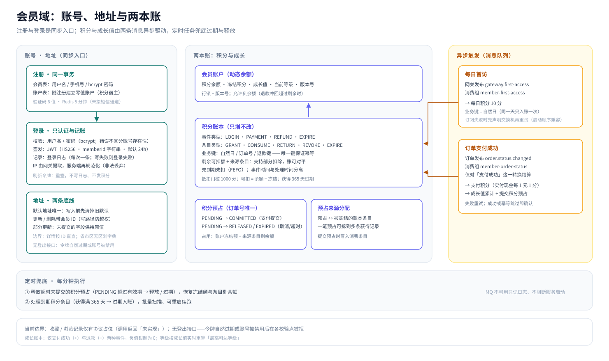
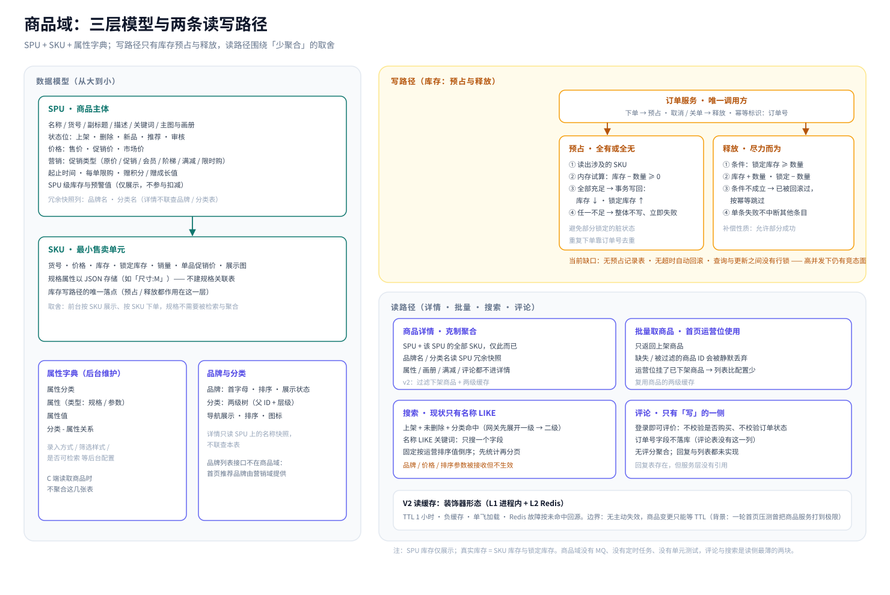
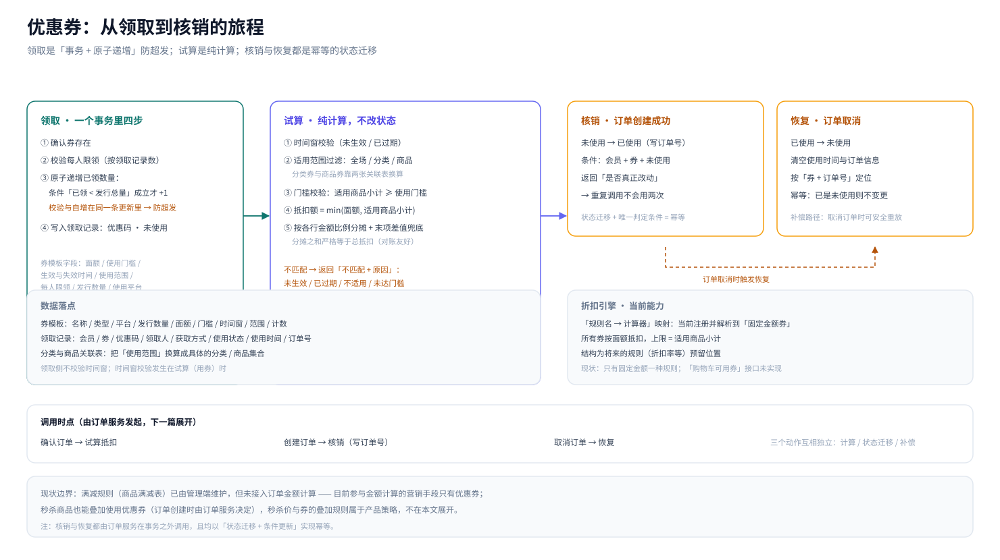
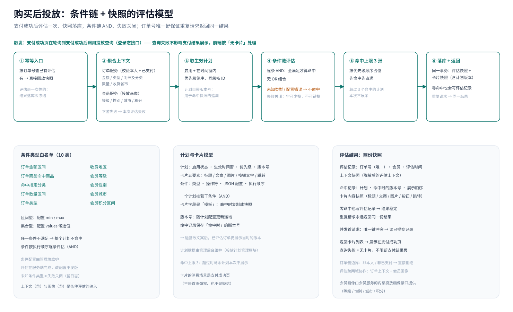
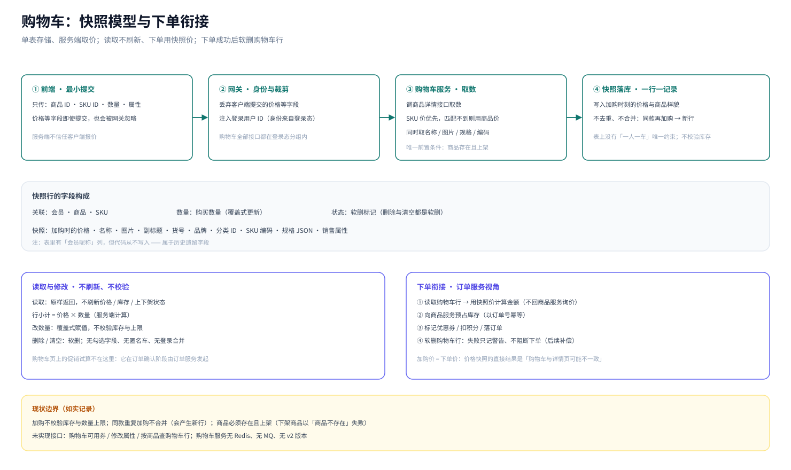

## 写在前面

第 01 篇拆了业务全景，第 02 篇讲了技术选型与整体分层，第 03 篇走到了所有 C 端请求的入口——网关。这一篇继续往里走一步，进入网关背后的五个领域服务：**会员、商品、营销、购物车、搜索**，看每个域里「模型长什么样、流程按什么规则走、请求在其中如何流转」。

把这五个域放在同一篇，是因为它们在业务上共享同一条「购物前」的路径：登录、逛、领券、加购、搜索——真正进入交易的订单与售后，留给下一篇。

## 一、会员域：账号、地址、积分和等级

### 1.1 注册与登录

注册的门槛是一枚六位数字验证码：请求验证码时生成随机码写入 Redis，五分钟内有效；注册时比对通过才继续。**当前实现没有接入短信通道，验证码会随接口响应直接返回**——这属于演示环境的形态，真实上线前这里必须补短信网关。

注册会在**同一个事务**里写两张表：会员表（用户名、手机号、加密后的密码、启用状态）和账户表（积分、冻结积分、成长值、等级的宿主）。

密码用 bcrypt 加盐存储；用户名与手机号分别做唯一性校验，注册成功后验证码立即失效。登录流程本身很标准：按用户名查会员 → 密码校验（账号不存在与密码错误共用同一句「用户名或密码错误」，不泄露账号是否存在）→ 账号禁用单独报错 → 签发 JWT → 写登录日志。

JWT 使用 HS256 对称签名，声明里带会员 ID、用户名、签发与过期时间，默认 24 小时有效；**会员 ID 以字符串形式写入令牌**——19 位整数如果按浮点解析会有精度丢失。

### 1.2 收货地址

地址是标准的增删改查，但守住了两条底线：

- **默认地址唯一**：写入默认地址前，先把该会员已有的默认地址全部取消，再写入新的——两条写路径（新增与修改）都执行同样的清理，不存在「两个默认地址」的中间态；
- **写路径的越权防护**：更新与删除的查询条件同时带地址 ID 与会员 ID，别的会员的地址改不动、删不掉。

### 1.3 积分

积分是整个会员域最重的一块，它由四张表支撑：**账户表**保存动态余额（余额、冻结积分、成长值、当前等级、版本号），**账本表**记录每一次积分变更，**预占表**登记订单对积分的占用，**预占来源分配表**把预占拆到具体的账本条目上。

账本表的设计是核心。每条记录带有四组信息：

| 维度 | 含义 | 示例 |
| --- | --- | --- |
| 事件类型 | 由什么业务事件触发 | 每日登录（LOGIN）、支付成功（PAYMENT）、退款（REFUND）、过期（EXPIRE） |
| 条目类型 | 这条记录对余额的影响方式 | 获得（GRANT）、消费（CONSUME）、退货返还（RETURN）、冲回（REVOKE）、过期（EXPIRE） |
| 业务键 | 幂等的依据 | 每日登录用「自然日」、支付与消费用订单号、退款用「退款键:订单号:明细ID」 |
| 价值信息 | 变更额、变更后余额、剩余可扣额、来源条目 | 剩余可扣额与来源条目是账本 V2 重构引入的 |

这套结构解决三个问题：

1. **幂等**。账本上有一条覆盖「会员 + 事件 + 条目 + 业务键 + 来源条目」的唯一键：重复消息再次入账时，唯一键冲突直接拦下，积分只加一次。每日登录积分用一个自然日做业务键，支付积分用订单号做业务键——所有异步链路都建立在这上面；
2. **部分扣除**。**每条获得记录自己带着「剩余可扣额」**，消费记录通过「来源条目」指回它扣的是哪一条——一笔获得可以被多笔消费分摊，账仍然对得上；
3. **时序可解释**。记录里区分了两个时间：事件真实发生时间（访问、支付、退款）与消息处理时间。两者分离。

有了账本，再看积分的四个动作：**获得**有三条路——每日首访固定 10 分、支付成功按实付现金部分每 1 元记 1 分（向下取整）、退款时返还当初抵扣掉的积分。**消费**按「先获得先到期」的顺序依次消耗各条目的剩余额，并记录每一笔的来源。**预占**服务于下单：下单时把积分锁定（账户冻结额增加、来源条目剩余额被占用），支付成功后再正式提交为消费；若订单取消或超时未支付，则把预占释放、恢复剩余额与冻结额。**过期**由定时任务兜底：获得类条目满 365 天后过期，每分钟批量处理一批，不在读取时做惰性过期。

使用积分抵扣的门槛是账户余额达到 1000 分；从绑定去重后的余额看，**积分余额允许为负**——退款冲回时，如果对应积分已经被后续消费花掉，系统允许余额被扣到负数，而不是拒绝这笔冲回。

一致性的最后一环是账户更新：所有积分与成长值的变更都先对账户行加锁，再以版本号自增的方式写回；预占表则以订单号为唯一键。行锁、唯一键、版本号三者叠加，支撑起「同一个订单的支付消息收到几次都只结算一次」。

### 1.4 等级

会员等级不是配置在会员身上的，而是**算出来的**：

- 等级表里每个等级配置一个成长值阈值与若干权益位，项目里不预置任何等级数据；
- 成长值存在账户上，并且**单独记一本成长账本**：只有支付成功（按实付现金部分加）与退款（扣减）两种事件能改变成长值；扣减到 0 以下时强制为 0；
- 每次成长值变化后立刻重算等级：取「阈值不超过当前成长值」的等级中最高的一档；没有匹配的等级则置空。这意味着等级永远与成长值一致，不存在「先记等级、后补成长值」的漂移；
- 会员中心查询时返回当前等级与下一等级的成长值进度，这两个值都是按账户实时算出来的。

### 1.5 触发方式重构：从「登录副作用」到「事件驱动」

旧行为里，登录接口是「认证 + 发积分 + 累计成长值」的合体：登录一慢，副作用跟着慢；重试登录，副作用还要靠幂等兜住。V2 **登录只做认证与记录**，积分与成长值改由两条消息驱动：

1. **每日首访**：网关的访问中间件在「当日首次请求」后异步发布一条首次访问事件，会员服务以独立消费组订阅，把消息换算成一笔当日首访积分，业务键是自然日——同一用户同一天收到多少条重复消息，积分都只入账一次；
2. **支付成功**：订单服务发出订单状态变化事件，会员服务订阅后**只对「支付成功」这一种状态转换**做结算（事件为支付、从待付款到待发货），一次完成三件事：发支付积分、累计成长值、提交积分预占；其余状态变化暂时只做应答、不做业务处理。

消费语义也值得一提：消息解码失败或用户标识非法 → 拒绝（不重试）；业务处理失败 → 进入重试（有次数与间隔上限）；处理成功或幂等跳过 → 确认。所有副作用都靠业务键幂等，因此「重试」和「重复投递」都不会产生第二笔账。消费端随服务一起启动，消息队列不可用只记日志、不阻断服务启动；首访消费者在订阅失败时还会先声明一次交换机再重试——这是为了应对「会员服务先于网关启动」的启动顺序问题。

读图提示：

1. 左上是账号的「写入口」：注册在事务里同时建立会员与账户，登录只认证、只记账；
2. 中间是账户与积分账本、预占、预占来源分配四张表的关系：账本条目自带「剩余可扣额」，消费与预占通过「来源条目」指向获得条目；
3. 右侧是两条异步触发：网关首访事件 → 每日积分；订单支付成功事件 → 支付积分 + 成长值 + 提交预占；两者都以业务键幂等；
4. 底部是定时兜底：每分钟释放过期预占、处理到期积分；
5. 底部边界条汇总了当前边界：收藏 / 浏览记录未实现、无登出接口——这些都是如实记录的现状。

## 二、商品域

### 2.1 商品模型：三层结构

商品模型分三层：

**第一层是 SPU**（标准产品单位），主表承载一个商品的完整画像：名称、货号、副标题、描述、关键词；主图与画册；一组状态位（上架、删除、新品、推荐、审核）；三种价格（售价、促销价、市场价）；单位、重量。**品牌名与分类名以冗余快照列的形式直接存在 SPU 上**。

**第二层是 SKU**，独立成表：每个 SKU 有自己的货号、价格、库存与锁定库存、销量、单品促销价、展示图。规格属性（比如「尺寸:M」）以**一段 JSON 存在 SKU 行上**：前台按 SKU 展示、按 SKU 下单，规格不需要被检索和聚合。

**第三层是属性字典**：属性分类、属性、属性值、分类与属性的关系，共四张表；属性上用类型区分「规格」与「参数」，还带着录入方式、筛选样式、是否可检索等后台配置。注意：**这些表由管理后台维护、面向商品发布，C 端服务读取商品时并不聚合它们**。

品牌与分类是两棵独立的树：品牌表带首字母、排序、是否制造商、展示状态、商品与评论计数；分类是**两级树**（父 ID + 层级），带导航展示、排序、图标等字段，没有内嵌的子节点结构，父子关系完全靠父 ID 表达。

### 2.2 商品详情的「聚合边界」

商品详情接口做了**克制的聚合**：SPU 单表 + 该 SPU 的全部 SKU，仅此而已。品牌名、分类名直接读 SPU 上的冗余快照，不联查品牌表与分类表。

### 2.3 库存：预占与释放，唯一的写入口

真实库存在 SKU 行上，由两个字段构成：**库存**与**锁定库存**。

库存的写操作只有两个，也只有一个调用方（订单服务）：

- **预占**（下单时）：把涉及的 SKU 全部读出，在内存里逐条试算「库存 − 购买数量 ≥ 0」；**全部充足才在一个事务里逐条写回**（库存减、锁定加），任何一条不足就整体不写、直接返回失败——「全有或全无」避免了部分锁定的脏状态；
- **释放**（取消/关单时）：把锁定库存退回库存，更新条件是「锁定库存 ≥ 本次数量」；条件不成立说明这笔锁定已被其他流程回滚过，按幂等跳过；单条失败中断其他条目。

### 2.4 商品信息缓存

在读取商品与批量取商品时加两层缓存。

- **L1 是进程内缓存，L2 是 Redis**，键为「商品 + ID」，有效期 1 小时；
- 支持负缓存（查不到的商品也会短暂记住，防止穿透）与单飞加载（同一个键的并发请求只回源一次）；
- Redis 故障时按「未命中」处理并回源——**缓存故障降级为直查数据库，而不是报错**。

当前的商品信息有一个可以优化的点：**没有主动失效**，商品的基本信息变更后，需要等 1 小时到期，对「读多写少、变更低频」的商品主数据来说可以接受。但是对于库存这种动态数据，每次从数据库中实时获取。

读图提示：

1. 左侧是三层模型：SPU（含品牌/分类名快照）→ SKU（规格 JSON、库存与锁定库存）→ 属性字典与品牌分类（后台维护，C 端不聚合）；
2. 右上写路径只有一条：订单服务发起「预占 / 释放」，全有或全无、按订单号幂等；缺口（无预占记录表、无超时回滚、无行锁）已明确标注；
3. 右下读路径：详情聚合 SPU + SKU，批量接口只返回上架商品，商品信息两级缓存（无主动失效）；

## 三、营销域：优惠券、秒杀与购买后投放

### 3.1 优惠券：从领取到核销的完整闭环

优惠券有两张表：**券模板**（名称、类型、使用平台、发行数量、面额、每人限领、使用门槛、生效与失效时间、可领取日期、使用范围、会员限制、优惠码、发放与使用计数）和**领取记录**（会员、券、优惠码、领取人昵称、获取方式、使用状态、使用时间与订单号）。

**领取**是一个事务里的四步：

1. 确认券存在；
2. 校验每人限领（按领取记录数比对限领张数）；
3. 给已领数量原子递增，条件写在更新里——「已领数量 < 发行总量」成立才加得动，加不动就是库存不足。**把校验和自增放进同一条带条件的更新，而不是先查后写**，这是防超发的关键；
4. 写入一条领取记录（含优惠码、未使用状态）。

**折扣计算**由一个「规则名 → 计算器」的映射引擎完成。当前注册并解析到的规则是**固定金额券**（按面额抵扣），引擎结构为将来的折扣率等规则留了位置。一次试算分四步：校验券的时间窗 → 按使用范围（全场 / 指定分类 / 指定商品）过滤出「适用商品」，分类券与商品券靠两张关联表换算 → 门槛校验（适用商品小计 ≥ 使用门槛）→ 金额计算：抵扣额 = min(面额, 适用商品小计)，抵扣金额直接寄到整个订单上，退货/退款时，如果是部分商品退货，可以选择是否退回优惠券，全部退货则直接返回优惠券。

试算是**纯计算、不改任何状态**；不匹配时返回「不匹配 + 原因」（未到生效时间、已过期、不适用、未达门槛、金额无效），订单侧据此决定是否继续。**核销**发生在订单创建成功的那一刻：按「会员 + 券 + 未使用」条件把它置为已使用并写入订单号，接口返回「是否真正改动过」——重复调用不会把同一张券用两次；**订单取消**时按「券 + 订单号」把记录恢复为未使用并清空使用信息。试算、核销、恢复三个动作由订单服务在确认订单、创建订单、取消订单三个时点分别调用。

### 3.2 秒杀：活动、场次、商品、SKU 的四级模型

秒杀用四张表表达：**活动**（起止日期、上下线状态）、**场次**（每日的开始与结束时刻、启用状态）、**关联**（活动 × 场次 × 商品）、**秒杀 SKU**（秒杀价、秒杀总量、每人限购、排序）。「日期型活动 + 每日重复的场次」组合起来，才是一天里的一个秒杀时段。

首页的秒杀列表按五步查询：找「今天生效」的活动 → 找「还没结束」的场次（比较的是当天的时刻）→ 取活动与场次的交集关联 → 拿商品 ID 去商品服务取完整信息 → 把场次时刻与今天日期拼成完整时间戳返回。

**秒杀下单走的是「借道购物车」的路径**：网关把商品以一个固定的秒杀标记加入购物车（作为购买属性写入购物车行）→ 从加购前后的购物车行里挑出这次新增的那一行 → 用这一行调订单服务创建订单；订单明细里带着这个标记，秒杀订单状态查询也靠它识别「这单是不是秒杀单」。

### 3.3 购买后投放：条件链 + 快照的评估模型

**「购买后投放」：支付成功后，根据这笔订单与这位会员的画像，决定给他展示哪几张运营卡片**。

**模型分三层**：

- **投放计划**：启用状态、生效时间窗、优先级、**版本号**，以及卡片的五个要素（标题、文案、图片、按钮文字、跳转链接）；
- **计划条件**：条件类型、操作符、JSON 配置、执行顺序——一个计划挂若干条件；
- **评估结果**：一张评估记录（订单、会员、评估时间、**上下文快照**）+ N 条命中记录（计划、**命中时的计划版本号**、展示顺序、**卡片内容快照**）。

**条件类型是一个白名单注册表**，目前注册了 10 类：订单金额区间、订单商品命中指定商品、订单商品命中指定分类、订单数量区间、订单类型、收货地区、会员等级、会员性别、会员城市、会员积分区间。区间型条件配置上下限，集合型条件配置候选值。

**评估流程**是五步：

1. 先按订单号查已有评估——**有则直接回放**。评估是「一次性」的：首次评估后结果落库，后续任何重复请求都返回同一份快照；
2. 聚合上下文：向订单服务要「本人 + 已支付」的订单上下文（实付金额、订单类型、商品明细及分类、总件数、收货省市），向会员服务要投放画像（等级、性别、城市、积分）。这里的校验在订单服务侧完成：**必须是本人的订单、且处于已支付状态**，否则直接拒绝——「购买后投放」的语义由此成立；
3. 取生效计划：启用 + 在时间窗内，按优先级倒序、同优先级按 ID 排序；
4. 逐计划跑条件链：条件按顺序逐条评估，**全部满足才算命中**（AND 语义，没有 OR 组合）；未知条件类型或配置解析失败一律视为不命中（失败关闭，同时留日志）；
5. 最多投 3 张卡，命中按优先级顺序占用名额。

**快照与幂等**是这套模型的两个关键词：第一次评估会把上下文快照与命中卡片一并写入两张表——**即使零命中也会落一条评估记录**，这样重复请求永远返回同一结果；命中记录保存卡片内容与计划版本号，运营后来改了文案或计划，已评估的订单仍展示「当时的版本」，可对账、可回溯。并发方面，评估表的订单号是唯一键：两个并发首请求只有一个能写入，另一个遇到唯一键冲突后改为读取已提交的记录，不会产生两份评估。

**触发点**在支付成功页：前端轮询到支付成功后调用投放查询（失败不影响页面——前端把投放当作「锦上添花」，出错就当作没有卡片）。这张卡片出现在支付成功页上，而不是首页的弹窗或短信里。

读图提示：

1. 领取是事务内的四步：校验存在性 → 限领校验 → 「已领 < 总量」条件下原子递增 → 写领取记录；
2. 试算是纯计算：时间窗 → 适用范围过滤 → 门槛校验 → 按比例分摊、末项兜底；不匹配会带原因返回；
3. 核销发生在订单创建成功时（未使用 → 已使用，重复调用安全）；订单取消时按订单号恢复；
4. 试算、核销、恢复分别由订单服务在确认订单、创建订单、取消订单时调用。

读图提示：

1. 触发点在支付成功页；网关转发后由营销域的投放服务评估；
2. 上下文来自两个服务：订单侧（校验本人 + 已支付）与会员侧（等级、性别、城市、积分）；
3. 计划按优先级排序，条件链按顺序评估、AND 语义、未知条件失败关闭；最多命中 3 张卡；
4. 首次评估即落「上下文快照 + 卡片快照（含计划版本）」；重复请求直接回放，并发靠订单号唯一键兜底。

## 四、购物车域

购物车是一个很「薄」的服务：

**模型**：单表存储购物车行，字段分三组——关联（会员、商品、SKU）、数量、**快照**（加购时的价格、名称、图片、副标题、货号、品牌、分类 ID、SKU 编码、规格属性，以及调用方传入的销售属性）。此外还有一个软删标记。

**加购**的流程体现了「服务端不信任客户端」的原则：前端只传商品、SKU、数量与属性——价格等字段即使传了也会被网关忽略；购物车服务调商品服务的详情接口取数，价格使用**SKU 价**及其规格与编码，然后把这一行「当时的样貌」写库。**不校验库存、不校验数量上限**，唯一的前置条件是「商品存在且上架」（下架商品会因为详情的上架过滤而报「商品不存在」）。同款商品重复加购不会合并，会多出一行；表上也没有「一人一车」的唯一约束。

**读取**是原样返回：不刷新价格、库存与上下架状态；每行小计在服务端算好（价格 × 数量）。

**修改与删除**：数量是覆盖式赋值（不是增量），同样不校验库存；删除与清空都是软删。

**与订单的衔接**是购物车最重要的下游：下单时订单服务读取购物车行，**使用购物车里的快照价**（不再回商品服务重新询价），随后向商品服务预占库存、标记优惠券、落订单，最后把购物车行软删；**删除失败只记警告、不影响下单结果**（由后续补偿处理）。

读图提示：

1. 加购时前端只传标识与数量，价格等敏感字段由服务端向商品服务取——SKU 价优先；
2. 快照字段落库后，读取不再刷新（价格/库存/上下架都是加购时刻的样貌）；
3. 下单时订单服务直接用快照价计算金额，并向商品服务预占库存（不用购物车服务参与）；

## 六、小结

| 域 | 关键模型 | 值得记录的设计 | 明确的现状边界 |
| --- | --- | --- | --- |
| 会员 | 账号 + 账户（余额/冻结/成长/等级）+ 积分账本 + 预占 | 账本业务键幂等、先到期先扣、预占四态、账户行锁 + 版本号、登录副作用异步化 | 收藏/浏览记录未实现；无登出；地址详情读路径未带归属校验 |
| 商品 | SPU + SKU（规格 JSON）+ 属性字典 + 两级分类 | 详情只聚合 SPU + SKU、名称快照、库存全有或全无预占、读缓存装饰器 | 评论只有写、搜索只有 LIKE、缓存无主动失效、库存无预占记录与超时回滚 |
| 营销 | 券模板 + 领取记录、秒杀四表、首页五表、投放三表 | 原子递增防超发、试算分摊、条件链 AND + 失败关闭、评估快照 + 版本 | 满减未接入计算、部分秒杀接口未实现、券引擎只有固定金额规则 |
| 购物车 | 单表 + 快照字段 | 服务端取价、下单用快照价、清车失败不阻断 | 不校验库存与上限、不去重合并、无勾选/匿名车/缓存 |