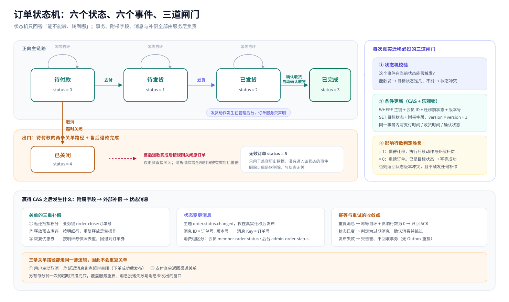
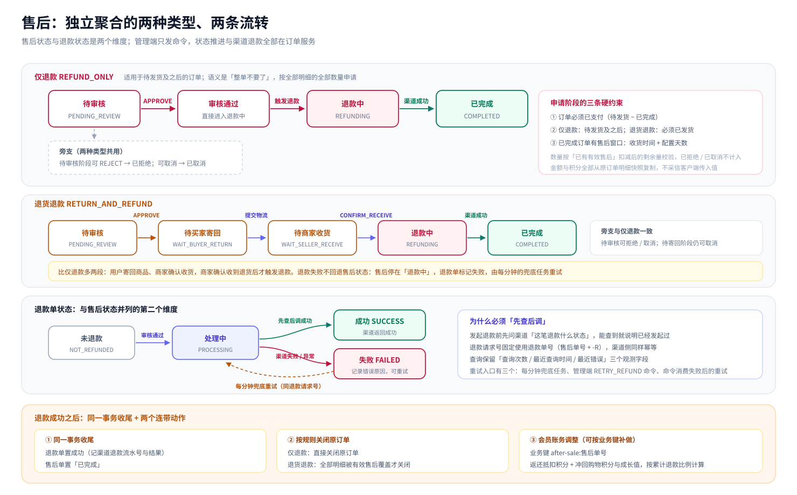
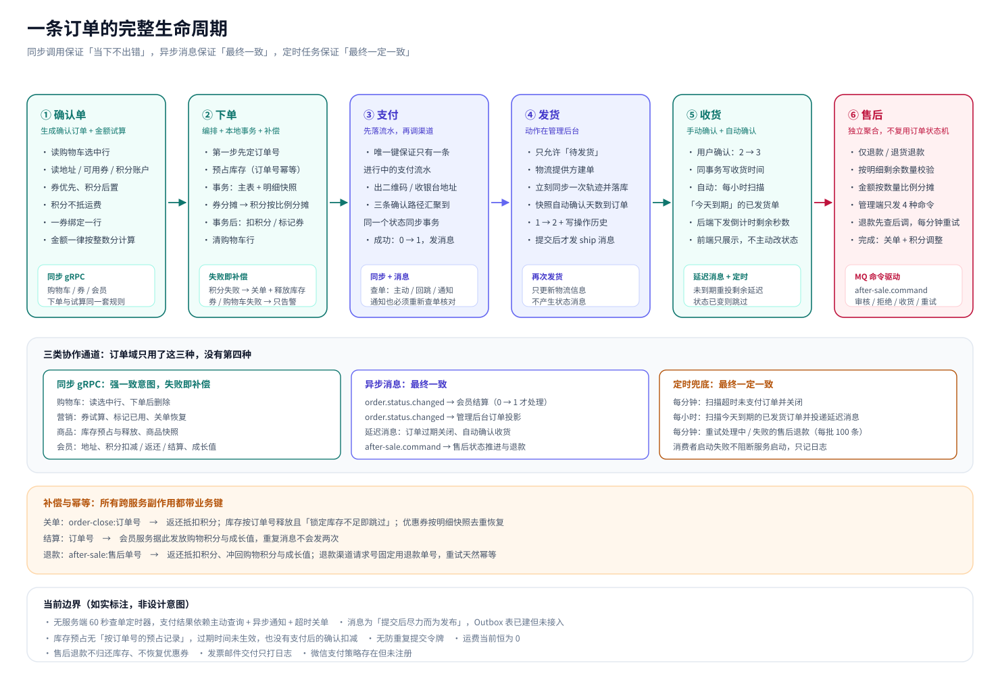

## 写在前面

第 04 篇走完了「购物前」的五个域：会员、商品、营销、购物车、搜索。这一篇进入整条链路上最重的一段——**订单与交易域**：从确认单、下单、支付、发货、收货，一直走到售后与发票，把一条订单的完整生命周期拆开看。

写作口径与前几篇保持一致：**只讲模型、规则与流程，不贴代码**；文中每个结论都能在服务的实现、数据表结构与项目文档里找到依据。同样地，对「设计过了但还没接上」「只做了一半」的部分照实标注——在交易域，边界往往比功能本身更有信息量。

一句话概括这个域的特征：**它是整个系统里唯一同时依赖「本地事务 + 跨服务同步调用 + 异步消息 + 定时兜底」四种一致性手段的地方**，也是唯一一个把「状态」当作一等公民来设计的地方。

## 一、订单域的边界：负责什么、不负责什么

### 1.1 一个服务，六组表

订单服务独占一个数据库，落在里面的表按职责可以分成六组：

| 分组 | 表 | 承载什么 |
| --- | --- | --- |
| 订单主体 | 订单主表、订单明细表 | 订单快照、金额构成、状态与版本、收货与物流快照 |
| 支付 | 支付流水表 | 每一次支付尝试、统一状态与渠道原始状态、查单次数与最近错误 |
| 售后 | 售后单表、售后商品表、退款单表 | 逆向交易的聚合、按明细的售后数量与金额、渠道退款执行状态 |
| 发票 | 发票主表、发票-订单关联表 | 发票要素与「一次开票覆盖哪些订单」的关系 |
| 配置与字典 | 订单配置表、售后原因字典表 | 各类超时分钟数、页面下拉可选的售后原因 |
| 辅助 | 订单操作历史表、订单到会员的事件 Outbox 表 | 后台操作留痕；跨服务事件的本地落库（当前未接入，见第十一节） |

另外还有一张「公司收发货地址表」，目前只有生成的访问层，没有业务读写路径——属于历史遗留。

### 1.2 订单存的是「快照」，不是「引用」

订单明细行里保存的是下单那一刻的商品名、商品图、规格属性、品牌、商品编号、SKU 编码与单价、数量；订单主表里保存的是下单那一刻的收货人姓名、电话、邮编、省市区与详细地址。

这一点决定了后续所有行为的解释口径：**商品改价、商品下架、地址被删改，都不会影响一条已经生成的订单**。订单是一份「当时双方认可的事实记录」，而不是对当前商品库的实时视图。优惠分摊、积分抵扣金额、应付金额也都作为金额快照固化在订单与明细上。

### 1.3 订单明确不做的三件事

- **不发货**：订单服务里没有发货接口。发货动作在管理后台完成（第六节展开）。
- **不记账**：积分余额、积分账本、成长值账本都在会员服务；订单服务只调用会员服务完成「扣减 / 返还 / 结算」。
- **不持有库存与优惠券**：库存预占与释放、优惠券试算与占用/恢复分别由商品服务与营销服务提供，订单服务只做编排与补偿。

这个边界也让「跨服务失败怎么办」变成一个必须正面回答的问题——第三节会给出完整的失败矩阵。

## 二、订单状态：六个状态与一张状态机

### 2.1 状态定义

| 状态码 | 名称 | 含义 |
| --- | --- | --- |
| `0` | 待付款 | 订单已生成，等待支付；超时会被自动关闭 |
| `1` | 待发货 | 已支付（或零元订单直接到达），等待后台发货 |
| `2` | 已发货 | 后台已填写物流信息，等待收货 |
| `3` | 已完成 | 用户确认收货或到期自动确认 |
| `4` | 已关闭 | 用户取消、超时关闭、渠道关单，或售后退款完成后关闭 |
| `5` | 无效订单 | 只用于兼容历史数据，当前没有任何「进入」该状态的业务入口 |

### 2.2 事件与迁移

状态机集中声明了「有哪些事件、每个事件从哪些状态出发、能到哪些状态」。当前一共六个事件：

| 事件 | 起始状态 | 目标状态 | 触发方 |
| --- | --- | --- | --- |
| 支付 | 待付款 | 待发货 | 订单服务（查单 / 异步通知落库成功后） |
| 取消 | 待付款 | 已关闭 | 订单服务（用户主动取消） |
| 超时关闭 | 待付款 | 已关闭 | 订单服务（延迟消息消费者 / 定时扫描） |
| 发货 | 待发货 | 已发货 | 管理后台（所以订单服务侧只声明、不发布） |
| 确认收货 | 已发货 | 已完成 | 订单服务（用户点击确认收货） |
| 自动确认收货 | 已发货 | 已完成 | 订单服务（延迟消息消费者） |

每个事件都额外声明了**它的幂等状态**：从幂等状态再次触发同一事件，视为成功且不产生任何变更。比如「支付」从「待发货」出发仍然回到「待发货」，「取消」从「已关闭」出发仍然回到「已关闭」。这让重复消息、重复点击、并发请求天然收敛。

除此之外的迁移都是**非法迁移**，会被映射成对应的状态冲突错误码返回——而不是悄悄放过、也不是直接改库。

### 2.3 状态机与服务层的分工

在本项目中，状态机和服务层的分工如下：

- **状态机只关注两件事情**：这个事件在当前状态能不能触发？能的话目标状态是什么？
- **服务层负责其余一切**：开事务、写附带字段（支付方式与支付时间、确认状态与收货时间、修改时间）、做数据库持久化、决定要不要发消息、要不要执行外部补偿。

这样划分的好处是：状态规则集中在一个地方可读、可测；而「事务怎么写、补偿怎么发」属于各业务动作自己的事，不会被塞进状态图里。

### 2.4 并发下怎么只用一次迁移

状态机只做「内存里推演」，真正决定胜负的是数据库那一次条件更新。写法是：

**用「主键 + 会员 ID + 迁移前状态 + 版本号」作为更新条件，同时把版本号自增，然后看影响行数。**

- 影响行数为 1：这次请求赢得了迁移，继续执行后续动作（写附带字段、发消息、做补偿）；
- 影响行数为 0：说明有人抢先了。此时**重新读一次订单**：
  - 如果订单已经处于这次事件的目标状态，判定为幂等成功，安静返回；
  - 否则返回状态版本冲突错误。

版本号（乐观锁）+ 迁移前状态（CAS 条件）+ 影响行数（胜负判定）三者叠加，保证了「同一个订单的并发取消、并发支付、并发确认收货」只会有一个赢家。

### 2.5 为什么值得为它做一次重构

项目里为状态机单独做过一次改造，动机写在开发日志里：改造前，各动作在各自的入口里用「状态范围判断 + 硬编码状态值」来把守；改造后，取消、支付、确认收货、申请退货、撤销退货统一接入状态机，分散的判断被收敛掉。

一个值得记录的演进细节：这次改造当时为了「撤销退货时恢复到退货前的状态」引入过一个 `previous_status` 列。后来退货申请被**独立的售后聚合**取代（第七节），订单主状态不再承担「退货中」，这一列也随之被清理迁移删掉。**状态字段的增删跟着业务模型走，是好事，不是技术债**——前提是每一步都有明确的迁移脚本。

读图提示：

1. 中间横轴是主流程：待付款 → 待发货 → 已发货 → 已完成；
2. 下方是两条出口：用户取消与超时关闭，都落到「已关闭」；「已关闭」与「已完成」是实际意义上的终态；
3. 每个状态都挂了一个「回到自己」的幂等自环，这是重复消息与重复请求的收敛点；
4. 右侧是每次真实迁移都要过的三道闸门：状态机校验 → 条件更新（主键 + 会员 + 前状态 + 版本）→ 影响行数判定；
5. 「无效订单」只作为历史数据兼容存在，没有进入事件。

## 三、下单：一条订单是怎么被造出来的

下单是同步主链路里最长的一段，也是跨服务调用最密集的一段。

### 3.1 确认单页与金额试算

进入下单页之前有一步「生成确认订单」，它一次性聚合四类信息：购物车选中行、会员收货地址列表、会员当前可用的优惠券、会员积分账户快照（余额与可用积分），再加上一次金额试算结果。

金额试算的口径需要写清楚，因为它决定了后面所有数字：

1. **先用优惠券，后用积分**；
2. **积分不能抵扣运费**；
3. 试算与正式下单使用**同一套规则、同一份代码路径**，差别只在于下单时用的是「落库后的订单明细」而不是「购物车行」。

优惠券的绑定关系是「一张券对一个购物车行」：每张券只对它绑定的那一行计算抵扣，同一行最多用一张券，同一张券最多用在一行上，两条约束都在试算前校验。券的抵扣额还要与「该行商品金额」取较小值，避免券面额超过行金额。

积分的使用有三个数字约束：

- **门槛**：账户余额必须达到 1000 分才能开启抵扣；
- **上限**：可扣数量取「余额 − 冻结」，并且抵扣金额不能超过「优惠券抵扣后的商品金额」；
- **汇率**：1 积分抵 1 分钱（即 100 积分抵 1 元）。

试算结果会一并返回给页面，让用户在确认单上看清「商品总额 / 优惠券抵扣 / 积分抵扣 / 应付金额」的构成。

### 3.2 下单的固定顺序

下单接口按下面这个顺序执行，顺序本身是有讲究的：

1. **先生成订单号**。订单号不是落库时才生成的，而是第一步就确定，因为后续所有跨服务的预占（库存）都要拿它当幂等业务键；
2. **读购物车选中行**，空集合直接拒绝下单；
3. **解析优惠券绑定**，把「券 → 购物车行」的映射固化成「券 → 订单明细序号」；
4. **预占商品库存**，按订单号提交，任一明细不足则整个下单终止；
5. **构造订单明细**，把购物车行转成明细快照；
6. **计算金额并分摊**：先算券的抵扣并写回对应明细，再算积分抵扣并按行分摊，最后汇总出订单的总额、券抵扣额、积分抵扣额与应付金额；
7. **补齐快照**：收货地址快照、会员用户名、订单来源、订单类型（普通 / 秒杀，由购物车行上是否带秒杀标记决定）；
8. **本地事务保存订单与明细**，并把主表自增 ID 回填到明细行；
9. **事务提交后**，依次做三件「外部动作」：扣减会员积分（若使用了积分）、逐条标记优惠券已使用、删除购物车中已下单的行。

第 9 步的三件事都发生在订单落库之后，这个位置关系决定了它们的失败语义（见下节）。

### 3.3 失败矩阵：每一步失败会发生什么

跨服务编排的价值不在于「永不失败」，而在于**每一步失败都有明确、可预测的后果**：

| 失败点 | 处理方式 | 结果 |
| --- | --- | --- |
| 购物车为空 | 直接拒绝 | 不下单 |
| 优惠券绑定非法（跨会员、重复绑定、券不可用） | 直接拒绝 | 不下单 |
| 库存预占失败 | 直接拒绝，并回传首个失败原因 | 不下单 |
| 金额计算失败 / 收货地址不存在 / 订单保存失败 | **释放已预占的库存**后返回失败 | 不下单 |
| 积分扣减失败 | **关闭订单（置为已关闭）+ 释放库存** | 订单存在但不可支付 |
| 优惠券标记已使用失败 | 只记录告警，**不阻断** | 下单成功，券状态待后续补偿 |
| 删除购物车行失败 | 只记录告警，**不阻断** | 下单成功，购物车可能残留 |

有两条设计判断值得单独说：

- **积分扣减失败为什么必须关单？** 因为订单已经落库、金额已经按「抵扣后」固化。如果只是返回失败，用户会拿到一条金额算错但可支付的订单；关掉它，比留下一颗地雷更安全。
- **为什么券标记与购物车清理只告警？** 因为到这一步订单已经是既成事实，用一次「回滚整个下单」去换「券状态更准」并不划算。这里的取舍是**优先保证订单一致性，把外部副作用降级为可补偿**。

### 3.4 零元订单：直接进入待发货

如果应付金额算下来是 0（比如券与积分把商品金额抵满），订单在创建事务里就直接被写成「待发货」，并同时写入支付时间——它不需要经过支付环节，也就不会进入超时关单的候选集合。

接口会返回「是否需要支付」这个标志，前端据此决定是跳到支付页还是直接提示下单成功。

### 3.5 奖励快照：积分与成长值在订单创建时固化

订单主表上存了两个数字：可获得的购物积分、可获得的成长值。它们的计算规则是统一的：

**以「不含运费的现金商品金额」为基数，每满 1 元记 1 积分 / 1 成长值，向下取整。**

这笔奖励在下单时就算出来并固化在订单上，但**真正发放是在支付成功之后**（由订单状态消息驱动会员服务结算，第十节展开）。为什么要在下单时固化？因为退款时需要按订单固化下来的上限冲回——如果发放和冲回都临时现算，规则一变历史订单就对不上了。

有一个当前实现的边界要说明：主表的「运费金额」字段与应付金额里的运费项都在，但下单流程里没有写入运费的路径，所以**当前运费恒为 0**，奖励基数也就等于实付金额。

### 3.6 分摊规则：行金额之和必须精确等于订单金额

订单金额不是「行金额的简单相加」，两轮抵扣都要分摊回明细行：

- **优惠券**：按行计算，直接落在该行上；
- **积分**：按「行金额占总金额的累计比例」分摊，使用整数分运算，**累计差值法**保证每行分摊额之和精确等于订单级抵扣额，不会出现「分摊后少一分钱」的经典问题。

分摊结果直接写回明细行：每行的优惠券分摊金额、积分抵扣金额、实付金额都会被更新。这样无论是「按行退款」还是「按行开票」，都能拿到正确的行级金额。

### 3.7 订单号与重复提交

订单号是一个**雪花式 ID**：低位是序列号，中间是 10 位工作节点号（优先从环境变量读，缺省时按主机名哈希得到），高位是相对一个固定纪元的毫秒时间戳，最终以十进制字符串输出。它自带时间有序性，也天然避免了多实例生成的撞号。

需要如实说明的边界是：**当前没有「防重复提交」的幂等令牌**。用户双击、网络重试都可能生成两条独立订单。项目里换来的保障是「每条订单都有独立、可追踪的订单号」，以及后续每一步都以订单号做幂等键——重复下单不会造成重复扣库存以外的资损扩大，但确实会占用两份库存。

## 四、超时关单：延迟消息 + 定时兜底 + 三重补偿

待付款订单的生命周期有明确上限，超时由订单配置控制，并且**按订单类型分别配置**：普通订单与秒杀订单各有一个超时分钟数。配置表为空时会回落到一组默认值（秒杀 30 分钟、普通 60 分钟）。

### 4.1 三条关单路径

| 路径 | 触发 | 说明 |
| --- | --- | --- |
| 用户主动取消 | 用户在订单列表/详情点击取消 | 只允许「待付款」；非待付款直接幂等返回 |
| 超时自动关闭 | 下单成功后发布的**延迟消息**到点投递 | 消息在订单创建成功后发出，延迟时长即订单类型的超时分钟数 |
| 渠道关单 | 支付查单返回「交易关闭」 | 支付流水与订单在同一个状态同步事务里落为关闭，随后返还已抵扣积分 |

前两条路径共用同一套「状态机迁移 + 条件更新 + 三重补偿」的实现；第三条路径复用支付侧的状态同步事务，因此它的补偿面比前两条窄——**只返还抵扣积分，不释放库存与优惠券，也不发布订单状态变更消息**（这一点也记在第十一节的边界清单里）。

延迟消息是主路径，但不作为唯一保障：还有一个**每分钟执行一次的超时扫描**兜底，覆盖「服务重启导致内存态丢失」「消息投递失败」「下单后消息没发出去」这些情况。两者最终都走同一个「按状态机迁移 + 条件更新」的关单逻辑，所以不会重复关单。

延迟消息的消费者还做了两处防护：一是**消息里的到期时间早于当前时间**时，不提前关单，而是把剩余延迟重新投递一次（防时钟漂移或误投递）；二是关单时如果发现订单已经不是待付款，直接确认消费并跳过（防与支付成功竞态）。

### 4.2 关单的三重补偿

（下面这三件事适用于用户主动取消与超时自动关闭两条路径。）

关单不只是把状态改成「已关闭」，还要把下单过程中占用的外部资源还回去。三件事都以**订单号**为幂等键：

1. **返还抵扣积分**：业务键是 `order-close:<订单号>`。会员服务按这个键做幂等，同一订单无论被哪条路径关几次，积分只返一次；
2. **释放预占库存**：按订单明细逐行提交释放。商品侧的释放实现带「锁定库存不小于释放数量」的前提条件，因此**重复释放是安全的空操作**，不会把库存加多；
3. **恢复优惠券**：先按明细行上的券快照去重恢复，若明细上没有券（历史数据），回退到订单主表上的券 ID。

这里有一条重要的顺序约定：**只有赢得 CAS 的那次请求才执行外部补偿**。幂等重试（影响行数为 0 的请求）不触发任何补偿动作，避免「一次关单、两次还券」。

### 4.3 消息发布是「尽力而为」

状态迁移的事务提交之后才发布状态变更消息；发布失败只记录告警、不回滚已经提交的关单事务。也就是说，**当前实现走的是「提交后发布、失败留日志」，没有落地 outbox 的持久化重投**（相关表结构已建，见第十一节）。

## 五、支付：策略、流水与状态闭环

### 5.1 当前有哪些支付方式

支付方式由「策略注册表」在服务启动时组装：每个策略向外暴露自己的编码、名称、提供方、交互形态（收银台 / 二维码）和兼容用的支付方式编码。当前实际注册的有三个：

| 编码 | 名称 | 提供方 | 形态 |
| --- | --- | --- | --- |
| `default` | 本地模拟支付 | 本地支付 | 收银台（本地页面） |
| `alipay_cashier` | 支付宝收银台 | 支付宝 | 收银台（跳转渠道页面） |
| `alipay_qr` | 支付宝扫码支付 | 支付宝 | 二维码（页面展示，有效期可配） |

微信收银台与微信扫码两个策略类在代码里存在，但**没有注册进注册表**，且各方法直接返回「未实现」——这是明确留出的扩展位，不是可用功能。

### 5.2 预支付：先落流水，再调渠道

预支付（准备支付）的顺序是刻意的：

1. 校验订单归属与状态（必须是「待付款」）；
2. **先在支付流水表落一条 PENDING 记录**，写清订单号、策略编码、提供方、金额、统一状态与来源标记；
3. 记录提交之后，才调用渠道策略去生成二维码或收银台地址。

「先落流水」带来两个好处：一是渠道调用无论成功、失败还是没有响应，**这次支付尝试都留有痕迹**（失败原因的截断记录、查单次数都会写在流水上）；二是后续任何一个入口（回跳、通知、主动查询）都能凭订单号找到这条流水，而不是靠内存状态。

同一订单只保留一条「进行中」的流水，靠的是数据库层面的约束：流水表上有一个生成列，**当状态为 PENDING 时取订单号、否则为 NULL**，并对这个列建了唯一索引。于是「并发点两次支付」最多只能成功插入一条 PENDING 流水；再次预支付时，逻辑会优先**复用并刷新**这条已有记录，而不是新开一条。

流水号格式是 `PAY-<纳秒时间戳>-<订单号>`，既保证唯一，也便于人肉排查时直接看出对应订单。

### 5.3 统一状态与渠道状态分开存

支付流水上有两个状态字段，这是理解支付闭环的关键：

- **统一状态**：`PENDING` / `SUCCESS` / `CLOSED`，订单服务内部只认这三个值；
- **渠道原始状态**：渠道返回的原样字符串（例如「等待买家付款」「交易成功」「交易已关闭」），只做记录与审计，不参与业务判断。

映射规则集中在策略层完成：

| 渠道状态 | 统一状态 | 订单目标状态 |
| --- | --- | --- |
| 等待买家付款 | PENDING | 保持待付款 |
| 交易成功 / 交易结束（已收款） | SUCCESS | 待发货 |
| 交易关闭 | CLOSED | 已关闭 |
| 其他未知值 | 直接报错，不落库 | —— |

另外，落库前会做一次**金额核对**：把渠道返回的金额与订单应付金额当成定点小数精确比较（而不是浮点比较），不一致就记为错误并拒绝推进。金额是第一位的裁判，其它信号都排在它后面。

### 5.4 三条确认路径，一条落库逻辑

用户支付完成后，支付结果可能从三个方向回到系统：

| 路径 | 入口 | 处理要点 |
| --- | --- | --- |
| 主动查询 | 订单支付页「我已支付」、支付状态轮询、结果页定时轮询 | 服务端**实时向渠道查单**，把结果落库后再返回 |
| 同步回跳 | 渠道把用户浏览器带回网关的支付回跳地址 | 不直接采信回跳参数，一律**以查单结果为准**；回跳的验签在当前实现中被注释掉，安全性完全由「必须查单」这一步兜住 |
| 异步通知 | 渠道服务器回调网关的通知地址 | **先验签，再查单**；只有「通知声明的状态」与「查单返回的状态、订单号、渠道流水、金额」全部一致才落库，最后才回 `success` 应答 |

三条路径最终都汇聚到**同一个状态同步事务**，这是这套支付设计里最值得记的一点。这个事务做的事：

1. 用「流水主键 + 状态为 PENDING + 流水版本号」做条件更新，**先把流水推进到目标状态**；
2. 影响行数为 0，说明已经有人推进过，直接结束（**不重复写订单、不重复发消息**）；
3. 影响行数不为 0，且目标状态是「待发货」或「已关闭」时，**在同一事务内**用「订单主键 + 状态为待付款 + 订单版本号 + 未删除」条件更新订单，支付成功时一并写入支付方式与支付时间；
4. 事务提交后，重新读取订单，如果状态确实发生了变化，才触发订单状态变更的发布钩子——注意这个钩子当前**只处理「待付款 → 待发货」这一种迁移**，因此渠道关单不会产生状态消息。

「先抢流水、再改订单、最后发消息」这个顺序，同时解决了幂等、并发与消息可靠性三个问题。

### 5.5 幂等与终态保护

- **只有 PENDING 能被推进**。已经是 SUCCESS 或 CLOSED 的流水，任何新的查单结果都不会改写它——包括「成功之后渠道又返回等待付款」这种回退场景；
- **重复通知 / 重复查询只会推进一次**，第二次开始都在第 2 步被拦下；
- **已关闭订单不再向渠道查单**：如果本地订单已经被超时任务关掉，而流水还停在 PENDING，系统会直接把流水落为关闭（来源标记为「订单关闭」），并顺手做一次积分返还，而不是去问渠道要一个已经没有意义的答案；
- **支付成功的修复性重发**：如果订单已经处于「待发货」而收到了支付成功事件，订单服务会重新发一次「待付款 → 待发货」的状态消息。这是为了修复「上一次消息发布失败」的窗口——下游以订单号为业务键做幂等，重发不会重复发奖。

### 5.6 前端视角：三个页面，三种确认方式

前端对支付结果的处理分成三种场景，都是「轮询 + 终态即停」：

- **二维码页面**：二维码有有效期倒计时，到期自动刷新；用户支付后手动点击「检查支付结果」，前端**只发一次查询请求**（刻意不自动轮询，避免页面一打开就无条件打渠道）；
- **收银台页面**：在新窗口完成支付后回到原页面，弹窗让用户确认「已完成支付」，确认后才进入查询，**最多 5 次、每次间隔 1 秒**；
- **支付回跳结果页**：进入页面即查一次，随后**最多 10 次、每次间隔 1 秒**（合计约 10 秒）；查到成功则停止并加载「购买后投放」的卡片；查到关闭则展示失败；10 秒仍未定论，展示「支付结果确认中」，并说明后台仍在继续处理。

订单列表页则是另一种模式：列表接口由**后端统一计算**支付截止时间与自动收货截止时间（并返回剩余秒数），前端只用本地时钟做倒计时展示；倒计时归零后触发一次列表刷新（带 3 秒节流），**不在前端主动触发取消**——关单是后端的职责。

### 5.7 需要标注的边界

开发日志里规划过一套「服务端 60 秒查单」：预支付成功后启动一个脱离请求生命周期的进程内定时器，每秒查一次、最多 60 次、查到终态提前结束，并按流水号去重。

**这套机制在当前代码里没有落地。** 现在的支付结果确认依赖三方组合：用户的主动查询（服务端每次实时向渠道查单）、渠道的异步通知（同样会重新查单核对）、以及超时关单兜底。这带来的实际差别是：如果用户支付成功后立刻关闭页面、同时渠道通知也丢失，订单要等到超时关单才会被关闭——而订单列表的支付倒计时会先归零。这是一个已知的、值得补齐的缺口。

## 六、发货与收货

### 6.1 发货在管理后台，不在订单服务

发货动作由管理后台直接完成，但做法不是「直接改状态」，而是：

1. 校验订单存在，且状态必须是「待发货」或「已发货」（后者只更新物流信息、不做状态迁移）；只有在「待发货」时才会去读订单配置；
2. 通过物流服务抽象的提供方创建物流单：可以传入自己的物流单号，也可以由提供方生成；
3. 立刻向提供方**同步一次物流轨迹**，把轨迹列表以 JSON 形式存到订单上；
4. **首次发货时**，把订单配置里的「自动确认收货天数」写入订单的自动确认天数，并把状态推进到「已发货」、写入物流公司、物流单号、发货时间；
5. 同一事务写一条订单操作历史；
6. **事务提交后**才发布「发货」状态消息。

有两点细节值得记住：

- **对已发货订单再次提交发货，只更新物流信息、不产生状态消息**——因为状态没有发生迁移，条件更新不会命中，也就不该发消息；
- **自动确认天数是在发货时快照到订单上的**，不是每次读取时现算配置。这样即使后台改了自动确认天数，已发货订单仍按发货那一刻的约定走。

### 6.2 用户确认收货

用户确认收货走状态机的「确认收货」事件：从「已发货」到「已完成」，同一事务写入确认状态与收货时间，事务提交后发布状态消息。重复点击、消息重复投递都在幂等状态上收敛。

### 6.3 自动确认收货

自动收货由「每小时扫描 + 延迟消息」两级完成：

1. **每小时**扫描「已发货、未删除、发货时间非空、且按『发货时间 + 自动确认天数』算出的到期时间落在今天」的订单；
2. 对每一条订单**单独发布一条延迟消息**，延迟时长即「到期时间 − 当前时间」；
3. 消费者到点后推进「自动确认收货」，并发布状态消息。

「按天扫描、按单投递延迟消息」这个组合，避免了在数据库里存一堆定时任务，也避免了用「每分钟全表扫描」去处理数量本来就不多的自动收货需求。消费者的防误投递逻辑与超时关单一致：时间没到就重新投递剩余延迟，状态已经变了就确认消费并跳过。

## 七、售后：独立的逆向交易聚合

### 7.1 为什么要把售后独立出来

售后不是「订单状态的一部分」，而是**一次与正向订单并列的逆向交易**。项目里对此做过一次明确的重构：删掉原先挂在订单上的退货申请表与订单级退货状态，改为独立的三张表（售后单、售后商品、退款单），**并且不复用订单状态机**。

这样做的直接收益是：订单主状态不再需要「退货中」这个中间态，也就不用再为「撤销退货该恢复成哪个状态」而引入 `previous_status` 之类的补偿字段。正向与逆向各自有各自的聚合、各自的状态流转，通过「原订单号 + 原明细 ID」建立关联。

### 7.2 两种类型，两条流转

**仅退款（REFUND_ONLY）**：适用于「付款了但还没收到货」或「不想退货只要钱」的场景；

**退货退款（RETURN_AND_REFUND）**：需要把货寄回去。

两种类型的前半段一致，后半段分岔：

- 仅退款：`待审核 → 审核通过 → 退款中 → 已完成`；
- 退货退款：`待审核 → 审核通过 → 待买家寄回 → 待商家收货 → 退款中 → 已完成`。

两条路径上的旁支也一致：审核前可以拒绝（`已拒绝`），审核前或待寄回阶段可以用户取消（`已取消`）。**退款失败不回退售后状态**：售后停在「退款中」，退款单标记为「失败」，允许重试。

退款单本身还有一套独立的状态：未退款 / 处理中 / 成功 / 失败——它和售后状态是两个维度，项目文档里特别强调过「页面上不要把两者合并显示」。

读图提示：

1. 上半部分是两个类型的正向流转，分岔点在「审核通过」；
2. 下半部分是退款执行的内部状态：退款中 → 处理中/失败/成功，失败可重试，直到售后退款成功后才进入「已完成」；
3. 右侧是三个入口的力量来源：用户侧提交与取消、管理端的四个命令、订单服务每分钟的兜底扫描；
4. 底部是退款成功之后连带发生的三件事：完成售后单、按规则决定是否关闭原订单、调用会员服务做积分与成长值调整。

### 7.3 申请条件

- 订单必须**已支付**：状态在「待发货 ~ 已完成」之间；
- **仅退款**允许「待发货」及其之后；**退货退款**要求订单已发货或已完成；
- 订单已完成时，还要受**售后窗口**约束：从「确认收货时间」起算，超过配置的「完成后可申请天数」就不再受理；
- 售后原因必填，可从售后原因字典里选择（字典只返回启用中的原因，按排序字段升序）。

### 7.4 数量与金额：都从订单快照推算，不信客户端

创建售后单时，会在一个事务里锁定原订单与订单明细，然后：

1. 统计**已存在的有效售后数量**：把该订单下所有售后商品行按明细聚合求和，**排除「已拒绝」与「已取消」的售后单**，得到每个明细的可申请剩余数量；
2. 校验本次申请数量不超过剩余数量，同一明细不允许重复提交，超量直接拒绝；
3. **仅退款按「整单全量」处理**：无论前端传了什么，都按原订单全部明细的全部数量申请——因为它的语义就是「这一单我不要了」；
4. **金额从明细快照复制**，不采信客户端传来的金额：行实付金额、优惠券分摊、积分抵扣金额、商品获得的积分与成长值、商品与 SKU 快照，全部从原订单明细拷贝到售后商品行；
5. **行退款金额按数量比例分摊**，用整数分与累计差值法计算：本次退款额 = 「累计到本次数量的分摊额」−「累计到上次数量的分摊额」。这样多次部分退款相加，正好等于该行的实付金额，不会少退或多退，尾差由最后一笔吸收；
6. 积分与成长值同样按累计退款比例计算，分别记录「返还的抵扣积分」「冲回的购物积分」「冲回的成长值」。

同时会写入一张**退款单**：单号是「售后单号 + `-R`」，并关联原支付流水的支付方式、渠道、渠道交易号——退款要走原路。订单服务还会顺手校验「退款单对应的支付流水必须存在且成功」，避免对一笔没真正收到钱的订单发起退款。

两个口径要写清楚：**不默认退运费**；**优惠券只作为退款金额的计算快照保存，退款时不恢复优惠券**。

售后单号复用与订单号相同的生成器，因此同样是全局唯一、时间有序的。

### 7.5 退款执行：管理端发命令，订单服务执行

这是售后设计里最值得学的一段——**管理后台不直接改售后状态**。它只做三件事：查列表、查详情、发命令。命令通过一个专门的售后命令主题投递，一共有四种：

| 命令 | 语义 |
| --- | --- |
| `APPROVE` | 审核通过。仅退款直接进入「退款中」并触发退款；退货退款进入「待买家寄回」 |
| `REJECT` | 审核拒绝。只允许从「待审核」拒绝；已是「已拒绝」按幂等成功处理 |
| `CONFIRM_RECEIVE` | 商家确认收到退货。只允许从「待商家收货」触发，之后进入「退款中」并触发退款 |
| `RETRY_REFUND` | 手动重试退款。只对「退款中」的售后单生效 |

订单服务侧有一个消费者订阅该主题，按当前售后状态做合法性校验，在事务里锁住售后单推进状态；重复命令按当前状态幂等处理，非法状态返回拒绝不重试，渠道或数据库临时错误进入重试。

**退款执行本身是「先查后调、同一请求号」**：

1. 在事务里锁定售后单与退款单，把退款单置为「处理中」，同时判断售后单是否已经完成但积分调整还没做（用于补做）
2. 事务提交后，**先查渠道退款状态**：
   - 渠道说成功 → 直接完成；
   - 渠道说处理中 → 更新为处理中，等下一轮；
   - 渠道说失败 → 标记失败并记录原因；
3. 查询本身报错（比如退款单还没创建过）时，才**调用渠道发起退款**，请求号固定用退款单号，保证渠道侧幂等；
4. 渠道返回成功 → 完成；返回处理中 → 等下一轮；其它 → 标记失败并记录渠道返回。

失败不会丢：有一个**每分钟执行一次**的兜底任务，扫描「退款中/已完成」且退款状态为「处理中 / 失败 / 成功」的售后单（每批最多 100 条），逐条重跑同一套退款执行逻辑。**这里的顺序是先查询再发起**，所以重试天然不会重复扣款。

### 7.6 退款成功之后

退款成功后，同一个事务里做两件事：把退款单置为成功、把售后单置为「已完成」；随后：

- **按规则关闭原订单**：仅退款直接关闭；退货退款则要检查「原订单每一条明细的申请数量是否都已被有效售后覆盖」，全部覆盖才关闭；
- **调用会员服务做账务调整**：业务键是 `after-sale:<售后单号>`，负载包含返还的抵扣积分、冲回的购物积分与冲回的成长值。调整完成后把售后单上的「积分处理状态」置为完成——所以即使退款成功了但积分调整失败，也会被每分钟的兜底任务重新捞起来补做。

### 7.7 售后侧的边界

- **退款不归还库存**：售后链路里没有调用库存释放。对「退货退款」来说，货回来了、库存没加回去，是一个明确的功能缺口；
- **退款不恢复优惠券**：这是产品口径上的取舍（券已经消耗掉了）；
- **不支持部分金额的手工退款**：退款金额完全由「售后商品行的分摊金额」决定，没有运营手填金额的入口。

## 八、发票

### 8.1 申请与校验

发票支持**多订单合并开票**：一次申请可以带上若干订单号。校验规则：

- 每张订单必须存在、属于当前用户、未被删除；
- **订单必须处于「已完成」**——未完成的订单不允许开票；
- **同一订单不可重复开票**：靠「发票-订单关联表」上的唯一约束兜底，先查一次给出友好错误，数据库约束再兜住并发；
- 发票类型为「个人」或「企业」，**企业发票的税号必填**；
- 交付方式为「下载 / 邮箱 / 下载+邮箱」三种，涉及邮箱时收件邮箱必填。

发票上的销售方信息（名称、税号、地址、电话、开户行、账号）以及开票人、复核人、收款人都从**服务配置**读取，而不是写在代码里——这属于运营信息，必须可配置。

### 8.2 金额与号码

- **总金额** = 各订单实付金额之和；
- **税额** = 价税合计 × 税率 ÷ (1 + 税率)，保留两位小数（默认税率 6%，即价内税的算法）；
- **不含税金额** = 价税合计 − 税额；
- **发票号码**：`YYYYMMDD` + 当天 4 位序号，序号由「当天已有的最大发票号码 + 1」得出；
- **发票代码**：12 位，由地区码 + 年份 + 批次 + 4 位随机数拼成；
- **校验码**：6 位随机数。

发票主记录与「发票-订单」关联记录在**同一个事务**里写入，关联表上那条唯一约束就是「一单只能开一次票」的最终保障。

### 8.3 交付：下载与「模拟发送」

- **下载**：PDF 在请求时**实时生成、不落盘**。版式对齐增值税电子普通发票：发票代码 / 号码 / 校验码 / 开票日期、购买方信息、商品明细（商品名、规格、数量、单价、金额、税率）、金额合计（不含税）、税额合计、价税合计（大写 + 小写）、销售方信息、收款人 / 复核人 / 开票人。
- **邮箱**：当前只把「收件人、主题、附件名、正文」打印成一条格式化日志，**并没有真正发送邮件**。这是一个刻意留白的「模拟发送」实现。

另外，发票状态定义了「有效 / 已作废」两个值，但**当前没有作废的接口与业务路径**。

## 九、一条订单走完全程

把前面几节串起来，一条正常订单的时间线是这样的（同步、异步、定时三类动作分开标注）：

读图提示：

1. 上方六张卡片从左到右是主流程：确认单 → 下单 → 支付 → 发货 → 收货 → 售后，每张卡片下角标注了该阶段主要依赖的通道；
2. 中间的「三类协作通道」把同步 gRPC、异步消息、定时兜底分别列清——同一阶段可能同时依赖多类；
3. 紧接着一条是「补偿与幂等」：关单、结算、退款三处的业务键分别是什么；
4. 最下方是当前边界清单，提醒这张图上的能力并非全部都已完成。

## 十、和其它域怎么协作：三张清单

这是全文最应该被记住的一节。订单域的协作方式可以精确地分成三类，没有第四种：

**第一类：同步 gRPC 调用（强一致意图，失败即走补偿）**

| 调用方 | 被调方 | 做什么 |
| --- | --- | --- |
| 订单 | 购物车 | 读选中行；下单成功后删除 |
| 订单 | 营销（优惠券） | 试算抵扣、标记已使用、关单时恢复 |
| 订单 | 商品 | 预占库存、释放库存、读 SKU 与商品快照 |
| 订单 | 会员 | 读地址与会员信息、读积分账户、扣减积分、返还/冲回积分与成长值 |
| 订单 | 支付渠道策略 | 预支付、查单、退款、查退款、验签与验通知 |

**第二类：异步消息（最终一致）**

| Topic | 生产方 | 消费方 | 用途 |
| --- | --- | --- | --- |
| 订单状态变更 | 订单服务、管理后台 | 会员服务（消费组 `member-order-status`） | 只对「支付成功（0→1）」做结算：发放购物积分与成长值 |
| 订单状态变更 | 订单服务、管理后台 | 管理后台（消费组 `admin-order-status`） | 同步后台的订单投影，让管理端看到的状态与交易侧一致 |
| 订单过期 | 订单服务 | 订单服务（消费组 `order-expiration-close`） | 延迟到点关闭未支付订单 |
| 自动收货 | 订单服务 | 订单服务（消费组 `order-auto-receipt-confirm`） | 延迟到点自动确认收货 |
| 售后命令 | 管理后台 | 订单服务（消费组 `order-after-sale-command`） | 审核、拒绝、确认收货、重试退款 |

这套消息设计里有三个约定值得单独摘出来：

1. **消息 ID 是「订单号 : 版本号」**，消息 Key 是订单号。版本号来自订单乐观锁，所以每一条消息都对应一次**真实的**状态迁移，重复投递天然可去重；
2. **不同服务必须用不同消费组**。会员服务与管理后台各自一个消费组，才能各自收到完整的全量消息；如果共用消费组就会互相抢消息（这一点在项目文档里有明确警示）；
3. **消息体带上了「不含运费的现金商品金额（整数分）」**。会员服务不需要再去查订单就能算奖励，而且金额以整数分传输，消费方不必做浮点运算。

**第三类：定时兜底（补偿与修复）**

| 任务 | 频率 | 作用 |
| --- | --- | --- |
| 超时关单扫描 | 每分钟 | 兜底「延迟消息没发出/服务重启」的未支付订单 |
| 自动收货扫描 | 每小时 | 找出今天到期的已发货订单，投递延迟消息 |
| 售后退款重试 | 每分钟 | 重试处理中/失败的退款，并补做积分调整 |

**把这三类放在一起看，会发现一条设计主线：主链路用同步调用保证「当下不出错」，跨服务结果用异步消息保证「最终一致」，再用定时任务保证「最终一定一致」。** 三者各管一段，互不越界。

## 十一、当前边界清单

把全文散落的边界集中列一下，方便后续对照：

| 位置 | 现状 |
| --- | --- |
| 支付结果确认 | 没有服务端 60 秒查单定时器，依赖用户主动查询、异步通知与超时关单 |
| 渠道关单 | 只返还抵扣积分，不释放库存与优惠券；状态变更也不发布消息（发布钩子只处理「待付款 → 待发货」） |
| 支付方式 | 微信收银台 / 微信扫码有策略类但未注册、未实现 |
| 消息可靠性 | 状态消息是「事务提交后尽力而为发布」，失败只留日志；Outbox 表已建但未接入业务 |
| 库存 | 预占后不落「按订单号的预占记录」，过期时间参数未被商品侧使用；**没有确认扣减（消费锁定库存）的动作**，锁定库存在关单之外不会被消化 |
| 运费 | 字段与计算口径都在，但下单流程没有写入运费的路径，当前恒为 0 |
| 重复提交 | 没有幂等令牌，重复点击可能生成两张订单 |
| 积分预占 | 会员侧有一套「预占 / 提交预占 / 过期释放」的表与接口，但下单链路走的是**直接扣减**（以订单号为幂等键写消费账本），两条机制目前并存 |
| 售后 | 退款不归还库存、不恢复优惠券；没有手工改金额的入口 |
| 发票 | 邮件交付只打日志；发票「作废」状态无入口 |
| 订单详情 | 「按订单 ID 查详情」的接口在服务侧是空实现，前端实际使用的是「按订单号查详情」 |
| 操作历史 | 订单操作历史表只有管理后台在写，交易侧的状态迁移不写这张表 |
| 遗留表 | 公司收发货地址表、订单到会员的事件 Outbox 表只有生成的访问层 |

## 小结

这一篇把订单与交易域拆成了六个阶段、六组表、三类一致性手段：

- **状态先行**：六个状态、六个事件、每个事件的幂等状态，全部集中声明；真实迁移靠「主键 + 会员 + 前状态 + 版本」的条件更新决胜，影响行数是唯一的裁判；
- **下单是编排**：先生成订单号、再预占库存、再落订单、最后做外部副作用；每一步失败都有明确的补偿或降级，金额用整数分与累计差值法分摊到行；
- **支付是闭环**：先落 PENDING 流水再调渠道，统一状态与渠道状态分离，三条确认路径汇聚到同一个状态同步事务，先抢流水、再改订单、最后发消息；
- **关单是补偿**：延迟消息负责精确到点，定时扫描负责兜底，三重补偿全部以订单号为幂等键，且只有赢得 CAS 的请求执行补偿；
- **售后是独立聚合**：不复用订单状态机，管理端只发命令、订单服务执行退款，积分与成长值按累计退款比例冲回，退款失败有每分钟兜底重试。

下一篇会进入 B 线（技术深潜），从多级缓存、状态机与乐观锁、支付抽象这些「具体怎么实现」的细节开始，把这一篇里点到为止的设计逐条展开。
