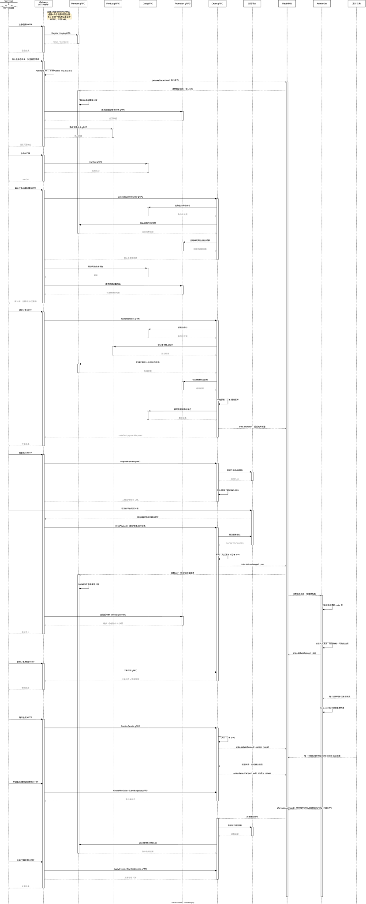
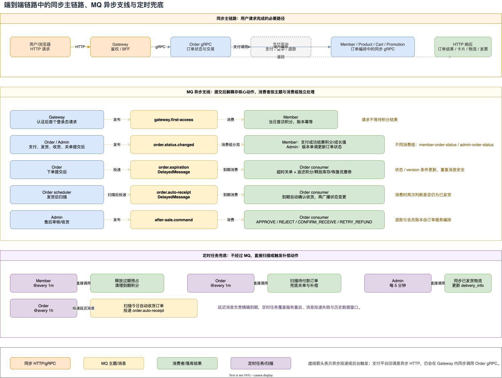

前面几篇文章分别拆过网关、会员、商品、订单和管理端。如果只从单个服务的角度看，系统像是一组相互独立的 CRUD；但用户真正经历的是一条连续链路：注册或登录，浏览商品，加购，下单，支付，等待积分和成长值到账，查看投放卡片，等待发货和物流，确认收货，最后可能进入售后或开票。

这篇文章把这条链路按“请求、RPC、消息、定时任务”重新串起来。重点不是罗列接口，而是回答三个问题：

- 哪些动作必须在当前请求中完成，调用方会等待什么结果？
- 哪些动作在核心数据提交后通过 RabbitMQ 继续传播，消费者如何重试和幂等？
- 哪些延迟消息或 MQ 任务还需要定时扫描兜底？

这里的“同步”指调用方等待返回的调用，不等于所有数据都在同一个数据库事务里；“异步”指请求已经可以返回，后续由消息消费者完成；“定时兜底”指即使延迟消息没有按预期执行，也通过扫描把状态拉回正确轨道。

## 先看结论：一条主链路有三种节奏

| 环节 | 入口与主要调用 | 实现节奏 | 用户是否等待结果 |
| --- | --- | --- | --- |
| 注册、登录 | Gateway → Member RPC | 同步 gRPC | 等待用户和 Token 结果 |
| 首次访问奖励 | Gateway `FirstAccess` → `gateway.first-access` → Member | 异步 MQ | 不等待积分处理 |
| 首页、商品浏览 | Gateway → Promotion/Product RPC | 同步 gRPC | 等待页面数据 |
| 加购、购物车 | Gateway → Cart RPC | 同步 gRPC | 等待购物车写入或查询 |
| 确认订单 | Gateway → Order，并补查 Cart/Coupon | 同步 RPC 编排 | 等待确认快照 |
| 提交订单 | Gateway → Order；Order 再调用库存、会员、优惠券、购物车 | 同步业务编排 + 本地事务 | 等待订单号、金额和支付状态 |
| 发起支付 | Gateway → Order → 支付策略/第三方 | 同步创建支付单 | 等待收银台地址或二维码 |
| 支付结果 | 第三方回调/查询 → Gateway → Order | 外部异步 HTTP + 内部同步持久化 | 回调方等待 `success`，用户端轮询状态 |
| 支付后积分、成长值 | Order → `order.status.changed` → Member | 异步 MQ | 不阻塞支付落库 |
| 投放卡片 | Gateway → Promotion `EvaluatePostPurchaseDelivery` | 同步 RPC | 等待卡片评估结果 |
| 管理端发货 | Admin 本地事务 → `order.status.changed` | 提交后异步广播 | 管理端等待发货操作结果，消费者稍后同步状态 |
| 物流轨迹 | Admin 物流同步调度器 | 每 5 分钟定时任务 | 页面读取已同步数据 |
| 自动收货 | Order 延迟消费者，另有小时扫描补安排 | 异步 + 定时兜底 | 不等待 |
| 售后、退款 | 售后创建/寄回同步；审核命令和退款异步 | 同步写单 + `after-sale.command` | 创建售后等待单据，退款最终一致 |
| 发票 | Gateway → Order RPC，下载直接输出 PDF | 同步 RPC/文件响应 | 等待申请、列表或文件结果 |

主链路的关键分界线是：订单和支付的“事实写入”必须先完成，积分、管理端投影、退款执行、物流刷新等后续动作再通过事件或任务推进。

## 主链路时序图



可编辑源文件：

[端到端主链路时序.drawio](./AIGO微服务电商项目全栈拆解（06）端到端主链路串联：从请求到消息/端到端主链路时序.drawio)

图中的箭头有意区分了三类动作：浏览器到 Gateway、Gateway 到各业务服务的调用，是当前请求内的同步路径；Order、Member、Admin 之间带主题名的箭头，是提交之后的 MQ 传播；底部的扫描器和调度器，是为延迟消息和进程重启准备的补偿路径。

## 一、登录和注册：同步拿到身份，异步记录“当天首次访问”

### 1. 注册和登录是同步 RPC

客户端进入 Gateway 的 member public 路由后，注册和登录分别调用 MemberClient 的 RPC。调用方需要立即拿到注册结果、登录结果和 Token，所以这部分属于同步链路：

```text
浏览器
  └─ HTTP → Gateway member_public
       └─ gRPC → Member
            └─ 返回用户信息/Token
```

拿到 Token 后，后续受保护的请求会经过 Gateway 的 `Auth` 中间件。中间件校验 JWT 并把 member id 放入上下文；只有经过认证，后面的购物车、订单、优惠券和投放卡片接口才能知道当前用户。

### 2. 首次访问奖励不是登录 RPC 的同步副作用

认证路由还挂着 `FirstAccess` 中间件。它的实际顺序很重要：中间件先执行下游请求，等 `r.Middleware.Next()` 返回后，再在 goroutine 中发布 `gateway.first-access` 消息。网关进程内的 gcache 以用户 id 为 key，并把过期时间设置到当天午夜，因此同一个用户每天最多触发一次。

```text
已认证请求
  └─ Auth 设置 member id
       └─ FirstAccess 放行当前请求
            └─ 请求结束后发布 gateway.first-access
                 └─ Member consumer
                      └─ AwardDailyLoginPoints
```

这意味着页面请求不需要等待积分账本写入。Member 的 `first_access.go` 消费者使用固定消费组 `member-first-access`，消息解析失败会 Reject，业务失败会 Retry，成功或幂等跳过才 Ack。实现上使用上海时区解析访问时间，并把当天奖励交给会员服务完成。

因此文章中不能把“登录返回字段”和“每日登录奖励已落账”混为一件事：登录是同步身份建立，首次认证访问是异步奖励触发；奖励最终是否到账，应以 Member 的积分账本和消费日志为准。

## 二、浏览、加购和确认订单：读请求同步，确认页是一次同步编排

### 1. 浏览路径由 Gateway 分发到多个服务

首页内容和商品信息由 Gateway 的 portal 控制器转发到 Promotion、Product 等客户端。分类、商品详情等页面数据需要在当前 HTTP 响应里返回，所以它们是同步 RPC。搜索和部分聚合接口也遵循同一边界：页面展示需要什么，Gateway 就等待对应服务返回什么。

### 2. 加购直接调用 Cart

加购和购物车列表分别通过 CartClient 的 `CartAdd`、`ListCart` 等 RPC 完成。加购成功后，用户才能在确认页看到购物车快照。这里没有必要先发一条“加购消息”再等购物车最终一致，因为购物车本身就是用户马上要读取的交互状态。

```text
浏览器 → Gateway/cart → Cart
                    ← cart item / cart list
```

### 3. 确认订单不是最终下单

Gateway 的 `GenerateConfirmOrder` 会调用 OrderClient 生成确认数据，同时补查购物车和会员优惠券历史，再调用优惠券计算逻辑组装可展示的优惠列表。这个接口的职责是给用户展示“买什么、能否优惠、预计付多少”，不应该把它当作库存扣减或订单持久化。

真正的提交动作是 `OrderGenerate`：Gateway 把购物车 id、收货地址、优惠券、商品优惠、支付方式、积分抵扣等参数传给 Order。Order 服务随后同步编排 Cart、Product、Member、Coupon，并在自己的数据库事务中写入订单和订单明细。

## 三、提交订单：同步完成资源占用，提交后安排超时关闭

Order 的生成过程可以压缩成下面的顺序：

1. 生成订单号。
2. 读取购物车，并按订单号预占商品库存。
3. 计算商品金额、优惠券优惠、积分抵扣和应付金额。
4. 填充收货人、会员和商品快照。
5. 在本地事务中持久化订单、订单明细和支付所需数据。
6. 事务之后处理积分扣减、优惠券使用和购物车删除；失败时按现有补偿逻辑记录并尝试恢复资源。

这些步骤之所以仍然在提交订单请求中，是因为接口必须立即回答订单号、应付金额和是否需要支付。库存预占也必须在生成订单阶段完成，否则用户拿到订单号时库存可能已经被别人抢走。

订单生成成功后，V2 Order 会为待支付订单安排 `order.expiration` 延迟消息。安排失败只记录 warning，不让一个已经成功落库的订单因为消息投递异常变成 HTTP 失败；同时由每分钟扫描任务兜底关闭超时未支付订单。延迟消息负责“尽量准时”，扫描负责“最终不能漏”。

### 超时关单的两条路径

```text
订单创建成功
  ├─ 延迟消息 order.expiration → 到期消费者 → CAS 关闭订单 → 释放积分/库存/优惠券
  └─ 每 1 分钟扫描待支付订单 → 同一状态机 → 关闭并释放资源
```

延迟消费者收到消息时还会检查 `expiresAt`，提前到达就重新安排；订单不存在、已支付或已经关闭则直接 Ack。扫描和消费者最终都会进入带版本条件的状态机，只有真正完成状态迁移的一方执行资源释放，避免重复补偿。

## 四、支付：支付单准备同步，支付成功通过状态事件异步扩散

### 1. 准备收银台是同步的

客户端调用 `PreparePayment` 后，Gateway 转发给 Order。Order 校验订单归属和待支付状态，调用支付策略创建支付凭证，并在本地创建或更新一条 PENDING 支付记录，返回二维码或收银台地址。这个阶段只代表“已准备支付”，不代表“支付成功”。

项目中的支付策略由默认策略和启动时注册的支付宝收银台、支付宝二维码等策略组成。Order 通过支付门面调用具体策略，业务状态仍由 Order 统一持久化。

### 2. 回调是外部异步 HTTP，内部仍要同步校验和落库

第三方支付完成后可能有两条入口：

- 浏览器返回支付页面，Gateway 的 payment status 接口调用 `SyncPaymentReturn`；
- 支付平台 POST 异步通知，Gateway 调用 `SyncPaymentNotification`，只有 Order 完成通知校验、再次查询和持久化后，才向平台返回纯文本 `success`。

所以这里有两层“异步”要分清：支付平台到商城的通知是外部异步 HTTP；Gateway 到 Order 以及 Order 到支付平台的校验查询，仍是当前请求里的同步调用。真正完成订单状态传播的是后面的 `order.status.changed` MQ。

```text
支付平台
  ├─ 浏览器 return → Gateway → Order 查询/持久化
  └─ server notify → Gateway → Order 校验+再查询+持久化 → success

Order 支付状态从 0 → 1 提交成功
  └─ 发布 order.status.changed
       ├─ Member：结算支付后积分、成长值
       └─ Admin：推进管理端订单投影
```

Gateway 的 `OrderPay` 也不会接受客户端“我已经支付”的声明。V2 Order 会重新读取支付状态，只有支付记录已经是 SUCCESS 才允许继续，否则返回未支付。这样可以避免把前端按钮、恶意请求或过期页面当成支付事实。

### 3. 订单状态消息的生产边界

Order V2 只在持久化状态确实发生变化后发布状态消息。消息包含订单号、会员 id、旧状态、新状态、事件名、版本、支付现金商品金额和变更时间；消息 id 使用 `${orderSn}:${version}`，key 使用订单号。

对于支付成功，V2 还通过一个 hook 接住 V1 支付回调和支付状态查询导致的 `0 → 1` 迁移，因此无论是支付平台通知还是用户端轮询发现成功，最终都能进入同一条状态事件路径。

这里有一个需要如实说明的可靠性边界：当前实现是“本地提交成功后发布消息”，发布失败会记录 warning，但还没有把状态事件写入持久化 outbox 再由后台重发。也就是说，消费者侧做了重试和幂等，生产侧仍保留消息发布失败窗口；这也是后续可以继续演进的地方。

## 五、积分、成长值和投放卡片：一个异步，一个同步查询

### 1. Member 消费支付成功事件

Member 的 `order_status.go` 订阅 `order.status.changed`，消费组为 `member-order-status`。当前已落地的业务重点是支付事件：只有订单从待支付 `0` 变成已支付 `1`，才进入 `SettleOrder`，完成现金商品金额对应的积分、成长值结算，并提交之前预占的积分。

消费逻辑具有三种结果：消息格式或身份不合法时 Reject；暂时性的业务失败 Retry；成功或已处理的重复消息 Ack。结算账本以订单业务键保持幂等，因此同一个支付事件重投不会重复发放。

其他订单状态迁移目前由 Member 消费后直接 Ack，不执行额外副作用，代码中也明确留下了后续拆分各状态业务的 TODO。文章不能把所有订单状态都概括为“Member 都会消费并发奖励”。

### 2. 购买后投放卡片是当前请求内的评估

支付成功后，客户端可以调用 Gateway promotion 控制器的 `PostPurchaseDelivery`。Gateway 获取当前会员 id，调用 DeliveryClient 的 `EvaluatePostPurchaseDelivery`，并把卡片结果同步返回。

这一步和积分结算的节奏不同：

- 积分、成长值是否落账由 Member 异步消费订单状态消息；
- 投放卡片是用户当前要展示的内容，由 Gateway 同步请求 Promotion 评估。

如果卡片展示需要依赖最终积分余额，应在 Promotion 侧读取已经落账的数据，或明确展示“处理中”状态，不能假设支付 HTTP 响应返回时 MQ 消费已经完成。

## 六、管理端消费：它不是重新创建订单，而是维护自己的状态投影

管理端启动时订阅 `order.status.changed`，消费组为 `admin-order-status`。它和 Member 使用同一个主题、不同消费组，因此一次订单状态变化可以分别送到会员结算和管理端投影，两者互不抢消息。

Admin 消费者会校验订单号、事件名、from/to 状态、版本、消息 id 和 RabbitMQ message key。收到有效事件后，使用 `WHERE id = ? AND version < event.Version` 的条件更新本地订单状态和版本：

```text
Order 状态提交
  └─ order.status.changed
       └─ Admin consumer
            ├─ 本地版本更高：认为旧消息，幂等 Ack
            ├─ 目标状态和版本已存在：重复消息，幂等 Ack
            ├─ 版本更新成功：推进 Admin 投影，Ack
            └─ 临时失败：Retry；格式/身份错误：Reject
```

这就是管理端的消费边界：它不参与用户端支付请求，也不反向调用 Order 来“确认”订单，而是消费事实事件，按照版本单调推进自己的查询数据。事件乱序或重复时，版本条件保证旧事件不能覆盖新状态。

## 七、发货、物流和收货：管理端既是事件消费者，也是事件生产者

### 1. 发货操作是管理端同步事务

管理员发货时，Admin 校验订单处于允许发货的状态，选择本地、顺丰、申通或京东策略，创建或同步运单信息，在事务内更新物流公司、运单号、发货时间、自动收货天数和操作历史。提交成功后，如果状态发生 `1 → 2`，再发布 `order.status.changed`。

因此一次发货操作有两个时间点：

1. Admin HTTP 请求返回：管理端自己的订单和物流数据已经提交。
2. Member、其他管理端实例或其他投影收到消息：各自最终同步到新的订单状态。

Admin 同时订阅和发布同一主题，是因为它既需要接收 Order 的支付、取消、收货等事实，又需要把管理员发货、关闭订单等状态变化广播出去。

### 2. 物流轨迹由定时任务刷新

管理端的物流同步调度器启动时立即执行，之后每 5 分钟同步已发货订单的物流轨迹。当前本地物流 Provider 是内存实现，会根据订单号生成运单和轨迹节点；进程重启会丢失这部分模拟数据，这是示例实现的明确边界，不应在文章中描述成已经接入真实快递平台。

### 3. 确认收货和自动收货

用户主动确认收货时，Gateway 同步调用 Order 的 `ConfirmReceipt`。Order 通过状态机和版本条件把 `2 → 3`，提交后发布状态消息。

如果用户没有主动操作，Order 会为发货订单安排 `order.auto-receipt` 延迟消息。消费者到时间后检查当前时间和订单状态，通过 CAS 完成自动收货；Order 启动的每小时扫描会重新为当天应自动收货的订单安排检查，覆盖进程重启或单次安排失败的情况。

这里的定时任务不是每小时直接批量改状态，而是“扫描并补安排精确延迟检查”；真正状态流转仍由同一套状态机完成。

## 八、售后和开票：单据创建同步，审核命令和退款执行异步

### 1. 创建售后和填写寄回物流是同步写单

Gateway 的售后控制器把创建、详情、列表、日志、物流和取消等请求同步转给 Order。创建售后时，Order 会校验原订单状态、支付状态、发货前置条件、售后商品数量和剩余可售后数量，然后在事务中写入售后单、售后明细和退款记录。

买家填写寄回物流后，售后状态同步进入等待卖家收货。这样的动作要立即给用户一个售后单号和当前状态，所以不能把“创建售后单”本身设计成只发消息不落库。

### 2. 管理审核通过后通过 `after-sale.command` 推进

管理端审核售后时，Admin 发布 `after-sale.command`，Order 的 `order-after-sale-command` 消费组处理 APPROVE、REJECT、CONFIRM_RECEIVE、RETRY_REFUND 等命令：

- 仅退款审核通过：进入退款中并执行退款；
- 退货退款审核通过：先等待买家寄回；
- 卖家确认收货：进入退款中并执行退款；
- 退款失败或可重试场景：通过重试命令再次推进。

退款执行仍会同步调用支付策略查询或发起退款，但整个审核到最终退款是异步状态机。每分钟的售后退款扫描任务会继续处理待退款记录，承担消费者重试、进程重启后的兜底职责；支付渠道的退款结果和会员积分返还也必须保持幂等。

### 3. 发票接口是同步 RPC

申请发票、发票详情、发票列表都由 Gateway 同步调用 Order。发票下载接口也是同步路径，但它不会走普通 JSON 响应包装，而是直接设置 `application/pdf` 输出 PDF 文件。发票因此不属于当前主链路中的 MQ 环节；如果未来接入外部开票平台，再单独增加“开票申请事件”和“开票结果事件”会更合适。

## 哪些环节已经异步化



[异步化环节标注.drawio](./AIGO微服务电商项目全栈拆解（06）端到端主链路串联：从请求到消息/异步化环节标注.drawio)

这张图把“异步化”再拆成三层：

### 第一层：请求结束后立即解耦的业务副作用

- `gateway.first-access`：每日首次认证访问奖励。
- `order.status.changed` → Member：支付后积分、成长值结算。
- `order.status.changed` → Admin：管理端订单状态投影。
- `after-sale.command`：管理审核命令驱动退款和售后状态机。

这些动作都不应该成为用户当前请求的长尾依赖；请求只需保证产生了正确的事实或命令。

### 第二层：延迟消息驱动的时间状态

- `order.expiration`：支付超时关闭。
- `order.auto-receipt`：发货后自动确认收货。

延迟消息让系统在目标时间附近执行，而不是让一个 HTTP 请求或常驻 goroutine 长时间等待。

### 第三层：定时扫描兜底

| 任务 | 频率 | 兜底对象 |
| --- | --- | --- |
| `CancelTimeoutOrders` | 每 1 分钟 | 未支付订单关闭和资源释放 |
| `ScheduleTodayAutoReceiptOrders` | 每 1 小时 | 当天应自动收货订单的延迟消息 |
| `ProcessAfterSaleRefunds` | 每 1 分钟 | 待处理退款和失败重试 |
| Member loyalty cleanup | 每 1 分钟 | 过期积分预占释放、到期积分账户处理 |
| Admin logistics sync | 每 5 分钟 | 已发货订单物流轨迹 |

延迟消息、消费重试和定时扫描分别解决“准时执行、暂时失败、最终不遗漏”三个问题。它们不是三个互相替代的方案，而是同一个状态机的不同触发器。

## 这条链路的可靠性设计

把代码串起来后，可以看到系统依赖的不是某个单独的 MQ，而是四个约束共同成立：

1. **事实先提交**：订单、支付、发货、收货等核心状态先在拥有者服务中提交，消息只传播已经发生的状态变化。
2. **状态机加版本**：订单取消、支付成功、确认收货、自动收货和管理端投影都使用状态条件或版本条件，只有迁移成功的一方执行后置动作。
3. **消费者可重试、可幂等**：消息处理失败 Retry，格式错误 Reject；支付结算、管理端投影和退款都允许重复投递而不重复产生业务结果。
4. **延迟消息加扫描**：消息负责低延迟推进，定时任务负责重启、投递失败和历史脏数据的最终收敛。

同时也要保留实现边界：当前 Order 状态事件生产端还没有完整的持久化 outbox 重发机制；Member 对非支付状态的业务处理尚未全部展开；Admin 的本地物流 Provider 只适合演示和测试。写清楚这些边界，才能区分“代码已经实现的链路”和“架构上可以继续演进的方向”。

## 代码索引：按主链路回看实现

网关入口和同步 RPC：

- `backend/app/gateway/internal/cmd/cmd.go`
- `backend/app/gateway/internal/middleware/auth.go`
- `backend/app/gateway/internal/middleware/accesslog.go`
- `backend/app/gateway/internal/controller/order/order_v1_methods.go`
- `backend/app/gateway/internal/controller/order/invoice.go`
- `backend/app/gateway/internal/controller/payment_public/payment.go`
- `backend/app/gateway/internal/controller/promotion/promotion_v1_methods.go`

会员和订单状态事件：

- `backend/app/member/internal/service/v2/first_access.go`
- `backend/app/member/internal/service/v2/order_status.go`
- `backend/app/order/internal/service/v2/order_status_mq.go`
- `backend/app/order/internal/service/v2/order.go`
- `backend/app/order/internal/service/v2/order_expiration_mq.go`
- `backend/app/order/internal/service/v2/order_auto_receipt_mq.go`
- `backend/app/order/internal/cmd/cmd.go`

售后和管理端消费：

- `backend/app/order/internal/service/v2/after_sale.go`
- `backend/app/order/internal/service/v2/after_sale_command.go`
- `micro-mall-admin/backend/internal/service/order_status_mq.go`
- `micro-mall-admin/backend/internal/service/order.go`
- `micro-mall-admin/backend/internal/scheduler/logistics_sync.go`

## 结语：用户看到的是一条链路，系统执行的是多条节奏

从用户视角，这是一条从登录到收货、售后和开票的连续旅程；从系统视角，它由同步 RPC、外部支付回调、RabbitMQ 事件、延迟消息和定时扫描共同完成。

最重要的设计取舍是：把必须立即确定的事实留在同步请求中，把可以稍后完成的副作用放到消息里，再用幂等状态机和定时任务保证最终收敛。这样既能让下单和支付接口保持清晰的响应边界，也能让积分、管理端投影、物流、自动收货和退款在独立节奏中扩展。
