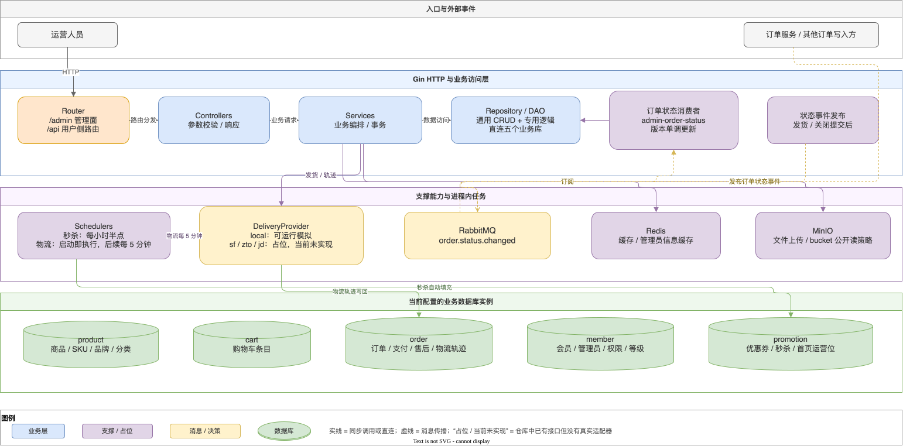

## 写在前面

前一篇把 C 端用户从请求、RPC、消息和定时任务串成了一条主链路，其中有一个容易被忽略的角色：管理后台。它既不是 C 端商城的另一个页面，也不是订单服务的简单管理界面，而是一套面向运营人员的 B 端系统。

这篇只讨论 `micro-mall-admin` 当前已经落地的系统设计和边界，不展开具体代码实现。重点回答四个问题：管理后台和 C 端如何分工，后台为什么可以直接访问多套业务库，订单状态消息在后台如何收敛，以及物流、秒杀场次和文件上传这些运营能力分别落在什么位置。

先给结论：当前后台是一个 **Gin HTTP 入口 + 业务服务层 + Repository/DAO + 多个业务数据库实例** 的运营系统；它同时通过 RabbitMQ 订阅订单状态变化，并在管理操作提交后发布部分状态事件。物流和秒杀是进程内定时任务，文件上传则由 MinIO 服务完成。这里还没有独立的后台读模型，也没有已经接通的顺丰、中通、京东物流适配器。

## 一、B 端和 C 端：同一业务系统的两种视角

### 1. C 端负责交易体验

C 端商城面向普通会员，核心诉求是浏览商品、管理购物车、提交订单、支付、查看订单和发起售后。它通过商城网关进入会员、商品、营销、购物车和订单等领域服务，主要关心一次用户操作能否得到及时响应，以及用户看到的状态是否符合交易流程。

### 2. B 端负责运营和履约操作

B 端面向管理员和运营人员，关注的是商品与 SKU 维护、分类和品牌、首页运营位、优惠券、秒杀配置、会员和订单处理、售后审核、物流信息以及运营看板。路由注册上，后台把管理接口放在 `/admin` 分组下，并通过登录中间件保护；同一个 Gin 服务还注册了 `/api` 用户侧路由，但本文讨论的主体是 `/admin` 管理面。

两端的关系不是“B 端调用 C 端页面”，而是围绕同一批业务事实协作：C 端产生订单和支付等交易事实，B 端读取这些事实并执行发货、关闭订单、修改运营数据等动作。B 端的操作又可能通过订单状态消息通知会员服务和其他消费者。

### 3. 当前实现选择了直接访问业务库

这套后台没有把所有运营读写都包装成对各领域服务的 RPC 调用，而是由后台进程直接连接商品、购物车、订单、会员和营销数据库实例。这样做让运营 CRUD 路径短，列表、详情、关联表写入也更容易在后台服务层内完成；代价是后台需要理解各领域表结构，数据库 schema 变化会同时影响后台。

这是一项当前实现，而不是通用架构结论。它意味着管理后台和领域服务之间的边界主要靠数据库实例、Repository 和业务约束维护，并没有因为仓库分开就自动获得数据库隔离。

## 二、管理后台内部架构

图中把后台分成四层：HTTP 路由与控制器、业务服务与数据访问、支撑能力、业务数据库。RabbitMQ 位于后台和订单状态生产者之间，既承接外部订单状态变化，也承接后台发货或关闭订单后发布的状态事件。

可编辑源文件：

[管理后台内部架构.drawio](./AIGO微服务电商项目全栈拆解（07）管理后台的系统设计/管理后台内部架构.drawio)

这张图只画了代码中能确认的关系。图中的“顺丰 / 中通 / 京东”被标记为占位，是因为当前仓库返回的是“尚未实现”的物流提供商，而不是实际的第三方调用。

## 三、从路由到数据库：后台的同步运营路径

### 3.1 HTTP 入口按管理面和用户面分组

Gin 引擎先挂载健康检查、指标、Swagger 和全局中间件，再注册 `/admin` 与 `/api` 两个顶层分组。管理面登录接口位于鉴权之前，登录后的信息、商品、营销、订单、售后、文件上传等接口位于登录校验之后。

从已注册的路由可以看出，后台并不是只做订单管理：

| 运营域 | 当前可观察到的管理能力 |
| --- | --- |
| 商品 | 商品、品牌、分类、属性、SKU、审核记录 |
| 会员 | 会员等级、会员与管理员相关信息 |
| 营销 | 优惠券、首页运营位、秒杀活动、秒杀场次、投放计划 |
| 订单 | 订单列表、详情、收货信息、金额、发货、关闭、备注、操作历史 |
| 售后 | 售后列表、详情和命令处理 |
| 文件 | 阿里云 OSS 签名入口，以及 MinIO 上传和公开读策略入口 |
| 看板 | 商品、会员、订单和待办等统计接口 |

控制器负责 HTTP 参数和响应，服务层组织业务动作，Repository/DAO 负责查询和写入，数据库实例由配置统一初始化。这个分层的实际价值在于：一个“创建商品”或“发货”的后台动作可以在服务层中同时处理主表、关联表、操作历史和事务，而不是把多次数据库操作散落在控制器里。

### 3.2 Repository 显式绑定业务库

后台的通用 CRUD Repository 默认绑定商品库；涉及其他领域的 Repository 则显式绑定对应实例。当前配置中的数据库实例是 product、cart、order、member 和 promotion，分别承载商品、购物车、订单、会员和营销相关数据。

典型的映射关系如下：

| 数据库实例 | 后台直接操作的代表性数据 |
| --- | --- |
| product | 商品、品牌、分类、属性、SKU、商品评论和运营日志 |
| cart | 购物车条目 |
| order | 订单、订单明细、支付流水、订单操作历史、售后、退货原因和订单设置 |
| member | 管理员、会员、会员等级、角色权限、积分与成长值相关历史 |
| promotion | 优惠券、秒杀活动与场次、首页运营位、购买后投放计划 |

这里的“直接操作”是指后台服务通过自己的 GORM 数据库连接进行查询和更新，不代表后台拥有这些领域的全部业务规则。例如订单状态迁移仍需要检查当前状态和版本，发货操作还要同步物流策略、写入物流信息和操作历史。

订单库尤其值得单独说明：当前后台使用的是配置中的 order 实例，订单服务和管理后台并没有各自独立的一份订单表。源码注释中把消费结果称为后台订单投影，但从实际连接配置看，这里更准确的说法是“管理后台对订单库中订单数据的视图和状态同步”，不能把它写成已经完成的独立读库架构。

## 四、订单状态 MQ：后台既消费，也在部分操作后发布

### 4.1 启动时尝试建立 RabbitMQ 能力

后台启动顺序是先加载配置、日志、链路追踪和数据库，再根据 `mq.link` 尝试创建 RabbitMQ 客户端。客户端建立成功后，后台订阅订单状态变化主题；如果配置为空、连接失败或订阅失败，后台仍然继续启动 HTTP 服务。

这形成了一个清晰的可用性边界：MQ 是订单状态同步的重要能力，但当前启动逻辑没有把它设置为后台 HTTP 服务的硬依赖。没有 RabbitMQ 时，订单状态监听不可用，后台操作后的消息发布也不可用；代码会记录日志，而不会把整个管理后台阻断在启动阶段。

### 4.2 消费组隔离了不同消费者

后台使用固定消费组 `admin-order-status` 订阅 `order.status.changed`。会员服务使用自己的消费组，因此同一条订单状态事件可以分别送往会员结算和后台同步，不会因为某一方消费成功而让另一方失去消息。

后台消费者并不是收到消息后无条件改状态。它会校验订单身份、订单号、状态迁移、版本、消息 ID 和消息 Key，再按订单号从 order 库读取本地记录。只有事件版本比当前版本新时，才推进订单状态、版本和修改时间；重复事件、旧事件或已经应用的版本会被视为幂等成功。

消费失败也分层处理：格式错误、身份不匹配和未知迁移属于不可恢复消息，会拒绝；暂时的数据库或处理错误会重试。当前订阅设置为单并发、最多十次尝试、重试间隔五秒。这些策略说明后台消费的目标是“按版本单调收敛”，而不是重新执行一遍订单完整业务。

### 4.3 后台操作后的事件发布仍是提交后尽力而为

管理后台关闭订单和发货时，会先在 order 库事务中更新订单状态并记录操作历史，事务提交成功后再发布状态事件。发货对应待发货到已发货，关闭对应待付款到已关闭。

因此这条链路的优先级是：先保证后台自己的订单写入成功，再尽力把状态变化传播给 MQ。当前实现没有把这类事件先写入持久化 Outbox 再由独立发送器重发；如果提交成功但 RabbitMQ 发布失败，代码会记录错误，但不会回滚已经提交的订单事务。这是当前实现的可靠性边界，不能把它描述成完整的消息最终投递保证。

## 五、物流：策略接口已经存在，真实三方仍是占位

管理后台发货时会根据物流公司名称解析提供商，创建物流单或登记已有运单号，然后读取当前轨迹并把轨迹序列化到订单记录中。物流能力通过统一的提供商抽象接入，后台服务不需要把所有物流规则写进订单服务。

当前真正可运行的是本地模拟物流：

- 物流单和轨迹只保存在进程内存中，进程重启后丢失；
- 物流单号、起点仓库和途经点数量由订单号计算得到；
- 默认每小时推进一个轨迹间隔，最终追加收货地址和“已签收”节点；
- 内存记录达到清理上限后会被移除，避免模拟数据无限增长。

顺丰、中通和京东已经有提供商编码和策略入口，但当前实现返回“尚未实现”。未知公司名还会回退到本地模拟提供商。因此，本文把物流描述为“可替换的策略边界 + 本地模拟实现”，而不是“已经接入多家快递平台”。

物流查询优先从提供商获取最新轨迹，失败时回退到订单中已经保存的轨迹。后台启动的物流同步任务会立即执行一次，之后每五分钟扫描已发货且有运单号的订单，把能够同步到的轨迹写回 order 库。这个任务是后台进程内的定时器，当前没有看到分布式选主或任务锁，因此不能推断多实例部署下会自动去重执行。

## 六、秒杀场次自动填充：运营配置之外的定时补位

后台提供秒杀活动、场次、商品关联和 SKU 配置的管理接口；除此之外，还启动了一个“全天整点秒杀”的自动填充任务。任务每小时半点运行，目标是上一小时对应的启用场次。

一次填充的业务顺序是：找到启用的活动和场次，删除该场次上一轮的商品关联及 SKU 配置，读取已上架且未删除的商品，筛选库存足够的 SKU，再写入新的商品关联和秒杀 SKU 配置。

当前规则也很具体：本轮随机选择三到五个合格商品；单个 SKU 只有库存达到十件才进入候选，秒杀数量按库存的十分之一计算，价格随机落在五折到八折之间。如果合格商品不足三件，任务仍会写入当前找到的结果；如果没有合格 SKU，则本轮跳过。

这些规则是当前后台的自动填充逻辑，不等同于通用的秒杀排期系统。任务依赖名为“全天整点秒杀”的启用活动和对应场次，代码中没有看到后台管理页面可配置的通用填充策略，也没有看到跨实例调度去重机制。

## 七、文件上传：MinIO 是当前可运行的对象存储路径

管理路由同时提供阿里云 OSS 直传签名入口和 MinIO 上传入口。当前配置文件中，OSS 参数仍是待替换的示例配置；MinIO 则配置了 endpoint、访问凭证、bucket 和是否使用 TLS。本文讨论大纲要求的 MinIO 路径。

MinIO 上传由受保护的管理接口接收 multipart 文件。服务端根据配置初始化客户端，检查 bucket 是否存在；不存在时创建 bucket，并设置公开读取策略。对象名采用日期目录、UUID 和原始扩展名组合，上传完成后返回访问 URL、对象名和文件大小。

这条路径的系统边界有三点：

1. 文件内容存储在 MinIO，不进入业务数据库；当前核查范围内没有看到文件元数据落库或附件领域服务。
2. URL 的协议和地址由 MinIO 配置拼接，公开读策略也是当前实现的一部分，不能默认推断为生产环境的私有对象加签访问。
3. OSS 签名接口与 MinIO 上传并存，但二者是两条不同的能力路径；不能因为后台提供了 OSS 接口，就写成当前文件一定上传到了 OSS。

## 八、把当前实现和规划边界分开

从这套后台可以总结出一条很明确的当前架构：**同步 CRUD 直接落业务库，订单状态通过 MQ 做跨消费者传播，物流和秒杀由进程内调度器补充，文件交给对象存储**。

同时，以下内容必须明确标注为当前未实现、占位或边界，而不能写成已完成能力：

- 独立的后台订单读模型或后台专用订单数据库：当前未实现，后台连接的是配置中的业务库实例。
- 顺丰、中通、京东真实物流接口：当前未实现，只有统一提供商接口和空实现占位。
- MQ 发布失败后的持久化 Outbox 重发：当前未实现，提交后发布属于尽力而为。
- 秒杀和物流调度的多实例选主、分布式锁或统一任务中心：在核查范围内未发现相关实现，不能推断具备集群去重能力。
- OSS 与 MinIO 的统一文件抽象：当前未实现，代码中是两条并存但独立的入口。

## 结语

管理后台的价值不只是“给数据库套一层页面”。在当前 AIGO 项目中，它承担了运营 CRUD、订单履约、状态事件消费、模拟物流、自动填充秒杀场次和对象存储上传等多种职责，因此采用了比 C 端网关更贴近数据和运营动作的组织方式。

这套设计的优点是落地直接：运营接口可以快速覆盖多个业务域，发货和关闭订单可以在后台事务中完成，消息消费又能把订单状态变化传播出去。它的边界也同样清楚：数据库耦合更强，MQ 发送仍有失败窗口，定时任务依赖单进程，真实物流尚未接入。

所以，对本文最准确的总结不是“管理后台已经完成了所有运营基础设施”，而是：**当前实现用直连多库承载运营读写，用 RabbitMQ 连接订单状态，用可替换接口包住物流，用进程内任务完成自动化补位，再用 MinIO 承担文件对象存储。**
