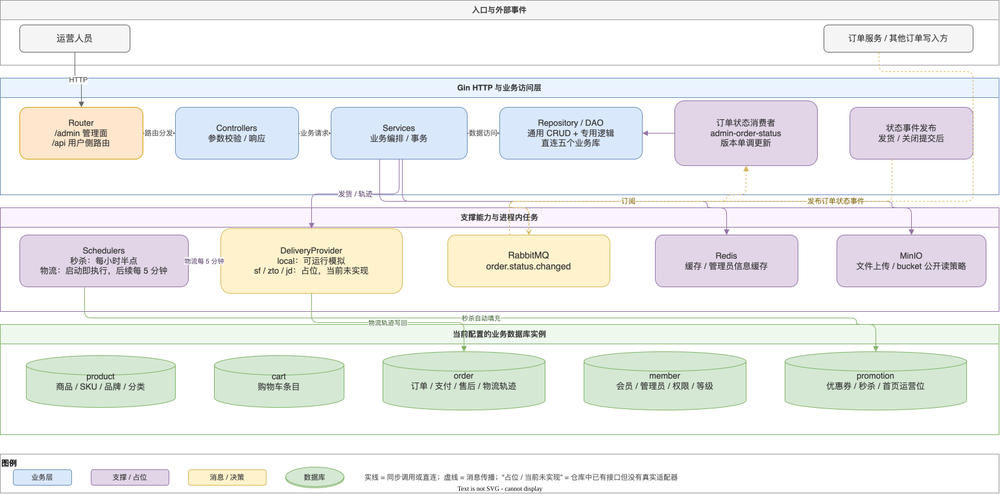

## 写在前面

这一篇文章我们来介绍这个项目的重要角色：管理后台。它既不是 C 端商城的另一个页面，也不是订单服务的简单管理界面，而是一套面向运营人员的 B 端系统。

重点回答四个问题：管理后台和 C 端如何分工，后台为什么可以直接访问多套业务库，订单状态消息在后台如何收敛，以及物流、秒杀场次和文件上传这些运营能力分别落在什么位置。

先给结论：当前后台是一个 **Gin HTTP 入口 + 业务服务层 + Repository/DAO + 多个业务数据库实例** 的运营系统；它同时通过 RabbitMQ 订阅订单状态变化，并在管理操作提交后发布部分状态事件。物流和秒杀是进程内定时任务，文件上传则由 MinIO 服务完成。这里还没有独立的后台读模型，也没有已经接通的顺丰、中通、京东物流适配器。

## 一、B 端和 C 端：同一业务系统的两种视角

### 1. C 端负责交易体验

C 端商城面向普通会员，核心诉求是浏览商品、管理购物车、提交订单、支付、查看订单和发起售后。它通过商城网关进入会员、商品、营销、购物车和订单等领域服务，主要关心一次用户操作能否得到及时响应，以及用户看到的状态是否符合交易流程。

### 2. B 端负责运营和履约操作

B 端面向管理员和运营人员，关注的是商品与 SKU 维护、分类和品牌、首页运营位、优惠券、秒杀配置、会员和订单处理、售后审核、物流信息以及运营看板。路由注册上，后台把管理接口放在 `/admin` 分组下，并通过登录中间件保护。

两端的关系不是“B 端调用 C 端页面”，而是围绕同一批业务事实协作：C 端产生订单和支付等交易事实，B 端读取这些事实并执行发货、关闭订单、修改运营数据等动作。B 端的操作又可能通过订单状态消息通知会员服务和其他消费者。

### 3. 当前实现选择了直接访问业务库

这套后台没有把所有运营读写都包装成对各领域服务的 RPC 调用，而是由后台进程直接连接商品、购物车、订单、会员和营销数据库实例。这样做让运营 CRUD 路径短，列表、详情、关联表写入也更容易在后台服务层内完成；代价是后台需要理解各领域表结构，数据库 schema 变化会同时影响后台。

## 二、管理后台内部架构

图中把后台分成四层：HTTP 路由与控制器、业务服务与数据访问、支撑能力、业务数据库。RabbitMQ 位于后台和订单状态生产者之间，既承接外部订单状态变化，也承接后台发货或关闭订单后发布的状态事件。

## 三、从路由到数据库：后台的同步运营路径

### 3.1 HTTP 入口按管理面

Gin 引擎先挂载健康检查、指标、Swagger 和全局中间件，再注册 `/admin` 顶层分组。管理面登录接口位于鉴权之前，登录后的信息、商品、营销、订单、售后、文件上传等接口位于登录校验之后。

后台并不是只做订单管理：

| 运营域 | 当前的管理能力 |
| --- | --- |
| 商品 | 商品、品牌、分类、属性、SKU、审核记录 |
| 会员 | 会员等级、会员与管理员相关信息 |
| 营销 | 优惠券、首页运营位、秒杀活动、秒杀场次、投放计划 |
| 订单 | 订单列表、详情、收货信息、金额、发货、关闭、备注、操作历史 |
| 售后 | 售后列表、详情和命令处理 |
| 文件 | 阿里云 OSS 签名入口，以及 MinIO 上传和公开读策略入口 |
| 看板 | 商品、会员、订单和待办等统计接口 |

控制器负责 HTTP 参数和响应，服务层组织业务动作，Repository/DAO 负责查询和写入，数据库实例由配置统一初始化。这个分层的实际价值在于：一个“创建商品”或“发货”的后台动作可以在服务层中同时处理主表、关联表、操作历史和事务，而不是把多次数据库操作散落在控制器里。

### 3.2 Repository 显式绑定业务库

后台的通用 CRUD Repository 默认绑定商品库；涉及其他领域的 Repository 则显式绑定对应实例。当前配置中的数据库实例是 product、cart、order、member 和 promotion，分别承载商品、购物车、订单、会员和营销相关数据。

典型的映射关系如下：

| 数据库实例 | 后台直接操作的代表性数据 |
| --- | --- |
| product | 商品、品牌、分类、属性、SKU、商品评论和运营日志 |
| cart | 购物车条目 |
| order | 订单、订单明细、支付流水、订单操作历史、售后、退货原因和订单设置 |
| member | 管理员、会员、会员等级、角色权限、积分与成长值相关历史 |
| promotion | 优惠券、秒杀活动与场次、首页运营位、购买后投放计划 |

## 四、订单状态 MQ：后台既消费，也在部分操作后发布

### 4.1 启动时尝试建立 RabbitMQ 能力

后台启动顺序是先加载配置、日志、链路追踪和数据库，再根据 `mq.link` 尝试创建 RabbitMQ 客户端。客户端建立成功后，后台订阅订单状态变化主题；如果配置为空、连接失败或订阅失败，后台仍然继续启动 HTTP 服务。

MQ 是订单状态同步的重要能力，但当前启动逻辑没有把它设置为后台 HTTP 服务的硬依赖。没有 RabbitMQ 时，订单状态监听不可用，后台操作后的消息发布也不可用；代码会记录日志，而不会把整个管理后台阻断在启动阶段。

### 4.2 消费组隔离了不同消费者

后台使用固定消费组 `admin-order-status` 订阅 `order.status.changed`。会员服务使用自己的消费组，因此同一条订单状态事件可以分别送往会员结算和后台同步，不会因为某一方消费成功而让另一方失去消息。

后台消费者并不是收到消息后无条件改状态。它会校验订单身份、订单号、状态迁移、版本、消息 ID 和消息 Key，再按订单号从 order 库读取本地记录。只有事件版本比当前版本新时，才推进订单状态、版本和修改时间；重复事件、旧事件或已经应用的版本会被视为幂等成功。

消费失败也分层处理：格式错误、身份不匹配和未知迁移属于不可恢复消息，会拒绝；暂时的数据库或处理错误会重试。当前订阅设置为单并发、最多十次尝试、重试间隔五秒。这些策略说明后台消费的目标是“按版本单调收敛”，而不是重新执行一遍订单完整业务。

## 五、物流：策略接口已经存在，真实三方仍是占位

管理后台发货时会根据物流公司名称解析提供商，创建物流单或登记已有运单号，然后读取当前轨迹并把轨迹序列化到订单记录中。物流能力通过统一的提供商抽象接入，后台服务不需要把所有物流规则写进订单服务。

当前真正可运行的是本地模拟物流：

- 物流单和轨迹只保存在进程内存中，进程重启后丢失；
- 物流单号、起点仓库和途经点数量由订单号计算得到；
- 默认每小时推进一个轨迹间隔，最终追加收货地址和“已签收”节点；
- 内存记录达到清理上限后会被移除，避免模拟数据无限增长。

物流查询优先从提供商获取最新轨迹，失败时回退到订单中已经保存的轨迹。后台启动的物流同步任务会立即执行一次，之后每五分钟扫描已发货且有运单号的订单，把能够同步到的轨迹写回 order 库。

## 六、秒杀场次自动填充：运营配置之外的定时补位

后台提供秒杀活动、场次、商品关联和 SKU 配置的管理接口；除此之外，还启动了一个“全天整点秒杀”的自动填充任务。任务每小时半点运行，目标是上一小时对应的启用场次。

一次填充的业务顺序是：找到启用的活动和场次，删除该场次上一轮的商品关联及 SKU 配置，读取已上架且未删除的商品，筛选库存足够的 SKU，再写入新的商品关联和秒杀 SKU 配置。

当前规则也很具体：本轮随机选择三到五个合格商品；单个 SKU 只有库存达到十件才进入候选，秒杀数量按库存的十分之一计算，价格随机落在五折到八折之间。如果合格商品不足三件，任务仍会写入当前找到的结果；如果没有合格 SKU，则本轮跳过。

这些规则是当前后台的自动填充逻辑，不等同于通用的秒杀排期系统。任务依赖名为“全天整点秒杀”的启用活动和对应场次。

## 七、文件上传：MinIO 是当前可运行的对象存储路径

当前配置文件中，MinIO 则配置了 endpoint、访问凭证、bucket 和是否使用 TLS。

MinIO 上传由受保护的管理接口接收 multipart 文件。服务端根据配置初始化客户端，检查 bucket 是否存在；不存在时创建 bucket，并设置公开读取策略。对象名采用日期目录、UUID 和原始扩展名组合，上传完成后返回访问 URL、对象名和文件大小。