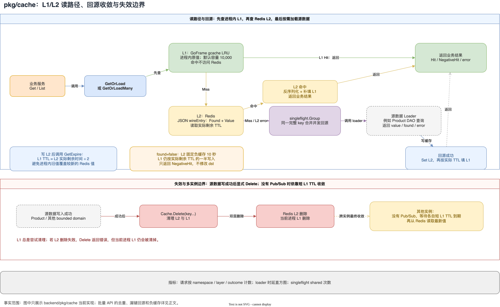

## 写在前面

前面的文章已经从架构、领域和端到端链路看过 AIGO 商城。这一篇切到主线 B：不再泛泛讨论“缓存能提高性能”，而是直接拆 `backend/pkg/cache` 这块已经落地的公共组件。

它的定位很明确：在一次 cache-aside 读请求中，先查当前进程的 L1，再查 Redis L2，最后才调用业务 loader。组件同时处理了 TTL、并发回源、空结果、批量漏键、主动失效和指标，但没有把自己包装成一个完整的分布式缓存一致性系统。

本文只以 `pkg/cache/cache.go`、`pkg/cache/README.md`、对应测试，以及 Product V2 和 Promotion 的实际接入代码为依据。尤其需要先说清楚两条边界：Product V2 已经调用了这套组件；Promotion 目前只有初始化占位，而且 namespace 含有组件明确禁止的冒号，当前初始化会失败，不能描述成“营销缓存已经生效”。

## 先看整体读路径



[缓存读路径与失效.drawio（可编辑源文件）](./AIGO微服务电商项目全栈拆解（08）多级缓存设计与实现/缓存读路径与失效.drawio)

图中只画 `pkg/cache` 已实现的事实：L1 是进程内 GoFrame `gcache` LRU，L2 是 Redis；L1 命中不会访问 Redis；L2 命中会按 Redis 的实际剩余 TTL 补填 L1；两级都未命中时，单键 `GetOrLoad` 通过 `singleflight` 合并回源。源数据写成功后由调用方显式 `Delete`，其他实例没有 Pub/Sub 推送，只能等自己的短 L1 TTL 到期后重新读取 Redis。

## 一、组件的边界：缓存旁路，而不是缓存即事实

`Cache` 持有三个核心对象：

- `l1`：当前进程中的 `gcache.Cache`，默认容量为 10,000；
- `l2`：由调用方传入的 GoFrame Redis client 适配器；
- `group`：`singleflight.Group`，只负责同一个完整 key 的并发回源合并。

公共 API 对业务暴露的是 `Get`、`Set`、`Delete`，以及泛型辅助函数 `GetOrLoad`、`GetOrLoadMany` 和 `GetOrLoadManyWithCount`。组件采用 cache-aside：源数据仍然由业务 loader 或 DAO 负责，缓存只保存查询结果。

### 1. namespace 是 key 的一部分

组件会把业务 key 组装为：

```text
namespace:key
```

namespace 不能为空，也不能含 `:`；业务 key 会先去掉首尾空格，空 key 直接报错。这个约束不是 Redis 的通用规则，而是该组件自己的 key 拼接约定，因此每个 bounded domain 应使用稳定、互不冲突的 namespace。

`Config` 里的 TTL 没有全局默认值。正缓存每次 `Set` 或 `GetOrLoad` 都必须传入 L2 TTL，L1 的过期时间由组件根据 L2 实际剩余时间计算，而不是再维护一份独立配置。

### 2. L2 存 wireEntry，L1 存原值

Redis 中保存的是 JSON 形式的 `wireEntry`：

```go
type wireEntry struct {
    Found bool            `json:"found"`
    Value json.RawMessage `json:"value,omitempty"`
}
```

`Found=true` 时才有 `Value`；`Found=false` 表示“源数据确认不存在”，也就是负缓存。L1 中保存的是 `cacheEntry`，正值路径会保留原始 Go 值的引用语义；README 明确要求调用方把从 L1 返回的值当作只读数据，不能在业务代码里原地修改后再假设缓存仍然安全。

从 L2 读取时，组件先反序列化 `wireEntry`，再把 `Value` 反序列化到调用方提供的目标指针，并用解码后的值填充 L1。类型不匹配时会清掉这条 L1，再回到 L2 或 loader，而不是把错误类型继续向业务层传播。

## 二、一次单键读取：L1 → L2 → loader

`Get` 的状态只有三个：`Miss`、`Hit`、`NegativeHit`。一次读取可以按下面的顺序理解：

1. 用完整 key 查 L1；正值命中返回 `Hit`，负值命中返回 `NegativeHit`。
2. L1 未命中后查 Redis；Redis 没有 key 返回 `Miss`。
3. Redis 有正值时解码，返回 `Hit`，并尝试根据 L2 实际剩余 TTL 补填 L1。
4. Redis 有 `Found=false` 时返回 `NegativeHit`，同样按剩余 TTL 的一半尝试补填 L1。
5. 只有 `GetOrLoad` 判断为 miss，才进入 singleflight 并调用 loader。

代码摘要可以压缩成下面这样，重点是 `found` 和 `err` 的语义：

```go
product, found, err := cache.GetOrLoad(
    ctx, utility.Cache, productCacheKey(id), productCacheTTL,
    func(ctx context.Context) (*entity.PmsProduct, bool, error) {
        var loaded *entity.PmsProduct
        err := dao.PmsProduct.Ctx(ctx).
            Where(dao.PmsProduct.Columns().Id, id).
            Scan(&loaded)
        return loaded, loaded != nil, err
    },
)
```

loader 返回 `found=false` 不是异常，而是可以被缓存一小段时间的“确实不存在”。loader 自己返回 error，或者缓存数据无法解码，则不会被当成正常 miss 静默吞掉。

### L1 为什么只用 L2 实际 TTL 的一半？

写入正缓存时，组件先把 JSON 写入 L2，再调用 `GetExpire` 读取 Redis 返回的实际剩余时间，最后执行：

```go
l1TTL := remaining / 2
```

从 L2 命中补填 L1 时也走同样的逻辑；如果算出的 L1 TTL 小于 1 毫秒，则不写入 L1。这样做有两个直接效果：

- L1 不会比 L2 活得更久，进程内旧值会更早让位给 Redis；
- Redis TTL 因网络、实现或写入耗时发生变化时，L1 仍以实际剩余时间为基准，而不是盲用调用方传入的原始 TTL。

“一半”不是一致性协议，也不能替代写后失效。它只是让 L1 成为更短的本地加速层：L1 过期后重新读 L2，L2 过期后才真正回源。

## 三、singleflight：把同一个 key 的并发回源合并

`GetOrLoad` 第一次查缓存未命中后，以完整的 `namespace:key` 作为 singleflight key。进入 `group.Do` 后还会再检查一次 L1：前一个 goroutine 可能已经完成 loader 并写入了 L1，后进入的 goroutine 不需要再次访问源数据。

因此，同一进程、同一完整 key 的并发 miss，loader 只执行一次，其他调用方共享结果。组件还单独记录 `singleflight` 的 shared 次数，用于观察请求是否确实发生了合并。

这里要注意范围：当前代码只在单键 `GetOrLoad` 中使用 `singleflight`。`GetOrLoadMany` 是一次批量扫描和一次 batch loader 调用，并没有为每个批量 key 再建立一套并发 singleflight 机制，不能把它描述成“批量请求也自动全局合并”。

### Redis 故障时会怎样？

`ErrL2Unavailable` 是组件专门标记 Redis 操作失败的错误。`GetOrLoad` 对这类错误采取 fail-open：把它当成缓存不可用，继续执行 loader；如果 loader 成功但 Redis 写入或 TTL 读取仍失败，结果可以返回给业务，但不会因此成功填充 L1。

这不是所有错误都忽略：JSON 解码错误、参数错误和 loader 错误仍然返回。直接调用 `Cache.Get` 或 `Cache.Set` 也会看到 L2 错误；只有 `GetOrLoad` 和批量辅助函数对 `ErrL2Unavailable` 做了回源兜底。

## 四、负缓存：10 秒止住不存在数据的反复回源

当单键 loader 返回 `found=false` 时，组件不使用调用方传入的正缓存 TTL，而是写入固定的 `negativeL2TTL = 10 * time.Second`。批量场景中，loader map 没有返回的漏键也按同样规则负缓存。

所以一次“商品不存在”的结果大致是：

```text
L2：Found=false，TTL 固定 10 秒
L1：按 L2 实际剩余时间的一半缓存负结果，约 5 秒
返回：NegativeHit，且不修改 dst
```

负缓存解决的是缓存穿透的一小部分：重复查询同一个确认不存在的 key 时，不会每次都直接打到数据库。它不是布隆过滤器，也没有声明所有非法 ID 都能被预判；它只缓存 loader 已经确认的 not found。

## 五、批量读取：去重、只加载漏键、为漏键继续缓存

`GetOrLoadMany` 使用默认的 `DefaultBatchCount=50`；需要更大或更小的处理上限时，可以调用 `GetOrLoadManyWithCount` 显式传入 count。

它的顺序很重要：先按完整 key 去重，再应用 count。比如输入 `a, a, b, c`，count 为 2 时，实际选中的是 `a, b`，而不是先截断成 `a, a` 再去重。

批量函数随后逐个查询两级缓存：

- 正缓存命中直接进入结果 map；
- 负缓存命中直接跳过；
- 两级都 miss 的 key 才进入 `missingKeys`；
- loader 只收到 `missingKeys`，并且调用一次；
- loader 返回 map 中未出现的请求 key 会写入负缓存；
- loader 返回了请求之外的额外 key，会被忽略；
- 最终结果 map 只包含找到的值。

这套接口把“请求 key 集合”和“数据库真正需要查询的 key 集合”分开了。loader 不需要重新判断哪些 key 已经命中缓存，也不需要为不存在的记录手工创建另一套标记。

## 六、Delete 失效策略与多实例收敛

组件没有自动监听数据库写入，也没有在 `pkg/cache` 内实现 Pub/Sub。README 给调用方的约定是：源数据写成功后调用 `Delete`。

`Delete(ctx, keys...)` 会构造完整 key，先尝试删除 Redis L2，再清理当前进程 L1。即使 L2 删除失败，代码仍然会执行 L1 删除，并把 L2 错误返回给调用方。因此它不是“删除失败就保留本地缓存”，而是优先降低当前进程继续读旧值的概率，同时把跨实例问题暴露出来。

多实例下的真实边界是：实例 A 调用 Delete，只能直接清掉 A 的 L1 和共享 Redis L2；实例 B 的 L1 不会被远程主动通知。没有 Pub/Sub 时，B 会在自己的短 L1 TTL 到期后再读 Redis，从而最终收敛。若 L2 删除本身失败，旧值还可能继续存在于 Redis，组件并没有在这里提供重试队列或持久化失效日志。

因此写路径应遵循“先提交源数据，成功后 Delete”的顺序；而在当前核对到的 Product V2 代码中，没有看到商品写入流程调用 `utility.Cache.Delete`。这意味着不能进一步推断商品更新已经具备即时缓存失效能力。

## 七、指标：能看到命中、回源和合并是否发生

`pkg/cache` 建立了名为 `micro-mall.dev/pkg/cache` 的 meter，当前代码定义了三类观测：

| 指标 | 作用 |
| --- | --- |
| `micro_mall_cache_requests_total` | 按 `cache.namespace`、`cache.layer`、`cache.outcome` 统计 L1/L2/loader 等结果 |
| `micro_mall_cache_loader_duration_ms` | 记录单键 loader 和 batch loader 的执行时延，单位为毫秒 |
| `micro_mall_cache_singleflight_shared_total` | 统计有多少次 `GetOrLoad` 共享了 singleflight 结果 |

这些指标能回答“缓存是否命中”“Redis 是否出错”“loader 是否变慢”“并发 miss 是否被合并”。但当前组件没有在代码中提供命中率计算、自动告警、热 key 淘汰策略或跨实例失效广播；这些能力都不应从现有指标定义外推出来。

## 八、Product V2 的真实接入：商品详情和批量列表

### 1. 单个商品详情

`app/product/internal/service/v2/product.go` 定义：

```go
const (
    productCacheTTL  = time.Hour
    productKeyPrefix = "product:"
)
```

`GetProduct` 用 `product:<id>` 作为 key，通过 `GetOrLoad` 读取。loader 查询 `pms_product` 的指定 ID，并要求 `publish_status` 为上架状态；查不到时返回 `found=false`，最终服务层把它转换为商品不存在的业务错误。

这说明缓存的是“当前商品详情查询结果”，不是任意商品表快照：未上架商品不会因为数据库中存在记录就被当作可读商品缓存。

### 2. 批量商品列表

`ListProducts` 将输入商品 ID 转成 `product:<id>`，然后调用 `GetOrLoadManyWithCount`，count 传入 `len(keys)`，TTL 仍是一小时：

真实调用是 `cache.GetOrLoadManyWithCount(ctx, utility.Cache, keys, len(keys), productCacheTTL, loader)`；loader 只接收 `missingKeys`，再把这些 key 还原成商品 ID，执行 `WhereIn` 查询和上架状态过滤，并按 `product:<id>` 建 map。这里不把完整 DAO 代码贴进文章，避免把缓存组件的重点淹没在查询细节中。

上面只保留调用形态，loader 的真实实现是把漏掉的 key 还原成 ID，用 `WhereIn` 批量查 `pms_product`，并过滤上架状态，再按 `product:<id>` 建 map。缓存组件负责去重、漏键分流和负缓存，Product 服务负责 ID 转换、DAO 查询和返回顺序。

如果 loader 没有返回某个请求 key，该 key 会被 `pkg/cache` 负缓存；Product 最后遍历原始 `ProductIds`，只把结果 map 中找到的商品追加到返回列表。因此，数据库中不存在或未上架的商品不会进入结果列表。

### 3. Product 的缓存实例配置

`app/product/utility/cache.go` 使用 namespace `product`、L1 容量 10,000，并把 `g.Redis()` 交给 `mmcache.New`。这部分是已实际被 Product V2 调用的实例。

但在本次核对的 Product V2 和相关 utility 文件里没有找到写路径上的 `Delete` 调用，文章只能下结论到“读缓存已经接入”，不能扩展成“商品更新后的缓存失效闭环已经完成”。

## 九、Promotion 接入的事实边界：初始化占位，不是已生效缓存

`app/promotion/utility/cache.go` 也声明了一个 `*mmcache.Cache`，L1 容量同样是 10,000，但 namespace 写成了：

```go
Namespace: "micro-mall:promotion",
```

而 `pkg/cache.newWithStores` 明确拒绝包含 `:` 的 namespace，并返回 `cache: namespace must not contain ':'`。因此当前初始化遇到该值时会直接 return，`utility.Cache` 不会被赋值；同时，在 promotion 目录中也没有检索到 `utility.Cache` 被 `GetOrLoad` 或其他缓存 API 使用。

结论必须写成：Promotion 当前存在缓存初始化代码，但按现有约束它是失败的接入占位，业务缓存读取当前未实现。若后续修正 namespace，还需要继续核对具体业务读写和 Delete 调用，不能仅凭这个 utility 文件宣布营销域已经完成多级缓存接入。

## 十、面试题：从实现细节回答，而不是背概念

### Q1：为什么 L1 TTL 取 L2 实际剩余时间的一半？

因为 L1 是进程内副本，必须比共享的 Redis L2 更早过期。代码不是拿传入的原始 TTL 直接设置 L1，而是写入/读到 L2 后调用 `GetExpire`，用实际剩余时间除以二。这样 L1 到期后会重新检查 L2，减少本地旧值长期遮蔽 Redis 新值的窗口；但它仍不是强一致保证，写成功后的主动 Delete 不能省略。

### Q2：Redis 故障时为什么还能返回数据？

`GetOrLoad` 只把 `ErrL2Unavailable` 当作缓存不可用并继续 loader。loader 成功时可以把源数据返回给业务；如果 Redis 写回或 TTL 读取也失败，则不填充 L1，避免把一次没有成功持久化到 L2 的结果误当成已缓存。loader 错误和解码错误不属于这个 fail-open 范围，仍然会返回。

### Q3：批量 loader 为什么只拿 miss 的 key？

因为批量 API 已经先逐个完成 L1/L2 判断。把命中的 key 再交给 DAO 会浪费查询，并且让 loader 无法区分“需要回源”和“已经有缓存”。代码通过 `missingKeys` 明确分界，loader 只查询漏键；返回 map 中没出现的漏键再被负缓存，下一次批量请求也不会重复打源。

### Q4：singleflight 是否解决了多实例击穿？

没有。它挂在每个 `Cache` 实例内部，只能合并同一进程中相同完整 key 的并发 loader。多实例之间没有共享 singleflight；它们依靠 Redis 作为共享 L2，以及 L1 短 TTL 和主动 Delete 尽量降低重复回源和旧值窗口。当前实现也没有分布式锁或 Pub/Sub 失效广播。

### Q5：调用 Delete 后是否所有实例立即拿到新值？

不保证。Delete 会清除调用实例的 L1 和共享 L2，但不会远程清掉其他实例的 L1。没有 Pub/Sub 时，其他实例要等自己的 L1 TTL 到期，之后从 Redis 读取；如果 L2 删除失败，Redis 侧旧值也可能仍在。这个组件提供的是最终收敛路径，不是即时全局失效协议。

## 结语：这套缓存真正解决了什么

`pkg/cache` 的价值不在于堆了很多缓存术语，而在于把几条容易散落在业务代码里的规则集中起来：

1. L1 GoFrame LRU 加 L2 Redis，读路径固定为 L1 → L2 → loader；
2. L1 使用 L2 实际剩余 TTL 的一半，缩短进程内旧值窗口；
3. 单键回源用 singleflight 合并同进程并发，Redis 故障按可识别错误 fail-open；
4. not found 用 10 秒负缓存，批量接口先去重、只回源漏键，并继续缓存漏键结果；
5. Delete 同时清理两层，但多实例只做到没有 Pub/Sub 时的 TTL 收敛；
6. 指标覆盖请求结果、loader 时延和 singleflight 共享次数。

当前真实落地范围也同样清楚：Product V2 的详情和批量列表已经使用；Promotion 仍是 namespace 不符合约束且没有业务调用的占位；Product 写路径是否调用 Delete 也不能从当前代码中确认。把这些边界写出来，才是对“可复用缓存组件”和“业务缓存闭环”之间差异的准确描述。

## 代码索引

- `backend/pkg/cache/cache.go`
- `backend/pkg/cache/README.md`
- `backend/pkg/cache/cache_test.go`
- `backend/app/product/internal/service/v2/product.go`
- `backend/app/product/utility/cache.go`
- `backend/app/promotion/utility/cache.go`
