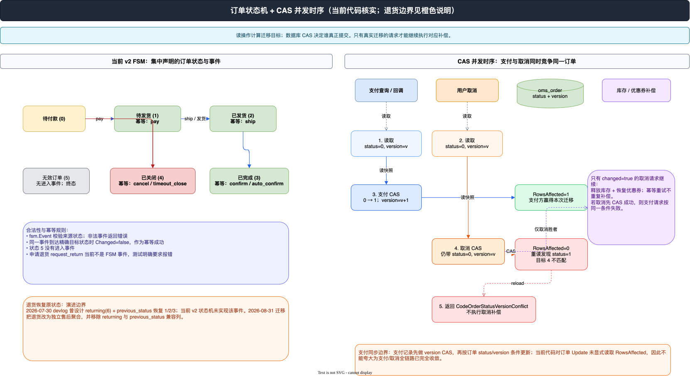

## 写在前面：把“状态能不能变”和“谁真的变成功”拆开

第 05 篇从业务视角梳理过订单的完整生命周期，第 06 篇又把支付、发货、收货和售后放回端到端链路。进入技术深潜线后，最值得单独拆出来的是订单状态的两个问题：

1. 业务代码怎样集中描述“什么事件可以把订单从哪里变到哪里”；
2. 两个请求同时拿到同一份订单快照时，怎样保证只有一个请求真正提交状态及其后续副作用。

本文以当前工作区的 `backend/app/order/internal/service/v2` 代码为准，重点核对 `order_state_machine.go`、`order_state_persistence.go` 和 `order_state_machine_test.go`，并对照 `devlog/devlog.md` 中 2026-07-30 的“订单状态机与乐观锁改造”记录。先给一个重要结论：**当前 v2 已经落地的是六个订单状态、状态迁移校验和 `version` CAS；`previous_status` 与订单级“退货中”状态属于演进记录中的方案，当前版本已经通过 2026-08-31 迁移撤回，不能当成现有能力。**

## 一、为什么需要状态机和乐观锁

### 1. 分散状态判断的问题

订单状态不是普通枚举。支付、取消、超时关单、发货、确认收货和自动确认收货都可能来自不同入口：用户请求、支付回调、定时扫描、延迟消息或管理端操作。如果每个入口都各自写一段 `if status == ...`，很容易出现三类问题：

- 同一个事件在不同入口允许的来源状态不一致；
- 已经完成的动作被重复请求时，接口把幂等重试误判为异常；
- 状态写入成功与库存、优惠券、积分等后续动作之间没有清晰的“胜者”边界。

2026-07-30 的 devlog 把改造职责划得很清楚：**FSM 负责验证迁移并计算目标状态；服务层负责事务、附属字段和数据库持久化。** 这个拆分的价值不在于引入一个库，而在于把业务决策与并发提交分成两个可测试的步骤。

### 2. 状态机解决“能不能变”，CAS 解决“谁变成功”

状态机只根据读到的当前状态计算结果，它本身不锁数据库，也不保证两个请求之间的先后关系。乐观锁则把读取时的 `version` 带进 `UPDATE` 条件：只要期间有另一个请求先提交，当前更新就会因为条件不再匹配而影响 0 行。

因此完整语义是：

```text
当前状态 + 事件
      │
      ├─ FSM：迁移是否合法？目标状态是什么？是否只是幂等到达？
      │
      └─ 数据库 CAS：status/version 条件是否仍匹配？谁拿到提交权？
```

## 二、`looplab/fsm` 集中声明当前状态和事件

### 1. 当前代码中的六个订单状态

当前生成实体 `backend/app/order/internal/model/entity/oms_order.go` 的状态注释仍是六个订单状态：

| 状态码 | 状态 | 在当前 FSM 中的角色 |
| --- | --- | --- |
| `0` | 待付款 | 支付、取消、超时关闭的来源状态 |
| `1` | 待发货 | 支付的目标状态，也是发货的来源状态 |
| `2` | 已发货 | 确认收货、自动确认收货的来源状态 |
| `3` | 已完成 | 确认收货类事件的幂等目标 |
| `4` | 已关闭 | 取消、超时关闭的幂等目标 |
| `5` | 无效订单 | 兼容历史数据；当前没有进入事件 |

状态机实现没有另造一套字符串常量来替代数据库整数，而是通过 `orderStateName` 把状态码转为字符串，再交给 `looplab/fsm`。执行结束后，`orderStatusFromStateName` 再把字符串解析回 `utility.OrderStatus`。这样既能使用 FSM 的事件 API，又保持了数据库和现有接口的状态码不变。

### 2. 事件表集中描述迁移

`order_state_machine.go` 中的 `orderEventDescriptions` 是迁移的单一声明位置。当前实际声明如下：

| 事件 | 来源 | 目标 | 精确幂等状态 |
| --- | --- | --- | --- |
| `pay` | 待付款 `0` | 待发货 `1` | 待发货 `1` |
| `cancel` | 待付款 `0` | 已关闭 `4` | 已关闭 `4` |
| `timeout_close` | 待付款 `0` | 已关闭 `4` | 已关闭 `4` |
| `ship` | 待发货 `1` | 已发货 `2` | 已发货 `2` |
| `confirm_receipt` | 已发货 `2` | 已完成 `3` | 已完成 `3` |
| `auto_confirm_receipt` | 已发货 `2` | 已完成 `3` | 已完成 `3` |

幂等迁移不是把所有重复事件都放行。例如 `pay` 到达已经支付的 `1` 是幂等成功，但对已关闭订单触发 `pay` 仍然是非法迁移。精确目标状态才是幂等边界，这比“只要不是待付款就返回成功”更安全。

代码摘要只保留状态机的职责边界：

```go
machine := fsm.NewFSM(orderStateName(current), orderEventDescriptions, orderStateCallbacks())
err := machine.Event(ctx, string(event), orderSn)

return orderTransition{
    From: current,
    To:   target,
    Changed: current.Code != target.Code,
}, nil
```

这里的 `Changed` 很关键：它把“事件合法但没有产生新状态”的幂等成功，与“真实发生状态迁移”区分开，后面的库存释放、优惠券恢复和消息通知都要依赖这个结果。

### 3. 合法性校验和回调只做各自的事

`transitionOrderStatus` 创建 FSM 后调用 `machine.Event`。普通非法事件会被包装成“当前状态拒绝该事件”的错误；`fsm.NoTransitionError` 则被保留下来继续解析当前状态，使精确幂等状态可以返回 `Changed=false`。未知状态码或无法解析的状态名会直接报错，避免把脏数据静默映射成某个合法状态。

状态回调 `orderStateCallbacks` 当前只记录迁移日志，日志包含订单号、事件、来源状态和目标状态。它没有在 FSM 回调里写数据库或调用库存服务，这也是“状态决策不夹带副作用”的体现。

## 三、持久化层：`version` 把状态迁移变成 CAS

### 1. 先读出足够的状态快照

`order_state_persistence.go` 使用 `orderStateRecord` 承载迁移所需的最小订单快照，其中有 `Id`、`MemberId`、`OrderSn`、`StatusCode`、`Version` 以及支付、积分和订单金额等后续动作会用到的字段。`loadOrderState` 支持传入事务对象：有事务时从同一个事务连接读取，没有事务时使用订单 DAO 查询。

为什么不只传一个状态码？因为 CAS 至少需要订单 id、会员归属、旧状态和旧版本；而取消订单在 CAS 成功后还要根据订单明细释放库存、恢复优惠券，支付状态消息也需要订单号和会员 id。把这些字段保留在同一个读取快照里，能让“状态变化”和“后续动作”的数据来源一致。

### 2. 原子更新的条件必须包含四个维度

真实迁移进入 `persistOrderTransition` 后，先处理 `Changed=false`：幂等请求不写库、不增加版本。对真实迁移，更新数据包括目标 `status` 和 `version = version + 1`，条件则由 `OmsOrderStateCondition` 组成：

```go
update.Status = transition.To.Code
update.Version = gdb.Raw("`version` + 1")

result, err := orderModel(ctx, tx).
    Data(update).
    Where(do.OmsOrderStateCondition{
        Id: order.Id, MemberId: order.MemberId,
        Status: transition.From.Code, Version: order.Version,
    }).
    Update()
```

这四个条件分别回答了：是不是同一条订单、是不是同一个会员的订单、订单是否仍处在计算迁移时看到的旧状态、读到的版本是否仍然有效。`version` 使用数据库表达式递增，避免先读后写把并发请求的版本覆盖掉。

### 3. `RowsAffected` 是 CAS 的判定点

更新结果不是简单看 SQL 有没有报错，而是继续读取 `RowsAffected`：

- `affected > 0`：当前请求赢得 CAS，返回 `true`，调用方才可以执行迁移后的副作用；
- `affected == 0`：重新读取订单；如果最新状态已经是本次目标状态，说明另一个请求已经完成同一迁移，返回 `false, nil`，按幂等成功处理；
- 如果订单消失，或最新状态不是本次目标状态，则返回 `CodeOrderStatusVersionConflict`，表示版本竞争后状态发生了分叉。

这也是为什么“更新 0 行”不能直接当成数据库错误：它可能是一个已经完成的重复请求，也可能是支付与取消之间的真实冲突，必须结合最新状态再次判断。

`order_state_persistence_test.go` 当前正好覆盖这四种结果：更新成功、并发请求已经到达目标状态、并发请求转向其他状态、订单不存在。带 `integration` build tag 的 `order_state_persistence_integration_test.go` 还验证了第一次迁移把版本从 `0` 增到 `1`，以及使用旧快照重复迁移时不会覆盖已经写入的 `pay_type`。

## 四、事务和副作用：CAS 胜者才有资格继续

### 1. 取消订单是当前最清晰的胜者路径

`OrderService.CancelOrder` 的顺序可以压缩成下面几步：

1. 按订单 id 和会员 id 读取订单，计算 `cancel` 迁移；
2. 在订单事务中调用 `persistOrderTransition`；
3. 迁移成功后发布订单状态变更消息；
4. 只有 `changed=true` 时，读取订单明细并调用商品服务释放库存、营销服务恢复优惠券。

因此支付请求先赢时，取消请求的 CAS 会返回 0 行，重读到状态 `1` 后目标 `4` 不匹配，取消直接返回版本冲突，不会进入库存和优惠券补偿。取消先赢时，则由取消请求执行一次释放，随后到达的重复取消会被识别为已处于 `4`，不会重复释放。

这里要保留一个实现细节：取消路径中的库存和优惠券补偿确实被 `changed` 门控；积分返还调用在当前 `CancelOrder` 中位于 `changed` 判断之前，但它使用 `order-close:<orderSn>` 业务键交给会员服务做幂等。因而更准确的结论是：**CAS 明确控制了库存/优惠券补偿的胜者边界，积分返还还依赖下游业务键幂等，不能把所有外部副作用都笼统描述为由同一个布尔值直接控制。**

### 2. 支付路径存在继承边界，不能夸大结论

支付状态同步仍主要承接 v1 的 `persistPaymentQueryResult`。当前实现先对支付流水使用 `payment_id + status=PENDING + payment.version` 做版本条件更新；支付记录更新成功后，再以订单 `status=0 + version=v` 条件尝试把订单推进到待发货，并写入支付方式和支付时间。

这条路径体现了同样的 CAS 思路，但和 v2 的 `persistOrderTransition` 有一个必须写清楚的差异：当前代码对“订单状态 Update”没有显式读取 `RowsAffected`，而是事务后重新读取订单并触发状态变更回调。因此，文章可以确认它带有订单状态和版本条件，但不能把它表述成支付/取消全链路已经用统一的 RowsAffected 判定完全收敛。图右下角的橙色说明就是这个当前边界。



可编辑源文件：[订单状态机与 CAS 并发时序.drawio](./AIGO微服务电商项目全栈拆解（09）订单状态机与乐观锁改造/订单状态机与CAS并发时序.drawio)

## 五、`previous_status` 与退货恢复：设计记录和当前实现要分开

### 1. devlog 中的退货状态机方案

2026-07-30 的 devlog 曾记录过另一套订单级状态方案：申请退货时从待发货、已发货或已完成进入“退货中(6)”，同时写入 `previous_status`；撤销退货时使用这个字段恢复到原状态。这样设计的动机很直接：如果只看到“退货中”，撤销时无法可靠推断原来是 `1`、`2` 还是 `3`，更不能用“当前状态减一”之类的规则代替事实。

在这套方案里，`previous_status` 不是普通备注，而是状态迁移的一部分：进入退货中时记录原状态；重复新增其他商品的退货申请不能覆盖它；撤销时把恢复动作和订单状态写入同一事务，并保留该值用于重试判定。这正是 devlog 所说“退货恢复原状态”的业务含义。

### 2. 当前代码并没有实现这条订单级迁移

核对当前工作区后，需要明确写出以下事实：

- `order_state_machine.go` 没有 `request_return` 或 `cancel_return` 事件；
- `order_state_machine_test.go` 的用例 `return request is not an order transition` 明确期望该事件报错；
- 当前生成的 `OmsOrder` entity 和 `OmsOrder` DO 都只有 `Version`，没有 `PreviousStatus`；
- `20260831_remove_order_returning_status.sql` 把历史 `status=6` 归并回已完成、已发货或待发货；
- `20260831_z_cleanup_order_return_compat.sql` 检查并删除 `oms_order.previous_status`；
- 当前 `after_sale.go` 在事务中锁定订单、校验可售后状态并创建售后单、售后明细和退款单，但没有把 `oms_order.status` 改成“退货中”，也没有写回 `previous_status`。

所以“退货恢复原状态”在本文中应标为：**当前未实现/已撤回的订单级状态机能力**。当前实现采用的是“订单主状态保持在已支付、已发货或已完成，售后记录作为独立逆向交易聚合”的边界；取消售后单只更新售后单状态，不存在把订单从 `6` 恢复到 `previous_status` 的当前路径。把 devlog 中的方案直接画成现状，会误导读者。

## 六、测试说明：测试既验证规则，也暴露边界

当前 v2 测试代码给出了比较清楚的分层：

| 测试 | 当前可核实的覆盖 |
| --- | --- |
| `order_state_machine_test.go` | 六类事件的合法迁移、对应幂等目标、非法来源、未知事件和无效订单终态 |
| `order_state_persistence_test.go` | CAS 更新成功、幂等重试、状态分叉冲突、订单不存在 |
| `order_state_persistence_integration_test.go` | 测试库中的 `version` 迁移、版本递增和旧快照不能覆盖支付方式；带 `integration` build tag |
| `order_status_mq_test.go` | 状态消息使用订单号和版本组成稳定消息 id；这是提交后通知的幂等基础 |

另一方面，devlog 的测试计划还写过 `previous_status` 写入/恢复、退货恢复 `1/2/3`、并发取消只补偿一次和并发支付不覆盖支付信息。这些是改造记录中的目标或验证计划；由于当前状态机测试反而把 `request_return` 判定为非法，不能把它们写成当前测试已经覆盖的能力。

## 七、这次改造真正带来的收益

从当前代码能够确认的收益有四点：

1. **迁移规则集中**：状态和事件不再散落在取消、确认收货、超时任务等入口中，非法迁移有统一判定。
2. **幂等语义明确**：目标状态相同是幂等成功，状态分叉是版本冲突，两者不会混成一个“更新失败”。
3. **提交权可观测**：`RowsAffected` 把数据库层的竞争结果转成 `changed`，服务层据此决定是否发送事件和做库存/优惠券补偿。
4. **接口兼容**：devlog 记录的改造保持 protobuf、网关路由和现有服务方法签名不变，变化集中在状态决策和持久化内部。

同时也要保留当前实现的边界：状态事件是在本地事务提交后直接发布，发布失败目前记录 warning，代码注释明确把持久化 outbox 留作后续增强；支付同步路径也不是完全复用 v2 的 `persistOrderTransition`。这两个边界说明，状态机和乐观锁解决的是“状态写入竞争”的核心问题，并不自动等价于跨服务副作用和消息投递已经具备端到端强一致。

## 结语

订单状态机的关键不是把状态画成一张图，而是把每一次状态变化拆成三问：事件是否合法、数据库条件是否仍然匹配、只有真正提交者才能做哪些副作用。AIGO 当前 v2 已经用 `looplab/fsm` 集中声明了六状态迁移，用 `version`、旧状态条件和 `RowsAffected` 形成了可测试的 CAS 边界；取消路径也把库存与优惠券补偿放在真实迁移之后。

至于 `previous_status` 和退货恢复原状态，正确结论不是“已经完成”，而是：它曾经是订单级状态机的演进方案，随后项目把退货状态拆到独立售后聚合，并清理了订单级 returning/previous_status 兼容字段。对真实项目做技术拆解时，能把“已实现”“曾设计”“当前未实现/已撤回”分开，本身就是比一张漂亮状态图更重要的工程能力。

本文核对的主要文件：

- `backend/app/order/internal/service/v2/order_state_machine.go`
- `backend/app/order/internal/service/v2/order_state_persistence.go`
- `backend/app/order/internal/service/v2/order_state_machine_test.go`
- `backend/app/order/internal/service/v2/order_state_persistence_test.go`
- `backend/app/order/internal/service/v2/order_state_persistence_integration_test.go`
- `backend/app/order/internal/service/v2/order.go`
- `backend/app/order/internal/service/v2/after_sale.go`
- `backend/app/order/internal/service/v1/order.go`
- `backend/db/migrations/20260730_add_order_state_machine_columns.sql`
- `backend/db/migrations/20260831_remove_order_returning_status.sql`
- `backend/db/migrations/20260831_z_cleanup_order_return_compat.sql`
- `devlog/devlog.md`（2026-07-30“订单状态机与乐观锁改造”）
