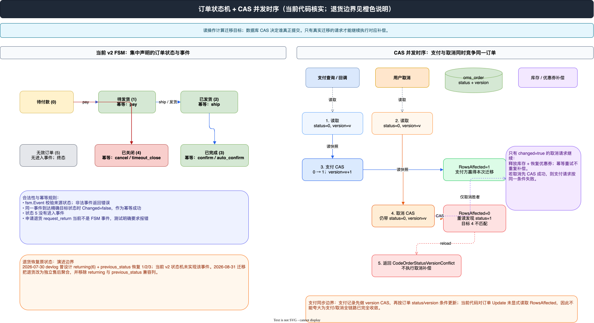

## 写在前面：把“状态能不能变”和“谁真的变成功”拆开

这篇文章我们来讲讲订单状态的两个问题：

1. 业务代码怎样集中描述“什么事件可以把订单从哪里变到哪里”；
2. 两个请求同时拿到同一份订单快照时，怎样保证只有一个请求真正提交状态及其后续副作用。

## 一、为什么需要状态机和乐观锁

### 1. 分散状态判断的问题

订单状态不是普通枚举。支付、取消、超时关单、发货、确认收货和自动确认收货都可能来自不同入口：用户请求、支付回调、定时扫描、延迟消息或管理端操作。如果每个入口都各自写一段 `if status == ...`，很容易出现三类问题：

- 同一个事件在不同入口允许的来源状态不一致；
- 已经完成的动作被重复请求时，接口把幂等重试误判为异常；
- 状态写入成功与库存、优惠券、积分等后续动作之间没有清晰的“胜者”边界。

**FSM 负责验证迁移并计算目标状态；服务层负责事务、附属字段和数据库持久化。**

### 2. 状态机解决“能不能变”，CAS 解决“谁变成功”

状态机只根据读到的当前状态计算结果，它本身不锁数据库，也不保证两个请求之间的先后关系。乐观锁则把读取时的 `version` 带进 `UPDATE` 条件：只要期间有另一个请求先提交，当前更新就会因为条件不再匹配而影响 0 行。

因此完整语义是：

```text
当前状态 + 事件
      │
      ├─ FSM：迁移是否合法？目标状态是什么？是否只是幂等到达？
      │
      └─ 数据库 CAS：status/version 条件是否仍匹配？谁拿到提交权？
```

## 二、`looplab/fsm` 集中声明当前状态和事件

### 1. 订单的五个状态

系统目前在状态机中定义了五个订单状态：

| 状态码 | 状态 | 在当前 FSM 中的角色 |
| --- | --- | --- |
| `0` | 待付款 | 支付、取消、超时关闭的来源状态 |
| `1` | 待发货 | 支付的目标状态，也是发货的来源状态 |
| `2` | 已发货 | 确认收货、自动确认收货的来源状态 |
| `3` | 已完成 | 确认收货类事件的幂等目标 |
| `4` | 已关闭 | 取消、超时关闭的幂等目标 |

### 2. 事件表集中描述迁移

`order_state_machine.go` 中的 `orderEventDescriptions` 是迁移的单一声明位置。当前实际声明如下：

| 事件 | 来源 | 目标 | 精确幂等状态 |
| --- | --- | --- | --- |
| `pay` | 待付款 `0` | 待发货 `1` | 待发货 `1` |
| `cancel` | 待付款 `0` | 已关闭 `4` | 已关闭 `4` |
| `timeout_close` | 待付款 `0` | 已关闭 `4` | 已关闭 `4` |
| `ship` | 待发货 `1` | 已发货 `2` | 已发货 `2` |
| `confirm_receipt` | 已发货 `2` | 已完成 `3` | 已完成 `3` |
| `auto_confirm_receipt` | 已发货 `2` | 已完成 `3` | 已完成 `3` |

幂等迁移不是把所有重复事件都放行。例如 `pay` 到达已经支付的 `1` 是幂等成功，但对已关闭订单触发 `pay` 仍然是非法迁移。精确目标状态才是幂等边界，这比“只要不是待付款就返回成功”更安全。

使用状态机进行订单状态转移的示例代码：

```go
machine := fsm.NewFSM(orderStateName(current), orderEventDescriptions, orderStateCallbacks())
err := machine.Event(ctx, string(event), orderSn)

return orderTransition{
    From: current,
    To:   target,
    Changed: current.Code != target.Code,
}, nil
```

这里的 `Changed` 很关键：它把“事件合法但没有产生新状态”的幂等成功，与“真实发生状态迁移”区分开，后面的库存释放、优惠券恢复和消息通知都要依赖这个结果。

### 3. 合法性校验和回调只做各自的事

`transitionOrderStatus` 创建 FSM 后调用 `machine.Event`。普通非法事件会被包装成“当前状态拒绝该事件”的错误；`fsm.NoTransitionError` 则被保留下来继续解析当前状态，使精确幂等状态可以返回 `Changed=false`。未知状态码或无法解析的状态名会直接报错，避免把脏数据静默映射成某个合法状态。

状态回调 `orderStateCallbacks` 当前只记录迁移日志，日志包含订单号、事件、来源状态和目标状态。它没有在 FSM 回调里写数据库或调用库存服务，这也是“状态决策不夹带副作用”的体现。

## 三、持久化层：`version` 把状态迁移变成 CAS

### 1. 先读出足够的状态快照

`order_state_persistence.go` 使用 `orderStateRecord` 承载迁移所需的最小订单快照，其中有 `Id`、`MemberId`、`OrderSn`、`StatusCode`、`Version` 以及支付、积分和订单金额等后续动作会用到的字段。`loadOrderState` 支持传入事务对象：有事务时从同一个事务连接读取，没有事务时使用订单 DAO 查询。

为什么不只传一个状态码？因为 CAS 至少需要订单 id、会员归属、旧状态和旧版本；而取消订单在 CAS 成功后还要根据订单明细释放库存、恢复优惠券，支付状态消息也需要订单号和会员 id。把这些字段保留在同一个读取快照里，能让“状态变化”和“后续动作”的数据来源一致。

### 2. 原子更新的条件必须包含四个维度

真实迁移进入 `persistOrderTransition` 后，先处理 `Changed=false`：幂等请求不写库、不增加版本。对真实迁移，更新数据包括目标 `status` 和 `version = version + 1`，条件则由 `OmsOrderStateCondition` 组成：

```go
update.Status = transition.To.Code
update.Version = gdb.Raw("`version` + 1")

result, err := orderModel(ctx, tx).
    Data(update).
    Where(do.OmsOrderStateCondition{
        Id: order.Id, MemberId: order.MemberId,
        Status: transition.From.Code, Version: order.Version,
    }).
    Update()
```

这四个条件分别回答了：是不是同一条订单、是不是同一个会员的订单、订单是否仍处在计算迁移时看到的旧状态、读到的版本是否仍然有效。`version` 使用数据库表达式递增，避免先读后写把并发请求的版本覆盖掉。

### 3. `RowsAffected` 是 CAS 的判定点

更新结果不是简单看 SQL 有没有报错，而是继续读取 `RowsAffected`：

- `affected > 0`：当前请求赢得 CAS，返回 `true`，调用方才可以执行迁移后的副作用；
- `affected == 0`：重新读取订单；如果最新状态已经是本次目标状态，说明另一个请求已经完成同一迁移，返回 `false, nil`，按幂等成功处理；
- 如果订单消失，或最新状态不是本次目标状态，则返回 `CodeOrderStatusVersionConflict`，表示版本竞争后状态发生了分叉。

这也是为什么“更新 0 行”不能直接当成数据库错误：它可能是一个已经完成的重复请求，也可能是支付与取消之间的真实冲突，必须结合最新状态再次判断。

## 四、事务和副作用：CAS 胜者才有资格继续

### 1. 取消订单是当前最清晰的胜者路径

`OrderService.CancelOrder` 的顺序可以压缩成下面几步：

1. 按订单 id 和会员 id 读取订单，计算 `cancel` 迁移；
2. 在订单事务中调用 `persistOrderTransition`；
3. 迁移成功后发布订单状态变更消息；
4. 只有 `changed=true` 时，读取订单明细并调用商品服务释放库存、营销服务恢复优惠券。

因此支付请求先赢时，取消请求的 CAS 会返回 0 行，重读到状态 `1` 后目标 `4` 不匹配，取消直接返回版本冲突，不会进入库存和优惠券补偿。取消先赢时，则由取消请求执行一次释放，随后到达的重复取消会被识别为已处于 `4`，不会重复释放。

### 2. 支付路径逻辑

当前实现先对支付流水使用 `payment_id + status=PENDING + payment.version` 做版本条件更新；支付记录更新成功后，再以订单 `status=0 + version=v` 条件尝试把订单推进到待发货，并写入支付方式和支付时间。



## 结语

订单状态机的关键不是把状态画成一张图，而是把每一次状态变化拆成三问：事件是否合法、数据库条件是否仍然匹配、只有真正提交者才能做哪些副作用。