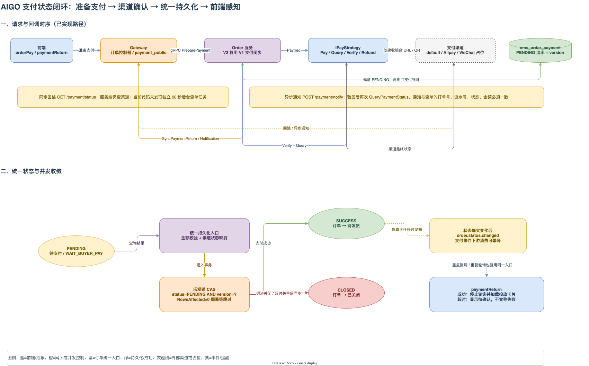

前面几篇文章已经把订单域、网关和端到端消息链路拆开了。支付是其中最容易被“一个支付接口”掩盖复杂度的部分：订单服务既要生成收银台或二维码，又要接收浏览器回跳和支付平台通知；支付结果还可能在回调、用户刷新、前端轮询之间重复到达。

这篇文章只讨论仓库里已经存在的支付实现，重点回答四个问题：

- 订单业务层如何在不直接依赖支付宝或微信 SDK 的情况下调用支付渠道？
- `oms_order_payment` 如何记录一次支付尝试及其渠道状态？
- 同步回跳、异步通知和用户端查状态，为什么最终都要进入同一个持久化入口？
- 并发回调、重复轮询和消息补发，如何避免把支付成功处理两次？

先给出本文最重要的事实边界：当前启动注册的真实策略是本地模拟支付、支付宝收银台和支付宝扫码；微信策略文件虽然存在，但属于未配置/空实现，且当前初始化代码没有注册它。另一个容易被大纲误读的地方是，当前代码没有找到独立的“每 60 秒后台查单”调度任务，查单主要由支付回跳、异步通知和订单支付状态接口触发。

## 一、先看真实闭环

支付闭环可以压缩成下面几步：

1. 前端在订单支付页调用 `/order/preparePayment`，Gateway 把请求转给 Order。
2. Order 校验订单归属和订单状态，按 `methodCode` 找到一个 `IPayStrategy`。
3. 策略返回收银台 URL 或二维码；Order 创建或刷新本地的 `PENDING` 支付流水。
4. 用户在第三方页面完成支付，浏览器可能回到前端，支付平台也可能向 Gateway 发送异步通知。
5. Gateway 将回跳参数或通知表单转给 Order；Order 验证渠道信息，并再次向渠道查单。
6. 渠道状态被映射为统一的 `PENDING`、`SUCCESS` 或 `CLOSED`，再用乐观锁更新支付流水和订单。
7. 真正发生 `0（待付款）→ 1（待发货）` 后，V2 Order 的 hook 发布 `order.status.changed`，积分、成长值等下游再异步消费。
8. 前端回跳页只读取服务端结果，不直接修改订单；成功后停止轮询并加载购买后投放卡片。



[下载可编辑的支付状态闭环 draw.io 源文件](./AIGO微服务电商项目全栈拆解（10）支付抽象与支付状态闭环/AIGO微服务电商项目全栈拆解（10）支付抽象与支付状态闭环.drawio)

这张图把“渠道通知”和“服务端查单”画成两个入口，但二者最终都要经过 Order 的统一持久化逻辑。支付平台是否发送了通知，不能改变本地状态机和幂等约束的职责。

## 二、`IPayStrategy`：业务只认识支付能力

### 1. 接口实际包含哪些能力

`backend/app/order/utility/pay/strategy.go` 中的 `IPayStrategy` 定义了每种支付方式都必须提供的能力：

| 能力 | 作用 | 当前调用/用途 |
| --- | --- | --- |
| `Pay` | 创建支付凭证 | 收银台 URL、二维码或本地模拟收银台 |
| `QueryPaymentStatus` | 查询渠道最终状态 | 用户查状态、同步回跳、异步通知回查 |
| `Refund` | 发起退款 | 售后退款流程调用 |
| `VerifyReturn` | 校验同步回跳 | 接口能力已定义；支付宝有验签实现 |
| `VerifyNotification` | 校验异步通知 | 解析并校验支付平台通知 |
| `QueryRefund` | 查询退款结果 | 售后退款任务查询渠道退款状态 |

大纲点名的五类能力是支付主链路的核心，但真实接口还多了 `QueryRefund`。如果把接口说成只有五个方法，会漏掉售后退款中的渠道查询能力。

策略返回的不是支付宝 SDK 类型，而是 `PayRsp`、`PaymentStatusRsp`、`RefundRsp` 等项目自己的结构。这样 Order 只依赖“创建、查询、退款、验签”这些业务能力，支付 SDK 被限制在 `utility/pay` 包内。

### 2. 策略清单：实现文件不等于当前可选方式

订单服务启动时的 `InitializePaymentStrategies` 当前注册了 `default`、支付宝收银台和支付宝二维码三项。结合策略文件，实际清单如下：

| 策略编码 | 提供方/模式 | 真实实现情况 |
| --- | --- | --- |
| `default` | 本地模拟 / 收银台 | 模拟实现。`Pay` 返回前端本地收银台地址；查单直接返回成功；退款和退款查询也返回本地成功结果，不连接第三方。 |
| `alipay_cashier` | 支付宝 / 收银台 | 已实现。使用 `smartwalle/alipay/v3` 创建 PC 收银台、查单、退款，并支持公钥或证书验签。配置和证书不完整时初始化失败。 |
| `alipay_qr` | 支付宝 / 扫码 | 已实现。调用支付宝当面付预下单，把返回的码串生成 PNG `data URL`；查单、退款和验签复用支付宝收银台策略。 |
| `wechat_cashier` | 微信支付 / 收银台 | 空实现/未实现。方法返回 `not implemented` 或 `not configured` 错误；当前未在启动注册表中注册。 |
| `wechat_qr` | 微信支付 / 扫码 | 部分模拟/未实现。`Pay` 只是把本地交易载荷生成二维码图片，查单、退款、回跳验证和通知验证仍委托给未实现的微信收银台；当前也未注册。 |

这里有两个不能混淆的词：`default` 是为了本地开发和测试提供的“模拟支付”，不是默认接入了某个支付平台；`wechat_qr` 虽然能生成一张图，也不代表已经接入微信支付，因为二维码生成后的支付事实没有可用的微信查单和验签闭环。

## 三、支付门面和网关入口

`order_pay.go` 提供了一个策略注册表和支付门面。上层传入 `methodCode` 后，注册表返回具体策略；`PaymentMethods` 只把策略的 `Code`、名称、提供方、模式和 `PayType` 暴露给前端，不把策略对象或 SDK 类型暴露出去。

准备支付的调用关系是：

```text
前端 orderPay
  └─ POST /api/v1/order/preparePayment
       └─ Gateway Order Controller
            └─ OrderService.PreparePayment
                 └─ service.PreparePayment
                      └─ strategy.Pay
```

Gateway 的订单支付接口在登录路由组中，会先取得当前会员 id；Order 再按订单号和会员 id 查询订单，并要求订单处于待付款状态。支付回跳和支付通知则由 `payment_public` 控制器绑定在公开路由上：

- `GET /api/v1/payment/status/{methodCode}/{outTradeNo}` 读取 query 参数，调用 `SyncPaymentReturn`；
- `POST /api/v1/payment/notify/{methodCode}/{outTradeNo}` 读取 form 参数，调用 `SyncPaymentNotification`；
- 异步通知只有在 Order 同步完成后，Gateway 才写出支付平台要求的纯文本 `success`。

公开回调不依赖会员 Token，而是依赖路径中的策略编码、商户订单号以及渠道参数完成定位和校验。订单支付状态接口 `/order/paymentStatus` 则是登录接口，它按当前会员查询订单，并在需要时触发渠道查单。

## 四、`oms_order_payment`：把支付尝试和订单状态分开

订单表里的 `status` 表示订单生命周期；`oms_order_payment.status` 表示支付流水的统一状态。支付流水表的关键字段可以按职责分成四组：

| 字段组 | 代表字段 | 含义 |
| --- | --- | --- |
| 本地关联 | `payment_sn`、`order_sn` | 本地支付流水和订单号；订单号有外键关联 |
| 策略快照 | `method_code`、`provider`、`pay_type`、`amount` | 本次尝试使用的支付策略、提供方、支付方式编码和金额 |
| 渠道回执 | `provider_status`、`provider_trade_no`、`notification_id`、`pay_result` | 渠道原始状态、渠道流水号、通知编号和抽象结果 |
| 收敛控制 | `status`、`last_error`、`query_count`、`last_query_at`、`payment_time`、`status_source`、`version` | 统一状态、最近错误、查单观测、支付完成时间、来源和乐观锁版本 |

表上还有一个生成列 `active_order_sn`：只有 `status = 'PENDING'` 时才等于订单号，并对它建立唯一索引。因此一个订单最多保留一条活动中的待支付流水。`persistPreparedPayment` 会先查当前 PENDING 记录：查到就刷新策略和金额，查不到才创建新的 `payment_sn`。

### “先落 PENDING”需要按代码时序准确理解

从业务语义看，支付确认前必须存在一条 PENDING 流水；但严格按当前 `PreparePayment` 代码，顺序是：

1. 先调用 `service.PreparePayment`，也就是先执行具体策略的 `Pay`；
2. 策略返回 URL 或二维码后，再调用 `persistPreparedPayment` 创建/刷新 `PENDING` 记录。

所以当前实现是“预支付凭证成功后，最终确认前落 PENDING”，不是“数据库先插入 PENDING，再调用第三方”。如果把后者描述成已实现，会超出真实代码。严格的“先落流水再调渠道”目前未实现；现在的数据库唯一索引和刷新逻辑主要解决的是同一订单活动支付尝试的收敛问题。

## 五、服务端查单：回跳、轮询和通知都不能直接相信前端

### 1. 同步回跳最终仍以渠道查单为准

支付宝收银台的 `return_url` 会把浏览器带回前端 `/payment/:method/:outTradeNo`。回跳页再请求 Gateway 的公开状态接口。Order 的 `SyncPaymentReturn` 当前实际调用的是 `QueryPaymentStatus`，随后进入统一持久化入口。

需要特别说明一个代码边界：`SyncPaymentReturn` 中直接调用 `VerifyPaymentReturn` 的代码目前被注释掉了。支付宝的 `QueryPaymentStatus` 在收到非空参数时会调用 `VerifySign`，因此当前支付宝路径仍有查询时的签名校验；但文章不能写成“所有策略的回跳都必然先执行 `VerifyReturn`”。微信回跳校验则仍是空实现。

### 2. 异步通知必须验签后再次查单

`SyncPaymentNotification` 走 `QueryPaymentNotification`，顺序是：

```text
VerifyNotification(params)
  └─ 得到已验签的 out_trade_no、trade_no、状态、金额
       └─ QueryPaymentStatus(out_trade_no)
            └─ 比较订单号、渠道流水号、等价支付状态和金额
                 └─ 一致后才进入本地状态同步
```

这也是“为什么通知不能直接当事实”的答案：通知本身可能重复、延迟或参数不完整，平台通知里的状态也不应绕过渠道查询。当前实现要求通知和查单结果的订单号、流水号、状态、金额一致；支付宝的 `TRADE_SUCCESS` 和 `TRADE_FINISHED` 会被视为等价的已支付状态。

### 3. 当前没有独立的 60 秒后台查单任务

大纲中提到“服务端 60 秒查单”，但在当前仓库的订单服务任务和调度代码中，没有找到一个独立的每 60 秒扫描 PENDING 支付并调用渠道查单的任务。已经存在的服务端查单入口是：

- 前端回跳页请求公开 `payment/status`；
- 登录用户调用 `/order/paymentStatus`；
- 支付平台发起异步通知后，Order 验签并回查渠道。

`GetOrderPaymentStatus` 只有在本地支付流水仍为 PENDING 时才调用策略查单；一旦本地状态已是 SUCCESS 或 CLOSED，后续读取直接返回本地结果。支付查询次数、最近查询时间和最近错误会写回 `oms_order_payment`，便于观测和重试判断。

## 六、统一状态同步：一次 CAS 决定谁能推进

渠道状态在 `normalizeProviderPaymentStatus` 中映射为本地状态和订单目标状态：

| 渠道状态 | 本地支付状态 | 订单状态 |
| --- | --- | --- |
| `WAIT_BUYER_PAY` | `PENDING` | `0`，待付款 |
| `TRADE_SUCCESS` / `TRADE_FINISHED` | `SUCCESS` | `1`，待发货 |
| `TRADE_CLOSED` | `CLOSED` | `4`，已关闭 |

同步入口会先校验订单、支付记录、策略编码和金额。金额比较使用十进制定点数，而不是直接比较浮点数。确认无误后，`persistPaymentQueryResult` 在事务内先更新支付流水：

```sql
UPDATE oms_order_payment
SET status = ?, version = version + 1, query_count = query_count + 1
WHERE id = ? AND status = 'PENDING' AND version = ?;
```

真正的代码通过 GoFrame DAO 构造这个条件，摘要只保留其业务含义。只有 `RowsAffected` 不为 0，当前请求才拥有推进这条 PENDING 流水的资格；如果另一个回调或轮询已经先更新，当前请求会幂等跳过，不会再次推进订单。

之后，只有目标订单状态不是待付款时，事务才用“订单 id + 当前状态 + 当前 version + 未删除”条件同步订单。支付成功会同时写入订单的支付方式和支付时间。订单更新完成后重新加载最新支付记录和订单，再根据状态变化触发 V2 的状态事件 hook。

这套保护有三层含义：

1. PENDING 支付流水是并发竞争的“闸门”；
2. 支付流水和订单各自有版本条件，旧读数据不能覆盖新状态；
3. 终态请求再次到达时只读本地终态，重复回调不会重复扣库存、发积分或推进订单。

支付已提交但事件发布失败时，V2 hook 仍可能在后续已经提交成功的状态查询中重新发布一次支付状态事件；下游消费要按订单业务键幂等。当前实现没有持久化 outbox 来保证发布失败后的可靠重发，这个窗口仍然存在，属于当前实现边界。

## 七、订单状态事件：支付成功如何离开支付请求

V2 Order 复用 V1 的支付同步实现，并通过 `handlePersistedOrderStatusChanged` 接住支付状态查询和支付回调引起的 `0 → 1` 迁移。提交成功后，它发布 `order.status.changed`：消息 id 使用“订单号:版本”，key 使用订单号。

支付请求本身只负责把支付流水和订单状态写正确；Member 的积分、成长值结算，以及其他下游投影通过状态事件异步完成。这里的“支付成功”不能等价于“所有支付后业务已经处理完”：前者是 Order 的本地状态事实，后者是事件消费者的最终一致结果。

## 八、前端回跳页怎样轮询

前端路由 `/payment/:method/:outTradeNo` 对应 `paymentReturn.vue`。它不拿 URL 参数直接展示成功，而是把回跳 query 参数原样带给 `/payment/status/{method}/{outTradeNo}`，由服务端再次查渠道并同步本地状态。

当前实现的轮询节奏不是“每 10 秒请求一次”，而是：

- 首次进入回跳页立即请求一次；
- 若仍是 `PENDING`，最多再尝试 10 次，每次间隔 1 秒；
- `SUCCESS` 时停止轮询并加载购买后投放卡片；
- `CLOSED` 或 `FAILED` 时停止轮询并展示关闭状态；
- 10 次仍没有终态时，页面显示“暂未确认支付结果”，并明确告诉用户后台通知仍可能继续处理。

订单支付页 `orderPay.vue` 的交互又分两种：二维码支付由用户主动点击“检查支付”，收银台支付由用户确认已完成后最多重试 5 次、每次间隔 1 秒。两者都只调用服务端的 `/order/paymentStatus`，不在浏览器里修改订单。

因此前端轮询是“状态感知机制”，不是支付一致性机制。即使用户关闭回跳页，异步通知仍可进入 Gateway；即使通知先到，回跳页后续查询也只会读到已经提交的 SUCCESS。

## 九、实现、模拟和空实现的边界清单

为了避免把示例代码写成生产能力，最后把边界集中列出：

### 已实现

- `IPayStrategy` 的支付、查单、退款、回跳/通知验证抽象；真实接口还包含退款查询。
- 支付宝收银台创建、查单、退款、退款查询，以及公钥/证书验签。
- 支付宝扫码预下单和服务端二维码图片生成。
- `oms_order_payment` 的 PENDING、渠道状态、查询计数、错误记录和版本字段。
- 异步通知验签后再次查单，并比较订单号、流水号、状态和金额。
- 支付状态统一映射、支付流水 CAS、订单版本条件和重复请求幂等收敛。
- Gateway 公开回调、登录状态查询，以及前端回跳页的终态轮询。

### 模拟实现

- `default` 策略完全是进程内本地模拟：支付状态存于内存 map，合法查单直接返回成功，适合本地开发和测试。
- `wechat_qr` 的 `Pay` 只生成本地交易载荷二维码，不能视为微信支付接入。
- 前端的本地收银台页面只用于配合 `default` 策略演示支付回跳。

### 当前未实现/占位

- `wechat_cashier` 的支付、查单、退款和回调验签均返回未实现/未配置错误。
- `wechat_qr` 的查单、退款、回跳验证和通知验证未实现，且初始化时未注册。
- 独立的每 60 秒后台支付查单任务当前未找到；现有查单由请求和回调触发。
- 回调状态的可靠 outbox 持久化与发布失败后的后台重发当前未实现，V2 只记录发布 warning，并通过后续状态查询尝试修复事件通知。
- “先写入 PENDING 再调用渠道”的严格前置时序当前未实现；现行代码是策略 `Pay` 成功后再创建/刷新 PENDING 流水。

## 结语：抽象的价值是把支付事实留在订单服务

这个支付设计真正解决的不是“如何调用某个支付 SDK”，而是把渠道差异、渠道状态和订单状态隔离开：策略负责适配，Order 负责校验和落库，Gateway 负责转发回跳/通知，前端负责读取最终状态。

从真实代码看，支付闭环的可靠性来自几个具体约束：PENDING 流水在最终确认前成为本地业务记录，通知必须回查渠道，状态同步必须经过金额校验和统一入口，CAS 决定并发请求的唯一胜者，前端不能自报成功。与此同时，微信接入、独立后台查单、outbox 和“严格先落 PENDING 再调渠道”等能力仍是当前未实现或待演进的部分。

下一篇继续看消息队列抽象：支付状态事件、订单超时和其他异步分支，如何在内存实现与 RabbitMQ 之间切换，以及消费者如何处理 Ack、Retry、Reject 和幂等。
