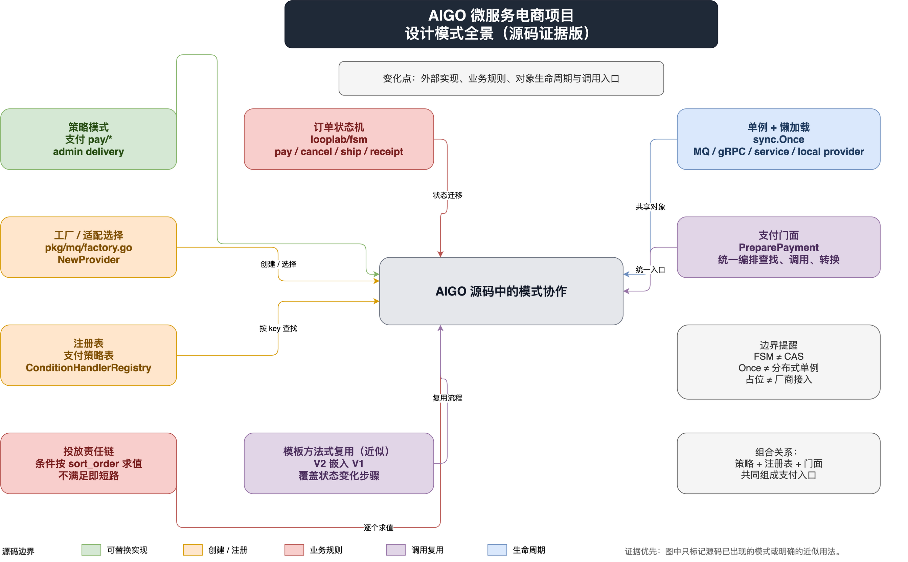

前面几篇文章已经分别拆过支付、MQ、订单状态机和购买后投放。把这些代码放在一起看，会发现项目里确实有不少“模式味道”，但它们并不是为了凑齐 GoF 目录而写出来的：有些是为了隔离第三方 SDK，有些是为了让状态迁移可验证，有些只是 GoFrame 生成代码和 Go 并发初始化带来的工程惯用法。

这篇文章只数源码里已经存在的设计，不把普通的 `switch`、一次性的构造函数或“有多个方法的结构体”强行命名为模式。判断标准很简单：它是否稳定地解决了一个重复出现的变化点？调用方是否真的依赖了那个抽象？如果没有，就只把它称为普通实现。

## 一张总览图：模式出现在哪些边界



可编辑源文件：[设计模式总览.drawio](./AIGO微服务电商项目全栈拆解（13）设计模式全景：从代码里数出用了哪些模式/设计模式总览.drawio)；矢量版：[设计模式总览.svg](./AIGO微服务电商项目全栈拆解（13）设计模式全景：从代码里数出用了哪些模式/设计模式总览.svg)。

图里的颜色只表示模式所处的业务边界：支付和物流是“替换供应商”，订单和投放是“约束业务流转”，公共包与服务初始化是“创建和共享对象”，门面与 V1/V2 是“收敛调用入口”。下面逐个看证据。

## 1. 策略模式：把“怎么支付”和“怎么查物流”隔离开

### 意图

策略模式把一组可互换的算法或外部实现放在同一个接口后面，让上层按业务键选择策略，而不把第三方细节扩散到订单流程中。这里的变化点不是“支付有很多方法”，而是支付宝、本地模拟支付和未来的微信支付拥有同一组业务动作。

### 位置一：支付策略

源码位置：`micro-mall/backend/app/order/utility/pay/strategy.go`，实现位于同目录的 `default.go`、`alipay.go`、`wechat.go` 和 `qr_code.go`。

短代码摘要如下，接口同时覆盖收银台、二维码、查单、退款和回调验签：

```go
type IPayStrategy interface {
    Method() Method
    Pay(context.Context, *PayReq) (*PayRsp, error)
    QueryPaymentStatus(context.Context, string, url.Values) (*PaymentStatusRsp, error)
    Refund(context.Context, *RefundReq) (*RefundRsp, error)
    VerifyReturn(context.Context, url.Values) (string, error)
    VerifyNotification(context.Context, url.Values) (*VerifiedNotification, error)
}

// default / alipay / wechat 都实现这组动作
strategy, err := paymentStrategyRegistry.GetStrategy(methodCode)
rsp, err := strategy.Pay(ctx, req)
```

`DefaultPaymentStrategy` 是本地模拟实现，`AlipayCashierStrategy` 和二维码策略封装支付宝 SDK，`WechatCashierStrategy` 目前是明确返回“未实现”的占位实现。调用方只看 `IPayStrategy`，因此支付 SDK、签名验证和参数转换留在策略内部。

### 位置二：管理后台物流策略

源码位置：`micro-mall-admin/backend/internal/delivery/delivery.go`。

`DeliveryProvider` 定义创建物流单、按已有单号创建和同步轨迹三个动作；`localProvider` 提供本地模拟，顺丰、中通、京东由 `emptyProvider` 占位。`NewProvider` 根据 `ProviderCode` 返回实现：

```go
type DeliveryProvider interface {
    CreateOrder(context.Context, CreateOrderRequest) (string, error)
    CreateOrderByTrackingNo(context.Context, CreateOrderRequest, string) error
    SyncDelivery(context.Context, string) (DeliveryInfo, error)
}

switch code {
case ProviderLocal:
    return getDefaultLocalProvider(opts...), nil
case ProviderSF, ProviderZTO, ProviderJD:
    return newEmptyProvider(code), nil
}
```

这里的策略价值很具体：后台服务可以先用确定性的本地轨迹跑通发货、同步和定时推进，接入真实物流时新增实现，不必重写订单服务。边界也很明确：顺丰、中通、京东现在只是占位策略，并不代表已经接入了这些厂商；本地策略的内存数据进程重启会丢失。

### 边界

策略只解决“同一业务动作的多种实现”。支付策略并不负责订单状态落库，物流策略也不负责后台权限、调度和数据库事务。如果把下单、查单、回调、状态推进全部塞进支付策略，接口会变成一个难以测试的“万能对象”。

## 2. 工厂与注册表：把选择过程集中到一个地方

这一组代码既有工厂，也有注册表。它们的共同目的都是把“根据字符串或配置选择实现”的逻辑从业务流程中移走，但两者不要混为一谈：工厂负责创建或返回对象，注册表负责维护“键 -> 已注册对象”的映射。

### 2.1 MQ 工厂：`pkg/mq/factory.go`

`micro-mall/backend/pkg/mq/factory.go` 的 `GetClient` 解析 `mq.link` 前缀，当前对 `rabbitmq:` 选择 `NewRabbitMQClient`：

```go
links := strings.SplitN(link, ":", 2)
switch links[0] {
case "rabbitmq":
    mqClient, mqErr = NewRabbitMQClient(ctx, links[1])
default:
    return nil, fmt.Errorf("消息类型 %s 暂不支持", links[0])
}
```

`pkg/mq/mq.go` 中的 `Producer`、`Consumer`、`Client` 只暴露项目需要的消息能力，不暴露 RabbitMQ SDK 类型；所以工厂后面可以替换客户端实现，业务服务仍然依赖公共接口。需要注意的是，当前主仓库的工厂已经支持 RabbitMQ，内存实现主要作为同构能力和测试/本地方向存在，不能把注释掉的 `local` 分支描述成生产可切换选项。

### 2.2 支付策略注册表：注册后按 method code 查找

支付服务在 `micro-mall/backend/app/order/internal/service/order_pay.go` 里集中注册策略：

```go
RegisterPayStrategy(pay.NewDefaultPaymentStrategy())
RegisterPayStrategy(cashier)
RegisterPayStrategy(qr)

func (r *PaymentStrategyRegistry) GetStrategy(code string) (pay.IPayStrategy, error) {
    if s, ok := r.paymentStrategiesMap[strings.TrimSpace(code)]; ok {
        return s, nil
    }
    return nil, gerror.Newf("unsupported payment method %q", code)
}
```

这部分是“注册表 + 策略”的组合：初始化阶段创建具体策略，运行时只用公开的支付方式编码查找。`PreparePayment` 又对这个过程做了一层统一编排，后面会看到它为什么更像门面。

### 2.3 投放条件注册表：配置驱动的 handler 工厂

源码位置：`micro-mall/backend/app/promotion/internal/logic/delivery/condition.go`。

`ConditionHandler` 约定 `Type`、`Validate` 和 `Match`；`NewConditionHandlerRegistry` 把订单金额、商品、数量、收货地区、会员等级等内置 handler 注册到 map 中。投放服务读取数据库里的 `ConditionType` 后，只调用 `registry.Get`：

```go
handler := s.registry.Get(cond.ConditionType)
if handler == nil {
    matched = false
    break
}
ok, err := handler.Match(ctx, config, dctx)
```

它的意图不是“把每条 if 搬到 map 里”，而是让运营配置的条件类型和实际求值代码之间有一个白名单边界：未知类型不执行，配置 JSON 先解析，再由 handler 自己校验和匹配。

### 边界

注册表降低了调用方对具体类型的依赖，但也带来了初始化顺序、重复注册和并发访问的责任。当前投放注册表是每个 `DeliveryService` 实例构造一份内置集合，支付注册表是包级共享 map；两者的生命周期和线程安全假设不同，不应抽象成一个“万能 Registry 框架”。

## 3. 状态机：订单状态不是一串散落的 if

### 意图

状态机把“当前状态 + 事件 -> 下一状态”集中声明，并拒绝未定义的迁移。订单支付、取消、超时关闭、发货、确认收货和自动确认收货，都属于状态迁移，不应由每个接口手写一套条件判断。

### 位置与短代码摘要

源码位置：`micro-mall/backend/app/order/internal/service/v2/order_state_machine.go`，底层库是 `github.com/looplab/fsm`。

```go
var orderEventDescriptions = fsm.Events{
    {Name: "pay", Src: []string{"0"}, Dst: "1"},
    {Name: "cancel", Src: []string{"0"}, Dst: "4"},
    {Name: "ship", Src: []string{"1"}, Dst: "2"},
    {Name: "confirm_receipt", Src: []string{"2"}, Dst: "3"},
}

machine := fsm.NewFSM(orderStateName(current), orderEventDescriptions, callbacks)
err := machine.Event(ctx, string(event), orderSn)
```

项目还显式声明了一些幂等迁移，例如已支付订单再次 `pay` 仍停留在待发货，已关闭订单再次关闭仍停留在已关闭。`transitionOrderStatus` 把库里的状态码转换为 FSM 状态名，再把结果转换回 `OrderStatus`，并返回 `Changed` 供持久化层判断是否真的发生状态变化。

### 边界

FSM 只负责合法迁移和回调，不负责数据库 CAS、库存补偿或消息发布。`order_state_persistence.go` 仍要用版本号和 `RowsAffected` 做并发收敛；把这两层混成“FSM 自动保证并发安全”是错误的。状态机保证的是规则，事务和乐观锁保证的是落库竞争。

## 4. 责任链：投放条件按顺序求值，任一不满足就停止

### 意图

投放计划是多个条件的 AND 组合：订单金额、商品、数量、地区和会员属性等条件按 `sort_order` 读取，逐个求值；一个条件不满足，当前计划就不命中，不再继续执行后续 handler。这正是责任链的短路特征。

### 位置与短代码摘要

源码位置：`micro-mall/backend/app/promotion/internal/logic/delivery/condition.go` 和 `micro-mall/backend/app/promotion/internal/service/v1/delivery.go`。

```go
matched := true
for _, cond := range conditions {
    handler := s.registry.Get(cond.ConditionType)
    if handler == nil {
        matched = false
        break
    }
    ok, err := handler.Match(ctx, config, dctx)
    if err != nil || !ok {
        matched = false
        break
    }
}
```

每个 `ConditionHandler` 只关心一个条件的配置校验和匹配，`DeliveryService` 负责链的顺序、短路、最多选三张卡以及结果快照。也就是说，handler 是链上的处理者，注册表负责按类型找到处理者，服务负责驱动链。

### 边界

这里是“显式循环驱动的责任链”，不是每个 handler 持有 `next` 指针的经典对象链。称为责任链是因为请求依次经过一组独立处理者并允许中止；如果未来要支持 OR、嵌套括号或复杂布尔表达式，单纯增加 handler 不够，应该升级为规则树或表达式求值器。

## 5. 单例 + 懒加载：共享连接和服务实例，但要看失败语义

### 意图

连接、客户端和领域服务通常希望在进程内共享，且只有真正被调用时才初始化。Go 里常见的实现是包级指针配合 `sync.Once`，它同时解决并发初始化和“只执行一次”。

### 源码中的真实位置

- `micro-mall/backend/app/gateway/utility/mq.go`：`mqClient` + `mqClientOnce`，按 `mq.link` 懒加载共享 MQ client。
- `micro-mall/backend/app/gateway/utility/grpc_conns.go`：每个下游连接有一个 `sync.Once`，首次取用时建立连接和 client。
- `micro-mall/backend/app/order/internal/service/v2/order.go`：`orderServiceOnce` 只创建一个嵌入 V1 的 V2 订单服务。
- `micro-mall-admin/backend/internal/delivery/delivery.go`：`defaultLocalOnce` 共享本地物流提供商；`localProvider` 内部维护内存物流单和清理 goroutine。
- GoFrame 生成的 DAO 全局对象和若干 `NewXxxService` 的共享实例，也体现了“包级入口 + 进程内复用”的习惯，但它们不都由本文项目手写 `sync.Once` 实现。

代表性的 MQ 摘要：

```go
var (
    mqClient     commonMQ.Client
    mqClientOnce sync.Once
)

func GetMQClient() commonMQ.Client {
    mqClientOnce.Do(func() {
        c, err := commonMQ.GetClient(ctx, link)
        if err == nil {
            mqClient = c
        }
    })
    return mqClient
}
```

### 一个必须说明的边界：`sync.Once` 不是万能重试器

`sync.Once` 的语义是函数最多执行一次。网关 MQ 代码在初始化失败时不写入 client，因此调用方看到的是 `nil`；但 `Once` 本身仍不会再次执行初始化函数。文章不能把它描述为“失败后每次调用都会重试”。如果业务需要失败重试，应使用显式状态、带退避的初始化器或可重置的生命周期管理。

同样，单例只限制一个进程内的实例数，不等于分布式单例；部署多个服务副本时，每个副本都有自己的连接和内存状态。

## 6. 模板方法式复用：V2 嵌入 V1，改少数变化步骤

### 意图

经典模板方法由父类固定算法骨架，子类覆盖少量钩子。Go 没有类继承，项目使用结构体嵌入实现了一种“模板方法式复用”：V2 复用 V1 已有能力，只重写状态变化、Outbox、超时和退款联动相关的操作。

### 位置与短代码摘要

源码位置：`micro-mall/backend/app/order/internal/service/v1/order.go` 与 `micro-mall/backend/app/order/internal/service/v2/order.go`。

```go
type OrderService struct {
    *servicev1.OrderService
}

func NewOrderService() *OrderService {
    orderServiceOnce.Do(func() {
        base := servicev1.NewOrderService()
        orderService = &OrderService{OrderService: base}
        base.OnOrderStatusChanged = orderService.handlePersistedOrderStatusChanged
    })
    return orderService
}

func (s *OrderService) GenerateOrder(ctx context.Context, in *service.GenerateOrderInput) (...) {
    out, err := s.OrderService.GenerateOrder(ctx, in)
    // V2 在 V1 生成完成后增加过期消息安排等步骤
    ...
}
```

这让 V2 不需要把购物车、会员、优惠券、商品等既有编排全部复制一遍，同时通过 `OnOrderStatusChanged` 把状态变化通知接到 V2 的后续处理上。

### 边界

这不是严格的继承层次，也不是所有 V1 方法都天然适合 V2。嵌入会把 V1 的公开方法带入 V2，可能造成方法集合和事务语义不够显式；当两版行为差异越来越大，应拆出共享组件或明确的应用服务，而不是继续堆叠覆盖。

## 7. 门面：支付服务对外只呈现一个稳定入口

### 意图

门面模式为一组复杂子系统提供更窄、更稳定的入口。支付准备需要解析 method code、查注册表、组装统一请求、调用策略、校验空响应并转换成网关输出；这些细节不应该散落在多个 controller 里。

### 位置与短代码摘要

源码位置：`micro-mall/backend/app/order/internal/service/order_pay.go` 的 `PreparePayment`、`QueryPaymentStatus`、`RefundPayment` 等函数。

```go
func PreparePayment(ctx context.Context, orderSn string, amount float64, code string) (*PreparePaymentOutput, error) {
    strategy, err := paymentStrategyRegistry.GetStrategy(code)
    if err != nil { return nil, err }

    rsp, err := strategy.Pay(ctx, &pay.PayReq{
        OutTradeNo: orderSn,
        TotalAmount: strconv.FormatFloat(amount, 'f', 2, 64),
        Body: "Go购商城",
    })
    if err != nil || rsp == nil { return nil, err }
    return &PreparePaymentOutput{CashierUrl: rsp.URL, QrCodeBase64: rsp.QrCodeBase64}, nil
}
```

门面没有替代策略，也没有把支付宝 SDK 暴露给网关；它只是把“支付用例”的固定编排收拢起来。`PaymentStrategyRegistry` 仍是选择对象的注册表，`IPayStrategy` 仍是可替换策略，三个角色各自有边界。

## 8. 总表：哪些是确定模式，哪些只是近似

| 模式 | 真实位置 | 解决的变化点 | 不能过度解读 |
| --- | --- | --- | --- |
| 策略 | `app/order/utility/pay`、admin `internal/delivery` | 支付渠道/物流提供商可替换 | 占位 provider 不等于真实厂商接入 |
| 工厂 | `pkg/mq/factory.go`、`NewProvider` | 按配置或编码创建/返回实现 | 当前 MQ 工厂主路径是 RabbitMQ |
| 注册表 | 支付策略表、`ConditionHandlerRegistry` | 字符串到实现的集中映射 | 需自行处理初始化、并发和重复注册 |
| 状态机 | `order/internal/service/v2/order_state_machine.go` | 集中声明订单合法迁移和幂等迁移 | 不负责 DB CAS、库存补偿和消息可靠性 |
| 责任链 | 投放 `ConditionHandler` 顺序求值 | 条件逐个处理并短路 | 当前是服务驱动的 AND 链，不是复杂规则树 |
| 单例 + 懒加载 | `sync.Once` 的 MQ、gRPC、V2 service、本地物流 | 进程内共享且并发安全初始化 | 不是分布式单例；`Once` 也不是失败重试 |
| 模板方法式复用 | V2 嵌入 V1 | 复用旧流程，只覆盖变化步骤 | Go 组合近似，不是严格父类继承 |
| 门面 | `PreparePayment` 等支付用例函数 | 为网关收敛支付编排入口 | 不替代注册表或策略 |

## 9. 从这些代码得到的工程判断

第一，项目真正稳定的抽象边界都围绕“未来会变”的地方：支付厂商、物流厂商、消息中间件、订单状态规则和运营条件类型。没有替换需求的简单逻辑，代码里并没有额外制造一层模式。

第二，模式是组合出现的。支付链路同时使用了策略、注册表、工厂式初始化和门面；投放同时使用了注册表与责任链；V2 订单同时使用了单例、嵌入复用、状态机和持久化 CAS。只给一个名词，反而会掩盖真正的协作关系。

第三，模式本身不提供业务正确性。策略接口不能保证回调可信，FSM 不能替代乐观锁，`sync.Once` 不能替代生命周期治理，责任链也不能自动保证快照幂等。真正可靠的系统还要看事务边界、状态持久化、唯一约束、错误处理和消息语义。

如果只记住一条：先从变化点找抽象，再从调用关系判断它是不是模式；不要因为一个 `switch`、一个全局变量或一段循环看起来“像”某个模式，就给它贴上结论。
