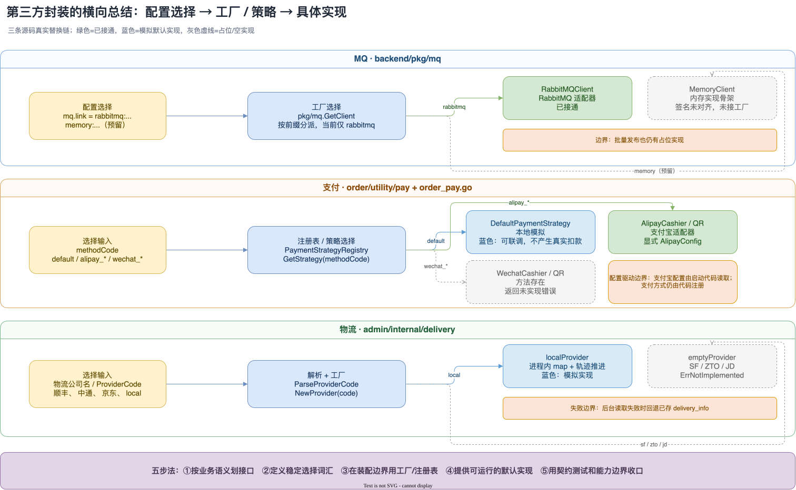

这一篇主要解决一个问题：如果第三方服务迟早可能更换，代码应该把“可替换”放在哪里？

答案不是把所有厂商都做成一个大而全的公共基类，而是在业务真正依赖的边界上，稳定地保留三样东西：**业务接口、选择方式、默认实现**。AIGO 的 MQ、支付和管理后台物流，刚好形成三个很好的对照：MQ 有完整的 RabbitMQ 适配器；支付接口和注册表已经成形；物流则把本地模拟跑通，同时用空实现给顺丰、中通、京东留下位置。

## 一、先定义“可替换”到底替换什么

第三方封装的对象通常有三层：

| 层次 | 负责什么 | 不应该泄漏什么 |
| --- | --- | --- |
| 业务层 | 下单、发消息、查物流等业务动作 | SDK 的请求类型、连接对象、厂商状态码 |
| 抽象层 | 定义业务真正需要的接口和统一数据 | 某一家厂商的字段命名与生命周期 |
| 适配层 | 把统一调用翻译成 RabbitMQ、支付宝或物流厂商 API | 让业务反向依赖适配器 |

所谓“换实现”，理想情况下只改启动装配和适配层：业务仍然调用同一组接口，消息仍然携带同一种 `Message`，支付仍然通过同一组支付动作，物流仍然返回同一种 `DeliveryInfo`。

## 二、三条真实替换链

### 1. MQ

`backend/pkg/mq/mq.go` 把业务需要的能力拆成 `Client`、`Producer`、`DelayedProducer`、`Consumer` 和 `Subscription`。消息也被收敛成与厂商无关的 `Message`：业务只关心 `ID`、`Key`、`Body`、`Headers` 和时间戳；消费结果只有 `Ack`、`Retry`、`Reject`。

这层抽象的价值在于，业务不必知道 RabbitMQ 的 exchange、queue、AMQP message 或 settle 细节。RabbitMQ 适配器在 `rabbitmq.go` 中负责声明 topic exchange、消费组队列、延迟交换机和投递确认。

选择入口在 `factory.go`：`GetClient` 读取形如 `rabbitmq:amqp://...` 的 `link`，按冒号前的类型选择具体客户端，并把客户端缓存起来。配置文件中的 `mq.link` 因此成为装配点，业务代码不需要改成 `if rabbitmq`。

### 2. 支付

支付的抽象更贴近业务。`backend/app/order/utility/pay/strategy.go` 定义了 `IPayStrategy`，统一了六类动作：支付、查支付状态、退款、查退款、同步回跳校验和异步通知校验。`Method` 又把提供商和支付形态拆开：`Provider` 可以是 `default`、`alipay`、`wechat`，`Mode` 可以是 `cashier` 或 `qr_code`。

订单服务在 `order_pay.go` 中维护 `PaymentStrategyRegistry`，用公开的 `methodCode` 注册和查找策略。启动时读取支付宝配置，创建支付宝收银台和二维码策略，再注册本地默认策略；调用方只拿 `alipay_cashier`、`alipay_qr` 或 `default` 这样的编码，不直接依赖支付宝 SDK。

### 3. 物流

管理后台的 `internal/delivery/delivery.go` 把物流能力收敛为 `DeliveryProvider`：创建物流单、按指定单号创建物流单、同步物流轨迹。`NewProvider` 根据 `ProviderCode` 返回策略，`ParseProviderCode` 负责把“顺丰”“SF”“中通”“京东”等输入转换为稳定编码。

## 三、抽象套路五步法

把三条链放在一起，可以得到一套适用于第三方 SDK、基础设施和外部服务的五步法。

### 第一步：先按业务语义划接口

接口只描述调用方真正需要的动作和返回值。MQ 用 `Publish/Subscribe/Ack`，支付用 `Pay/Refund/Verify`，物流用 `CreateOrder/SyncDelivery`。不要把厂商 SDK 的 client、request 或 response 直接放进业务接口，否则替换实现时连业务模型也要一起迁移。

接口也不能为了“未来可能用到”而无限膨胀。每加一个方法，就意味着所有实现都要承担它；如果某一能力并非所有提供商都支持，可以拆成更小的能力接口，或在能力清单中明确“不支持”的返回语义。

### 第二步：为选择项定义稳定的配置词汇

配置值要能被日志、监控和测试识别，且不携带厂商 SDK 类型。AIGO 里可以看到三种词汇：`mq.link` 用 `rabbitmq:` 前缀表达连接类型，支付用 `methodCode` 表达提供商和形态，物流用 `ProviderCode` 表达公司。

配置还要有明确的缺省与非法值策略：缺省是安全的默认实现、启动失败，还是回退到已有数据？`boot.go` 中注册中心按 `registry.type` 在 `etcd` 与 `file` 之间选择，默认走文件注册中心，就是一个“配置读取 → 分支选择 → 具体实现”的启动装配例子。

### 第三步：把工厂或注册表放在装配边界

工厂负责把字符串变成接口，注册表负责把公开编码映射到策略。业务服务只拿接口，不在每个 handler 里重复 `switch`。MQ 的 `GetClient`、支付的 `PaymentStrategyRegistry`、物流的 `NewProvider` 都体现了这个位置。

装配最好集中在启动阶段或依赖注入入口：配置错误尽早暴露，具体实现的生命周期也容易管理。若采用懒加载，要确保并发下只初始化一次，并让客户端关闭、重建和失败重试有清晰语义。

### 第四步：提供一个可运行的默认实现

默认实现的目的，是降低本地开发、单元测试和演示环境的外部依赖，而不是模拟生产能力。默认实现至少要有一个可验证的闭环：消息能被消费，支付状态能被查询，物流轨迹能被同步。

AIGO 的 `default` 支付和 `localProvider` 物流做到了这一点。默认实现必须在文档里标注“模拟”“进程内”“不持久化”等限制，避免被部署配置误用。

### 第五步：用契约测试和能力边界收口

替换实现最容易出问题的地方，不是构造函数，而是细节语义：重复消息怎么处理、支付通知是否验签、物流查询失败返回什么、关闭是否幂等、延迟单位是什么。

因此应把接口行为写成契约测试：同一组消息在 memory 和 RabbitMQ 上都验证 `Ack/Retry/Reject`；所有支付策略都验证订单号、状态和退款结果的映射；所有物流提供商都验证创建、查询和明确的“不支持”错误。对模拟和空实现，则测试它们**明确失败**，而不是只测试“能被工厂创建”。

## 四、哪些替换已经成立，哪些只是预留

| 能力 | 接口 | 选择入口 | 默认/占位 | 当前结论 |
| --- | --- | --- | --- | --- |
| MQ | `mq.Client` 等 | `mq.link` + `GetClient` | `MemoryClient` 骨架 | RabbitMQ 可用；memory 尚未接通 |
| 支付 | `IPayStrategy` | `methodCode` + 注册表 | `default` 本地模拟 | 默认、支付宝路径已区分；微信为空实现 |
| 物流 | `DeliveryProvider` | `ParseProviderCode` + `NewProvider` | `localProvider` | 本地模拟可演示；三家厂商为空实现 |
| 注册中心 | GoFrame resolver | `registry.type` + `boot.Init` | `file` | `file` / `etcd` 选择路径已落地 |

从这张表可以看出，“为将来可替换而设计”不是一句全有或全无的评价。它至少有三个成熟度层次：

1. **接口预留**：业务依赖已经收口，未来实现有明确插入点；
2. **默认实现可运行**：本地或测试环境不依赖外部系统，能完成受限闭环；
3. **生产适配器可替换**：目标厂商完成真实调用、错误映射、鉴权、重试、监控和契约测试。

## 五、最后的工程检查清单

在代码里封装一个可能更换的第三方组件，可以按下面的问题逐项检查：

- 业务接口是否只暴露领域动作，没有 SDK 类型？
- 配置名是否表达“选哪个实现”，而不是散落在业务代码里的布尔开关？
- 工厂或注册表是否集中处理选择、初始化和生命周期？
- 默认实现是否真的能跑通一个闭环，并明确是模拟还是生产能力？
- 空实现是否返回可识别的错误，而不是静默成功？
- 外部状态是否映射成稳定的内部状态，重复调用是否幂等？
- 失败时是重试、回退已有数据，还是阻断主链路？这些策略是否写进测试？
- 新实现加入后，是否只需要新增适配器和装配项，而不需要改业务流程？