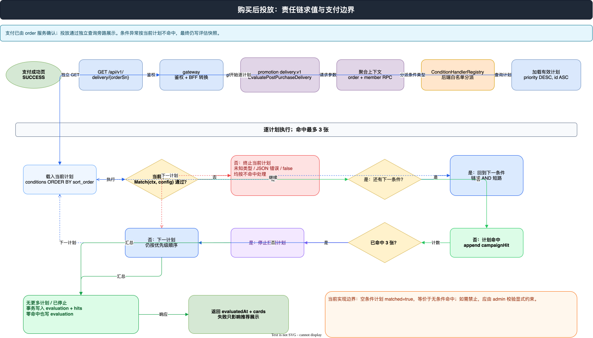
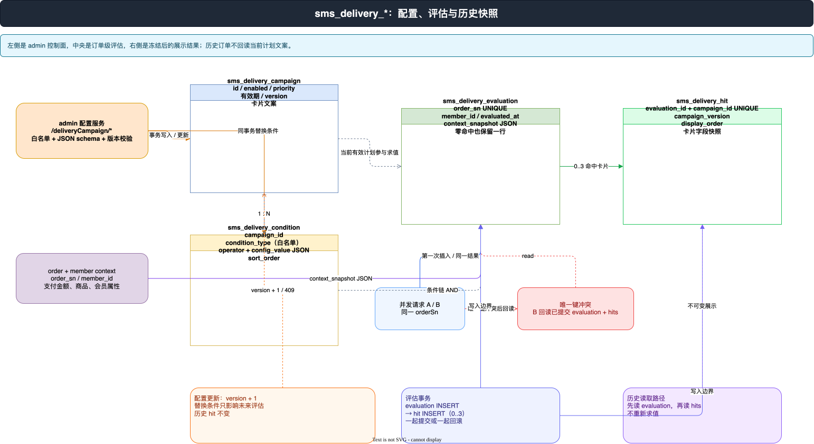

支付成功以后，商城通常还要做一件“看起来很轻”的事：根据订单和会员画像，挑几张营销卡片展示在支付成功页。

真正难的是这件事不能反过来影响支付。投放规则会被运营人员修改，同一订单可能被支付回跳、刷新、重试并发触发，甚至一次评估也可能一张卡都没有命中。因此，购买后投放的核心不是“查几条活动”，而是把它做成一个边界清晰的评估系统：条件可控、求值可解释、结果可重放、并发可收敛、故障可隔离。

本文只按当前代码拆解这条链路，重点核对 `promotion` 的 `delivery/v1`、`condition` 责任链、`service/v1`、`sms_delivery_*` 表、网关路由和 admin 配置服务。

## 先看全貌：支付主链路与投放支链分离

支付回跳和异步通知进入 gateway 后，调用的是 order 服务的 `SyncPaymentReturn` / `SyncPaymentNotification`，成功后才返回支付平台要求的 ACK。购买后投放没有嵌入这个同步回调，而是由支付成功页在确认支付状态为成功后，另发一次 `GET /api/v1/delivery/{orderSn}`。



[下载 PNG 预览](<./AIGO微服务电商项目全栈拆解（15）购买后投放系统：责任链、快照与并发收敛/购买后投放责任链求值图.png>) · [打开可编辑 draw.io](<./AIGO微服务电商项目全栈拆解（15）购买后投放系统：责任链、快照与并发收敛/购买后投放责任链与快照关系.drawio>)

这条边界很重要：投放服务超时或数据库异常时，支付状态已经由订单服务处理，前端只是不显示推荐卡片。投放是支付成功后的增强体验，不是支付事务的一部分。

## 1. 请求入口：网关只做鉴权和协议转换

网关 API 在 `backend/app/gateway/api/promotion/v1/promotion.go` 声明了：

```go
type PostPurchaseDeliveryReq struct {
    g.Meta  `path:"/delivery/{orderSn}" method:"get" sm:"购买后投放查询" tags:"投放"`
    OrderSn string `json:"orderSn" in:"path" v:"required"`
}
```

它属于登录后的 promotion 分组。`promotion_v1_methods.go` 先从上下文取登录用户 ID，再把 `orderSn` 和 `memberId` 交给 `delivery.v1` 的 `EvaluatePostPurchaseDelivery` RPC，最后只把 `evaluatedAt` 和卡片字段转换成 HTTP 响应。

promotion 服务端的接口非常窄：`delivery.proto` 只有一个 `EvaluatePostPurchaseDelivery` 方法，输入是订单号和会员 ID，输出是评估时间与卡片列表。窄接口意味着网关不需要知道条件类型，也不需要参与规则计算。

## 2. 条件白名单：先把可表达的规则关进笼子

评估上下文由订单服务和会员服务聚合得到，当前字段包括：实付金额、订单类型、商品 ID 集合、商品分类 ID 集合、商品总件数、收货省市，以及会员等级、性别、城市和积分。对应类型是 `delivery.DeliveryContext`。

`backend/app/promotion/internal/logic/delivery/condition.go` 用 `ConditionHandler` 抽象单个条件：

```go
type ConditionHandler interface {
    Type() string
    Validate(config ConditionConfig) error
    Match(ctx context.Context, config ConditionConfig, dctx *DeliveryContext) (bool, error)
}
```

`NewConditionHandlerRegistry` 只注册内置处理器，当前白名单为：

| 条件族 | 类型 | 配置形态 |
| --- | --- | --- |
| 订单金额 | `ORDER_PAY_AMOUNT_BETWEEN` | `{"min": 100, "max": 500}` |
| 订单商品 | `ORDER_PRODUCT_ID_IN` | `{"values": [1001, 1002]}` |
| 商品分类 | `ORDER_CATEGORY_ID_IN` | `{"values": [10, 20]}` |
| 商品数量 | `ORDER_QUANTITY_BETWEEN` | 整数区间 |
| 订单类型 | `ORDER_TYPE_IN` | int32 集合 |
| 收货地区 | `RECEIVER_REGION_IN` | `{"values": ["浙江省,杭州市"]}` |
| 会员等级/性别 | `MEMBER_LEVEL_IN` / `MEMBER_GENDER_IN` | int32 集合 |
| 会员城市 | `MEMBER_CITY_IN` | 字符串集合 |
| 当前积分 | `MEMBER_INTEGRATION_BETWEEN` | 整数区间 |

这不是把 JSON 交给脚本引擎执行。admin 的 `validateDeliveryCondition` 还会再次校验：类型必须在后端白名单内，操作符只能是 `BETWEEN` 或 `IN`，JSON 不允许未知字段，整数集合拒绝数字字符串和小数，地区必须是精确的“省,市”字符串，配置大小不能超过 16KB。这样，后台页面只是配置入口，最终的语言仍然是后端认可的有限规则语言。

## 3. 责任链求值：任一不命中，立即终止当前计划

`service/v1/delivery.go` 的评估顺序可以压缩成下面几步：

1. 先按 `order_sn` 查 `sms_delivery_evaluation`，已有结果直接读快照返回。
2. 没有快照时，调用 order/member RPC 聚合 `DeliveryContext`。
3. 查询启用且在生效时间内的计划，按 `priority DESC, id ASC` 排序。
4. 每个计划的条件按 `sort_order ASC` 取出，逐个从注册表找到 handler 并执行 `Match`。
5. 某个条件返回 `false`、类型未知、JSON 解析失败或 handler 出错，当前计划立即标记为不命中，不再执行它后面的条件，也不会加入结果。
6. 所有条件都通过，才把计划加入命中列表；命中列表达到 `maxCards = 3` 后停止继续扫描计划。

这里的“责任链”不是多个 handler 互相传递请求，而是“注册表负责分派，计划内条件按顺序短路”的组合。它有两个直接收益：规则类型可扩展但入口受控；失败的计划不会污染其他计划的评估。

需要注意一个当前实现的边界：后台允许条件数组为空，服务端的空条件链会保持 `matched = true`，因此它表现为无条件计划。如果产品要求每个计划至少一个条件，应在 admin 校验处显式增加约束，不能把“白名单存在”误读成“空条件已被禁止”。

计划优先级只负责决定扫描顺序，不会把计划合并成一张卡。最多返回三张卡片，是 `evaluateCampaigns` 在追加命中前后的硬上限；相同优先级再用计划 ID 保证确定性。

## 4. 快照：把一次评估冻结成订单事实

投放涉及四张核心表：

```text
sms_delivery_campaign       计划本体：启用状态、优先级、有效期、版本、卡片文案
sms_delivery_condition      计划条件：类型、操作符、JSON 配置、执行顺序
sms_delivery_evaluation     订单级评估：order_sn、member_id、评估时间、上下文快照
sms_delivery_hit            命中卡片：计划版本、展示顺序、卡片字段快照
```

写入时，服务在一个事务中先插入 `sms_delivery_evaluation`，再插入本次命中的 `sms_delivery_hit`。即使一张卡都没有命中，也会写 evaluation；表注释已经明确标出“零命中也写入”。这样，空结果也有时间点、有订单号、有评估上下文，不会因为返回 `[]` 而被误认为“从未评估”。



命中记录不会只保存 `campaign_id`。它还复制 `campaign_version`、标题、描述、图片、按钮和跳转地址。运营后来修改卡片文案，历史订单仍然读取旧的 `sms_delivery_hit`；后来禁用或删除计划，也不会抹掉已经发生的评估事实。

配置变更在 admin 侧会把计划 `version` 加一，并在同一事务里替换条件。评估服务只读取当前有效计划，但历史响应优先读取已存在的 evaluation/hit 快照，所以“当前配置”与“历史展示”被分成了两条读路径。

## 5. 唯一订单号：让并发请求收敛到一个结果

支付成功页可能因为回跳、刷新或网络重试同时发起两次投放查询。仅靠“先查再插”会产生竞态：两个请求都查不到 evaluation，然后各自写一份结果。

当前实现把收敛点放在数据库：

```sql
UNIQUE KEY uk_order_sn (order_sn)
```

第一次请求负责完成评估事务；并发请求在插入 evaluation 时触发唯一键冲突，然后 `persistEvaluation` 识别 duplicate/unique/1062 错误，重新读取已经提交的 evaluation 和 hits，返回同一份结果。换句话说，应用层的“先读”优化延迟，数据库唯一约束才是最终裁判。

命中表还有 `UNIQUE KEY uk_eval_campaign (evaluation_id, campaign_id)`，防止同一个评估下重复落同一计划。评估和命中同事务提交，则不会出现“有快照但命中半截”的正常路径。

这套方案的边界也很清楚：重复错误的识别目前是按错误字符串匹配，数据库驱动或错误包装变化时应补充集成测试；不要把它夸大成分布式锁。真正提供并发收敛的是 `uk_order_sn` 和失败后的回读。

## 6. admin 配置服务：控制面同样需要并发控制

管理后台不是直接操作 promotion 数据库，而是通过 Gin 的配置服务：

```text
GET  /admin/deliveryCampaign/list
GET  /admin/deliveryCampaign/conditionTypes
GET  /admin/deliveryCampaign/:id
POST /admin/deliveryCampaign/create
POST /admin/deliveryCampaign/update/:id
POST /admin/deliveryCampaign/update/status/:id
POST /admin/deliveryCampaign/delete/:id
```

`internal/service/sms_delivery.go` 用 `sync.Once` 初始化单例服务，创建和更新计划、条件放在同一 GORM 事务中。更新时使用 `WHERE id = ? AND version = ?`，成功后执行 `version + 1`；如果受影响行数为零，会区分“记录不存在”和“版本已变化”，后者返回 409，提示管理员刷新后重试。

前端 `views/sms/delivery/index.vue` 显示计划优先级、版本、有效期和启用状态，条件编辑器从 `conditionTypes` 获取后端白名单，并在提交前把 JSON 解析成结构化值。最终校验仍以 admin 后端为准，所以不能绕过页面直接伪造 `SCRIPT`、未知字段或错误类型的配置。

## 7. 故障隔离：推荐失败，不等于支付失败

当前前端支付成功页的顺序是：轮询支付状态，确认 `SUCCESS`，停止轮询，再调用 `/delivery/{orderSn}`。投放请求的 `catch` 会把 `deliveryCards` 置为空，页面仍然保持支付成功状态。

因此故障边界是：

| 故障点 | 主链路结果 | 用户体验 |
| --- | --- | --- |
| 条件 JSON 非法或 handler 报错 | 评估请求失败/计划不命中 | 推荐卡片为空，支付不回滚 |
| promotion gRPC 超时 | 订单已支付 | 成功页无推荐，可重试查询 |
| 快照写入失败 | 订单已支付 | 本次推荐失败，需要日志与告警 |
| admin 配置服务不可用 | 已有订单不受影响 | 不能修改新计划，历史快照仍可读 |

这是一种很实用的旁路设计：订单支付负责正确性，投放负责增值体验。若未来要做营销触达、短信或 MQ 异步发送，也应该继续沿用这个边界，把不可用的投放能力降级为“无卡片”，而不是让支付回调等待它。

## 小结：这条链路真正解决了什么

- 白名单把条件表达式限制在可审计、可测试的有限集合内。
- 责任链按 `sort_order` 执行 AND，任一不命中立即终止当前计划，整体最多取三张卡。
- `sms_delivery_evaluation` 记录包括零命中的评估，`sms_delivery_hit` 冻结计划版本和展示内容。
- `uk_order_sn` 把重复请求收敛到一份已提交结果，事务保证快照与命中记录一起成功或失败。
- admin 版本号避免配置覆盖，历史快照不随当前配置改动。
- 网关路由与支付成功页把投放放在支付主链路之外，投放故障不会改变支付结果。

源码核对入口：`backend/app/promotion/internal/logic/delivery/condition.go`、`backend/app/promotion/internal/service/v1/delivery.go`、`backend/app/promotion/manifest/protobuf/delivery/v1/delivery.proto`、`backend/db/migrations/20260808_add_delivery_tables.sql`、`backend/app/gateway/api/promotion/v1/promotion.go`、`backend/app/gateway/internal/controller/promotion/promotion_v1_methods.go`、`micro-mall-admin/backend/internal/service/sms_delivery.go`。
