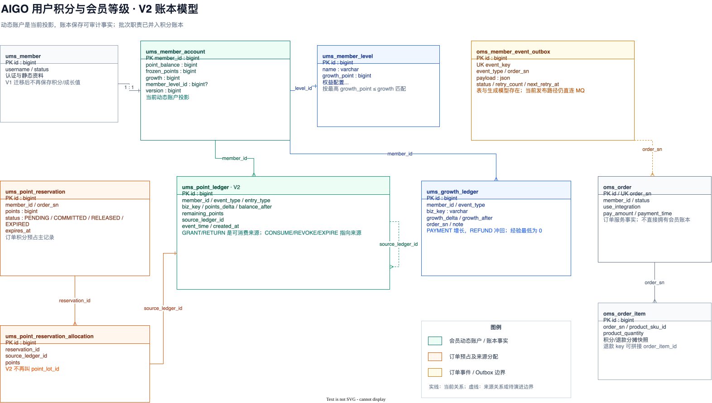
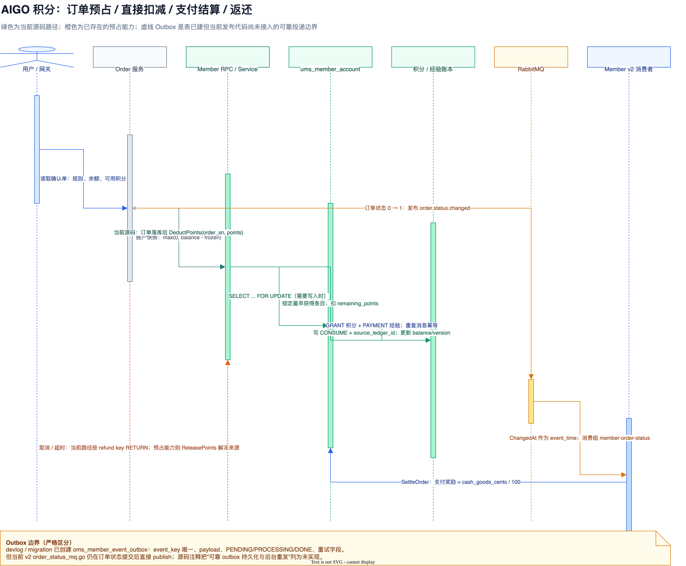

用户积分看起来像会员表上的两个数字：`integration` 和 `growth`。但只要系统同时支持每日奖励、订单抵扣、支付后奖励、退款返还、积分过期和会员升级，这两个数字就不再是普通字段，而是一个需要并发控制、幂等和审计的账户系统。

这篇只讨论仓库里与会员积分和等级有关的真实代码、迁移与 devlog。先把一个容易被文章大纲掩盖的边界说清楚：**当前动态账户和账本逻辑已经落地；`oms_member_event_outbox` 的表和生成模型已经存在，但当前 v2 订单状态发布代码仍直接发送 MQ，可靠 Outbox 投递与后台重发还没有接通。** 后文会把“源码事实”和“devlog 设计/演进”明确分开。

## 一、先把“会员资料”和“会员账户”拆开

### 1. `ums_member` 只负责静态身份

V1 迁移前，会员表里同时放着身份资料和积分、成长值、等级等动态字段。`20260810_add_member_loyalty_v1.sql` 做了两件关键的事：新增 `ums_member_account`，然后从 `ums_member` 删除 `member_level_id`、`integration`、`growth`、`luckey_count`、`history_integration` 五个动态字段。

这不是简单的“把字段换一张表”。它重新划定了边界：

| 模型 | 保存什么 | 谁负责更新 |
| --- | --- | --- |
| `ums_member` | 用户名、密码、手机号、状态、头像等身份与资料 | 会员资料服务 |
| `ums_member_account` | 积分余额、冻结积分、累计经验、当前等级、版本号 | 会员 loyalty service |
| `ums_member_level` | 等级阈值与权益配置 | 会员等级配置 |
| `ums_point_ledger` | 每一笔积分事实及其来源关系 | 会员积分服务 |
| `ums_growth_ledger` | 每一笔经验变化事实 | 会员等级服务 |

已有会员的迁移也必须按事实理解：迁移会为每个现有会员插入零值账户，**不会读取旧字段并回填**。也就是说，旧 `integration` 或旧 `growth` 曾经有值，并不意味着迁移后账户会保留这些值；这是迁移脚本和 devlog 都明确写下的取舍。

### 2. `ums_member_account` 是动态投影，不是全部历史

当前账户字段如下：

| 字段 | 业务含义 | 关键约束 |
| --- | --- | --- |
| `member_id` | 会员 ID，同时是主键 | 一个会员一行动态账户 |
| `point_balance` | 签名积分余额 | 允许为负；退款冲回超过现有来源时会出现负数 |
| `frozen_points` | 订单预占中的积分总数 | 只表示暂时不能再次使用的部分 |
| `growth` | 累计经验 | 业务逻辑把最低值限制为 0 |
| `member_level_id` | 当前等级 | 找不到满足阈值的等级时为空 |
| `version` | 乐观锁版本 | 账户变更时递增 |

读取账户时，可用积分不是一列，而是一个明确的派生规则：

```text
available_points = max(0, point_balance - frozen_points)
```

`GetLoyaltyProfile` 会把余额、冻结、经验、当前等级和下一等级一起返回。这里有两个容易写错的点：余额允许为负，但可用积分不会返回负数；“余额达到 1000 分”的抵扣门槛看的是 `point_balance`，真正预占时还要扣除 `frozen_points`。

注册流程也已经跟着这个模型改变：`Register` 在一个数据库事务中先插入 `ums_member`，再插入零值 `ums_member_account`。因此“会员已经创建但动态账户不存在”不会成为正常注册结果；如果历史数据出现账户缺失，`loadAccountForUpdate` 当前会返回账户不存在错误，而不是偷偷创建一行。

### 3. 等级是按经验重新计算出来的

等级配置表不预置任何默认等级。会员每次经验变化后，服务按 `growth_point <= growth` 查询，取阈值最高的一条；如果没有匹配等级，账户的 `member_level_id` 设为 `NULL`。读取会员信息时，再根据当前等级查询下一条更高阈值的配置。

因此等级不是 `ums_member` 的静态标签，也不是前端自己根据经验推断的数字。它是动态账户上的一个可重建投影：经验账本负责解释“为什么变成这个经验”，等级配置负责解释“这个经验对应哪个等级”。

## 二、从 V1 的积分批次，到 V2 的来源账本

### 1. V1 为什么需要四张积分相关表

第一版迁移创建了：

- `ums_point_ledger`：记录事件类型、积分变化和变更后余额；
- `ums_point_lot`：记录一笔获得积分的原始数量、剩余数量、冻结数量和到期时间；
- `ums_point_reservation`：记录某个订单预占了多少积分；
- `ums_point_reservation_allocation`：记录一次预占具体分摊到了哪些积分批次。

这个模型的业务含义很直观：积分账本记“发生过什么”，批次记“哪一批还剩多少”，预占分配记“哪个订单冻结了哪一批”。问题也同样明显：积分剩余和冻结状态散落在账本、批次和预占分配三处，消费、返还和过期都需要跨表同步。

### 2. V2 把批次职责并回账本

`20260822_refactor_point_ledger_v2.sql` 下线 `ums_point_lot`，把批次的核心职责放回 `ums_point_ledger`：

| V2 字段 | 作用 |
| --- | --- |
| `remaining_points` | `GRANT` / `RETURN` 获得类条目的剩余可用积分 |
| `source_ledger_id` | `CONSUME` / `REVOKE` / `EXPIRE` 所扣除的获得条目 ID |
| `biz_key` | 业务幂等键；订单号、退款号和明细 ID 按约定拼接在这里 |
| `event_time` | 业务事实发生的时间，如实际访问、支付或退款时间 |
| `created_at` | 账本行真正写入的时间，也就是消息处理时间 |

V2 的账本条目可以按两类理解：

```text
获得类：GRANT / RETURN
  points_delta > 0
  remaining_points = 仍可消费的数量
  source_ledger_id = 0

扣除类：CONSUME / REVOKE / EXPIRE
  points_delta < 0
  remaining_points = 0
  source_ledger_id = 被扣除的获得条目 ID（无来源的负余额调整为 0）
```

假设一笔支付奖励得到 200 分，订单只抵扣 100 分，V2 会把获得条目的 `remaining_points` 减到 100，并新增一条 `CONSUME(points_delta=-100, source_ledger_id=获得条目 ID)`。这比“一个批次只能整体消费”更适合部分扣减，也让审计者可以沿 `source_ledger_id` 追溯来源。

V2 的唯一键也因此从“会员 + 事件 + 业务键 + 类型”扩展为：

```text
(member_id, event_type, entry_type, biz_key, source_ledger_id)
```

同一个订单一次扣减多个获得来源时，可以写入多行消费账本，而不会因为业务键相同发生误冲突。

### 3. 过期不再走接口惰性处理

积分获得后有效期为 365 天。V2 不再保留积分批次表，也不在每次查询接口中偷偷做过期清理；会员服务的每日后台任务扫描 `entry_type IN ('GRANT', 'RETURN')`、`remaining_points > 0` 且 `created_at` 已超过 365 天的条目，然后在单会员事务中：

1. 锁住会员账户和到期获得条目；
2. 按剩余积分写入 `EXPIRE` 账本，`source_ledger_id` 指向原获得条目；
3. 将来源条目的 `remaining_points` 减到零；
4. 扣减 `point_balance` 并递增 `version`。

注意这里的时间口径：**事件真实发生时间写在 `event_time`，但当前过期任务按账本 `created_at` 判断 365 天。** 这不是把两个时间字段混成一个字段，而是明确选择“从入账时间开始计算有效期”。

### 4. `event_time` 的时区修复是一个真实故障

网关首访消息里的 `accessTime` 是不带时区的东八区本地字符串。早期如果直接用 `time.Parse`，Go 会按 UTC 解析；写入数据库时又经过东八区连接配置转换，导致 `event_time` 与 `created_at` 相差约 8 小时。

当前 v2 首访消费者改用 `time.ParseInLocation(..., Asia/Shanghai)`，解析失败才回退当前东八区时间；历史明显偏移的 LOGIN 记录由 `20260827_fix_point_ledger_event_time_timezone.sql` 定向回填。这个修复说明：账本的 `event_time` 是业务事实时间，不能把“消息什么时候被消费”当成“用户什么时候访问”。



[下载可编辑的积分账本 ER draw.io 源文件](./AIGO微服务电商项目全栈拆解（16）用户积分与会员等级：从动态账户到账本建模/AIGO积分账本ER.drawio)

## 三、积分怎样获得、冻结、消费和返还

### 1. 每日首次访问：积分奖励从登录请求移到事件

当前密码登录只负责校验密码、签发 Token 和记录登录审计日志，不再同步发放每日积分。网关认证中间件发布 `gateway.first-access`，会员服务用消费组 `member-first-access` 订阅；消息体带有 `userId` 和 `accessTime`。

首访消费者的处理边界是：

```text
解码失败 / userId 非法       → Reject
accessTime 解析失败           → 回退当前上海时间并继续
AwardDailyLoginPoints 失败    → Retry
成功或业务键已存在            → Ack
```

`AwardDailyLoginPoints` 按上海自然日生成幂等键，每天发放 10 分。它先锁住动态账户，再用 `LOGIN + GRANT + 日期` 检查唯一业务键；重复消息不会重复增加余额。奖励写入时 `remaining_points` 也完整增加 10，负余额不会把这 10 分实时抵偿掉。

这里的主链路边界很重要：登录 HTTP 响应成功，不等于积分已经落账。积分是否到账，要以会员积分账本和消费者处理结果为准。

### 2. 订单确认：显示余额，Order 负责权威试算

订单确认接口通过会员内部 RPC 调用 `GetLoyaltyProfile`，返回：

- `point_balance`：签名余额；
- `available_points`：扣除冻结后的可用积分；
- `frozen_points`：已经被其他订单预占的积分；
- 积分抵扣门槛、抵扣汇率和 365 天有效期；
- 经验与等级进度。

订单服务当前的规则是：余额至少 1000 分才允许普通订单使用积分，1 积分抵扣 1 分钱，运费不能用积分抵扣，金额边界统一转成整数分。确认页展示的是会员服务返回的账户快照，但最终试算和创建订单仍由 Order 重新校验，不能信任前端提交的积分数。

### 3. “预占”能力存在，但当前下单路径实际使用 `DeductPoints`

这是本文最需要严格区分的一段。会员服务已经实现了 `ReservePoints`、`ReleasePoints` 和 `SettleOrder` 所需的预占模型：

1. 锁定 `ums_member_account`；
2. 校验 `point_balance >= 1000`，再用 `max(0, balance - frozen)` 校验可用量；
3. 创建 `PENDING` 预占记录；
4. 按获得时间从早到晚锁定积分来源，把分配写入 `ums_point_reservation_allocation`；
5. 减少各来源条目的 `remaining_points`，增加账户 `frozen_points`；
6. 取消或预占过期时，按来源加回 `remaining_points`，再把预占置为 `RELEASED` 或 `EXPIRED`。

但从当前 `backend/app/order/internal/service/v1/order.go` 的真实调用看，创建订单是在订单落库后调用：

```text
Order.GenerateOrder
  ├─ 预占库存
  ├─ 保存订单与订单明细
  └─ MemberService.DeductPoints(member_id, order_sn, use_points)
```

当前代码没有在这条下单路径调用 `ReservePoints`。`DeductPoints` 自己开启会员账户事务，按最早获得时间直接扣减来源 `remaining_points`，写入 `ORDER + CONSUME` 账本，并更新 `point_balance`。同一 `order_sn` 重复调用会读取已有消费账本；积分数量不一致则拒绝复用业务键。

所以文章不能把“订单创建必然先冻结、支付成功再消费”写成当前事实。准确说法是：**预占/释放是会员域已经具备的能力；当前订单创建主路径是落订单后直接幂等扣减。** 积分扣减失败时，订单服务会关闭订单并释放库存，避免留下一个金额和积分状态不一致的待支付订单。

### 4. 支付成功：订单事实与会员奖励异步分离

支付状态从 `0（待付款）` 变成 `1（待发货）` 后，v2 Order 发布 `order.status.changed`。Member 侧消费组 `member-order-status` 只对支付成功事件进入结算：

```text
event = pay
from_status = 0
to_status = 1
```

`SettleOrder` 在账户事务中以订单号做幂等检查：

- 已有 PAYMENT 经验账本时，重复消息直接返回当前快照；
- 有预占输入时，提交预占并把冻结来源转成消费账本；
- 按现金商品金额（分）向下取整到整数元，发放同等数量积分和经验；
- 积分写 `PAYMENT + GRANT`，经验写 `PAYMENT` 成长账本；
- `event_time` 使用订单事件携带的真实 `ChangedAt`，缺省时才回退消息处理时间。

当前订单创建已经用 `DeductPoints` 完成积分抵扣，因此支付结算不会再次扣除同一笔抵扣积分；支付后奖励是另一条 `GRANT` 事实。这样“订单创建时消费”和“支付成功后发奖励”两个动作不会因为重复支付通知而重复发生。

### 5. 取消、超时和退款：返还不是简单加回余额

订单取消与超时关单会根据订单快照中的 `use_integration` 调用会员服务的退款联动入口。售后退款还会把商品级积分分摊、冲回积分和冲回经验传入 `ApplyRefund`。会员事务中按退款业务键幂等完成：

- `ReturnedPoints > 0`：写 `REFUND + RETURN`，返还积分按退款时间重新获得 365 天有效期；
- `RevokedPoints > 0`：按最早获得来源写 `REFUND + REVOKE`，不足部分允许继续扣减账户余额并形成负数；
- `RevokedGrowth > 0`：写 `REFUND` 经验账本，新的经验最低为 0，并重新计算等级。

因此当前取消/退款路径的“返还”是一个新的账本事实，不是把某一行消费记录删除，也不是无条件把数字加回账户。若接入真正的订单预占流程，`ReleasePoints` 才是“冻结还没有消费，按原来源解冻”；两者业务含义不同。

部分退款的分摊在 Order v2 里使用累计比例计算，避免多次退款因为整数除法导致合计少一分或多一分。会员账本拿到的 `refund_key + order_sn + order_item_id` 组合键，正是把商品级退款事实接到积分与经验幂等上的边界。

## 四、经验账本和会员等级：为什么不能只改一个 `growth`

`ums_growth_ledger` 的核心字段是 `event_type`、`biz_key`、`growth_delta`、`growth_after` 和 `order_sn`。支付成功产生正向经验，退款产生负向经验；`changeGrowthTx` 会先计算新的经验，低于 0 时截断为 0，再记录实际变化量并重算等级。

这里至少有三层价值：

1. **可解释**：可以回答“这 100 点经验来自哪笔订单”；
2. **可回滚**：退款不是猜一个当前值，而是按退款业务键写一笔反向事实；
3. **可幂等**：支付事件和退款事件重复到达时，先查对应业务账本，不再重复改变账户。

等级表只描述规则，账户只保存当前命中结果，经验账本保存变化历史。三者合起来，才能在运营调整等级阈值、退款降级或排查重复消息时保持可追溯。

## 五、Outbox：表已经有了，可靠投递还没有闭环

订单会员事件迁移创建了 `oms_member_event_outbox`，字段已经表达出一套标准事务 Outbox 设计：

| 字段 | 作用 |
| --- | --- |
| `event_key` | 全局唯一幂等键 |
| `event_type` | `ORDER_PAID`、`ORDER_CANCELLED`、`REFUND_COMPLETED` |
| `member_id` / `order_sn` | 下游定位会员与订单 |
| `payload` | 会员事件载荷 |
| `status` | `PENDING`、`PROCESSING`、`DONE` |
| `retry_count` / `next_retry_at` / `last_error` | 重试调度与诊断 |

理想的可靠链路是：订单状态事务和 Outbox 行在同一个本地事务中提交；后台 publisher 抢占 `PENDING` 事件并发送 MQ；发送成功标记 `DONE`，失败递增重试字段。这样即使 MQ 短暂不可用，订单事实也不会和事件发布结果互相覆盖。

但当前源码的事实是另一条路径：`backend/app/order/internal/service/v2/order_status_mq.go` 在订单状态已经提交后，直接构造 `OrderStatusChangedEvent` 并 publish 到 `order.status.changed`。失败时记录 warning；代码注释明确写着可靠 Outbox 持久化和后台重发“如果需要可以后续加入”。仓库里能找到 Outbox migration、Entity、DO 和 DAO，但没有找到当前状态发布链路对该表的实际写入与 publisher 消费闭环。

这也是为什么本文把 Outbox 画成虚线边界：它是已建模、待接线的可靠性能力，不应被描述成“当前支付事件已经由 Outbox 保证不丢”。目前的补偿手段主要是：状态查询再次发现已提交支付时可以重新发布事件，下游 Member 又以订单业务键幂等；但在提交成功后、重新查询前的发布失败窗口，仍然存在事件延迟或丢失风险。



[下载可编辑的积分订单联动时序 draw.io 源文件](./AIGO微服务电商项目全栈拆解（16）用户积分与会员等级：从动态账户到账本建模/AIGO积分订单联动时序.drawio)

## 六、从源码与 devlog 分开看“已经完成”和“下一步”

| 主题 | 当前源码事实 | devlog / 设计记录 |
| --- | --- | --- |
| 动态账户 | `ums_member_account` 已落地；注册事务同步创建；所有 loyalty 更新账户 | 迁移既有会员为零值，不回填旧动态字段 |
| 积分来源 | V2 账本有 `remaining_points` 与 `source_ledger_id` | 删除 `ums_point_lot`，批次并入账本 |
| 首访奖励 | 网关事件异步触发；上海时区；每日 10 分幂等 | 密码登录不再同步发放 |
| 过期 | 每日任务按 `created_at` 清理 365 天前获得类条目 | 不在查询接口惰性过期 |
| 订单扣分 | 当前 `GenerateOrder` 落单后调用 `DeductPoints` | 会员域同时保留预占/释放模型，未来可收敛为完整预占流程 |
| 支付奖励 | `order.status.changed` 直发 MQ，Member 消费后 `SettleOrder` | 订单事实先落库，积分与成长值异步最终一致 |
| 退款 | 退款 key 幂等返还积分、冲回积分和经验 | 商品级部分退款采用累计比例分摊 |
| Outbox | 表、迁移、生成 DAO/DO/Entity 存在；当前发布路径未写入 | 预期由事务 Outbox 保障重试与可靠投递 |
| 等级 | 经验变化后按最高阈值重算；无匹配时为空 | 等级不再写回 `ums_member` |

这张表是这篇文章的“防误读清单”。尤其是 `Outbox` 和“订单预占”：模型已经准备好，不代表当前所有入口都已经走过它们。

## 七、实现这类账户系统时要守住的几个不变量

### 1. 余额、可用和冻结是三个不同概念

不能用 `point_balance` 直接作为下单可用积分，也不能因为冻结而改写签名余额。账户应始终满足：

```text
available_points = max(0, point_balance - frozen_points)
frozen_points >= 0
```

余额负数本身不是异常，它可能来自退款冲回超过当前仍可追溯的获得来源；异常的是账本和账户更新没有处于同一事务里。

### 2. 获得条目才能被消费

`GRANT` 和 `RETURN` 承载 `remaining_points`；`CONSUME`、`REVOKE`、`EXPIRE` 只通过 `source_ledger_id` 指向来源。消费时按 `created_at, id` 升序选择来源，既保证最早获得优先，也避免同一时间下排序不稳定。

### 3. 幂等键要跟业务事实绑定

每日奖励绑定“会员 + 上海自然日”，支付奖励绑定订单号，退款绑定退款业务键，订单直接扣减绑定 `order_sn`。不能拿消息 ID 代替业务幂等键，因为同一个事实可能由回调、轮询、重投或补偿产生多个消息 ID。

### 4. 事件时间和处理时间不要互换

`event_time` 用来还原用户什么时候访问、订单什么时候支付、退款什么时候发生；`created_at` 用来观察消息什么时候被处理。日志排障时两者都要保留，过期规则则必须明确选择哪个时间字段。

### 5. 订单服务不应该直接改会员账本

订单服务可以通过 `GetLoyaltyProfile` 获取试算快照，通过 `DeductPoints`、`ApplyRefund` 等内部 RPC 请求会员服务执行变更；积分来源、账本、经验和等级的写入仍然属于 Member。这样订单状态机和会员账户各自拥有自己的本地事务边界，跨服务一致性再通过事件、幂等与补偿处理。

## 结语：动态账户只是快照，账本才是解释能力

这一套设计最重要的不是增加了几张表，而是把三个问题拆开了：

- `ums_member_account` 回答“现在有多少积分、冻结多少、是什么等级”；
- 积分与经验账本回答“这些数字是怎么来的、被哪笔业务改变”；
- 订单事件与 Outbox/MQ 边界回答“支付、取消和退款怎样跨服务到达会员域”。

当前实现已经完成了动态账户、V2 来源账本、365 天过期、首访奖励、订单扣减、支付后奖励和退款冲回；同时也保留着两个必须如实记录的演进边界：订单主链路实际调用的是 `DeductPoints`，而不是完整预占；Outbox 表已建模，但可靠投递代码尚未接入。把这两个边界说清楚，才不会把设计目标误写成线上事实。
