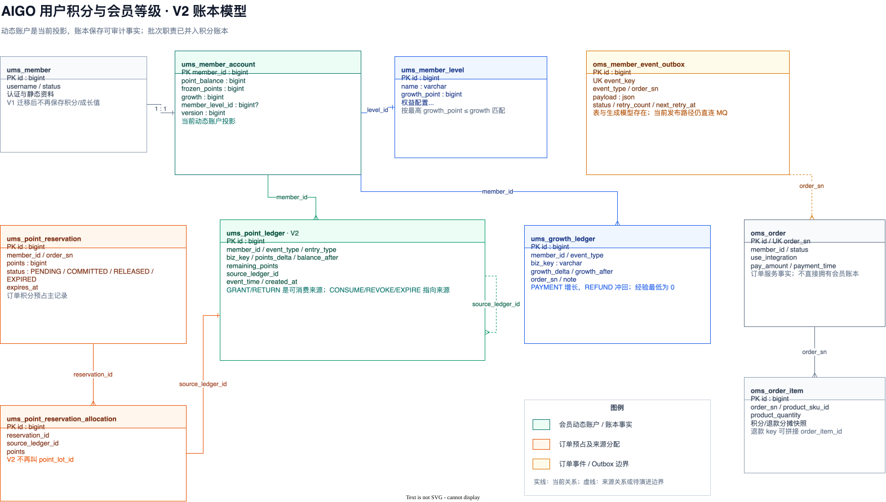
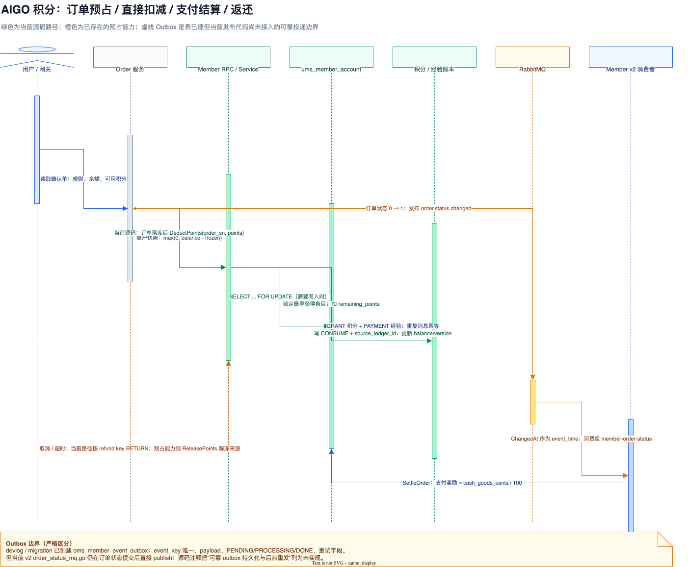

用户积分看起来像会员表上的两个数字：`integration` 和 `growth`。但只要系统同时支持每日奖励、订单抵扣、支付后奖励、退款返还、积分过期和会员升级，这两个数字就不再是普通字段，而是一个需要并发控制、幂等和审计的账户系统。

## 一、先把“会员资料”和“会员账户”拆开

### 1. `ums_member` 只负责静态身份

V1 迁移前，会员表里同时放着身份资料和积分、成长值、等级等动态字段。迁移之后：新增 `ums_member_account`，然后从 `ums_member` 删除 `member_level_id`、`integration`、`growth`、`luckey_count`、`history_integration` 五个动态字段。

这不是简单的“把字段换一张表”。它重新划定了边界：

| 模型 | 保存什么 | 谁负责更新 |
| --- | --- | --- |
| `ums_member` | 用户名、密码、手机号、状态、头像等身份与资料 | 会员资料服务 |
| `ums_member_account` | 积分余额、冻结积分、累计经验、当前等级、版本号 | 会员 loyalty service |
| `ums_member_level` | 等级阈值与权益配置 | 会员等级配置 |
| `ums_point_ledger` | 每一笔积分事实及其来源关系 | 会员积分服务 |
| `ums_growth_ledger` | 每一笔经验变化事实 | 会员等级服务 |

### 2. `ums_member_account` 是动态投影，不是全部历史

当前账户字段如下：

| 字段 | 业务含义 | 关键约束 |
| --- | --- | --- |
| `member_id` | 会员 ID，同时是主键 | 一个会员一行动态账户 |
| `point_balance` | 签名积分余额 | 允许为负；退款冲回超过现有来源时会出现负数 |
| `frozen_points` | 订单预占中的积分总数 | 只表示暂时不能再次使用的部分 |
| `growth` | 累计经验 | 业务逻辑把最低值限制为 0 |
| `member_level_id` | 当前等级 | 找不到满足阈值的等级时为空 |
| `version` | 乐观锁版本 | 账户变更时递增 |

读取账户时，可用积分不是一列，而是一个明确的派生规则：

```text
available_points = max(0, point_balance - frozen_points)
```

`GetLoyaltyProfile` 会把余额、冻结、经验、当前等级和下一等级一起返回。这里有两个容易写错的点：余额允许为负，但可用积分不会返回负数；“余额达到 1000 分”的抵扣门槛看的是 `point_balance`，真正预占时还要扣除 `frozen_points`。

注册流程也已经跟着这个模型改变：`Register` 在一个数据库事务中先插入 `ums_member`，再插入零值 `ums_member_account`。因此“会员已经创建但动态账户不存在”不会成为正常注册结果；如果历史数据出现账户缺失，`loadAccountForUpdate` 当前会返回账户不存在错误，而不是偷偷创建一行。

### 3. 等级是按经验重新计算出来的

等级配置表不预置任何默认等级。会员每次经验变化后，服务按 `growth_point <= growth` 查询，取阈值最高的一条；如果没有匹配等级，账户的 `member_level_id` 设为 `NULL`。读取会员信息时，再根据当前等级查询下一条更高阈值的配置。

## 二、积分账本：把获得、扣减和来源写进同一张表

积分账本 `ums_point_ledger` 同时承担两件事：记录每一次积分变化，以及跟踪每一条获得记录的剩余量和去向。`ums_member_account` 上的余额是它的汇总投影，明细事实都保留在账本里。

### 1. 账本条目承载什么

| 字段 | 作用 |
| --- | --- |
| `event_type` | 事件类型，如 `LOGIN`、`PAYMENT`、`ORDER`、`REFUND`、`EXPIRE` |
| `entry_type` | 条目类型：`GRANT`、`CONSUME`、`RETURN`、`REVOKE`、`EXPIRE` |
| `points_delta` | 本条目的积分变化量，可正可负 |
| `balance_after` | 变化后的账户积分余额 |
| `remaining_points` | `GRANT` / `RETURN` 获得类条目的剩余可用积分 |
| `source_ledger_id` | `CONSUME` / `REVOKE` / `EXPIRE` 所扣除的获得条目 ID |
| `biz_key` | 业务幂等键；订单号、退款号和明细 ID 按约定拼接在这里 |
| `event_time` | 业务事实发生的时间，如实际访问、支付或退款时间 |
| `created_at` | 账本行真正写入的时间，也就是消息处理时间 |

### 2. 获得类与扣除类条目

```text
获得类：GRANT / RETURN
  points_delta > 0
  remaining_points = 仍可消费的数量
  source_ledger_id = 0

扣除类：CONSUME / REVOKE / EXPIRE
  points_delta < 0
  remaining_points = 0
  source_ledger_id = 被扣除的获得条目 ID（没有来源可指的负余额冲回标记为 0）
```

假设一笔支付奖励入账 200 分，之后订单只抵扣 100 分：获得条目的 `remaining_points` 变为 100，并新增一条 `CONSUME(points_delta=-100, source_ledger_id=获得条目 ID)`。同一条获得记录可以被多次部分扣减，审计时沿 `source_ledger_id` 就能从任意一条扣减记录回溯到它的来源。

### 3. 唯一键：一次扣减可以对应多条来源

账本的唯一键是：

```text
(member_id, event_type, entry_type, biz_key, source_ledger_id)
```

把 `source_ledger_id` 纳入唯一键，是为了支持一次扣减命中多条来源：订单抵扣 150 分时，如果 80 分来自最早获得的条目、70 分来自下一条，就会写入两行 `CONSUME`——`biz_key` 相同，`source_ledger_id` 不同，互不冲突。`DeductPoints`、`ReservePoints` 与退款冲回都按 `created_at, id` 升序选择来源，既保证最早获得优先，也避免同一时间下排序不稳定。

### 4. 过期由后台任务统一处理

积分获得后有效期为 365 天。过期不在查询接口里惰性处理，而是由会员服务启动时注册的单实例后台任务（`gcron.AddSingleton`，每分钟触发一次）批量处理：先扫描 `entry_type IN ('GRANT', 'RETURN')`、`remaining_points > 0` 且 `created_at` 已超过 365 天的条目，按会员分组取出最多 200 个会员，再对每个会员在单账户事务中完成：

1. 锁住会员账户和到期获得条目；
2. 按剩余积分逐条写入 `EXPIRE` 账本（`biz_key` 为 `expire:<获得条目ID>`，`source_ledger_id` 指向原获得条目）；
3. 将来源条目的 `remaining_points` 减到零；
4. 扣减 `point_balance` 并递增 `version`。

即使任务还没轮到某个会员，消费、预占与退款冲回的来源查询也只接受处于 365 天有效期内的条目（按 `created_at` 过滤），已到期的剩余积分不会被继续消费。

注意这里的时间口径：**事件真实发生时间写在 `event_time`，但过期判断按账本 `created_at` 计算 365 天。** 这不是把两个时间字段混成一个字段，而是明确选择“从入账时间开始计算有效期”。



## 三、积分怎样获得、冻结、消费和返还

### 1. 每日首次访问：积分奖励从登录请求移到事件

当前密码登录只负责校验密码、签发 Token 和记录登录审计日志，不再同步发放每日积分。网关认证中间件发布 `gateway.first-access`，会员服务用消费组 `member-first-access` 订阅；消息体带有 `userId` 和 `accessTime`。

首访消费者的处理边界是：

```text
解码失败 / userId 非法       → Reject
accessTime 解析失败           → 回退当前上海时间并继续
AwardDailyLoginPoints 失败    → Retry
成功或业务键已存在            → Ack
```

`AwardDailyLoginPoints` 按上海自然日生成幂等键，每天发放 10 分。它先锁住动态账户，再用 `LOGIN + GRANT + 日期` 检查唯一业务键；重复消息不会重复增加余额。奖励写入时 `remaining_points` 也完整增加 10，负余额不会把这 10 分实时抵偿掉。

这里的主链路边界很重要：登录 HTTP 响应成功，不等于积分已经落账。积分是否到账，要以会员积分账本和消费者处理结果为准。

### 2. 订单确认：显示余额，Order 负责权威试算

订单确认接口通过会员内部 RPC 调用 `GetLoyaltyProfile`，返回：

- `point_balance`：签名余额；
- `available_points`：扣除冻结后的可用积分；
- `frozen_points`：已经被其他订单预占的积分；
- 积分抵扣门槛、抵扣汇率和 365 天有效期；
- 经验与等级进度。

订单服务当前的规则是：余额至少 1000 分才允许普通订单使用积分，1 积分抵扣 1 分钱，运费不能用积分抵扣，金额边界统一转成整数分。确认页展示的是会员服务返回的账户快照，但最终试算和创建订单仍由 Order 重新校验，不能信任前端提交的积分数。

### 3. “预占”能力存在，但当前下单路径实际使用 `DeductPoints`

这是本文最需要严格区分的一段。会员服务已经实现了 `ReservePoints`、`ReleasePoints` 和 `SettleOrder` 所需的预占模型：

1. 锁定 `ums_member_account`；
2. 校验 `point_balance >= 1000`，再用 `max(0, balance - frozen)` 校验可用量；
3. 创建 `PENDING` 预占记录；
4. 按获得时间从早到晚锁定积分来源，把分配写入 `ums_point_reservation_allocation`；
5. 减少各来源条目的 `remaining_points`，增加账户 `frozen_points`；
6. 取消或预占过期时，按来源加回 `remaining_points`，再把预占置为 `RELEASED` 或 `EXPIRED`。

但从当前 `backend/app/order/internal/service/v1/order.go` 的真实调用看，创建订单是在订单落库后调用：

```text
Order.GenerateOrder
  ├─ 预占库存
  ├─ 保存订单与订单明细
  └─ MemberService.DeductPoints(member_id, order_sn, use_points)
```

当前代码没有在这条下单路径调用 `ReservePoints`。`DeductPoints` 自己开启会员账户事务，按最早获得时间直接扣减来源 `remaining_points`，写入 `ORDER + CONSUME` 账本，并更新 `point_balance`。同一 `order_sn` 重复调用会读取已有消费账本；积分数量不一致则拒绝复用业务键。

### 4. 支付成功：订单事实与会员奖励异步分离

支付状态从 `0（待付款）` 变成 `1（待发货）` 后，Order 发布 `order.status.changed`。Member 侧消费组 `member-order-status` 只对支付成功事件进入结算：

```text
event = pay
from_status = 0
to_status = 1
```

`SettleOrder` 在账户事务中以订单号做幂等检查：

- 已有 PAYMENT 经验账本时，重复消息直接返回当前快照；
- 有预占输入时，提交预占并把冻结来源转成消费账本；
- 按现金商品金额（分）向下取整到整数元，发放同等数量积分和经验；
- 积分写 `PAYMENT + GRANT`，经验写 `PAYMENT` 成长账本；
- `event_time` 使用订单事件携带的真实 `ChangedAt`，缺省时才回退消息处理时间。

当前订单创建已经用 `DeductPoints` 完成积分抵扣，因此支付结算不会再次扣除同一笔抵扣积分；支付后奖励是另一条 `GRANT` 事实。这样“订单创建时消费”和“支付成功后发奖励”两个动作不会因为重复支付通知而重复发生。

### 5. 取消、超时和退款：返还不是简单加回余额

订单取消与超时关单会根据订单快照中的 `use_integration` 调用会员服务的退款联动入口。售后退款还会把商品级积分分摊、冲回积分和冲回经验传入 `ApplyRefund`。会员事务中按退款业务键幂等完成：

- `ReturnedPoints > 0`：写 `REFUND + RETURN`，返还积分按退款时间重新获得 365 天有效期；
- `RevokedPoints > 0`：按最早获得来源写 `REFUND + REVOKE`，不足部分允许继续扣减账户余额并形成负数；
- `RevokedGrowth > 0`：写 `REFUND` 经验账本，新的经验最低为 0，并重新计算等级。

因此当前取消/退款路径的“返还”是一个新的账本事实，不是把某一行消费记录删除，也不是无条件把数字加回账户。若接入真正的订单预占流程，`ReleasePoints` 才是“冻结还没有消费，按原来源解冻”；两者业务含义不同。

部分退款的分摊在 Order 里使用累计比例计算，避免多次退款因为整数除法导致合计少一分或多一分。会员账本拿到的 `refund_key + order_sn + order_item_id` 组合键，正是把商品级退款事实接到积分与经验幂等上的边界。

## 四、经验账本和会员等级：为什么不能只改一个 `growth`

`ums_growth_ledger` 的核心字段是 `event_type`、`biz_key`、`growth_delta`、`growth_after` 和 `order_sn`。支付成功产生正向经验，退款产生负向经验；`changeGrowthTx` 会先计算新的经验，低于 0 时截断为 0，再记录实际变化量并重算等级。

这里至少有三层价值：

1. **可解释**：可以回答“这 100 点经验来自哪笔订单”；
2. **可回滚**：退款不是猜一个当前值，而是按退款业务键写一笔反向事实；
3. **可幂等**：支付事件和退款事件重复到达时，先查对应业务账本，不再重复改变账户。

等级表只描述规则，账户只保存当前命中结果，经验账本保存变化历史。三者合起来，才能在运营调整等级阈值、退款降级或排查重复消息时保持可追溯。



## 六、实现这类账户系统时要守住的几个不变量

### 1. 余额、可用和冻结是三个不同概念

不能用 `point_balance` 直接作为下单可用积分，也不能因为冻结而改写签名余额。账户应始终满足：

```text
available_points = max(0, point_balance - frozen_points)
frozen_points >= 0
```

余额负数本身不是异常，它可能来自退款冲回超过当前仍可追溯的获得来源；异常的是账本和账户更新没有处于同一事务里。

### 2. 获得条目才能被消费

`GRANT` 和 `RETURN` 承载 `remaining_points`；`CONSUME`、`REVOKE`、`EXPIRE` 只通过 `source_ledger_id` 指向来源。消费时按 `created_at, id` 升序选择来源，既保证最早获得优先，也避免同一时间下排序不稳定。

### 3. 幂等键要跟业务事实绑定

每日奖励绑定“会员 + 上海自然日”，支付奖励绑定订单号，退款绑定退款业务键，订单直接扣减绑定 `order_sn`。不能拿消息 ID 代替业务幂等键，因为同一个事实可能由回调、轮询、重投或补偿产生多个消息 ID。

### 4. 事件时间和处理时间不要互换

`event_time` 用来还原用户什么时候访问、订单什么时候支付、退款什么时候发生；`created_at` 用来观察消息什么时候被处理。日志排障时两者都要保留，过期规则则必须明确选择哪个时间字段。

### 5. 订单服务不应该直接改会员账本

订单服务可以通过 `GetLoyaltyProfile` 获取试算快照，通过 `DeductPoints`、`ApplyRefund` 等内部 RPC 请求会员服务执行变更；积分来源、账本、经验和等级的写入仍然属于 Member。这样订单状态机和会员账户各自拥有自己的本地事务边界，跨服务一致性再通过事件、幂等与补偿处理。

## 结语：动态账户只是快照，账本才是解释能力

这一套设计最重要的不是增加了几张表，而是把三个问题拆开了：

- `ums_member_account` 回答“现在有多少积分、冻结多少、是什么等级”；
- 积分与经验账本回答“这些数字是怎么来的、被哪笔业务改变”；
- 订单事件与 Outbox/MQ 边界回答“支付、取消和退款怎样跨服务到达会员域”。