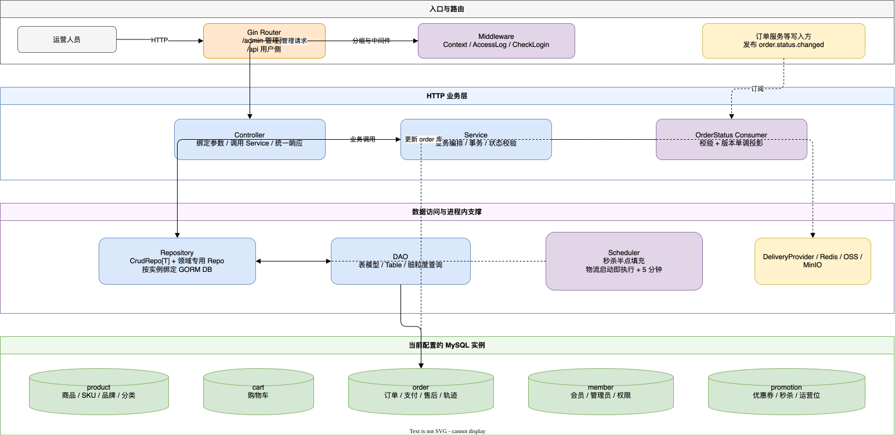
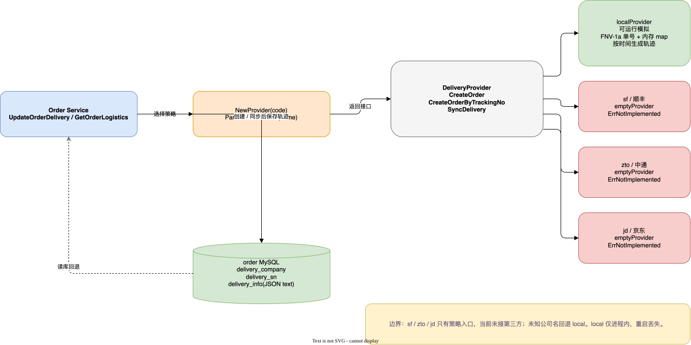
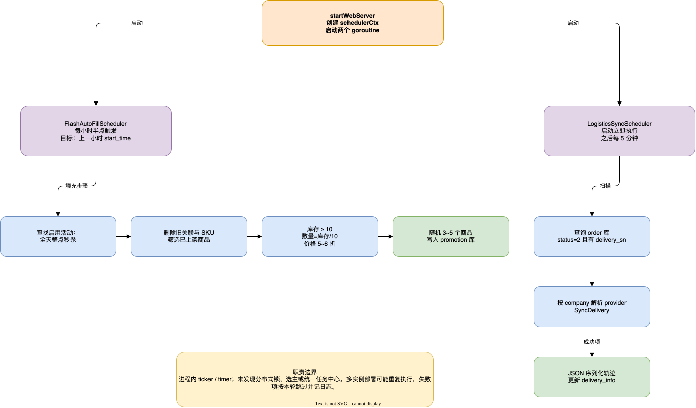

## 写在前面：后台不是“给数据库套一层页面”

前面的文章已经从业务和链路角度介绍过 B 端管理后台。这一篇把镜头推进到 `micro-mall-admin/backend` 的代码：一次 `/admin/order/update/delivery` 请求，究竟如何从 Gin 路由走到 Service、Repository、DAO 和具体的 MySQL 实例；订单状态消息如何进入后台并按版本收敛；物流策略、秒杀填充和物流同步又分别由谁负责。

本文先读了项目大纲和后台的实现说明，再以源码为准整理。需要特别说明：后台仓库的 `AGENTS.md` 仍把它描述为 Gin + GORM 的服务，`backend/docs/order-status-changed-mq.md` 与 `backend/docs/plan-orderdeliveryService.promt.md` 也明确记录了当前实现和边界。文中“已实现”“可运行模拟”“空实现”“测试替身”会分开写，不把规划项当成生产能力。

先给结论：**当前管理后台是一个 Gin HTTP 入口，业务逻辑集中在 Service，Repository/DAO 直接操作五个业务 MySQL 实例；订单状态用 RabbitMQ 做跨消费者传播，物流用策略接口包住本地模拟和三家空实现，秒杀与物流由进程内调度器驱动，文件能力则分成 OSS 签名和 MinIO 上传两条路径。**

## 一、先看代码地图：五层不是口号



可编辑源文件：[管理后台分层.drawio](./AIGO微服务电商项目全栈拆解（17）管理后台的技术实现：Gin、直连多库、任务与物流/管理后台分层.drawio)

从目录结构看，后台的主要职责落在下面五层：

| 层次 | 代码位置 | 当前职责 |
| --- | --- | --- |
| Router / Middleware | `api/router/`、`api/middleware/` | 注册 `/admin`、`/api`，挂载日志、上下文和登录校验 |
| Controller | `api/controller/` | 绑定 query/path/body，调用 Service，包装统一响应 |
| Service | `internal/service/` | 业务编排、事务、状态校验、MQ 和外部能力协作 |
| Repository | `internal/repo/` | 泛型 CRUD、分页、按领域绑定数据库实例 |
| DAO / DB | `internal/dao/db/`、`internal/dao/db/base.go` | 表模型、表名、细粒度查询和 GORM 连接初始化 |

这里的“分层”不是强制每个模块都经过同一套模板。新业务大多使用 `internal/entity` + `internal/repo/micromallCrudRepos.go` 里的泛型 Repository；旧的 `mallGoodsRepoImpl.go` 仍保留了专用 DAO 组合。两种风格共存，正好能看出项目从手写表访问向泛型 CRUD 收敛的过程。

## 二、Gin 入口：一棵 `/admin` 路由树

### 2.1 启动顺序先准备依赖，再开 HTTP

`cmd/mall/web.go` 的 `startWebServer` 基本按以下顺序运行：

1. `core.InitConfig` 加载配置；
2. 初始化日志和 OTel tracer；
3. `db.InitDB()` 初始化数据库连接；
4. 尝试建立 RabbitMQ 客户端，并启动订单状态消费者；
5. 启动秒杀自动填充和物流同步两个调度器；
6. 创建 Gin engine，调用 `router.RegisterRouter` 注册路由；
7. 用 `http.Server` 监听，并在 `SIGINT` / `SIGTERM` 到来时优雅退出。

MQ 是一个有意的软依赖：`mq.link` 为空、连接超时或订阅失败时，进程仍然继续提供 HTTP 服务。此时订单状态监听不可用，后台发货或关闭订单后的状态消息也只能记录失败；这不是“MQ 一定可靠”，而是启动阶段的可用性取舍。

### 2.2 全局能力和两个顶层分组

`RegisterRouter` 先注册：

- `/health`：健康检查；
- `/metrics`：Prometheus handler；
- `/swagger/*any`：Swagger UI；
- 全局 `Context`、可观测性和访问日志中间件；
- `/admin`：管理面；
- `/api`：同一 Gin 服务中的用户侧少量接口。

`RegisterAdminRouter` 将登录接口放在 `CheckLogin` 之前，随后保护管理员信息、商品、会员、营销、订单、售后、文件等接口。例如订单路由是：

```text
GET  /admin/order/list
GET  /admin/order/:id
GET  /admin/order/logistics/:id
POST /admin/order/update/receiverInfo
POST /admin/order/update/moneyInfo
POST /admin/order/update/delivery
POST /admin/order/update/close
POST /admin/order/update/note
POST /admin/order/delete
```

路由表已经说明后台的范围远大于“订单列表”：商品和 SKU、分类和品牌、首页运营位、优惠券、秒杀、会员等级、售后、退货原因、看板，以及 `/admin/aliyun/oss` 和 `/admin/minio` 文件入口都在同一个管理面中。

### 2.3 Controller 只做协议适配

以发货接口为例，`AdminUpdateOrderDelivery` 做的事情很窄：把 JSON 绑定为 `[]service.UpdateOrderDeliveryRequest`，校验空请求，调用 `service.UpdateOrderDelivery`，再用 `SuccessWithData` 返回结果。订单状态、物流 provider、事务和 MQ 都不应该下沉到 Controller。

这条约束的好处是：HTTP 层只关心协议；同一份 Service 可以被定时任务、测试或其它内部调用复用。缺点是 Service 变得更重，因此需要用清晰的 Repository、provider 和 scheduler 边界拆开职责。

## 三、Service、Repository、DAO：一次 CRUD 经过哪里

### 3.1 Service 负责“一个业务动作”的完整性

商品创建、订单关闭、订单发货都不是单表 `Create`：它们通常同时写主表、关联表、操作历史，或者在提交后发送消息。Service 层因此承担三类判断：

1. **参数和业务状态**：例如发货只接受待发货（状态 1）或已发货（状态 2）的订单；
2. **事务边界**：例如 `UpdateOrderDelivery` 在 order 库事务内写物流和状态；
3. **副作用时序**：事务提交后再发布订单状态事件，不能让 MQ 失败回滚已经成功的订单写入。

`CloseOrder` 和 `UpdateOrderDelivery` 都通过 `WithDBInstance(tx)` 把 Repository 切到事务连接；`updateOrderStatusWithVersion` 使用 `id + status + version` 条件更新，`RowsAffected != 1` 就返回状态冲突。这里的乐观锁不是 Router 的事情，而是 Service 在业务动作中保证的。

### 3.2 泛型 `CrudRepo[T]` 把重复 CRUD 收进一个实现

`internal/repo/crudRepo.go` 的核心结构是：

```go
type CrudRepo[T any] struct {
    DB *gorm.DB
}
```

它提供 `Create`、`CreateBatch`、`Update`、`UpdateBatch`、`UpdateByIDs`、`DeleteByID`、`DeleteByIDs`、`GetByID`、`List` 和 `PageList`。`List` 与 `PageList` 接收 `func(*gorm.DB) *gorm.DB` scopes，所以业务层可以把筛选条件、排序和分页拼接到 Repository，而不需要为每张表重新写相同的分页模板。

`PageList` 先在同一组 scopes 上执行 `Count`，再执行 `Limit/Offset` 查询，结果统一返回 `core.PageResult[T]`。这也是后台列表接口能够共享分页协议的原因。

### 3.3 Repository 构造函数显式选择数据库

泛型 Repository 默认使用 `product`：

```go
func NewCrudRepo[T any]() CrudRepo[T] {
    return CrudRepo[T]{DB: db.GetDbInstance("product")}
}
```

跨库的领域 Repository 必须显式绑定：

```go
func NewOmsOrderRepo() OmsOrderRepo {
    return OmsOrderRepo{
        CrudRepo: NewCrudRepoWithDB[entity.OmsOrder]("order"),
    }
}
```

`micromallCrudRepos.go` 里可以看到同一规律：`Pms*` 通常绑定 `product`，`Oms*` 绑定 `order`，`Sms*` 绑定 `promotion`，`Ums*` 绑定 `member`，购物车实体绑定 `cart`。这是一种简单但很有价值的约束：**Repository 的构造函数就是数据归属的显式声明。**

### 3.4 DAO 仍然适合少量专用查询

`internal/dao/db/` 中的 DAO 保存表模型和表名，例如 `GoodsDBDao` 负责 `mall_goods` 的创建、更新、删除、按分类查询和按 ID 查询，`AdminDBDao` 负责管理员和角色关联查询。需要多个表一起写时，Service 可以把事务 `*gorm.DB` 传给 DAO。

不过旧 DAO 代码需要按源码审慎阅读。`mallGoodsRepoImpl.go` 中的 `WithDBInstance` 是值接收者，并且示例调用 `self.mallGoodsDao.WithDBInstance(tx)` 没有接住返回值；这意味着不能仅凭函数名就断言后续 DAO 写入一定使用了事务连接。当前主业务 Repository 的 `NewOmsOrderRepo().WithDBInstance(tx)` 会接住返回值，文章把旧的 `MallGoodsRepoImpl` 标为需要回归测试的遗留路径，而不是新的事务模板。

## 四、直连多库：五个实例，一套进程内连接表

### 4.1 配置不是一个“默认库”

`core.MallConfig` 的 `Mysql` 字段是 `[]MysqlConfig`，每项包含 `instance`、`dsn`、慢查询阈值和 SQL trace 开关。当前 `conf.local.yaml` / `conf.prod.yaml` 启用的实例是：

| 实例 | 主要数据 |
| --- | --- |
| `product` | 商品、SKU、品牌、分类、商品运营记录 |
| `cart` | 购物车条目 |
| `order` | 订单、支付、操作历史、售后和物流轨迹 |
| `member` | 会员、管理员、角色权限、积分与任务 |
| `promotion` | 优惠券、秒杀、首页运营位、投放计划 |

配置里还保留了 `default`、`mysql` 等注释示例，但它们不是当前启用的实例。后台并不是连接一个名为 `micro_mall` 的总库后靠表名前缀区分领域，而是通过 DSN 把连接分到多个 MySQL database。

### 4.2 `InitDB` 的实际行为

`internal/dao/db/base.go` 用 `sync.Once` 保证初始化只执行一次：循环读取配置，为每个实例创建 GORM logger，再调用 `gorm.Open(mysql.Open(conf.Dsn), ...)`，成功后放入 `map[string]*gorm.DB`。

这里有两个必须记住的边界：

- 某一个 DSN 初始化失败时，代码打印错误并 `continue`，不会让其它实例初始化失败；
- `GetDbInstance` 找不到名称时返回 `nil`，不会自动创建或抛出更明确的配置错误。

所以生产环境需要把实例名、DSN 和启动日志纳入配置校验与监控；否则服务可能启动成功，但在真正访问某个领域时才出现空连接或后续 panic。

### 4.3 多库不等于分布式事务

一个 Service 可以在内存中同时拿到 `productDB` 和 `promotionDB`，例如读取商品后同步首页推荐数据，但这不意味着两个实例共享一个事务。当前源码看到的是每个数据库实例各自 `Begin`、`Commit` 或 `Rollback`，没有 XA、SAGA 或跨库 Outbox 事务协调器。

因此描述后台时应使用“直连多库、Service 编排多表操作”，而不是“后台拥有跨库原子事务”。订单发货主要落在 `order` 库；秒杀自动填充主要落在 `promotion`，读取商品和 SKU 时访问 `product`，它们之间没有一个跨实例的提交点。

## 五、订单状态 MQ：消费是收敛，发布是提交后尽力而为

### 5.1 启动时建立共享客户端

`startOrderStatusMessaging` 会去除配置值里的兼容前缀 `rabbitmq:`，使用 `mq.link` 创建 RabbitMQ 客户端，然后把同一个 client 放进 Service，既供消费者使用，也供发货、关闭订单后的 producer 使用。

后台固定订阅：

```text
Topic: order.status.changed
Consumer group: admin-order-status
Concurrency: 1
MaxAttempts: 10
RetryDelay: 5s
```

不同业务服务必须使用不同消费组；否则会员服务和后台会互相竞争，而不是各自收到一份事件。

### 5.2 消息先校验，再按版本更新

事件包含 `orderId`、`orderSn`、`memberId`、`fromStatus`、`toStatus`、`event`、`version`、金额分和 `changedAt`。消息 ID 是 `<orderSn>:<version>`，Key 是 `orderSn`。

后台处理器的决策可以压缩为：

| 情况 | 处理结果 |
| --- | --- |
| JSON 不能解析、字段越界、迁移组合未知 | `Reject`，重试无法修复 |
| 消息 ID / Key 与 payload 不一致 | `Reject` |
| 订单暂时不存在、数据库错误 | `Retry` |
| 本地版本高于消息，或同版本同状态 | `Ack`，幂等成功 |
| 同版本但本地状态不同 | `Reject`，说明数据冲突 |
| 消息版本更高 | 条件更新 `WHERE version < event.version`，成功后 `Ack` |

`applyOrderStatusChanged` 先按 `order_sn` 找本地订单，再校验订单 ID 和会员 ID。更新成功后，后台投影只推进 `status`、`version` 和 `modify_time`；版本跳号也直接采用最新事件，不凭空补造中间操作历史。这个消费者的目标是保持管理页面的当前状态收敛，不是重放完整订单状态机。

### 5.3 管理操作的发布时序

后台关闭订单和发货都遵循：

```text
开启 order 库事务
  → 校验状态和乐观锁
  → 更新订单、物流、操作历史
提交事务
  → 尝试发布 order.status.changed
```

发货是 `1 → 2 / ship`，关闭是 `0 → 4 / cancel`。如果提交成功但 RabbitMQ 发布失败，订单不会回滚，日志会记录发布错误；当前没有为这条消息实现持久化 Outbox 或通用补发任务。因此 MQ 是状态传播通道，不是当前实现里的订单写入事务参与者。

## 六、物流策略：接口已落地，真实三方仍是空实现



可编辑源文件：[物流策略.drawio](./AIGO微服务电商项目全栈拆解（17）管理后台的技术实现：Gin、直连多库、任务与物流/物流策略.drawio)

### 6.1 `DeliveryProvider` 只抽象订单级能力

`internal/delivery/delivery.go` 定义了三种业务动作：

```go
type DeliveryProvider interface {
    CreateOrder(ctx context.Context, req CreateOrderRequest) (string, error)
    CreateOrderByTrackingNo(ctx context.Context, req CreateOrderRequest, trackingNo string) error
    SyncDelivery(ctx context.Context, trackingNo string) (DeliveryInfo, error)
}
```

`CreateOrderRequest` 只包含订单号、收货人、电话和地址；`DeliveryInfo` 包含 tracking number、provider 和 `[]Trace`。订单 Service 因此只依赖接口，不需要知道“物流单是 API 申请还是本地生成”。

### 6.2 公司名解析和策略工厂

当前 provider code 有四个：`local`、`sf`、`zto`、`jd`。`ParseProviderCode` 支持中文名和编码：顺丰映射 `sf`，中通映射 `zto`，京东映射 `jd`，本地/模拟映射 `local`；未知公司名也回退 `local`。

`NewProvider` 再根据 code 返回具体策略：

- `local`：共享的 `localProvider`；
- `sf` / `zto` / `jd`：`emptyProvider`；
- 其它 code：返回 `ErrUnsupportedProvider`。

这两个层次不要混淆：未知中文公司名在解析层会被当成本地模拟，而直接把未知 `ProviderCode` 交给工厂则会返回“不支持”。

### 6.3 local：FNV-1a + 内存物流单 + 可重复轨迹

本地模拟的确定性来自订单号的 FNV-1a 64 位 hash：

- 单号格式：`LOCAL` + 16 位十六进制 hash；
- 途经点数量：`1 + hash % 20`；
- 起点仓库：`起点1`、`起点2` 或 `起点3`；
- 默认每小时推进一个轨迹间隔，也可以用 `WithInterval` 缩短测试时间。

订单被存进进程内 `map[trackingNo]*localOrder`，`SyncDelivery` 根据发货时间到当前时间经过的 interval 数生成轨迹前缀：起点“已揽收”、若干“运输中”，最后才是收货地址“已签收”。它不访问外部物流 API，也不把 provider 的内部订单表持久化到 MySQL。

local provider 另有清理 goroutine，每个 interval 推进一次进度，达到 `maxRetentionSteps=100` 后移除内存记录。进程重启后 map 丢失，所以它适合本地开发、演示和测试，不能作为真实物流数据源。

### 6.4 sf / zto / jd：有策略位置，没有三方调用

顺丰、中通、京东都由 `emptyProvider` 返回 `ErrNotImplemented`。当前没有看到签名、请求重试、运单订阅、供应商回调或第三方 SDK 调用。图中红色节点表示“接口占位”，不是“已经接入”。

### 6.5 发货 Service 如何接上策略

`UpdateOrderDelivery` 的一批请求共享一个 `order` 库事务。每条请求的主要顺序是：

1. 校验订单 ID、物流公司和订单状态；
2. 用订单里的收货信息构造 `CreateOrderRequest`；
3. 没有传 `deliverySn` 时调用 `CreateOrder`，有单号时调用 `CreateOrderByTrackingNo`；
4. 立即调用 `SyncDelivery`，把轨迹 JSON 写入 `oms_order.delivery_info`；
5. 待发货订单更新为已发货并递增 version，已发货订单只更新物流信息；
6. 写入发货操作历史，提交事务；
7. 提交后尽力发布 `ship` 事件。

订单详情接口把 `delivery_info` 反序列化成 `[]delivery.Trace`。物流查询接口则优先向 provider 要最新轨迹，provider 调用失败时回退到数据库已经保存的 JSON；这让本地模拟单在进程内可以“实时推进”，也让历史轨迹在 provider 不可用时仍可展示。

## 七、两个调度器：自动化补位，不是统一任务平台



可编辑源文件：[调度器职责.drawio](./AIGO微服务电商项目全栈拆解（17）管理后台的技术实现：Gin、直连多库、任务与物流/调度器职责.drawio)

### 7.1 秒杀自动填充：每小时半点补上一场

`StartFlashAutoFillScheduler` 在后台启动时创建 goroutine，不使用固定 ticker，而是计算下一个本地时间的 `HH:30:00`。触发后 `runFlashAutoFill` 处理上一小时的场次。

一次填充的实际步骤是：

1. 从 `promotion` 库找标题为“全天整点秒杀”且启用的活动；
2. 找上一小时 `start_time` 对应的启用场次；
3. 先删除该场次旧的 SKU 配置，再删除商品关联；
4. 从 `product` 库读取已上架且未删除的商品；
5. 只保留库存至少 10 的 SKU，秒杀数量为库存除以 10；
6. 随机选择 3～5 个合格商品，价格随机落在 5～8 折；
7. 将商品关联和 SKU 秒杀配置写回 `promotion` 库。

找不到活动、场次、商品或合格 SKU 时，任务记录日志并跳过；合格商品少于 3 个时也会写入当前找到的数据。这个任务的参数是源码常量和随机规则，不是后台页面可配置的通用排期引擎。

### 7.2 物流同步：启动先跑一次，之后每五分钟

`StartLogisticsSyncScheduler` 启动 goroutine 后先立即执行 `runLogisticsSync`，再用 `5 * time.Minute` ticker 周期执行。Service 查询 `order` 库中 `status=2` 且有 `delivery_sn` 的订单，逐单解析 provider 并调用 `SyncDelivery`；成功的轨迹序列化后更新 `delivery_info`，失败的订单记录或跳过。

它的职责很窄：把外部/模拟 provider 的当前轨迹同步回订单记录。它不负责重新发货、不改变订单状态，也不补发 MQ 事件。

### 7.3 调度边界

两个调度器都绑定 `schedulerCtx`，收到取消信号后退出；代码中没有发现分布式锁、租约、选主或统一任务中心。多实例部署时，每个进程都会启动自己的 goroutine，物流同步和秒杀填充可能重复执行。

这不等于一定会写坏数据：秒杀任务会先清理再写入，物流同步是覆盖同一份轨迹；但它们也没有跨实例去重的明确保证。若未来扩容后台副本，应为任务增加分布式锁、外部调度器或可安全重入的幂等任务记录。

## 八、OSS 与 MinIO：两条并存的文件路径

### 8.1 OSS 是前端直传签名

`GET /admin/aliyun/oss/policy` 调用 `GetOSSPolicy`：读取 OSS 配置，生成带过期时间和目录前缀限制的 Policy，使用 `HMAC-SHA1` 对 base64 Policy 签名，再返回 AccessKey ID、Policy、Signature、Dir、Host 和 Expire。

当前配置中的 AccessKey 和 Host 仍是待补全的示例值；缺少关键配置时接口返回“OSS 配置未完善”。代码只负责签名材料，不负责把文件内容上传到 OSS，也没有把 OSS 和 MinIO 统一成一个 storage interface。

### 8.2 MinIO 是服务端 multipart 上传

`POST /admin/minio/upload` 接收 multipart 文件，`UploadFileToMinio` 执行：

1. 校验 endpoint、AccessKey、SecretKey 和 bucket；
2. 初始化 MinIO client；
3. 检查 bucket，不存在时创建并设置匿名 `s3:GetObject` 公开读策略；
4. 用 `yyyy/mm/dd/UUID + 原扩展名` 生成对象名；
5. 上传并返回 URL、对象名和大小。

这条路径的事实边界也很清楚：文件内容进入 MinIO，不进入业务数据库；当前核查范围内没有附件元数据表；公开读策略和拼接 URL 是现行实现，不能替它推断出生产环境一定是私有 bucket + 预签名 URL。

## 九、测试、模拟和空实现边界

### 9.1 仓库里已有的测试替身

后台单元测试大量使用 SQLite 内存数据库，`internal/dao/db/base.go` 提供 `SetDBInstanceForTest`，把 product、promotion、order、cart、member 等实例映射到同一个测试连接。这样可以验证 Service 的查询、事务和状态判断，但它不等价于真实五个 MySQL 实例的跨库行为。

物流测试位于 `internal/delivery/delivery_test.go`，覆盖 provider 工厂、本地单号非空、轨迹数量、`WithInterval` 和 `CreateOrderByTrackingNo`；订单 MQ 测试覆盖事件校验、版本单调更新和发布边界。测试本地 provider 时应显式缩短 interval，并在测试结束关闭 provider 的清理 goroutine。

### 9.2 当前状态表

| 能力 | 当前状态 | 不能夸大的部分 |
| --- | --- | --- |
| Gin 路由和管理 CRUD | 已实现 | 不是所有接口都经过统一领域 RPC |
| `CrudRepo[T]` | 已实现 | 只能抽象通用 CRUD，复杂联表仍在 Service/DAO |
| 五个 MySQL 实例 | 已实现配置和连接初始化 | 没有跨库分布式事务 |
| 订单状态 MQ 消费 | 已实现 | 发布失败无持久化 Outbox，订阅依赖 RabbitMQ |
| local 物流 | 可运行模拟 | 内存数据，重启丢失，不是真实快递轨迹 |
| sf / zto / jd | 空实现占位 | 没有第三方 API、签名、回调或重试 |
| 秒杀自动填充 | 进程内任务 | 没有多实例选主和配置化排期 |
| 物流同步 | 进程内任务 | 没有统一任务中心或跨实例去重 |
| OSS | 签名接口 | 当前配置未完善，接口不上传文件 |
| MinIO | 服务端上传可运行 | 默认设置公开读，未见附件元数据落库 |

## 十、按一次“发货”回看全链路

把上面的层次压缩成一次实际动作：

```text
运营人员
  → POST /admin/order/update/delivery
  → Gin Router + CheckLogin
  → Controller 绑定 []UpdateOrderDeliveryRequest
  → Service 开启 order 库事务
  → Repository 读取 OmsOrder
  → ParseProviderCode + NewProvider
  → local 创建/登记单号，或 sf/zto/jd 返回未实现
  → SyncDelivery 得到轨迹
  → 更新 delivery_company / delivery_sn / delivery_info
  → 状态 1→2、version+1、写操作历史
  → 提交事务
  → 尽力发布 order.status.changed(ship)
```

这条链路同时体现了本文的三个判断：同步事务负责“后台自己的事实”， provider 负责“物流能力的替换点”， MQ 负责“提交后的状态传播”。三个边界没有被混写成一套全能组件。

## 结语：当前后台的技术画像

从源码看，AIGO 管理后台的技术实现不是一个复杂的微服务编排层，而是一个贴近业务数据库、适合运营动作落地的 Gin 单体后台：

- Router 和 Controller 负责管理面协议；
- Service 把状态、事务和副作用放在一起编排；
- 泛型 Repository 用 `CrudRepo[T]` 承接大量标准 CRUD；
- DAO 为表名和特殊查询保留落点；
- `db.GetDbInstance(name)` 让一个进程直接访问 product、cart、order、member、promotion 五个实例；
- RabbitMQ 消费按版本单调收敛，发布仍是提交后的尽力而为；
- `DeliveryProvider` 已经形成替换边界，但只有 local 可运行，sf/zto/jd 仍是空实现；
- 秒杀和物流是进程内调度器，MinIO 是当前真正可执行的对象存储上传路径。

最准确的总结是：**后台用直连多库换取运营 CRUD 的短路径，用 Service 事务保护履约动作，用 MQ 传播订单状态，用策略接口隔离物流差异，再用两个简单调度器补齐自动化。它已经具备清晰的实现骨架，但真实物流、Outbox、跨实例任务协调和统一对象存储抽象仍然属于后续演进。**
