## 概述
我们的数据库一般都会并发执行多个事务，多个事务可能会并发的对相同的一批数据进行增删改查操作，可能就会导致我们说的脏写、脏读、不可重复读、幻读这些问题。
这些问题的本质都是数据库的多事务并发问题，为了解决多事务并发问题，数据库设计了事务隔离机制、锁机制、MVCC多版本并发控制隔离机制、日志机制，用一整套机制来解决多事务并发问题。

## 事务及其ACID属性
事务是一组操作要么全部成功，要么全部失败，目的是为了保证数据最终的一致性。  
事务具有以下4个属性,通常简称为事务的ACID属性。
- 原子性(Atomicity) ：当前事务的操作要么同时成功，要么同时失败。原子性由undo log日志来实现。
- 一致性(Consistent) ：使用事务的最终目的，由其它3个特性以及业务代码正确逻辑来实现。
- 隔离性(Isolation) ：在事务并发执行时，他们内部的操作不能互相干扰。隔离性由MySQL的各种锁以及MVCC机制来实现。
- 持久性(Durable) ：一旦提交了事务，它对数据库的改变就应该是永久性的。持久性由redo log日志来实现。

## 并发事务处理带来的问题

1. 更新丢失(Lost Update)或脏写：当两个或多个事务选择同一行数据修改，有可能发生更新丢失问题，即最后的更新覆盖了由其他事务所做的更新。
2. 脏读（Dirty Reads）：事务A读取到了事务B已经修改但尚未提交的数据
3. 不可重读（Non-Repeatable Reads）：事务A内部的相同查询语句在不同时刻读出的结果不一致
4. 幻读（Phantom Reads）：事务A读取到了事务B提交的新增数据

## 事务隔离级别

“脏读”、“不可重复读”和“幻读”,其实都是数据库读一致性问题,必须由数据库提供一定的事务隔离机制来解决。

隔离级别|脏读(Dirty Read)|不可重复读(NonRepeatable Read)|幻读(Phantom Read)
---|---|---|---
读未提交(Read uncommitted)|可能|可能|可能
读已提交(Read committed)|不可能|可能|可能
可重复读(Repeatableread)|不可能|不可能|可能
可串行化(Serializable)| 不可能|不可能|不可能

数据库的事务隔离越严格,并发副作用越小,但付出的代价也就越大,因为事务隔离实质上就是使事务在一定程度上“串行化”进行,这显然与“并发”是矛盾的。同时,不同的应用对读一致性和事务隔离程度的要求也是不同的,比如许多应用对“不可重复读"和“幻读”并不敏感,可能更关心数据并发访问的能力。  

**查看当前数据库的事务隔离级别:** 
```bash
show variables like 'tx_isolation';
```

**设置事务隔离级别：**
```bash
set tx_isolation='REPEATABLE-READ';
```

**Mysql默认的事务隔离级别是可重复读，用Spring开发程序时，如果不设置隔离级别默认用Mysql设置的隔离级别，如果Spring设置了就用已经设置的隔离级别**

## 事务隔离级别案例分析
以下是我们的测试表：

```sql
CREATE TABLE `account` (
  `id` int(11) NOT NULL AUTO_INCREMENT,
  `name` varchar(255) DEFAULT NULL,
  `balance` int(11) DEFAULT NULL,
  PRIMARY KEY (`id`)
) ENGINE=InnoDB DEFAULT CHARSET=utf8;
INSERT INTO `test`.`account` (`name`, `balance`) VALUES ('lilei', '450');
INSERT INTO `test`.`account` (`name`, `balance`) VALUES ('hanmei', '16000');
INSERT INTO `test`.`account` (`name`, `balance`) VALUES ('lucy', '2400');
```

**读未提交：**  
（1）打开一个客户端A，并设置当前事务模式为read uncommitted（未提交读），查询表account的初始值：

```bash
set tx_isolation='read-uncommitted';
```

<center>
    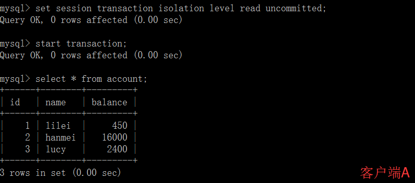
</center>

（2）在客户端A的事务提交之前，打开另一个客户端B，更新表account：

<center>
    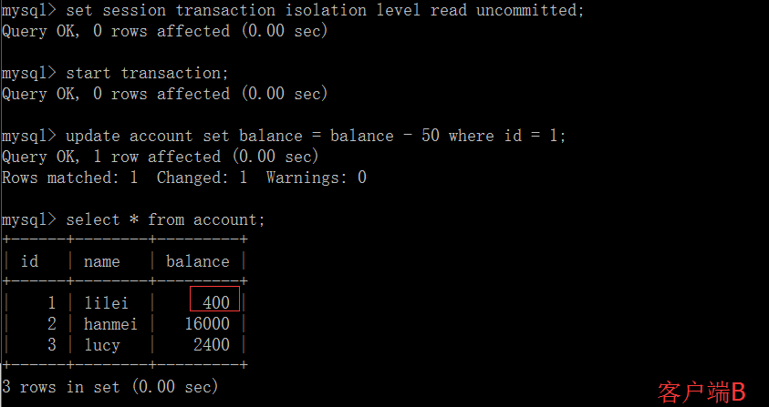
</center>

（3）这时，虽然客户端B的事务还没提交，但是客户端A就可以查询到B已经更新的数据： 

<center>
    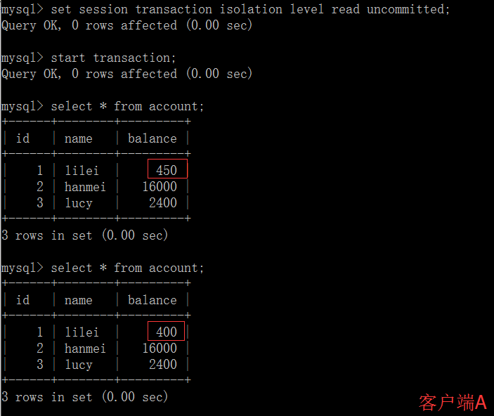
</center>

（4）一旦客户端B的事务因为某种原因回滚，所有的操作都将会被撤销，那客户端A查询到的数据其实就是脏数据： 

<center>
    
</center>

（5）在客户端A执行更新语句update account set balance = balance - 50 where id =1，lilei的balance没有变成350，居然是400，是不是很奇怪，数据不一致啊，如果你这么想就太天真了，在应用程序中，我们会用400-50=350，并不知道其他会话回滚了，要想解决这个问题可以采用读已提交的隔离级别

<center>
    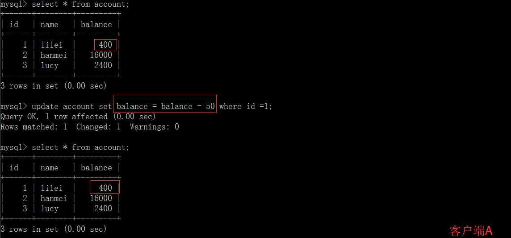
</center>

**读已提交：**
（1）打开一个客户端A，并设置当前事务模式为read committed（读已提交），查询表account的所有记录：

```bash
set tx_isolation='read-committed';
```

<center>
    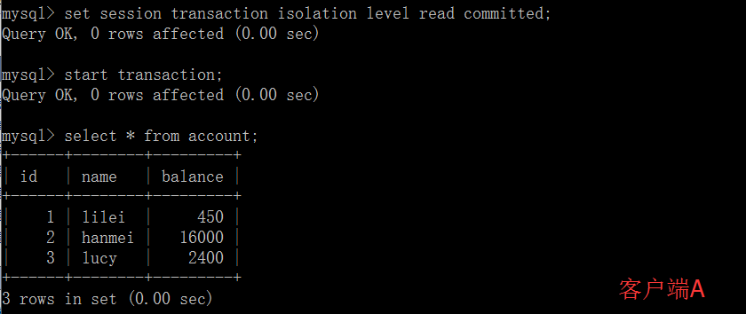
</center>

（2）在客户端A的事务提交之前，打开另一个客户端B，更新表account：

<center>
    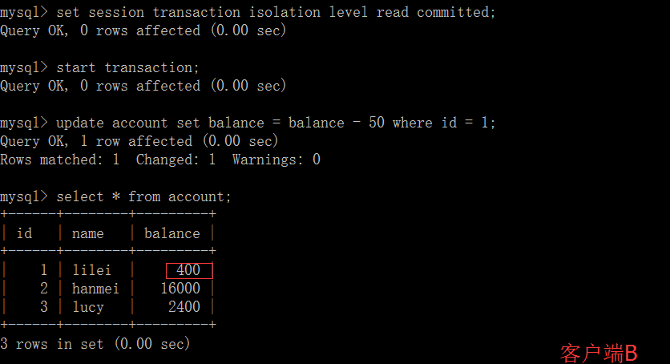
</center>

（3）这时，客户端B的事务还没提交，客户端A不能查询到B已经更新的数据，解决了脏读问题： 

<center>
    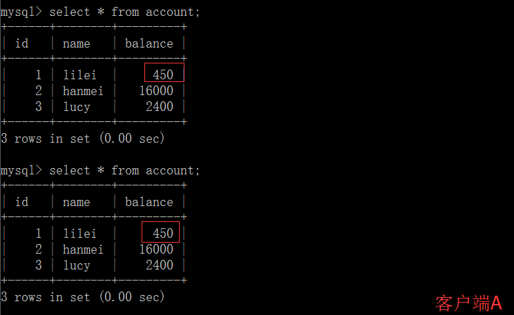
</center>

（4）客户端B的事务提交

<center>
    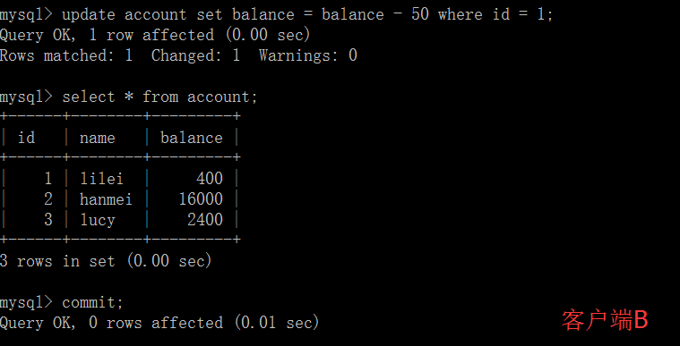
</center>

（5）客户端A执行与上一步相同的查询，结果 与上一步不一致，即产生了不可重复读的问题

<center>
    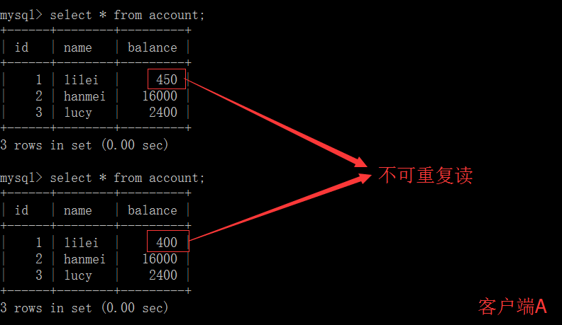
</center>

**可重复读：**

可重复读隔离级别在事务开启的时候，第一次查询是查的数据库里已提交的最新数据，这时候全数据库会有一个快照(当然数据库并不是真正的生成了一个快照)，在这个事务之后执行的查询操作都是查快照里的数据，别的事务不管怎么修改数据对当前这个事务的查询都没有影响，但是当前事务如果修改了某条数据，那当前事务之后查这条修改的数据就是被修改之后的值，但是查其它数据依然是从快照里查，不受影响。

（1）打开一个客户端A，并设置当前事务模式为repeatable read，查询表account的所有记录

```bash
set tx_isolation='repeatable-read';
```

<center>
    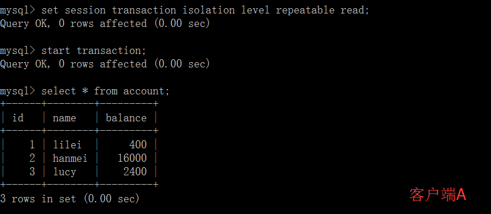
</center>

（2）在客户端A的事务提交之前，打开另一个客户端B，更新表account并提交

<center>
    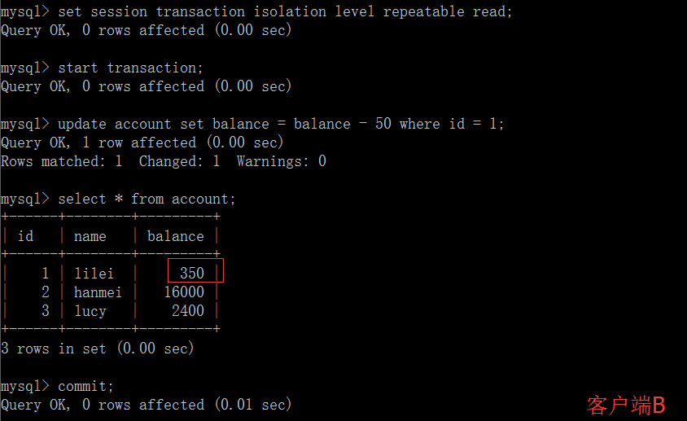
</center>

（3）在客户端A查询表account的所有记录，与步骤（1）查询结果一致，没有出现不可重复读的问题

<center>
    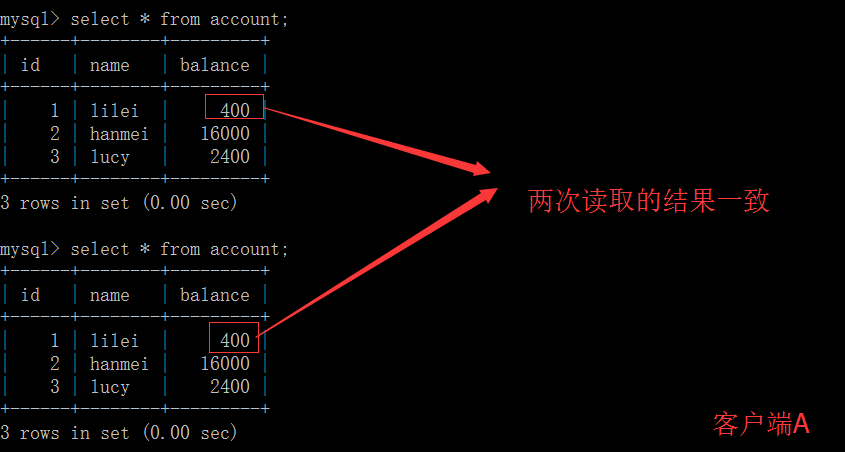
</center>

（4）在客户端A，接着执行update account set balance = balance - 50 where id = 1，balance没有变成400-50=350，lilei的balance值用的是步骤2中的350来算的，所以是300，数据的一致性倒是没有被破坏。可重复读的隔离级别下使用了MVCC(multi-version concurrency control)机制，select操作是快照读（历史版本）；insert、update和delete是当前读（当前版本）。

<center>
    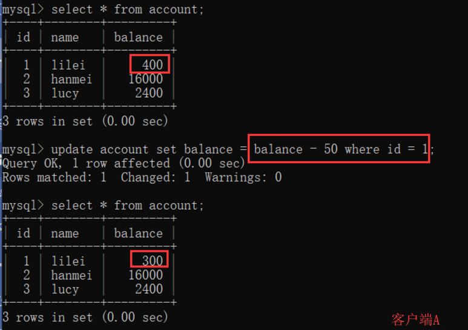
</center>

（5）重新打开客户端B，插入一条新数据后提交

<center>
    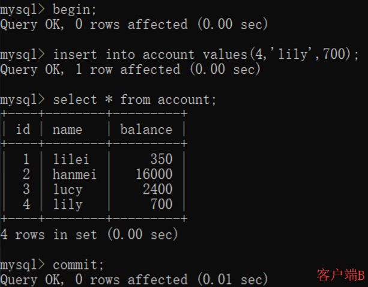
</center>

（6）在客户端A查询表account的所有记录，没有查出新增数据，所以没有出现幻读

<center>
    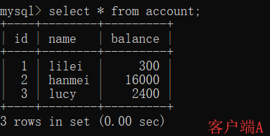
</center>

（7）验证幻读：在客户端A执行update account set balance=888 where id = 4；能更新成功，再次查询能查到客户端B新增的数据

<center>
    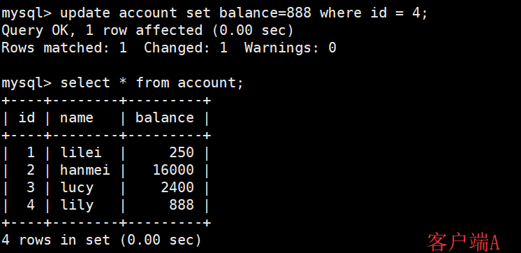
</center>

**串行化：**
（1）打开一个客户端A，并设置当前事务模式为serializable，查询表account的初始值：

```bash
set tx_isolation='serializable';
```

<center>
    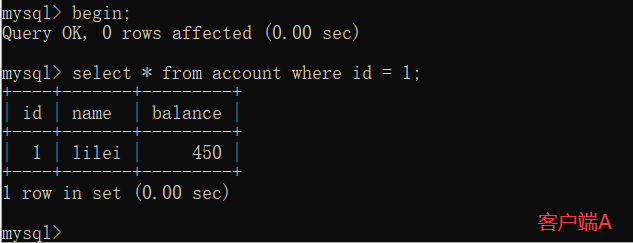
</center>

（2）打开一个客户端B，并设置当前事务模式为serializable，更新相同的id为1的记录会被阻塞等待，更新id为2的记录可以成功，说明在串行模式下innodb的查询也会被加上行锁，如果查询的记录不存在会给这条不存在的记录加上锁(这种是间隙锁，后面会详细讲)。  
如果客户端A执行的是一个范围查询，那么该范围内的所有行包括每行记录所在的间隙区间范围都会被加锁。此时如果客户端B在该范围内插入数据都会被阻塞，所以就避免了幻读。**这种隔离级别并发性极低，开发中很少会用.**

<center>
    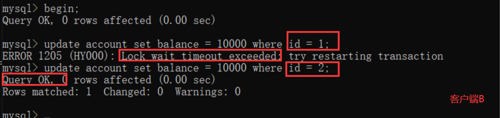
</center>