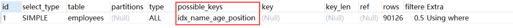
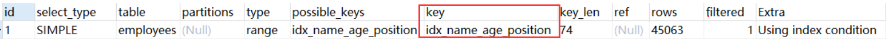
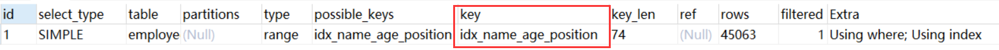
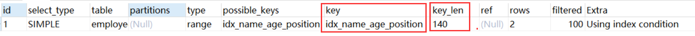
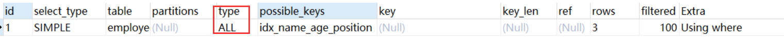
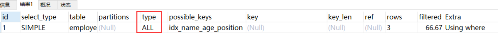
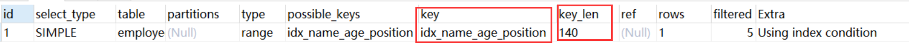
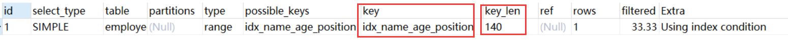

## 示例表
本文中用到的表结构如下：
```sql
CREATE TABLE `employees` (
  `id` int(11) NOT NULL AUTO_INCREMENT,
  `name` varchar(24) NOT NULL DEFAULT '' COMMENT '姓名',
  `age` int(11) NOT NULL DEFAULT '0' COMMENT '年龄',
  `position` varchar(20) NOT NULL DEFAULT '' COMMENT '职位',
  `hire_time` timestamp NOT NULL DEFAULT CURRENT_TIMESTAMP COMMENT '入职时间',
  PRIMARY KEY (`id`),
  KEY `idx_name_age_position` (`name`,`age`,`position`) USING BTREE
) ENGINE=InnoDB AUTO_INCREMENT=1 DEFAULT CHARSET=utf8 COMMENT='员工记录表';

INSERT INTO employees(name,age,position,hire_time) VALUES('LiLei',22,'manager',NOW());
INSERT INTO employees(name,age,position,hire_time) VALUES('HanMeimei', 23,'dev',NOW());
INSERT INTO employees(name,age,position,hire_time) VALUES('Lucy',23,'dev',NOW());

-- 插入一些示例数据
drop procedure if exists insert_emp; 
delimiter ;;
create procedure insert_emp()        
begin
  declare i int;                    
  set i=1;                          
  while(i<=100000)do                 
    insert into employees(name,age,position) values(CONCAT('zhuge',i),i,'dev');  
    set i=i+1;                       
  end while;
end;;
delimiter ;
call insert_emp();
```

## 一些例子
1. 联合索引第一个字段用范围不会走索引
```sql
EXPLAIN SELECT * FROM employees WHERE name > 'LiLei' AND age = 22 AND position ='manager';
```

<center>

</center>

结论：联合索引第一个字段就用范围查找不会走索引，mysql内部可能觉得第一个字段就用范围，结果集应该很大，回表效率不高，还不如就全表扫描

2. 强制走索引

```sql
EXPLAIN SELECT * FROM employees force index(idx_name_age_position) WHERE name > 'LiLei' AND age = 22 AND position ='manager';
```

<center>

</center>

结论：虽然使用了强制走索引让联合索引第一个字段范围查找也走索引，扫描的行rows看上去也少了点，但是最终查找效率不一定比全表扫描高，因为回表效率不高

以下的实验对比了强制走索引和不强制走索引的查询效率

```sql
-- 关闭查询缓存
set global query_cache_size=0;  
set global query_cache_type=0;
-- 执行时间0.333s
SELECT * FROM employees WHERE name > 'LiLei';
-- 执行时间0.444s
SELECT * FROM employees force index(idx_name_age_position) WHERE name > 'LiLei';
```

3. 覆盖索引优化

```sql
EXPLAIN SELECT name,age,position FROM employees WHERE name > 'LiLei' AND age = 22 AND position ='manager';
```

<center>

</center>


4. in和or在表数据量比较大的情况会走索引，在表记录不多的情况下会选择全表扫描

```sql
EXPLAIN SELECT * FROM employees WHERE name in ('LiLei','HanMeimei','Lucy') AND age = 22 AND position ='manager';
```

<center>

</center>

```sql
EXPLAIN SELECT * FROM employees WHERE (name = 'LiLei' or name = 'HanMeimei') AND age = 22 AND position ='manager';
```

<center>

</center>

做一个小实验，将employees 表复制一张employees_copy的表，里面保留两三条记录

```sql
EXPLAIN SELECT * FROM employees_copy WHERE name in ('LiLei','HanMeimei','Lucy') AND age = 22 AND position ='manager';
```

<center>

</center>

```sql
XPLAIN SELECT * FROM employees_copy WHERE (name = 'LiLei' or name = 'HanMeimei') AND age = 22 AND position ='manager';
```

<center>

</center>

5. like KK% 一般情况都会走索引

```sql
EXPLAIN SELECT * FROM employees WHERE name like 'LiLei%' AND age = 22 AND position ='manager';
```
<center>

</center>

```sql
EXPLAIN SELECT * FROM employees_copy WHERE name like 'LiLei%' AND age = 22 AND position ='manager';
```

<center>

</center>
