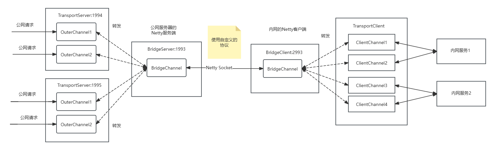

## 流量转发模型

    
    
npt流量转发模型

## 遇到的问题
- [x] 解决半包和粘包的问题，因为转发的时候在原数据包前面加了一个头部，所以可能使数据包超过限制
- [x] 区分不同的外部连接，这样内网返回的数据才能顺利的找到需要返回给哪个外网客户端
- [x] 如何正确转发到对应的内网服务器
- [x] 前端管理界面新增一个端口转发(port1->port2)的时候，在公网服务器上新起一个TCP服务器，监听公网的port1端口，成功之后，向响应的客户端发起一个命令，让其新起一个客户端与刚刚的TCP服务器连接，同时，再起一个和本地服务连接的TCP客户端，然后把这两个客户端连通起来。但是此时还无法区分内网服务返回的数据要返回给哪个公网请求
在内网服务器端，维护一个map，键为转发的hashcode，值为请求本地服务的TCP客户端，在连接的时候加入map，关闭连接的时候从map中移除。

- [x] 出现了TooLongException问题
Netty响应公网请求的时候出现TooLongFrameException:（解决）把LengthFieldBasedFrameDecoder的maxFrameLength设置成2^31-1

- [x] maven打包公共包时出错
在父项目上一起打包
- [x] ssh和mysql客户端工具连接时没有反应
通过抓包发现，客户端在三次握手之后就没有反应了，需要服务端发送一个PSH帧，客户端才会继续，所以公网服务器在三次握手成功后需要向内网客户端发送一个空的数据报，让内网的服务响应一个PSH帧

## 功能
- [x] 通过配置文件启动，解析yml文件
- [ ] 一键注册成系统服务

## 步骤
1. 公网服务端启动，监听1993端口
2. 内网客户端启动，连接公网服务端的1993端口：通过vkey验证此客户端是否合法
3. 公网或内网发起公网端口p1到内网p2的端口映射请求，同时指定是TCP还是UDP
4. 公网启动一个监听p1端口的服务器(TCP/UDP)，并且复用1993号端口的线程(eventloopgroup)
5. 通知相应的客户端，公网服务端的p1端口监听成功，客户端记录来自p1端口的请求是转发到p2
6. 在内网客户端收到转发请求之后，根据映射表，启动一个客户端去请求相应端口的内网服务
7. 内网服务返回后，客户端将响应转发回公网服务端，公网服务端找到相应的channel，然后转发