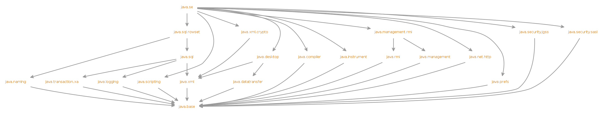

## 前言

模块化是Java9正式引入的feature，全称是：Java Platform Module System (JPMS)，该特性的引入增强了Java的模块化和封装性；而且用户可利用JDK9提供的打包工具Jlink生成可执行镜像文件（该文件可不依JDK环境直接运行）

## 语法说明

### JavaSE模块间依赖关系

<center>
    
    <p>JavaSE模块间依赖关系</p>
</center>

### 语法详解
- Java9模块化代码编写的核心类是module-info.java，该类必须在模块的根路径上定义（例如：maven项目中可以将module-info.java放置在main\src\java下）；
- 当前模块的所有定义都在module-info.java文件中，主要关键字包括：exports, module, open, opens, provides, requires, uses (with, to, transitive)；
- module-info.java中 模块名称必须定义且moduleName必须保证唯一（模块名可自定义，建议直接用模块包名做模块名），body（{}中的内容）可以为空；
- 当一个工程中有module-info.java时，会被当做一个模块来看待，访问外部模块中的类时会受外部模块定义的约束限制（例如：只能访问到其他模块exports的内容，更强的封装性），当工程中没有module-info.java时，则当成普通的jar访问；
- 默认情况下，在模块中的public类需要exports才能被外部其他模块访问到，exports的类中用public/protected修饰的嵌套类也可被外部模块访问到；


各关键字使用说明如下：
```java
/**
 * 声明模块名称：algorithm.api，open：可选项；
 * 当用open修饰module时表示模块中的任何类都可以被外部访问到；
 * all packages in a given module should be accessible at runtime and via
 * reflection to all other modules
 */
[open] module algorithm.api {   

  // 声明当前模块依赖于另一模块java.base
  // java.base是默认requires，不用在module-info.java中明确声明；
  requires java.base;

  // 依赖的传递性，与maven的依赖继承性相似，任何依赖algorithm.api的模块同时也依赖java.desktop;
  // 去掉transitive则必须在依赖模块中明确依赖，即声明requires java.desktop;
  // JavaSE内部module间的依赖都已用transitive修饰，这使得我们对JavaSE module声明依赖更加简洁;
  requires transitive java.desktop;

  // 对java.xml的依赖在编译期必须，运行期非必须，
  // 类似maven中的<scope>provided<scope>，使用Jlink打包的jimage不包含java.xml的文件
  requires static java.xml;

  // 将当前模块指定包中的public类（包含用public/protected修饰的嵌套类）exports（公布），供给外部模块访问；
  // 只exports当前声明的package中的类，子package中的内容不被导出，需另声明；
  exports nl.frisodobber.java9.jigsaw.calculator.algorithm.api;

  // 将包中的类导出给指定的Modules，只能在限定的Module内使用；
  exports nl.frisodobber.java9.jigsaw.calculator.algorithm.api.extension to java.desktop, java.sql, calculator.gui;

   // 引入通过 provides…with 提供的service类，一般 provides…with 的定义在其他模块中
   // 代码中可以通过 ServiceLoader.load(Algorithm.class); 获取可用的service类；
  uses nl.frisodobber.java9.jigsaw.calculator.algorithm.api.Algorithm;


   // 通过 provides…with 指令，提供一个实现类；外部模块使用时可用过 uses 引入；
  provides nl.frisodobber.java9.jigsaw.calculator.algorithm.api.Algorithm with nl.frisodobber.java9.jigsaw.calculator.algorithm.add.Add;

  // 所有包内的public类（包含public/protected嵌套类）只能在运行中被访问
  // 包内的所有类以及所有类内部成员都可以通过反射访问到
  opens nl.frisodobber.java9.jigsaw.calculator.algorithm.api;

  // 限定访问包的模块
  opens nl.frisodobber.java9.jigsaw.calculator.algorithm.api.scala to java.desktop, java.sql;

  /**
   * By default, a module with runtime reflective access to a package can see the package’s public types
   * (and their nested public and protected types). However, code in other modules can access all types in
   * the exposed package and all members within those types, including private members via setAccessible,
   * as in earlier Java versions.
   */

}
```

## 相关工具

### Jlink

- 用Jlink创建一种名为jimage的镜像文件，可直接运行，无需JDK环境；jimage可以有效减小运行时镜像（剔除了无依赖的java module）；
- Jlink使用时要求当前项目以及其所依赖的所有jar都有module-info.java文件

生成jimage示例：

```shell
> cd maven-java9-jigsaw
> mvn clean package -DskipTests
> jlink
  --module-path libs
  --add-modules calculator.gui,calculator.cli
  --compress 2  // gzip压缩，可选
  --output jimage
```

运行jimage：

```shell
> cd jimage/bin
> java -m calculator.gui/nl.frisodobber.java9.jigsaw.calculator.gui.Main
```

### Jmod
生成jmod文件：

```shell
# 将jar转换成jmod文件
> cd libs
> jmod
  create calculator.gui
  --class-path fd-java9-jigsaw-gui-1.0-SNAPSHOT.jar
  --module-version 1.0
```

### Jdeps
依赖对象分析工具，可分析模块相关依赖信息，具体命令可通过jdeps -h查看，简单示例：

```shell
> cd libs
> jdeps
  --module-path libs
  -m calculator.gui
  --list-deps
```

### Maven插件

name|description
---|---
[jlink](!https://maven.apache.org/plugins/maven-jlink-plugin/usage.html)|Build Java Run Time Image
[jmod](!https://maven.apache.org/plugins/maven-jmod-plugin/)|Build Java JMod files

## Netty中的module
```
Usage with JDK 9+

Netty can be used in modular JDK9+ applications as a collection of automatic modules. The module names follow the reverse-DNS style, and are derived from subproject names rather than root packages due to historical reasons. They are listed below:

io.netty.all
io.netty.buffer
io.netty.codec
io.netty.codec.dns
io.netty.codec.haproxy
io.netty.codec.http
io.netty.codec.http2
io.netty.codec.memcache
io.netty.codec.mqtt
io.netty.codec.redis
io.netty.codec.smtp
io.netty.codec.socks
io.netty.codec.stomp
io.netty.codec.xml
io.netty.common
io.netty.handler
io.netty.handler.proxy
io.netty.resolver
io.netty.resolver.dns
io.netty.transport
io.netty.transport.epoll (native omitted - reserved keyword in Java)
io.netty.transport.kqueue (native omitted - reserved keyword in Java)
io.netty.transport.unix.common (native omitted - reserved keyword in Java)
io.netty.transport.rxtx
io.netty.transport.sctp
io.netty.transport.udt

Automatic modules do not provide any means to declare dependencies, so you need to list each used module separately in your module-info file.
```