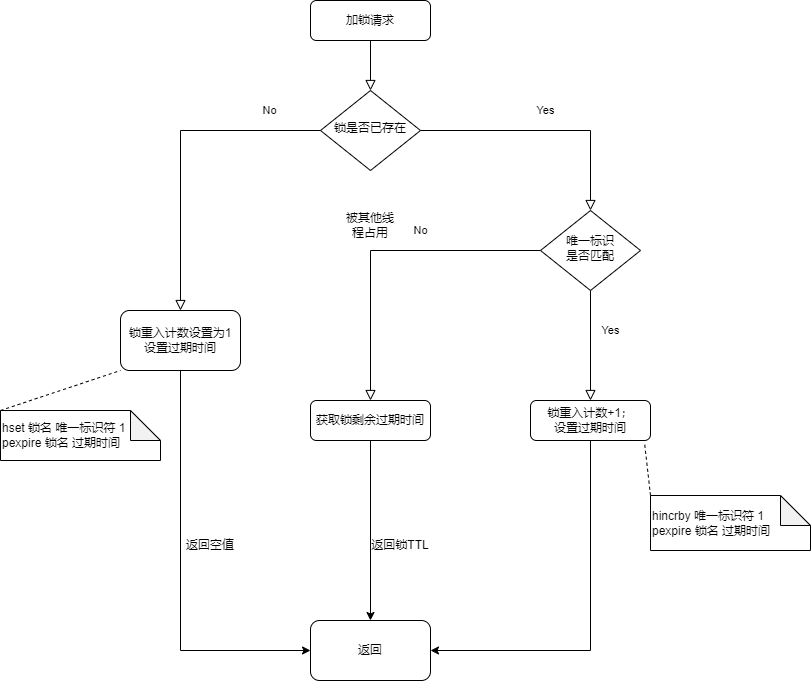

### 什么是分布式锁？
分布式锁是一种机制，用于确保在分布式系统中，多个节点在同一时刻只能有一个节点能对共享资源进行操作。它是解决分布式环境下并发控制和数据一致性问题的关键技术之一。

### 分布式锁的特征
- **互斥性**：任意时刻，只有一个客户端能持有锁
- **锁超时性**：持有锁超时时，需要释放锁，防止不必要的资源浪费，同时也能防止死锁
- **可重入性**
- **高性能和高可用**：加锁和解锁需要开销尽可能底，同时也要保证高可用，避免分布式锁失效
- **安全性**：锁只能被持有的客户端删除，不能被其他客户端删除

### Redis分布式锁的实现方案(基于Redisson)

#### Redisson在单点模式下实现分布式可重入锁

##### 加锁和解锁的Lua脚本
https://blog.csdn.net/asd051377305/article/details/108384490
加锁、解锁Lua脚本是实现redisson分布式锁的最重要的组成部分。
1. 加锁Lua脚本
- 脚本入参

| 参数 | 实例值 | 含义 
|-------|--------|------
|KEY个数|1|KEY个数
|KEYS[1]|my_first_lock_name|锁名
|ARGV[1]|60000|持有锁的有效时间：毫秒
|ARGV[2]|32213|唯一标识：获取锁时set的唯一值，实现上为redisson客户端ID(UUID)+线程ID
- 脚本内容

```Lua
-- 若锁不存在，则新增锁，并设置锁重入技术为1、设置锁过期时间
if (redis.call('exsts',KEYS[1]==0) then
    redis.call('hset',KEYS[1],ARGV[2],1);
    redis.call('pexpire',KEYS[1],ARGV[1]);
    return nil;
end;

-- 若锁存在，且唯一标识符也匹配，说明是同一个线程请求加锁，则锁的重入计数+1，并再次设置锁过期时间
if (redis.call('hexists',KEYS[1],ARGV[2]==1) then
    redis.call('hincrby',KEYS[1],ARGV[2],1);
    redis.call('pexpire',KEYS[1],ARGV[1]);
    return nil;
end;

-- 若锁存在，但唯一标识不匹配，表明锁是被其他线程占用，当前线程无权获取其他线程的锁，直接返回剩余过期时间
return redis.call('pttl',KEYS[1]);
```

- 脚本流程图如下
<center>

      <p>加锁脚本流程图</p>
</center>

Q：为什么返回值要为nil或者剩余过期时间？
A：客户端可以根据返回值判断加锁是否成功。
返回的结果为nil时，表示加锁成功；否则加锁失败。
