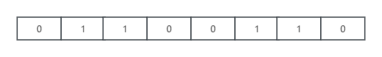

布隆过滤器主要是为了解决海量数据的存在性问题。对于海量数据中判定某个数据是否存在且容忍轻微误差这一场景（比如缓存穿透、海量数据去重）来说，非常适合。

## 什么是布隆过滤器？
布隆过滤器（Bloom Filter，BF）是Bloom于1970年提出的。我们可以把它看作由二进制向量（或者说位数组）和一系列随机映射函数（哈希函数）两部分组成的数据结构。相比于我们平时常用的List、Map、Set等数据结构，它占用空间更少并且效率更高，但是缺点是其返回的结果是概率性的，而不是准确的。理论情况下添加到集合中的元素越多，误报的可能性就越大。并且，存放在布隆过滤器的数据不容易删除。

Bloom Filter会使用一个较大的bit数组来保存所有的数据，数组中的每个元素只占用1bit，并且每个元素只能是0或者1（代表```false```或者```true```），这也是Bloom Filter节省内存的核心所在。这样来算的话，申请一个100万个元素的位数组只占用1000000 Bit/8，即约等于122KB的空间
<center>

<p>布隆过滤器的位数组</p>
</center>

## 布隆过滤器的原理
**向布隆过滤器中添加一个元素时，需要进行如下操作：**
1. 使用布隆过滤器中的哈希函数对元素值进行计算，得到哈希值（有几个哈希函数就得到几个哈希值）。
2. 根据得到的哈希值，在位数组中把对应下标的值置为1。

**当我们需要判断一个元素是否存在于布隆过滤器中时，会进行如下操作：**
1. 对给定元素进行相同的哈希计算。
2. 得到值之后判断位数组中的每个元素是否都为1，如果值都为1，那么说明这个值在布隆过滤器中，如果存在一个值不为1，说明该元素不在布隆过滤器中。

当字符串加入到布隆过滤器中时的过程如下图：

当我们需要判断某个字符串是否存在于布隆过滤器中时，只需要对给定字符串再次进行相同的哈希计算，得到值之后判断位数组中的每个元素是否都为1，如果值都为1，那么说明这个值在布隆过滤器中，如果存在一个值不为1，说明该元素不在布隆过滤器中。

**不同的字符串可能哈希出来的位置相同，这时候我们可以适当增加位数组大小或者调整哈希函数。**

综上，我们可以得出：**布隆过滤器说某个元素存在，小概率会误判。布隆过滤器说某个元素不在，那么这个元素一定不在。**

## 布隆过滤器的使用场景

1. 判断给定数据是否存在：比如判断一个数字是否存在于包含大量数字的数字集中（数字集很大，上亿）、防止缓存穿透（判断请求的数据是否有效，从而避免请求绕过缓存请求到数据库）、邮箱的垃圾邮件（判断一个邮件地址是否在垃圾邮件列表中）、黑名单功能（判断一个IP地址或手机号是否在黑名单中）
2. 去重：比如对巨量的QQ号/订单号去重。

这两个场景都是需要判断给定数据是否存在，因此布隆过滤器主要是为了解决海量数据的存在性问题。

## 编码实战

### 通过Java手动实现布隆过滤器

如果要手动实现一个布隆过滤器的话，需要实现以下功能：
1. 一个合适大小的位数组来保存数据
2. 多个不同的哈希函数
3. 添加元素到位数组（布隆过滤器）的实现方法
4. 判断给定元素是否存在于位数组（布隆过滤器）

```java
import java.util.BitSet;

public class MyBloomFilter {

    public static void main(String[] args) {
        String value1 = "https://huangpei.nobugs.net.cn/";
        String value2 = "https://github.com/huangpei1993";
        MyBloomFilter filter = new MyBloomFilter();
        System.out.println(filter.contains(value1));
        System.out.println(filter.contains(value2));
        filter.add(value1);
        filter.add(value2);
        System.out.println(filter.contains(value1));
        System.out.println(filter.contains(value2));

    }
    /**
     * 位数组的大小
     */
    private static final int DEFAULT_SIZE = 2 << 24;
    /**
     * 通过这个数组可以创建 6 个不同的哈希函数
     */
    private static final int[] SEEDS = {3, 13, 46, 71, 91, 134};
    /**
     * 位数组。数组中的元素只能是 0 或者 1
     */
    private BitSet bits;
    /**
     * 存放包含 hash 函数的类的数组
     */
    private MyHash[] hashes = new MyHash[SEEDS.length];

    public MyBloomFilter() {
        bits = new BitSet(DEFAULT_SIZE);
        for (int i = 0; i < SEEDS.length; i++) {
            hashes[i] = new MyHash(DEFAULT_SIZE, SEEDS[i]);
        }
    }

    public MyBloomFilter(int size) {
        bits = new BitSet(size);
        for (int i = 0; i < SEEDS.length; i++) {
            hashes[i] = new MyHash(size, SEEDS[i]);
        }
    }
    /**
     * 添加元素到位数组
     */
    public void add(Object value) {
        for (MyHash f : hashes) {
            bits.set(f.hash(value), true);
        }
    }
    /**
     * 判断指定元素是否存在于位数组
     */
    public boolean contains(Object value) {
        for (MyHash f : hashes) {
            //只要有一个位置为false就提前推出循环
            if(!bits.get(f.hash(value))){
                return false;
            }
        }
        return true;
    }


    static class MyHash {
        private int cap;
        private int seed;

        public MyHash(int cap, int seed) {
            this.cap = cap;
            this.seed = seed;
        }

        public int hash(Object value) {
            int h;
            return (value == null) ? 0 : Math.abs((cap - 1) & seed * ((h = value.hashCode()) ^ (h >>> 16)));
        }
    }
}

```

### 利用Google开源的Guava中的布隆过滤器

首先我们需要在项目中引入 Guava 的依赖：

```xml
<dependency>
    <groupId>com.google.guava</groupId>
    <artifactId>guava</artifactId>
    <version>28.0-jre</version>
</dependency>

```
创建一个最多存放最多 1500 个整数的布隆过滤器，并且我们可以容忍误判的概率为百分之（0.01）

```java
// 创建布隆过滤器对象
BloomFilter<Integer> filter = BloomFilter.create(
    Funnels.integerFunnel(),
    1500,
    0.01);
// 判断指定元素是否存在
System.out.println(filter.mightContain(1));
System.out.println(filter.mightContain(2));
// 将元素添加进布隆过滤器
filter.put(1);
filter.put(2);
System.out.println(filter.mightContain(1));
System.out.println(filter.mightContain(2));

```

上面的代码中，当```mightContain()```方法返回为```true```时，我们可以99%确定该元素在过滤器中，当返回```false```时，我们可以100%确定该元素不存在于过滤器中。
