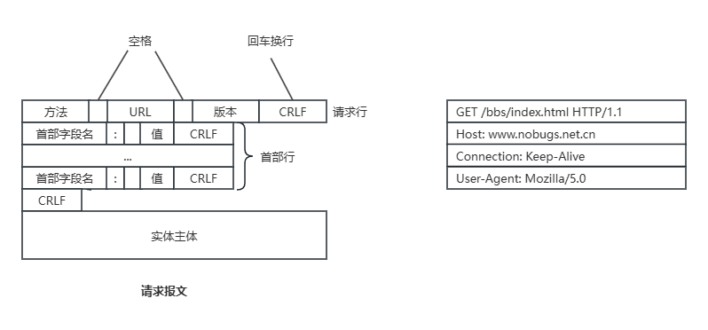
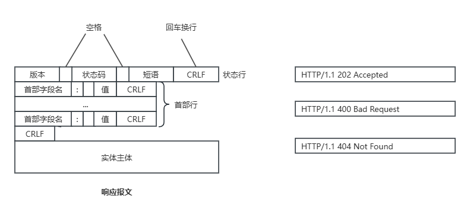

## 计算机网络基础
### 网络分层模型
#### OSI模型是什么？每一层的作用是什么？
**OSI七层模型**是国际标准化组织提出的一个网络分层模型，其大体结构以及每一层提供的功能如下表所示：  
OSI七层模型|传输单位|功能|主要协议
---|---|--|---
应用层||为计算机用户提供服务|HTTP、FTP、SMTP
表示层||数据处理（编解码、加密解密、压缩解压缩|
会话层||管理（建立、维护、重连）应用程序间地会话|
传输层||为两台主机进程之间地通信提供数据传输|TCP、UDP
网络层|数据报|路由和寻址、流量控制、拥塞控制、差错控制、网际互连等|IP、ARP
数据链路层|帧|纠正物理层出现地错误|
物理层|比特|在物理介质上透明地**传输原始比特流**|

#### TCP/IP四层模型是什么？每一层地作用是什么？
**TCP/IP四层模型**是目前被广泛采用地一种模型，我们可以将TCP/IP模型看作是OSI七层模型地精简版，
<table>
    <tr>
        <td>TCP/IP四层模型</td>
        <td>OSI七层模型</td>
        <td>传输单位</td>
        <td>功能</td>
        <td>主要协议</td>
    </tr>
    <tr>
        <td rowspan="3">应用层</td>
        <td>应用层</td>
        <td></td>
        <td>为计算机用户提供服务</td>
        <td>HTTP、FTP、SMTP</td>
    </tr>
    <tr>
        <td>表示层</td>
        <td></td>
        <td>数据处理（编解码、加密解密、压缩解压缩</td>
        <td></td>
    </tr>
    <tr>
        <td>会话层</td>
        <td></td>
        <td>管理（建立、维护、重连）应用程序间地会话</td>
        <td></td>
    </tr>
    <tr>
        <td>传输层</td>
        <td>传输层</td>
        <td></td>
        <td>为两台主机进程之间提供数据传输</td>
        <td>TCP、UDP</td>
    </tr>
    <tr>
        <td>网络层</td>
        <td>数据报</td>
        <td>路由、寻址、流量控制、拥塞控制、差错控制等</td>
        <td>IP、ARP</td>
    </tr>
    <tr>
        <td rowspan="2">网络接口层</td>
        <td>数据链路层</td>
        <td>帧</td>
        <td>纠正物理层出现的错误</td>
        <td></td>
    </tr>
    <tr>
        <td>物理层</td>
        <td>比特</td>
        <td>在物理介质中透明地传输比特流</td>
        <td></td>
    </tr>
</table>

#### 为什么要网络分层？
复杂地系统需要分层，因为每一层都需要专注于一类事情。网络分层地原因也是一样地，每一层只专注于做一类事情。网络分层地原因：  
1. 各层之间相互独立：各层之间相互独立，每一层不需要关心其它层是如何实现地，只需要知道自己如何条用下层提供好地功能即可。这个和我们开发系统时进行分层是一个道理。
2. 提高了灵活性和可替换性：每一层都可以使用最合适地技术来实现，你只需要保证你提供地功能以及暴露地接口地规则没有改变就行了。并且，每一层都可以根据需要进行修改或替换，而不会影响到整个网络地结构。这个和我们平时开发系统的时候要求的高内聚、低耦合也是可以对应上的。
3. 大问题化小：分层可以将复杂的网络问题分解为许多比较小的、界限比较清晰简单的小问题来处理和解决。这样使得复杂的计算机网络系统变得易于设计、实现和标准化。这个和我们平时开发系统的时候，一般会将系统功能分解，然后将复杂的问题分解为容易理解的更小的问题是相对应的，这些较小的问题具有更好的边界定义。  

计算机世界有一句非常有名的话：
> 计算机科学领域的任何问题，都可以通过增加一个中间层来解决，整个计算机体系从上到下都是按照严格的层次结构来设计的。

#### 应用层有哪些常见的协议？
- HTTP（超文本传输协议）：基于TCP协议，是一种用于传输超文本和多媒体内容的协议，主要是为Web浏览器于Web服务器之间的通讯而设计的。当我们使用浏览器浏览网页的时候，我们网页就是通过HTTP请求进行加载的。
- SMTP（简单邮件发送协议）：基于TCP协议，是一种用于发送电子邮件的协议。
- POP3/IMAP（邮件接收协议）：基于TCP协议，两者都是负责邮件接收的协议。
- FTP（文件传输协议）：基于TCP协议，是一种用于在计算机之间传输文件的协议，可以屏蔽操作系统和文件存储方式。
- SSH（安全的网络传输协议）：基于TCP协议，通过加密和认证机制实现安全的访问和文件传输
- RTP（实时传输协议）：通常基于UDP协议，提供了端到端的实时传输数据的功能。
- DNS（域名管理系统）：基于UDP协议，用于解决域名和IP地址的映射问题。

#### 从输入URL到页面展示到底发生了什么？
1. 浏览器解析URL
2. 浏览器向DNS服务器请求域名对应的IP地址
3. 浏览器获取到IP地址后，与该主机建立TCP连接
4. 建立TCP连接后，浏览器发出HTTP请求
5. 服务器发出HTTP响应
6. 释放TCP连接
7. 浏览器解析获得的HTTP响应

#### HTTP的报文结构

      
      
HTTP请求报文

      
      
HTTP响应报文

#### HTTP和HTTPS有什么区别？
- 端口号：HTTP默认是80，HTTPS默认是443
- URL前缀：HTTP的URL前缀是$http://$,HTTPS的URL前缀是$https://$。
- 安全性和资源消耗：HTTP协议运行在TCP之上，所有传输的内容都是明文，客户端和服务器端都无法验证对方的身份。HTTPS是运行在SSL/TLS之上的HTTP协议，SSL/TLS运行在TCP之上。所有传输的内容都经过加密，加密采用对称加密，但对称加密的密钥用服务器方的证书进行了非对称加密。所以说，HTTP安全性没有HTTPS高，但是HTTPS比HTTP耗费跟多服务器资源
- SEO（搜索引擎优化）：搜索引擎通常会更青睐于使用HTTPS协议的网站，因为HTTPS能够提供更高的安全性和用户隐私保护。使用HTTPS协议的网站在搜索结果中可能会被优先显示，从而对SEO产生影响。

#### HTTP是无状态的协议，那它如何保存用户状态？
HTTP是一种无状态协议。也就是说HTTP协议本身不对请求和响应之间的通信状态进行保存。那么我们如何保存用户状态呢？Session机制的存在就是为了解决这个问题的，Session的主要作用就是通过服务端记录用户的状态。而我们使用最多的是通过Token来记录用户的登录状态。

把用户的登录Token保存到Redis中，并设置过期时间。每次客户端发出请求时，在请求头加上Token，来进行用户的验证。

#### URI和URL的区别是什么？
- URI(Uniform Resource Identifier)是统一资源标志符，可以唯一标识一个资源。
- URL(Uniform Resource Locator)是统一资源定位符，可以提供该资源的路径。他是一种具体的URI，即URL可以用来标识一个资源，而且还知名了如何locate这个资源  

URI的作用像身份证号一样，URL的作用更像家庭住址一样，URL是一种具体的URI，它不仅唯一标识资源，而且还提供了定位该资源的信息

#### GET和POST的区别
GET和POST是HTTP协议中两种常用的请求方法，它们在不同的场景和目的下有不同的特点和用法。一般来说，它们的区别如下：
1. 语义（主要区别）：GET通常用于花去或查询资源，而POST通常用于创建或修改资源
2. 幂等：GET请求是幂等的，即多次重复执行不会改变资源的状态，而POST请求是不幂等的，即每次执行可能会产生不同的结果或影响资源的状态
3. 格式：GET请求的参数通常放在URL中，形成查询字符串（querystring），而POST请求的参数通常放在请求体（body）中，可以有多种编码格式，如application/x-www-form-urlencoded、multipart/form-data、application/json等。GET请求的URL长度受到浏览器和服务器的限制，而POST请求的body则没有明确的大小限制。不过，实际上GET也可以用body传送数据，只是不推荐这样做，因为这样做可能会导致兼容性或者语义上的问题
4. 缓存：由于GET请求是幂等的，它可以被浏览器或中间节点（如网关、代理）缓存起来，以提高性能和效率。而POST请求则不适合缓存，因为它可能有副作用，每次执行可能需要实时的响应
5. 安全性：GET和POST请求如果使用的是HTTP协议的话，那都不安全，因为HTTP协议本身是明文传输的，必须使用HTTPS协议来加密传输数据。另外，GET请求相比POST请求更容易泄露敏感数据，因为GET请求的参数通常放在URL中。

#### HTTP状态码有哪些？
**1XX Informational（信息性状态码）**
相比于其它类别状态码来说，1XX平时大概率不会碰到
**2XX Success（成功状态码）**
- **200 OK：** 请求被成功处理
- **201 Created：** 请求被成功处理并且在服务端创建了一个新的资源。比如我们通过POST请求创建一个新的用户
- **202 Accepted：** 服务端已经收到了请求，但是还未处理
- **204 NoContent：** 服务端已经成功处理了请求，但是没有返回任何值。

**3XX Redirection（重定向状态码）**
- **301 Moved Permanently：** 资源被永久重定向了。比如你的网站地址更换了
- **302 Found:** 资源被临时重定向了。比如你的网站的某些资源被暂时转移到另外一个网址

**4XX Client Error（客户端错误状态码）**
- **400 Bad Request：** 发送的HTTP请求存在问题。比如请求参数不合法、请求方法错误。
- **401 Unauthorized：** 未认证却请求需要认证之后才能访问的资源
- **403 Forbidden：** 直接拒绝HTTP请求，不处理。一般用来针对非法请求。
- **404 Not Found：** 请求的资源未在服务端找到。比如请求的URL不存在的时候
- **409 Conflict：** 表示请求的资源与服务端当前的状态存在冲突，请求无法被处理

**5XX Server Error（服务端错误状态码）**
- **500 Internal Server Error：** 服务端出问题了（通常是服务端出BUG了）。比如在请求服务端时抛出异常，但是异常并未在服务端被正确处理
- **502 Bad Gateway：** 网关将请求转发到服务端，但是服务端返回的却是一个错误的响应。