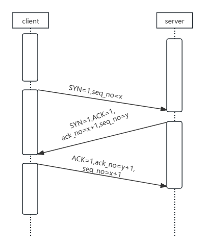
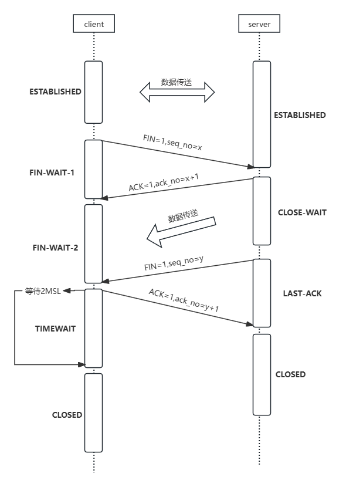
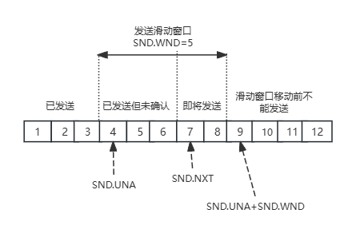
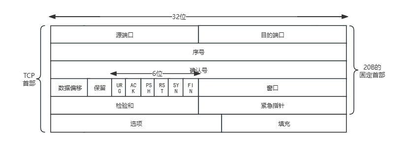
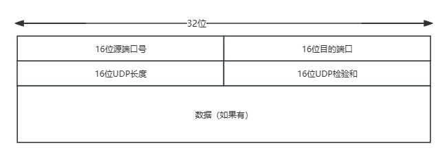
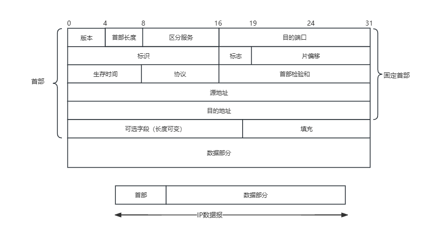

## 计算机网络基础
### 网络分层模型
#### OSI模型是什么？每一层的作用是什么？
**OSI七层模型**是国际标准化组织提出的一个网络分层模型，其大体结构以及每一层提供的功能如下表所示：  


OSI七层模型|传输单位|功能|主要协议
---|---|--|---
应用层|数据报|为计算机用户提供服务|HTTP、FTP、SMTP
表示层|数据报|数据处理（编解码、加密解密、压缩解压缩|
会话层|数据报|管理（建立、维护、重连）应用程序间地会话|
传输层|数据报|为两台主机进程之间地通信提供数据传输|TCP、UDP
网络层|数据报|路由和寻址、流量控制、拥塞控制、差错控制、网际互连等|IP、ARP
数据链路层|帧|纠正物理层出现地错误|
物理层|比特|在物理介质上透明地**传输原始比特流**|


#### TCP/IP四层模型是什么？每一层的作用是什么？
**TCP/IP四层模型**是目前被广泛采用地一种模型，我们可以将TCP/IP模型看作是OSI七层模型地精简版，
<table>
    <tr>
        <td>TCP/IP四层模型</td>
        <td>OSI七层模型</td>
        <td>传输单位</td>
        <td>功能</td>
        <td>主要协议</td>
    </tr>
    <tr>
        <td rowspan="3">应用层</td>
        <td>应用层</td>
        <td rowspan="3">数据报</td>
        <td>为计算机用户提供服务</td>
        <td>HTTP、FTP、SMTP</td>
    </tr>
    <tr>
        <td>表示层</td>
        <td>数据处理（编解码、加密解密、压缩解压缩</td>
        <td></td>
    </tr>
    <tr>
        <td>会话层</td>
        <td>管理（建立、维护、重连）应用程序间地会话</td>
        <td></td>
    </tr>
    <tr>
        <td>传输层</td>
        <td>传输层</td>
        <td>数据报</td>
        <td>为两台主机进程之间提供数据传输</td>
        <td>TCP、UDP</td>
    </tr>
    <tr>
        <td>网络层</td>
        <td>网络层</td>
        <td>数据报</td>
        <td>路由、寻址、流量控制、拥塞控制、差错控制等</td>
        <td>IP、ARP</td>
    </tr>
    <tr>
        <td rowspan="2">网络接口层</td>
        <td>数据链路层</td>
        <td>帧</td>
        <td>纠正物理层出现的错误</td>
        <td></td>
    </tr>
    <tr>
        <td>物理层</td>
        <td>比特</td>
        <td>在物理介质中透明地传输比特流</td>
        <td></td>
    </tr>
</table>

#### 为什么要网络分层？
复杂地系统需要分层，因为每一层都需要专注于一类事情。网络分层地原因也是一样地，每一层只专注于做一类事情。网络分层地原因：  
1. 各层之间相互独立：各层之间相互独立，每一层不需要关心其它层是如何实现地，只需要知道自己如何条用下层提供好地功能即可。这个和我们开发系统时进行分层是一个道理。
2. 提高了灵活性和可替换性：每一层都可以使用最合适地技术来实现，你只需要保证你提供地功能以及暴露地接口地规则没有改变就行了。并且，每一层都可以根据需要进行修改或替换，而不会影响到整个网络地结构。这个和我们平时开发系统的时候要求的高内聚、低耦合也是可以对应上的。
3. 大问题化小：分层可以将复杂的网络问题分解为许多比较小的、界限比较清晰简单的小问题来处理和解决。这样使得复杂的计算机网络系统变得易于设计、实现和标准化。这个和我们平时开发系统的时候，一般会将系统功能分解，然后将复杂的问题分解为容易理解的更小的问题是相对应的，这些较小的问题具有更好的边界定义。  

计算机世界有一句非常有名的话：
> 计算机科学领域的任何问题，都可以通过增加一个中间层来解决，整个计算机体系从上到下都是按照严格的层次结构来设计的。

#### 应用层有哪些常见的协议？
- HTTP（超文本传输协议）：基于TCP协议，是一种用于传输超文本和多媒体内容的协议，主要是为Web浏览器于Web服务器之间的通讯而设计的。当我们使用浏览器浏览网页的时候，我们网页就是通过HTTP请求进行加载的。
- SMTP（简单邮件发送协议）：基于TCP协议，是一种用于发送电子邮件的协议。
- POP3/IMAP（邮件接收协议）：基于TCP协议，两者都是负责邮件接收的协议。
- FTP（文件传输协议）：基于TCP协议，是一种用于在计算机之间传输文件的协议，可以屏蔽操作系统和文件存储方式。
- SSH（安全的网络传输协议）：基于TCP协议，通过加密和认证机制实现安全的访问和文件传输
- RTP（实时传输协议）：通常基于UDP协议，提供了端到端的实时传输数据的功能。
- DNS（域名管理系统）：基于UDP协议，用于解决域名和IP地址的映射问题。

#### 从输入URL到页面展示到底发生了什么？
1. 浏览器解析URL
2. 浏览器向DNS服务器请求域名对应的IP地址
3. 浏览器获取到IP地址后，与该主机建立TCP连接
4. 建立TCP连接后，浏览器发出HTTP请求
5. 服务器发出HTTP响应
6. 释放TCP连接
7. 浏览器解析获得的HTTP响应

#### HTTP的报文结构
<center>
      
      <p>HTTP请求报文</p>
</center>
<center>
      
      <p>HTTP响应报文</p>
</center>

#### HTTP和HTTPS有什么区别？
- 端口号：HTTP默认是80，HTTPS默认是443
- URL前缀：HTTP的URL前缀是```http://```,HTTPS的URL前缀是```https://```。
- 安全性和资源消耗：HTTP协议运行在TCP之上，所有传输的内容都是明文，客户端和服务器端都无法验证对方的身份。HTTPS是运行在SSL/TLS之上的HTTP协议，SSL/TLS运行在TCP之上。所有传输的内容都经过加密，加密采用对称加密，但对称加密的密钥用服务器方的证书进行了非对称加密。所以说，HTTP安全性没有HTTPS高，但是HTTPS比HTTP耗费跟多服务器资源
- SEO（搜索引擎优化）：搜索引擎通常会更青睐于使用HTTPS协议的网站，因为HTTPS能够提供更高的安全性和用户隐私保护。使用HTTPS协议的网站在搜索结果中可能会被优先显示，从而对SEO产生影响。

#### HTTP是无状态的协议，那它如何保存用户状态？
HTTP是一种无状态协议。也就是说HTTP协议本身不对请求和响应之间的通信状态进行保存。那么我们如何保存用户状态呢？Session机制的存在就是为了解决这个问题的，Session的主要作用就是通过服务端记录用户的状态。而我们使用最多的是通过Token来记录用户的登录状态。

把用户的登录Token保存到Redis中，并设置过期时间。每次客户端发出请求时，在请求头加上Token，来进行用户的验证。

#### URI和URL的区别是什么？
- URI(Uniform Resource Identifier)是统一资源标志符，可以唯一标识一个资源。
- URL(Uniform Resource Locator)是统一资源定位符，可以提供该资源的路径。他是一种具体的URI，即URL可以用来标识一个资源，而且还知名了如何locate这个资源  

URI的作用像身份证号一样，URL的作用更像家庭住址一样，URL是一种具体的URI，它不仅唯一标识资源，而且还提供了定位该资源的信息

#### GET和POST的区别
GET和POST是HTTP协议中两种常用的请求方法，它们在不同的场景和目的下有不同的特点和用法。一般来说，它们的区别如下：
1. 语义（主要区别）：GET通常用于花去或查询资源，而POST通常用于创建或修改资源
2. 幂等：GET请求是幂等的，即多次重复执行不会改变资源的状态，而POST请求是不幂等的，即每次执行可能会产生不同的结果或影响资源的状态
3. 格式：GET请求的参数通常放在URL中，形成查询字符串（querystring），而POST请求的参数通常放在请求体（body）中，可以有多种编码格式，如application/x-www-form-urlencoded、multipart/form-data、application/json等。GET请求的URL长度受到浏览器和服务器的限制，而POST请求的body则没有明确的大小限制。不过，实际上GET也可以用body传送数据，只是不推荐这样做，因为这样做可能会导致兼容性或者语义上的问题
4. 缓存：由于GET请求是幂等的，它可以被浏览器或中间节点（如网关、代理）缓存起来，以提高性能和效率。而POST请求则不适合缓存，因为它可能有副作用，每次执行可能需要实时的响应
5. 安全性：GET和POST请求如果使用的是HTTP协议的话，那都不安全，因为HTTP协议本身是明文传输的，必须使用HTTPS协议来加密传输数据。另外，GET请求相比POST请求更容易泄露敏感数据，因为GET请求的参数通常放在URL中。

#### HTTP状态码有哪些？
**1XX Informational（信息性状态码）**
相比于其它类别状态码来说，1XX平时大概率不会碰到
**2XX Success（成功状态码）**
- **200 OK：** 请求被成功处理
- **201 Created：** 请求被成功处理并且在服务端创建了一个新的资源。比如我们通过POST请求创建一个新的用户
- **202 Accepted：** 服务端已经收到了请求，但是还未处理
- **204 NoContent：** 服务端已经成功处理了请求，但是没有返回任何值。

**3XX Redirection（重定向状态码）**
- **301 Moved Permanently：** 资源被永久重定向了。比如你的网站地址更换了
- **302 Found:** 资源被临时重定向了。比如你的网站的某些资源被暂时转移到另外一个网址

**4XX Client Error（客户端错误状态码）**
- **400 Bad Request：** 发送的HTTP请求存在问题。比如请求参数不合法、请求方法错误。
- **401 Unauthorized：** 未认证却请求需要认证之后才能访问的资源
- **403 Forbidden：** 直接拒绝HTTP请求，不处理。一般用来针对非法请求。
- **404 Not Found：** 请求的资源未在服务端找到。比如请求的URL不存在的时候
- **409 Conflict：** 表示请求的资源与服务端当前的状态存在冲突，请求无法被处理

**5XX Server Error（服务端错误状态码）**
- **500 Internal Server Error：** 服务端出问题了（通常是服务端出BUG了）。比如在请求服务端时抛出异常，但是异常并未在服务端被正确处理
- **502 Bad Gateway：** 网关将请求转发到服务端，但是服务端返回的却是一个错误的响应。

### WebSocket

#### 什么是WebSocket
WebSocket是一种基于TCP连接的全双工通信协议，即客户端和服务端可以同时发送和接收数据。

WebSocket协议是应用层的协议，用于弥补HTTP协议在持久通信能力上的不足。客户端和服务端只需一次握手，两者之间就可以创建持久性的连接，并进行双向数据通信。

#### WebSocket的常见应用场景有哪些？
- 视频弹幕
- 实时消息推送
- 实时游戏对战
- 多用户协同编辑
- 社交聊天
- ....

#### WebSocket和HTTP有什么区别？

WebSocket和HTTP两者都是基于TCP的应用层协议，都可以在网络中传输数据。它们的主要区别有：
- WebSocket是一种双向实时通信协议，而HTTP是一种单向通信协议。并且，HTTP协议下通信只能由客户端发起，服务器无法主动通知客户端
- WebSocket使用ws://或ws://（使用SSL/TLS加密后的协议，类似于HTTP和HTTPS的关系）作为协议前缀，HTTP则使用http://或http://作为协议前缀
- WebSocket通信数据格式比较轻量，用于协议控制的数据包头部相对较小，网络开销小，而HTTP每次通信都要携带完整的头部，网络开销大。

#### WebSocket的工作过程是什么样的？

WebSocket的工作过程可以分为以下几个步骤：
1. 客户端向服务器发送一个HTTP请求，请求头中包含```Upgrade: websocket```和```Sec-WebSocket-Key```等字段，表示要求升级协议未Websocket。
2. 服务器收到这个请求后，会进行升级协议的操作，如果支持WebSocket，它将回复一个```HTTP 101```状态码，响应头中包含```Connection: Upgrade```和```Sec-WebSocket-Accept: xxx```等字段，表示成功升级到WebSocket协议。
3. 客户端和服务器之间建立了一个WebSocket连接，可以进行双向的数据传输。数据以帧(frame)的形式进行传送，WebSocket的每条消息可能会被切成多个数据帧。发送端会将消息切割成多个帧发送给接收端，接收端接收帧，并将关联的帧重新组装成完整的消息。
4. 客户端或服务器可以主动发送一个关闭帧，表示要断开连接。另一方接收到后，也会回复一个关闭帧，然后双方关闭TCP连接。

另外，建立WebSocket连接之后，通过心跳机制来保持WebSocket连接的稳定性和活跃性。

### DNS

#### DNS的作用是什么？
DNS（Domain Name System）域名管理系统，是当用户使用域名访问服务器时，使用的第一个重要协议。DNS解决的是**域名和IP地址的映射问题**。

在一台电脑上，可能存在浏览器DNS缓存，操作系统DNS缓存，路由器DNS缓存。如果以上缓存都查询不到，那么DNS就要登场了。

目前DNS采用的是分布式、层次数据库结构，DNS是应用层协议，它可以在UDP或TCP协议之上运行，默认端口是53.

#### DNS服务器有哪些？根服务器有多少个？

DNS服务器自顶向下可以分为以下几个层次：
- 根DNS服务器：即域名中最后省略的那个```.```
- 顶级域DNS服务器：后缀有```com```,```org```,```cn```等
- 权威DNS服务器：在因特网上具有公共可访问主机的每个组织机构必须提供公共可访问的DNS记录，这些记录将主机的名字映射为IP地址
- 本地DNS服务器：每个ISP（网络服务提供商）都有一个自己的本地DNS服务器。当主机发出一个DNS请求时，该请求被发往本地DNS服务器，它起着代理的作用，并将该请求转发到DNS层次结构中。严格来说，这不属于DNS层级结构

#### DNS解析的过程是什么样的？
1. 客户端首先会发出一个DNS请求，问www.server.com的IP是啥，并发给本地DNS服务器（也就是客户端的TCP/IP设置中填写的DNS服务器地址）
2. 本地域名服务器收到客户端的请求后，如果缓存中又www.server.com，则直接返回IP地址。如果没有，本地DNS会去问它的跟域名服务器：“老大，能告诉我www.server.com的IP地址吗？”根域名服务器是最高层次的，它不直接用于域名解析，但能指明一条道路。
3. 根DNS收到来自本地DNS的请求后，发现后缀是.com，说：“www.server.com这个域名归.com区域管理，我给你.com顶级域名服务器地址，你去问问它吧”
4. 本地DNS收到顶级域名.com的服务器的地址后，发起请求问“老二，你能告诉我www.server.com的IP地址吗？”
5. 顶级域名.com说：“我给你负责www.server.com区域的权威DNS.server.com的地址，你去问它吧”
6. 本地DNS于是转向问权威DNS服务器.server.com：“老三，www.server.com对应的IP是啥呀？
7. 权威DNS服务器server.com查询后将对应的IP地址x.x.x.x告诉给本地DNS服务器。
8. 本地DNS再将IP地址返回给客户端，客户端再用该IP地址去发起连接

以上是迭代方式，还有一种是递归的方式，即不是本地DNS服务器向根域名服务器的下级域名服务器去查询，而是由根域名递归的向下级去查询，这种方式的缺点是根域名的压力会非常大，会有很多查询阻塞在根域名处，而有一个优点就是上级域名可以缓存下级域名返回的结果

### TCP与UDP

#### TCP与UDP的区别
1. 是否面向连接：UDP在建立连接之前不需要建立连接。而TCP提供面向连接的服务，在传输数据之前必须先建立连接，数据传送结束后要关闭连接
2. 是否是可靠传输：远程主机在收到UDP报文后，不需要给出任何确认，并且不保证不丢失，不保证是否顺序到达。TCP提供可靠的传输服务，TCP在传送数据之前，会有三次握手来建立连接，而且在数据传送时，有确认、发送窗口、重传、拥塞控制机制。通过TCP传输的数据，无差错、不丢失、不重复、并且按序到达。
3. 是否有“状态“：这个和上面的”是否可靠传输“相对应。TCP传输是有”状态“的，这个”有状态“说的是TCP会去纪律自己发送消息的状态比如消息是否发送了、是否被接收了等等。为此，TCP需要维持复杂的连接状态表。而UDP是”无状态“的，简单来说就是不管发出去之后的事情了
4. **传输效率**：由于使用TCP进行传输的时候多了连接、确认、重传等机制，所以TCP的传输效率要比UDP低
5. **传输形式**：TCP是面向字节流的，UDP是面向报文的
6. **首部开销**：TCP首部开销（20~60字节），比UDP首部开销（8字节）大
7. **是否提供广播或多播服务**：TCP只支持点对点通信，UDP支持一对一、一对多、多对一、多对多； 

#### 什么时候选择TCP，什么时候选择UDP？
- UDP一般用于即时通信：比如：语音、视频、直播等等。这些场景对传输数据的准确性要求不是特别高，比如看视频时少了一两帧，给人的感觉区别不大
- TCP用于对传输准确性要求特别高的场景，比如文件传输、发送和接收邮件、远程登录等等

#### 使用TCP的协议有哪些？使用UDP的协议有哪些？

运行于TCP协议之上的协议：
1. HTTP协议（HTTP/3.0）
2. HTTPS协议
3. FTP协议
4. SMTP协议
5. POP3/IMAP协议
6. Telnet协议
7. SSH协议

运行于UDP协议之上的协议：
1. HTTP协议（HTTP/3.0）
2. DHCP协议
3. DNS

#### TCP三次握手和四次挥手
<center>
      
      <p>三次握手建立TCP连接</p>
</center>
<center>
      
      <p>四次挥手释放TCP连接</p>
</center>

#### 什么是半连接队列和全连接队列？
在TCP三次握手过程中，Linux内核会维护两个队列来管理连接请求：
1. 半连接队列（也称SYN Queue）：当服务端收到客户端的SYN请求时，此时双方还没有完全建立连接，它会把半连接状态的连接放在半连接队列，即还没有完成第三次握手。
2. 全连接队列（也称Accept Queue）：当服务端收到客户端的ACK响应时，意味着三次握手成功完成，服务端会将该连接从半连接队列移动到全连接队列。如果未收到客户端的ACK响应，会进行重传，重传的等待时间通常是指数增长的。如果重传次数超过了系统预设的最大重传次数，系统将从半连接队列中移除该连接。

#### 为什么要三次握手？

三次握手的目的是建立起可靠的通信信道。说到通信，简单来说就是数据的发送与接收，而三次握手最主要的目的就是确认自己与对方的发送与接收是正常的

1. **第一次握手**：Client什么都不能确认；Server确认了：对方发送正常，自己接收正常
2. **第二次握手**：Client确认了：自己发送、接收正常，对方发送、接收正常；Server确认了：对方发送正常，自己接收正常
3. **第三次握手**：Client确认了：自己发送、接收正常，对方发送、接收正常；Server确认了：对方发送、接收正常，自己接收、发送正常

三次握手就能确认双方的收发功能正常，缺一不可。

#### 第2次握手传回了ACK，为什么还要传回SYN？

服务端传回发送端的ACK是为了告诉客户端：“我收到的消息确实是你所发送的消息”，这表明从客户端到服务端的通信是正常的。回传SYN则是为了建立并确认从服务端到客户端的通信。

#### 三次握手过程中可以携带数据吗？

在TCP三次握手过程中，第三次握手是可以携带数据的。也就是说，一旦完成了前两次握手，TCP协议允许数据在第三次握手时传输。

如果第三次握手的ACK确认包丢失，但是客户端已经开始发送携带数据的包，那么服务端在接收到这个数据包时，如果该包中包含了ACK标记，服务端会将其视为有效的第三次握手确认。这样，连接就被认为是建立的，服务端会处理该数据包，并继续正常的数据传输流程。

#### 为什么要四次挥手？

TCP是全双工通信，可以双向传输数据。任何一方都可以在数据传送结束后发出连接释放的通知，待对方确认后进入半连接状态。当另一方也没有数据发送的时候，则发出连接释放通知，对方确认后就完全释放了TCP连接。即：
1. **第一次挥手**：我发送完了，要关闭连接了
2. **第二次挥手**：对方确认我要关闭连接
3. **第三次挥手**：对方也发送完了，要关闭连接
4. **第四次挥手**：我方确认对方要关闭连接了，此时TCP连接完全释放了

#### 为什么不能把服务端发送的ACK和FIN合并起来，变成三次挥手？

因为服务端收到客户端断开连接的请求时，可能还有一些数据没有发送完，这时先回复ACK，表示接收到了断开连接的请求，等到数据发完之后再发FIN，断开服务端与客户端的数据传送

#### 如果第二次挥手时服务端的ACK没有送达客户端，会怎样？

客户端没有收到ACK确认，会重新发送FIN请求。

#### 为什么第四次挥手客户端需要等待2*MSL（报文段最长寿命）时间后才进入CLOSED状态？

第四次挥手时，客户端发送给服务端的ACK有可能丢失，如果服务端因为某些原因没有收到ACK的话，服务端就会重发FIN，如果客户端在2*MSL的时间内收到了FIN，就会重新发送ACK并再次等待2MSL，防止Server没有收到ACK而不断重发FIN。

#### TCP如何保证传输的可靠性？

1. **基于数据块传输**：应用数据被分割称TCP认为最适合发送的数据块，再传输给网络层，数据块被称为报文段或段。
2. **对失序数据包重新排序以及去重**：TCP为了保证不丢包，就给每一个包一个序号，有了序列号就能够对接收到的数据根据序列号进行排序，并且去掉重复序列号的数据就可以实现数据包去重。
3. **校验和**：TCP会维持它的首部和数据的校验和。它是一个端到端的校验和，目的是检测数据在传输过程中的任何变化。如果收到段的检验和有差错，TCP将丢弃该报文段并且不发送该报文的确认
4. **重传机制**：在数据包丢失或延迟的情况下，重新发送数据包，直到收到对方的确认应答（ACK）。
5. **流量控制**：TCP的接收方会维持一个接收窗口，并通过确认报文段中的窗口字段通知发送方，发送方会根据接收到的窗口字段动态的调整己方的发送窗口，以保证接收方的接收缓存不会溢出。即TCP利用滑动窗口实现流量控制。
6. **拥塞控制**：当网络拥塞时，减少数据的发送。TCP在发送数据的时候，需要考虑两个因素：一是接收方的接收能力，二是网络的拥塞程度。接收方的接收能力由滑动窗口表示。网络的拥塞程度由拥塞窗口表示。


#### TCP如何实现流量控制？

**TCP利用滑动窗口实现流量控制。流量控制是为了控制发送方的发送速率，保证接收方来的及接收**。接收方发送的确认报文中的窗口字段可以用来控制发送方发送窗口大小，从而影响发送方的发送速率。将窗口字段设置为0，则发送方将不能发送数据。

#### TCP的发送窗口和接收窗口

**TCP发送窗口可以划分称四个部分**：
1. 已经发送并且确认的TCP段（已经发送并确认）；
2. 已经发送但是没有确认的TCP段（已经发送未确认）；
3. 未发送但是接收方准备接收的TCP段（可以发送）；
4. 未发送并且接收方也未准备接收的TCP段（不可发送）。

TCP发送窗口结构示意图：
<center>
      
      <p>TCP发送窗口结构示意图</p>
</center>

**TCP接收窗口可以划分称三个部分**：
1. 已经接收并且已经确认的TCP段（已接收并确认）；
2. 等待接收且允许发送方发送TCP段（可以接收未确认）；
3. 不可接收且不允许发送方发送TCP段（不可接收）；

**接收窗口的大小是根据接收端处理数据的速度动态调整的。**如果接收端读取数据快，接收窗口可能会扩大，否则可能会缩小

#### TCP的拥塞控制是怎么实现的？
**什么是拥塞**：在某段时间，若对网络中某一资源的需求超过了该资源所能提供的可用部分，网络的性能就会变坏，这种情况就叫拥塞。

**什么是拥塞控制**：指防止过多的数据注入网络，保证网络中的路由器或链路不致过载。它是一个全局性的过程，涉及所有的主机、所有的路由器。

**如何进行拥塞控制**：为了进行拥塞控制，TCP发送方要维持一个**拥塞窗口(cwnd)**的状态变量。拥塞控制窗口的大小取决于网络的拥塞程度，并且动态变化。发送方让自己的发送窗口取为拥塞窗口和接收方的接收窗口的较小的一个

**拥塞控制的四种算法**：
1. **慢开始**：因为不清楚网络的负荷情况，会先发送少量数据探测一下，若没有发生拥塞，则适当增大拥塞窗口，直到达到**慢开始门限**```ssthresh```。一般为，```cwnd```的初始值为1，然后每次加倍，即指数增加
2. **拥塞避免**：拥塞避免算法的思路是让拥塞窗口```cwnd```缓慢增大，即每经过一个往返时间RTT就把发送窗口加1，即线性增加
3. **快重传**：快重传算法要求发送方尽快（尽早）进行重传，而不等超时计时器超时再重传。这就要求接收方不要等待自己发送数据时才捎带确认，而要立即发送确认，即使收到了失序的报文段也要立即发出对已收到报文段的重复确认。发送方一旦连续收到3个冗余ACK（即重复确认），就立即重传响应的报文段，而不等该报文段的超时计时器超时再重传。
4. **快恢复**：当发送方连续收到3个冗余ACK（重复确认）时，执行“乘法减小”方法，把慢开始门限```ssthresh```调整为当前```cwnd```的一半，并且```cwnd```也设置为当前值的一半，并从这个值开始执行**拥塞避免**算法。
<center>
      
      <p>快恢复算法.</p>
</center>


#### TCP有哪些重传机制？
1. 基于计时器的重传（超时重传）
2. 快速重传：基于接收端的反馈信息来引发重传
3. SACK：在快速重传的基础上，返回最近收到的报文段的序列范围，这样客户端就知道哪些数据包已经到达服务器了
4. D-SACK：重复SACK，在SACK的基础上，额外携带信息，告知发送发有哪些数据包自己重复接收了

#### 什么是ARQ协议？
**自动重传请求（Automatic Repeat-reQuest，ARQ）** 是OSI模型中数据链路层和传输层的错误纠正协议之一。它通过使用确认和超时这两个机制，在不可靠服务的基础上实现可靠的信息传输。如果发送方在发送后一段时间内没有收到确认消息（ACK），它通常会重新发送，知道收到确认或者重试超过一定的次数。

ARQ包括停止等待ARQ协议和连续ARQ协议

**停止等待ARQ协议**

停止等待是为了实现可靠传输的，它的原理是每发完一个分组就停止发送，等待对方确认（回复ACK）。如果过了一段时间（超时时间后），还是没有收到ACK确认，说明没有发送成功，需要重新发送，直到收到确认后再发送下一个分组。

在停止等待协议中，若接收方收到重复分组，就丢弃该分组，但同时还要发送确认

**连续ARQ协议**

发送方维持一个发送窗口，凡位于发送窗口内的分组可以连续发送出去，而不需等待对方确认。接收方一般采用累计确认，对按序到达的最后一个分组发送确认，表明到这个分组为止的所有分组都已经正确收到了。


#### TCP的报文段格式

<center>

<p>TCP报文段格式</p>
</center>

#### UDP的报文段格式
<center>

<p>UDP报文段格式</p>
</center>


### 网络层（IP协议）

#### IP协议报文段
<center>

<p>IP报文段格式</p>
</center>


#### IP协议的作用是什么？

**IP（Internet Protocol，网际协议）** 是TCP/IP协议中最重要的协议之一，属于网络层的协议，主要作用是定义数据包的格式、对数据包进行路由和寻址，以便它们可以跨网络传播并到达正确的目的地。

目前IP协议主要有两种，IPv4和IPv6，目前这两种协议都在使用。

#### 什么是IP地址？IP地址如何工作？

每个互联网的设备或域（如计算机、服务器、路由器等）都被分配一个IP地址（Internet Protocol address），作为唯一标识。每个IP地址都是一个字符序列，如192.158.1.1（IPv4）。

当网络设备发送IP数据包时，数据包中包含了源IP地址和目的IP地址。源IP地址用于标识数据包的发送方设备或域，而目的IP地址则用于标识数据包的接收方设备或域。这类似于一封邮件中同时包含了目的地址和回邮地址。

网络设备根据目的IP地址来判断数据包的目的地，并将数据包转发到正确的目的网络或子网络，从而实现了设备间的通信。

这种基于IP地址的寻址方式是互联网通信的基础，它允许数据包在不同的网络之间传递，从而实现了全球范围内的网络互联互通。IP地址的唯一性和全球性保证了网络中的每个设备都可以通过其独特的IP地址进行标识和寻址。

#### 如何获取客户端的真实IP？

获取客户端真实IP的方法有多种，主要分为应用层方法、传输层方法和网络层方法。

**应用层方法：**

通过HTTP协议中的字段**X-Fordwarded-For**请求头获取，简单方便。不过，这种方法无法保证获取到的是真实IP，这是因为```X-Fordwarded-For```字段可能会被伪造。如果经过多个代理服务器，```X-Forwarded-For```字段可能会有多个值（附带了整个请求链中的所有代理服务器IP地址）。并且，这种方法只使用于HTTP和SMTP协议。

**传输层方法：**

利用TCP Options字段承载真实源IP信息。这种方法使用于任何基于TCP的协议，不受应用层的限制。不过，这并非是TCP标准所支持的，所以需要通信双方都进行改造。也就是说：对于发送方来说，需要有能力把真实源IP插入到TCP Options里面。对于接收方来说，需要有能力把TCP Options里面的IP地址读取出来。

也可以通过Proxy Protocol协议来传递客户端IP和Port信息。这种方法可以利用Nginx或者其它支持该协议的反向代理服务器来获取真实IP或者在业务服务器解析真实IP。

**网络层方法：**

隧道+DSR模式。这种方法可以适用于任何协议，就是实施起来比较麻烦，也存在一定的限制，实际应用中一般不会使用这种方法。

### 网络攻击常见手段

#### IP欺骗技术是什么？

IP欺骗技术就是伪造某台主机IP地址的技术。通过IP地址的伪装使得某台主机能够伪装成另外一台主机，而这台主机往往具有某种特权或者被另外的主机所信任。

假设现在有一个合法用户（1.1.1.1）已经与服务器建立了正常的连接，攻击者构造攻击的TCP数据，伪装自己的IP为（1.1.1.1），并向服务器发送一个带有RST位的TCP数据段。服务器接收到这样的数据后，认为从1.1.1.1发送的连接有错误，就会清空缓冲区中建立好的连接。

这时，如果合法用户1.1.1.1再发送合法数据，服务器就已经没有这样的连接了，该用户就必须重新开始建立连接。攻击时，伪造大量的IP地址，向目标发送RST数据，使服务器不对合法用户服务。虽然IP地址欺骗攻击有着相当难度，但我们应该意识到，这种攻击非常广泛，入侵往往从这种攻击开始。

**如何缓解IP欺骗？**

虽然无法预防IP欺骗，但可以采取措施来阻止伪造数据包渗透网络。**入口过滤**是防范欺骗的一种常见的防御措施，如BCP38（通用最佳实践文档）所示。入口过滤是一种数据包过滤形式，通常在网络边缘设备上实施，用于检查传入的IP数据包并确定其源标头。如果这些数据包的源标头预计其来源不匹配或者看上去很可疑，则拒绝这些数据包。一些网络还实施出口过滤，检查退出网络的IP数据包，确保这些数据包具有合法源标头，以防止网络内部用户使用IP欺骗技术发起出战恶意攻击。

#### SYN Flood（SYN 泛洪攻击）

**SYN Flood 是什么？**

SYN Flood是互联网上最原始、最经典的DDos（Distributed Denial of Service，分布式拒绝服务）攻击之一，旨在耗尽服务器的可用资源，致使服务器无法传输合法流量。

SYN Flood 利用了TCP协议的三次手机制，攻击者通常利用工具或者控制僵尸主机向服务器发送海量的变源IP地址或者变源端口的TCP SYN报文，服务器响应了这些报文后就会生成大量的半连接，当系统资源被耗尽后，服务器将无法提供正常的服务。

增加服务器性能，提供更多的连接能力对于SYN Flood 的海量报文来说杯水车薪，防御SYN Flood的关键在于判断哪些连接来自于真实源，屏蔽非真实源的请求以保障正常的业务请求能得到服务。

**TCP SYN FLood的攻击原理是什么？**

TCP SYN Flood 攻击利用的是TCP的三次握手，假设连接发起方是A，连接接收方是B，即B在某个端口（Port）上监听A发出的连接请求。

如果B在收到A的SYN消息时，及时的发送了SYN-ACK消息，使连接进入**半开状态**，因为B不确定自己发送给A的```SYN-ACK```消息或A反馈的ACK消息是否会丢在半路，所以会给每个待完成的半开连接都设定一个Timer,如果超过时间还没收到A的ACK消息，则重新发送一次SYN-ACK消息给A，直到重试超过一定次数时才会放弃。

B为了能和A顺利连接，需要分配内核资源维护半开连接，那么当B面临海量的连接时，SYN Flood 攻击就形成了，攻击方A可以控制肉机向B发送大量SYN消息但不响应ACK消息，或者干脆伪造SYN消息中的Source IP，使B反馈的SYN-ACK消息石沉大海，导致B被大量注定不能完成的半开连接占据，直到资源耗尽，停止响应正常的连接请求。

**SYN Flood常见的攻击形式有哪些？**

1. **直接攻击**：不伪造IP地址的SYN 泛洪攻击称为直接攻击。
2. **欺骗攻击**：通过伪造发送的各个SYN数据包的IP地址。
3. **分布式攻击（DDos）**：通过不同的主机发起攻击。