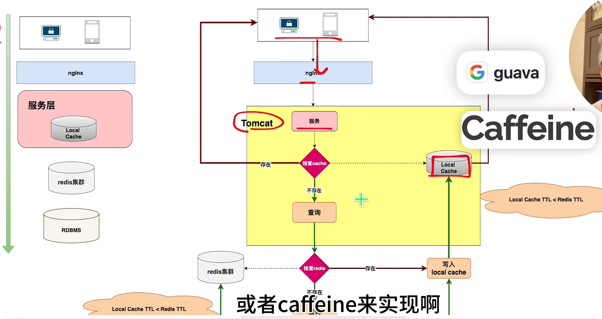

## 20240715
1. 做算法题的时候，经常会出现这样一个问题，前面的思路是正确的，但是总会在中间某一步卡住无法继续下去。
> 把前面的思路用代码或者用纸笔实现出来，看看效果，然后再顺着这个思路继续往下想。在不确定已经有的思路是否正确时，可以举例子或者用数学方法证明之，或者用反例证伪。而当你无法证明它是错的时候，它就很可能是对的，你要做的就是顺着思路把完整的解法写出来，然后用题目的用例去判定即可。切记不要停滞不前！！！

## 20240804
### ReentrantLock通过AQS实现公平锁和非公平锁的方式

**非公平锁：**

```java
// ReentrantLock.java

abstract static class Sync extends AbstractQueuedSynchronizer{

    final boolean nonfairTryAcquire(int acquires){
        final Thread current = Thread.currentThread();
        int c = getState();
        if(c==0){   //可以去竞争锁
            //不管现在有没有其它线程在等待这把锁，直接去竞争锁
            if(compareAndSetState(0,acquires)){
                setExclusiveOwnerThread(current);
                return true;
            }
        }
        else if (current==getExclusiveOwerThread()){
            int nextc = c + acquires;
            if (nextc<0){
                throw new Error("Maxium lock count exceeded");
            }
            setState(nextc);
            return true;
        }

        return false;
    }

}

```

**公平锁：**

```java
// ReentrantLock.java //state=0表示没有被加锁，说明它是一把互斥锁
static final class FairSync extends Sync{

protected final boolean tryAcquire(int acquires){
    final Thread current = Thread.currentThread();//获取当前线程
    // 获取共享变量的值
    int c = getState();
    if(c==0){// 没有被加锁
        // 有两种情况：1.CLH队列为空，2.CLH队列的第一个排队线程是当前线程，则尝试获取锁
        if(!hasQueuedPredecessors()&&compareAndStetState(0,acquires)){
            setExclusiveOwerThread(current);  //设置为当前线程独占
            return true;
        }
    }
    else if(current==getExclusiveOwnerThread()){ //已经被加锁，但是加锁的线程是当前线程
        int nextc = c+acquires;
        if(nextc<0){    //重入次数溢出
            throw new Error("Maximum lock count exceeded");
        }
        setState(nextc);
        return true;
    }
    //已经被其它线程加锁，或者有其它线程在等待锁，则加锁失败
    return false;

}

}

```

**总结：**  
公平锁：当可以竞争锁时，当前线程会判断是不是自己先等待锁的，若不是则进入等待队列。  
非公平锁：当可以竞争锁时，不管前面是否有线程在等待锁，当前线程都会去尝试获取一次锁。

### 两个忆级url文件，要找出它们相同的url并统计重复次数

### MySQL的主从复制怎么做？

### MySQL的索引

### 使用B+树索引的好处

### MySQL性能查看以及如何优化

### Redis是怎么做缓存的

### Redis的持久化操作，如何利用Redis处理热点数据，Redis是单线程还是多线程？Redis的分布式集群怎么做?分布式消息队列有哪些(Kafka等)?有使用过哪些?具体应用在什么场景?负载均衡怎么做的呢，为什么这么做，了解过集群雪崩么。谈谈高并发场景下削峰，限流的实现?

### TCP三次握手的过程，如果没有第三次握手有什么问题

### 分布式锁怎么实现？

### CAP了解吗，分别指什么？

### 网络编程NIO和netty的线程模型，零拷贝实现。

### CDG 腾讯金融科技 二面
用过Spring框架吗？说说一个HTTP请求从打到服务器到被解析处理到最后返回的全过程链路，越详细越好

哪个组件负责HTTP请求的解析？

HTTP协议有什么特点？说得越多越好

HTTP1.0 HTTP1.1 HTTP2.0 之间的改进和差别，说得越多越好

了解半链接吗？什么是半链接攻击？怎么解决？

Java的Spring用到了哪些设计模式？越多越好

代理模式是怎么用到的？如果要你自己用代码实现动态代理，应该怎么做？如何做到原生接口来实现？

Java数据结构用过哪些？HashMap的扩容机制？为什么链表转红黑树的临界个数是8？为什么红黑树退化成链表的临界个数是6？

红黑树是一种什么样的结构？有什么特点？向红黑树中插入一个数，内部的平衡机制是怎么样的？

如何搭建MySQL的主从集群？讲一讲异步复制、半同步复制？

MySQL分库分表怎么实现？已经分表的系统如何进行扩容？

讲讲最有收获的实习项目？

Redis有哪些数据结构？用过哪些？底层的实现原理都是什么？说得越多越好

如何实现Redis的高可用？

平时如何提升自己的能力？如何学习新的知识？

## 20240829

### 分布式缓存系统如何实现数据分片

1. 使用一致性Hash算法
   使用
2. 一致性哈希算法导致负载不均衡问题

### Redis集群如何分配槽位

### 分布式缓存的过期策略
1. 定时过期策略：key只要一过期，就对该key进行清理
2. 惰性过期策略：请求到某个key时，判断该key是否过期，过期的话就清理，不过期就正常返回
3. 定期删除策略：每隔一段时间扫描一定数量的key，对过期的key进行清理
4. Redis的删除策略：将设置了过期时间的key放到一个字典里去，定期（100ms）从字典中随机抽取20个key，删除其中过期的key,
   如果其中过期的key超过了1/4，则会重复上述操作

### 分布式缓存的失效(淘汰)策略

### 如何保证分布式缓存数据的一致性
缓存使用策略（模式）
1. 旁路缓存策略(Cache-Aside Pattern)（最佳实践）
   读取：业务系统先读取缓存，命中返回，未命中则从数据库读取后写入缓存，再返回
   更新：更新数据库，成功后删除或更新缓存（一般是删除）
2. 直读策略(Read-Through)
   读取：业务系统从缓存系统读取缓存，缓存系统命中则返回，未命中则缓存系统去加载缓存
   写入：业务系统将数据写入到缓存系统，缓存系统负责将数据写入数据库与更新缓存，或者删除缓存

保证旁路缓存模式中缓存与数据库的一致性
方案1: 先更新缓存，再更新数据库
数据库的更新可能失败，会导致不一致
方案2: 先更新数据库，再更新缓存
缓存的更新可能会失效，导致不一致

方案3: 先删除缓存，再更新数据库

方案4: 先更新数据库，再删除缓存（常用这种）

解决方法：
1. 延迟双删
   第一次在更新数据库之前删除缓存，在更新了数据库之后，延迟一秒后删除缓存

### 如何保证多级缓存的一致性
<center>
    
</center>

多级缓存的要求：
1. 简单易用，能够让业务方快速接入
2. 能够最大限度的降低代码的侵入性
3. 能够配置需要本地缓存的key的名单
4. 多个业务服务需要感知到某个key的更新
5. 实时计算某个key的访问次数，从而发现热点key

具体实现：
1. 接入配置中心，实现开启与关闭本地缓存，以及哪些key需要缓存
2. 读请求时，拦截redis的读操作，实现先在本地缓存查找，然后再去redis查询
3. 写请求时，拦截redis的写操作，实现通知其它服务去更新该key
4. 如果某个key在预设的时间段内达到了热点key的条件，同样去通知其它业务服务去加载该key，做到提前缓存


多个分布式部署的服务的本地缓存如何感知到某个缓存被更新了？

### 为什么Mysql使用B+树？跳表不行吗？不也可以一次加载大量磁盘数据进来吗？

### HTTP协议中交换了哪些信息？

### HTTP中响应码502和504分别表示什么？

### CAS的底层原理

### 一条SQL的执行流程

### 挂起和阻塞的区别
挂起是被移出了内存，而阻塞是等待资源
### 超卖问题怎么解决

### 解决nvm ls-remote 列表只出现iojs版本
https://www.cnblogs.com/niuben/p/18368872
