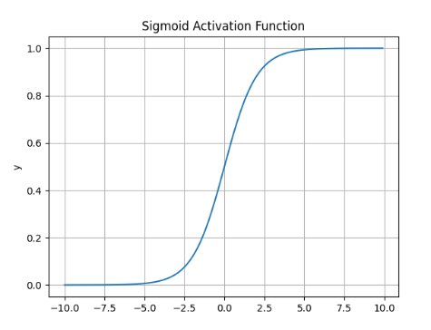
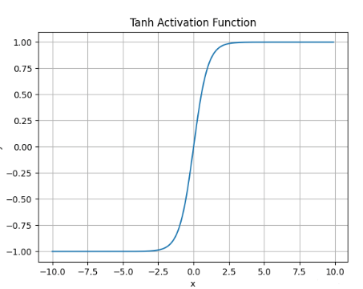
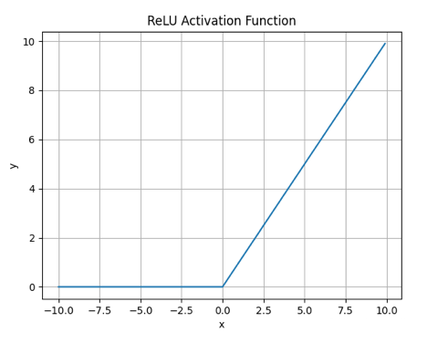
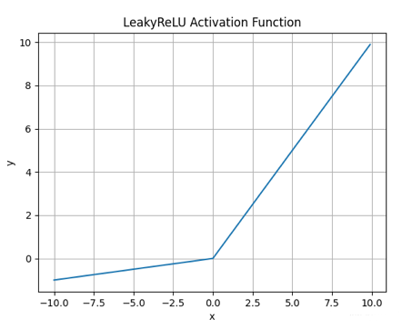
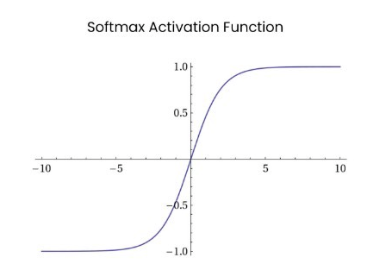
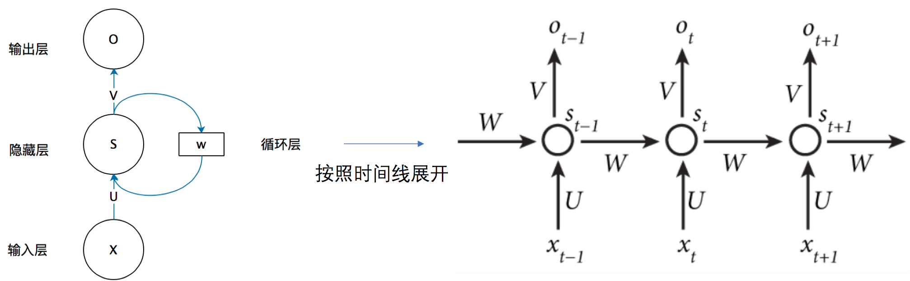
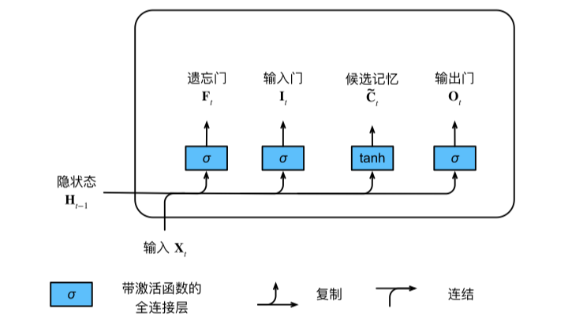
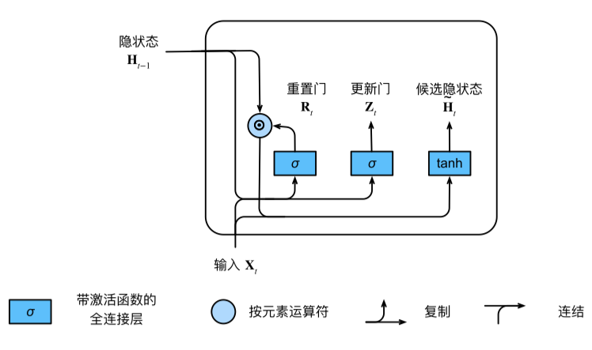

## 数学基础

### 向量的范数

任意一组向量设为$\vec{x}=(x_1,x_2,...,x_N)$ 如下：

- 向量的 1 范数： 向量的各个元素的绝对值之和

$$
\Vert\vec{x}\Vert_1=\sum_{i=1}^N\vert{x_i}\vert
$$

- 向量的 2 范数： 向量的每个元素的平方和再开平方根

$$
\Vert\vec{x}\Vert_2=\sqrt{\sum_{i=1}^N{\vert{x_i}\vert}^2}
$$

- 向量的负无穷范数： 向量所有元素的绝对值中最小的

  $$
  \Vert\vec{x}\Vert_{-\infty}=\min{|{x_i}|}
  $$

- 向量的正无穷范数： 向量所有元素的绝对值中最大的

$$
\Vert\vec{x}\Vert_{+\infty}=\max{|{x_i}|}
$$

- 向量的 p 范数： 向量元素绝对值的 p 次方和，然后再开 P 次方根
  $$
  L_p=\Vert\vec{x}\Vert_p=\sqrt[p]{\sum_{i=1}^{N}|{x_i}|^p}
  $$

### 矩阵的范数

对于矩阵 $A_{m \times n}$， 举例而说：

```
A = [
-1, 2, 3;
4, -6, 6;
]
```

- 矩阵的 1 范数（列范数）：矩阵的每一列上的元素绝对值先求和，再从中取个最大值

  $$
  \Vert A\Vert_1=\max_{1\le j\le n}\sum_{i=1}^m|{a_{ij}}| \\
  \text{举例}: \Vert A\Vert_1 = max([5,8,9]) = 9
  $$

- 矩阵的 2 范数： 矩阵 $A^TA$ 的最大特征值开平方根
  $$
  \Vert A\Vert_2=\sqrt{\lambda_{max}(A^T A)}
  $$

### 矩阵的特征值分解和特征向量及其含义

- 特征值分解可以得到特征值与特征向量
- 特征值表示的是这个特征到底有多重要，而特征向量表示这个特征是什么

### Hessian 矩阵正定性在梯度下降中的应用

在判断优化算法的可行性时 Hessian 矩阵的正定性起到了很大的作用,若 Hessian 正定,则函数的二阶偏导恒大于 0,函数的变化率处于递增状态,在牛顿法等梯度下降的方法中,Hessian 矩阵的正定性可以很容易的判断函数是否可收敛到局部或全局最优解。

### 事件的信息量与概率的关系

事件$x$的自信息为：

$$
I(x)=-\log_2(p(x))
$$
其中$p(x)$表示事件$x$发生的概率。单位是比特(bit)或香农(Shannon)。
>- 概率P是对确定性的度量，信息是对不确定性的度量。
>- 事件发生的概率越大，它的信息量就越小。

### 信息熵(information entropy)
信息熵是对平均不确定性的度量，本质上是所有事件的信息量的期望。
熵可以表示样本集合的不确定性，熵越大，样本的不确定性就越大。
- 信息熵的定义：

$$
H(x)=E_{X}\left[I(x)\right]=-\sum\limits_{x \in X} p(x)\log_2(p(x))
$$
其中$X$表示所有可能的事件，$p(x)$表示事件$x$发生的概率。
>- 信息论中，记$0\log(0)=0$。
>- 当且仅当某个$P(x)=1$时，$H(x)=0$。
>- 当且仅当$P(x_i)=\frac{1}{n},i=1,2,...,n$时，有极大值$H(x)=\log(n)$。

### 互信息
$$
I(X,Y)=\sum_{x\in X}\sum_{y\in Y}p(x,y)\log\frac{p(x,y)}{p(x)p(y)}
$$
互信息$I(X,Y)$取值为非负。当$X、Y$相互独立时，互信息$I(X,Y)=0$。

### 相对熵(KL 散度)
对于同一个随机变量$X$有两个独立的概率分布$P(X),Q(X)$，我们可以使用KL散度来衡量这两个分布的差异
- **定义：** $P$对$Q$的相对熵(KL 散度)定义为：
$$
D_{P}(Q)=\sum_{x \in X}p(x)\log\frac{p(x)}{q(x)}
$$
其中$p(x)$表示分布$P$的概率，$q(x)$表示分布$Q$的概率。
- **含义**：在离散型变量的情况下， KL 散度衡量的是：当我们使用一种被设计成能够使得概率分布 $Q$ 产生的消息的长度最小的编码，发送包含由概率分布 $P$ 产生的符号的消息时，所需要的额外信息量。
- **性质**：
>- 非负性：$D_{P}(Q)\geq 0$，$D_{P}(Q)=0$ 当且仅当 $P=Q$。
>- 不对称性：$D_{P}(Q) \neq D_{Q}(P)$

### 交叉熵
**定义**：设$P$为真实分布，$Q$为估计分布，$P$对$Q$的交叉熵定义为：

$$
H(P,Q)=-\sum_{x \in X}p(x)\log q(x)
$$
在一定程度上，交叉熵可以度量两个随机变量分布的“距离”。
## Pytorch

### 为什么 Tensor 转成 numpy 时，需要 detach?

## 机器学习

### 有如下两组数据 ${(-1,0),(-1,2),(1,2)} 和 {(0,0),(1,0),(1,1)}$ ，我们在该数据集上训练一个线性 SVM 模型，该模型中的支持向量是哪些？

- 支持向量：决定决策边界的数据叫做支持向量

### 类域界面方程法中，不能求线性不可分情况下分类问题近似或精确解的方法是？

- A 伪逆法
- B 感知机算法
- C 基于二次准则的 H-K 算法
- D 势函数法

### 定序变量

定序变量是一种分类变量，其取值之间存在一定的顺序关系，但没有明确的间隔或比率关系。如：教育程度可以分为初中、高中、大专、本科、研究生、博士等，这些取值之间有顺序，但不具备数值关系。

### 皮尔逊相关系数

**定义**：两个变量之间的皮尔逊相关系数定义为两个变量之间的协方差和标准差乘积的商：

$$
    r=\frac{\sum_{i=1}^n(x_i-\bar{x})(y_i-\bar{y})}{\sqrt{\sum_{i=1}^n(x_i-\bar{x})^2\sum_{i=1}^n(y_i-\bar{y})^2}}=\frac{cov(x,y)}{\sigma_x\sigma_y}
$$

**使用场景**：

- 连续数据（如身高、体重、血糖等）的相关性分析。
- 正态分布
- 线性关系

### Spearman 相关系数

**定义**：斯皮尔曼相关系数被定义成等级变量之间的皮尔逊相关系数。对于样本容量为 n 的样本，n 个原始数据被转换成等级数据，相关系数 ρ 为

$$
r=\frac{\sum_{i=1}^n(x_i-\bar{x})(y_i-\bar{y})}{\sqrt{\sum_{i=1}^n(x_i-\bar{x})^2\sum_{i=1}^n(y_i-\bar{y})^2}}=\frac{cov(x,y)}{\sigma_x\sigma_y}
$$

**使用场景**：

## 深度学习

### Pytorch中构建模型的步骤
1. 输入处理模块（把数据转换成模型能处理的Tensor类型）
2. 构建网络结构模块（定义模型的结构，比如卷积层、池化层、全连接层等）
3. 损失函数模块（定义模型的损失函数，比如交叉熵、MSE等）
4. 优化器模块（定义模型的优化器，比如SGD、Adam等）
5. 训练模块（训练模型，输入训练数据、标签、迭代次数、学习率等参数）
6. 验证模块（验证模型的效果，比如准确率、损失值等）
7. 预测模块（使用训练好的模型对新数据进行预测）


### H-K 算法较之于感知机算法的优点是什么？

**H-K 算法：** 它的思想是在最小均方误差准则下求得权矢量，H-K 算法可以处理线性可分和不可分问题。对于线性可分的情况，给出最优权矢量；对于非线性可分的情况，可以判别出来并退出迭代过程。

- H-K 算法可以处理线性不可分问题，而感知机算法只能处理线性可分问题。

### 卷积核作用之后，输出维度的计算

### CNN 常见的 Loss 函数有哪些？

- 交叉熵损失函数（Cross-Entropy Loss）
- 平方误差损失函数（Squared Error Loss）
- 绝对值误差损失函数（Absolute Error Loss）
- 对数似然损失函数（Log Likelihood Loss）
- Focal Loss
### Contrastive Loss 是什么

在孪生神经网络（siamese network）中，其采用的损失函数是 contrastive loss，这种损失函数可以有效的处理孪生神经网络中的 paired data 的关系（形式上并不一定是两个 Net，也可以是一个 Net 两个 Out，可以认为上面示意图的 Network1 和 2 是同一个，或者不是同一个）。contrastive loss 的表达式如下：

$$
    L = \frac{1}{2N}\sum_{n=1}^N[yd^2+(1-y)max(0,margin-d)^2]
$$

其中，$d$是两个样本特征的欧式距离，$y$为两个样本是否匹配的标签，$y=1$代表两个样本相似或者匹配，$y=0$代表两个样本不相似或者不匹配。$margin$是超参数，用来控制两个样本之间的匹配程度(阈值)。

### Dropout 对测试过程和训练过程的影响

- Dropout 不会影响测试过程，只会影响训练过程。

### 激活函数需要满足什么性质？
- **非线性：** 为模型引入非线性因素
- **几乎处处可微：** 便于反向传播，利于优化
- **计算简单：** 激活函数的计算次数与神经元的个数成正比，因此简单的非线性函数更适合做激活函数（这也是ReLU等比其它使用指数函数的激活函数更受欢迎的原因之一）
- **非饱和性：** 饱和指的是在某些区间梯度接近于零（即梯度消失），使得参数无法继续更新的问题
- **单调性：** 当激活函数是单调的时候，单层网络能保证是凸函数
- **$ f(x) \approx x $：** 当激活函数满足这个性质时，如果参数的初始化是随机的较小值，那么神经网络的训练将会很高效；
  >- 由于这个条件与非线性有点矛盾，因此激活函数基本只有部分满足这个条件，如ReLU只有在$x \gt 0$时满足
- **输出值的范围有限：** 当激活函数输出值是有限的时候，基于梯度的优化方法会更加稳定，因为特征的表示受有限权值的影响更显著；但这导致了前面提到的梯度消失问题，而且强行让每一层的输出限制到固定范围会限制其表达能力
  >- 当激活函数的输出是无限的时候，模型的训练会更加高效，不过在这种情况下，一般需要更小的learning rate
- **参数少：** 大部分激活函数都是没有参数的
- **归一化：** 主要思想是使样本分布自动归一化到零均值、单位方差的分布，从而稳定训练

### 常见的激活函数有哪些？
有两类激活函数
- **饱和激活函数：** Sigmoid、tanh
- **非饱和激活函数：** ReLU、Leaky ReLU、ELU、PReLU、RReLU
[深度学习中常见的10种激活函数（Activation Function）总结](https://blog.csdn.net/qq_42691298/article/details/126590726)

### Sigmoid激活函数的表达式及其图像
Sigmoid激活函数的数学表达式为：
$$
f(x) = \frac{1}{1+e^{-x}}
$$
导数为：
$$
f^{'}(x)=f(x)(1-f(x))
$$
函数图像为：
 <center>
      
      <p>Sigmoid函数图像</p>
  </center>

**什么情况下适合使用Sigmoid？**
>Sigmoid函数的值域是$[0,1]$。非常适合需要输出单个输出值在$[0,1]$内的函数，如二分类模型。

**Sigmoid的缺点**
>- 容易造成梯度消失，因为导数都小于0.25
>- Sigmoid函数执行的是指数运算，计算速度较慢

### Tanh激活函数的表达式及其图像
Tanh激活函数的数学表达式为：
$$
\begin{align*}
f(x) &= \frac{e^{x}-e^{-x}}{e^{x}+e^{-x}} \\
    &= \frac{e^{2x}-1}{e^{2x}+1} \\
    &= 1-\frac{2}{e^{2x}+1}
    &= 2sigmoid(2x)-1
\end{align*}
$$

其函数图像为：
<center>
      
      <p>Tanh函数图像</p>
 </center>

**什么情况下适合使用Tanh？**
>- tanh 的输出间隔为 1，并且整个函数以 0 为中心，比 sigmoid 函数更好；
>- 在 tanh 图中，负输入将被强映射为负，而零输入被映射为接近零。

**Tanh有哪些缺点？**
>- 仍然存在梯度饱和问题
>- 依然进行的是指数运算

### ReLU函数
ReLU激活函数的数学表达式为：
$$
f(x) = max(0,x)
$$
其函数图像为：
<center>
      
      <p>ReLU函数图像</p>
</center>

**什么情况下适合使用ReLU（优点）？**
>- ReLU解决了梯度消失的问题，当输入值为正时，神经元不会饱和
>- 由于ReLU线性、非饱和的性质，在SGD中能够快速收敛
>- 计算复杂度低，不需要进行指数运算

**ReLU有哪些缺点？**
>- 与Sigmoid一样，其输出不是以0为中心的
>- Dead ReLU 问题。当输入为负时，梯度为0。这个神经元及之后的神经元梯度永远为0，不再对任何数据有所响应，导致相应参数永远不会被更新

### Leaky ReLU函数
Leaky Relu激活函数的数学表达式为：
$$
f(x) = max(\alpha x,x),\alpha \in (0,1)
$$

函数图像为：
<center>
      
      <p>Leaky ReLU函数图像</p>
</center>

**什么情况下适合使用Leaky ReLU（优点）？**
>- 解决了ReLU输入值为负时神经元出现的死亡的问题
>- Leaky ReLU线性、非饱和的性质，在SGD中能够快速收敛
>- 计算复杂度低，不需要进行指数运算

**Leaky ReLU有哪些缺点？**

>- 函数中的α，需要通过先验知识人工赋值（一般设为0.01）
>- 有些近似线性，导致在复杂分类中效果不好。

**注意：** 从理论上讲，Leaky ReLU 具有 ReLU 的所有优点，而且 Dead ReLU 不会有任何问题，但在实际操作中，尚未完全证明 Leaky ReLU 总是比 ReLU 更好

### Softmax函数的表达式及其图像
Softmax激活函数的数学表达式为：
$$
Softmax(x_i) = \frac{e^{x_i}}{\sum_i e^{x_i}}
$$
函数图像如下:
<center>
      
      <p>Softmax函数图像</p>
</center>

**Softmax函数的优点**
>- 值域是$[0,1]$，用于多分类任务中

### 有哪些常用的优化器
1. SGD算法
2. 动量法
3. Adagrad算法
4. Adadelta算法
5. RMSprop算法
6. Adam算法
7. Adammax算法
8. SparseAdam算法
9. L-BFGS算法
10. Rprop算法
[深度学习中各类优化器的选择总结](https://blog.51cto.com/u_14508933/5565870#)

### SGD优化器
1. 公式：
$$
w_{t+1} = w_{t}-\eta_t = w_t - \alpha g_t
$$
其中$\alpha$是学习率，$g_t$是当前参数的梯度
2. 优点：每次只用一个样本更新模型参数，训练速度快。
3. 缺点：容易陷入局部最优；沿陡峭方向振荡，而沿平缓维度进展缓慢，难以迅速收敛
### 动量法SGD

a. ✒️**公式**

$$
\begin{align*}
m_t &= \beta_1 m_{t-1}+(1-\beta_1)g_t \\
w_{t+1} &= w_t - \alpha m_t
\end{align*}
$$

其中$m_t$为动量。

b. ✒️**优点**：可借助动量跳出局部最优点。

c. ✒️**缺点**：容易在局部最优点里来回振荡。

### AdaGrad：
经常更新的参数已经收敛得比较好了，应该减少对它的关注，即降低其学习率；对于不常更新的参数，模型学习的信息过少，应该增加对它的关注，即增大其学习率。

a. ✒️**公式**
$$
w_{t+1}=w_t-\alpha \cdot g_t / \sqrt{V_t}=w_t-\alpha \cdot g_t / \sqrt{\sum_{\tau=1}^t g_\tau^2}
$$
其中$V_t$是二阶动量，为累计梯度值的平方和，与参数更新频繁程度成正比。

b. ✒️**优点**：稀疏数据场景下表现好；自适应调节学习率。

c. ✒️**缺点**：$V_t$单调递增，使得学习率单调递减为0，从而使得训练过程过早结束。

### RMSProp
AdaGrad的改进版，不累计所有历史梯度，而是过去一段时间窗口内的历史梯度。

a. ✒️**公式**
$$
\begin{align*} w_{t+1} & =w_t-\alpha \cdot g_t / \sqrt{V_t} \\ & =w_t-\alpha \cdot g_t / \sqrt{\beta_2 \cdot V_{t-1}+\left(1-\beta_2\right) g_t^2}\end{align*}
$$
即把$V_t$换成指数移动平均。

b. ✒️**优点**：避免了二阶动量持续累积、导致训练过程提前结束的问题了。

### Adam
=Adaptive + momentum，即结合了momentum一阶动量+RMSProp二阶动量。

a. ✒️**公式**
$$
\begin{align*} w_{t+1} & =w_t-\alpha \cdot m_t / \sqrt{V_t} \\ & =w_t-\alpha \cdot\left(\beta_1 \cdot m_{t-1}+\left(1-\beta_1\right) \cdot g_t\right) / \sqrt{\beta_2 \cdot V_{t-1}+\left(1-\beta_2\right) g_t^2}\end{align*}
$$

b. ✒️**优点**：通过一阶动量和二阶动量，有效控制学习率步长和梯度方向，防止梯度的振荡和在鞍点的静止。

c. ✒️**缺点**：二阶动量是固定历史时间窗口的累积，窗口的变化可能导致Vt振荡，而不是单调变化，从而导致训练后期学习率的振荡，模型不收敛，可通过
$$
V_t = max(\beta_2 * V_{t-1}+(1-\beta_2)g_t^2,V_{t-1})
$$
来修正，保证学习率单调递减；自适应学习率算法可能会对前期出现的特征过拟合，后期才出现的特征很难纠正前期的拟合效果，从而错过全局最优解。

### 常用的评价指标有哪些
[评价指标 - MAE、MSE、RMSE、MRE](https://zhuanlan.zhihu.com/p/652167878)
1. MAE
2. MSE
3. RMSE
4. MRE
尽管RMSE更复杂且偏向更高的误差，它仍然是许多模型的默认度量标准，因为用RMSE来定义损失函数是平滑可微的，且更容易进行数学运算。

### 什么是正则化(Regularization)
正则化（Regularization）是机器学习中一种常用的技术，其主要目的是控制模型复杂度，减小过拟合。最基本的正则化方法是在原目标（代价）函数中添加惩罚项，对复杂度高的模型进行“惩罚”。其数学表达形式为：
$$
\overline{J}(w;X,y) = J(w;X,y)+\alpha \Omega(w)
$$
式中$X$、$y$为训练样本和相应标签，$w$为权重系数向量；$J()$为目标函数，$\Omega(w)$即为惩罚项，可理解为模型“规模”的某种度量；参数$\alpha$控制控制正则化强弱。不同的$\Omega$函数对权重$w$的最优解有不同的偏好，因而会产生不同的正则化效果。最常用的$\Omega$函数有两种，即$L_1$范数和$L_2$范数，相应称之为L1正则化和L2正则化。即
$$
L_1: \Omega(w) = \Vert w \Vert_1 = \sum_i|w_i| \\
L_2: \Omega(w) = \Vert w \Vert_2^2 = \sum_i w_i^2
$$
### L1、L2正则化的区别
L1正则化容易得到稀疏解，即稀疏权值矩阵，L2正则化容易得到平滑解（权值很小）


### 深度学习项目构建流程
1. **定义问题：** 确定是分类问题还是回归问题或者是无监督问题
2. **探索和清洗数据：** 这一个是深度学习中最重要的一步
   >- 将枚举值转换为独热编码
   >- 处理缺失值和处理异常值，一般采用均值填充
   >- 数据归一化
   >- 划分训练集、验证集和测试集
3. **选择模型并探索模型结果：** 探索模型的结果，通常是需要对模型在验证集上的性能进行进一步的分析，这是如何进一步提升模型性能很重要的步骤。将模型在训练集和验证集都进行结果的验证和可视化，可直观的分析出模型是否存在较大偏差以及结果的正确性。
4. **监控训练和验证误差：** 

### 模型提升策略
1. **数据角度：** 进行数据增强，以扩充数据集
2. **模型角度：** 提高模型复杂度，更改模型结构
3. **调参角度：**
4. **训练角度：** 

### 梯度消失的原因和解决办法
1. 隐藏层的层数过多
    >反向传播求梯度时的链式求导法则，某部分梯度小于1，则多层连乘后出现梯度消失
2. 采用了不合适的激活函数
    >如sigmoid函数的最大梯度为1/4，这意味着隐藏层每一层的梯度均小于1（权值小于1时），出现梯度消失。

解决方法：
  >1、relu激活函数，使导数衡为1 
  >2、batch norm 
  >3、残差结构

### 梯度爆炸的原因和解决办法
1. 隐藏层的层数过多，某部分梯度大于1，则多层连乘后，梯度呈指数增长，产生梯度爆炸。
2. 权重初始值太大，求导时会乘上权重

解决方法：1、梯度裁剪 2、权重L1/L2正则化 3、batch norm

### 如何检验深度学习过程中出现的梯度消失和梯度爆炸问题？

## 计算机视觉

### IoU的作用与实现
```python
def box_iou(boxes1:torch.Tensor, boxes2:torch.Tensor)->torch.Tensor:
    """Compute pairwise IoU across two lists of anchor or bounding boxes.

    Defined in :numref:`sec_anchor`"""
    box_area = lambda boxes: ((boxes[:, 2] - boxes[:, 0]) *
                              (boxes[:, 3] - boxes[:, 1]))
    # Shape of `boxes1`, `boxes2`, `areas1`, `areas2`: (no. of boxes1, 4),
    # (no. of boxes2, 4), (no. of boxes1,), (no. of boxes2,)
    areas1 = box_area(boxes1)
    areas2 = box_area(boxes2)
    # Shape of `inter_upperlefts`, `inter_lowerrights`, `inters`: (no. of
    # boxes1, no. of boxes2, 2)
    inter_upperlefts = torch.max(boxes1[:, None, :2], boxes2[:, :2])
    inter_lowerrights = torch.min(boxes1[:, None, 2:], boxes2[:, 2:])
    inters = (inter_lowerrights - inter_upperlefts).clamp(min=0)
    # Shape of `inter_areas` and `union_areas`: (no. of boxes1, no. of boxes2)
    inter_areas = inters[:, :, 0] * inters[:, :, 1]
    union_areas = areas1[:, None] + areas2 - inter_areas
    return inter_areas / union_areas
```


### GIoU
$$
  GIoU=IoU-\frac{|A_c-U|}{|A_c|}
$$
### IoU的变种
1. GIoU
2. DIoU
3. CIoU

### Soft-NMS

### 非极大值抑制（non-maximum suppression,NMS）
作用：当有许多锚框时，可能会输出许多相似的具有明显重叠的预测边界框，它们都围绕着同一目标。为了简化输出，我们可以使用非极大值抑制（NMS）合并属于同一目标的相似的预测边界框
原理：
实现：基于Pytorch实现
```python
def nms(boxes:torch.Tensor,scores:torch.Tensor,iou_threshold:float) -> torch.Tensor:
    '''非极大值抑制'''
    # 依据置信度进行排序，并返回索引
    B = torch.argsort(scores,dim=-1,descending=True)
    keep = []
    while B.numel()>0:
        # 取出置信度最大的边界框所在的索引
        i = B[0]
        keep.append(i)
        if B.numel()==1:break
        # 计算和其它边界框的iou
        iou = box_iou(boxes[i,:].reshape(-1,4),boxes[B[1:],:].reshape(-1,4)).reshape(-1)
        # 返回iou小于阈值的边界框的索引
        inds=torch.nonzero(iou<=iou_threshold).reshape(-1)
        # 因为iou的索引少一个B[0]，所以需要向右偏移
        B = B[inds+1]
    return torch.tensor(keep,device=boxes.device)
```
### 常用的图像增广的方法
- 翻转和裁剪
- 改变颜色：包括亮度对比度、饱和度和色调
- 旋转图像

### 目标检测有哪几类损失函数？
1. 锚框类别的损失（多分类问题）：使用交叉熵损失函数
2. 正类锚框偏移量的损失(回归问题)：使用$L_1$范数损失，即预测值和真实值之差的绝对值之和
  
最后将两个损失相加得到最终损失函数


### 目标检测回归损失函数（公式、优缺点）——L1、L2、smooth L1
1. L1 Loss（MAE）
**公式为:**
$$
MAE = \frac{\sum_{i=1}^n|f(x_i)-y_i|}{n}
$$
优点：L1损失函数的导数是常量，有着稳定的梯度，所以不会有梯度爆炸的问题。对于离群点造成的惩罚是固定的，不会被放大。
缺点：MAE函数虽然连续，但是在0处不可导。而且MAE的导数为常数，所以在较小的损失值时，得到的梯度也相对较大，可能造成模型震荡不利于收敛。
2. L2 Loss（MSE）
$$
MSE =\frac{\sum_{i=1}^n(f(x_i)-y_i)^2}{n} 
$$
优点：函数曲线连续，处处可导，随着误差值的减小，梯度也减小，有利于收敛到最小值。
缺点：由于采用平方运算，当预测值和真实值的差值大于1时，会放大误差。尤其当函数的输入值距离中心值较远的时候，使用梯度下降法求解的时候梯度很大，可能造成梯度爆炸。同时当有多个离群点时，这些点可能占据Loss的主要部分，需要牺牲很多有效的样本去补偿它，所以MSE损失函数受离群点的影响较大。
3. Smooth L1 Loss
简单的说Smooth L1就是一个平滑版的L1 Loss，其公式如下：
$$
Smooth L_1 = 
\left\{
\begin{align*}
|x|-0.5,|x|&>1 \\
0.5x^2,|x|&<1
\end{align*}
\right.
$$
优点：该函数实际上是一个分段函数，在[-1,1]之间就是L2损失，解决L1在0处有折点，在[-1， 1]区间以外就是L1损失，解决离群点梯度爆炸问题，所以能从以下两个方面限制梯度：
    - 当预测值与真实值误差过大时，梯度值不至于过大；
    - 当预测值与真实值误差很小时，梯度值足够小。

缺点：在早期的目标检测网络Fast R-CNN中被提出，用于计算Bounding Box的4个坐标值和GT框之间的误差，然后将这4个loss进行相加构成回归损失，但是这种做法假设Bounding Box的4个点是相互独立的，实际上其有一定相关性。并且检测框的评价指标使用的是IOU，和该损失无法等价。


### 说一说什么是空洞卷积
空洞卷积中文名也叫膨胀卷积或者扩张卷积,英文名也叫Atrous Convolution。
**原理：** 在标准的卷积里注入了空洞，与正常的卷积相比，空洞卷积多了一个成为**扩张率**的超参数$dr$。具体操作为，在原图像中，每隔$dr$取一个元素和卷积核进行卷积
**空洞卷积的感受野：** 设卷积核大小为$k \times k$，扩张率为$dr$，则该空洞卷积的感受野为$k+(k-1)(dr-1)$
代码实现如下：
```python
def dilation_conv(X,K,d):
    h,w = k.shape
    Y = torch.zeros((X.shape[0],X.shape[1]))
    for i in range(X.shape[0]):
      for j in range(X.shape[1]):
        Y[i,j] = X[i:i+(d-1)*(h-1)+h:d,j:j+(d-1)*(w-1)+w:d]*K
    return Y
```

### 空洞卷积的作用
空洞卷积是为了解决图像分割问题而提出的，常见的图像分割算法通常使用池化层和卷积层来增加感受野，这就缩小了特征图的尺寸，然后再利用上采用还原图像尺寸，特征图缩小再放大的过程造成了精度上的损失，因此需要一种操作可以在**增加感受野**的同时保持特征图的尺寸不变，从而代替下采样和上采样操作，于是就诞生了空洞卷积
**注意：** 普通卷积本身就可以保持特征图的尺寸，而空洞卷积只是增大了感受野！

### 空洞卷积存在什么问题？
1. 网格效应（The Gridding Effect）
   因为有空洞，所以会损失掉像素之间的连续性信息，对像素级的预测任务不友好
2. 长距离的信息可能是不相关的
   用大的空洞卷积有利于大尺寸物体检测，而不利于小物体检测

### 说一说什么是转置卷积
转置卷积可以用来逆转下采样导致的空间维度减小，从而恢复到原图大小。
其代码如下：
```python
def trans_conv(X,K):
    h,w = K.shape
    Y = torch.zeros((X.shape[0]+h-1,X.shape[1]+w-1))
    for i in range(X.shape[0]):
      for j in range(X.shape[1]):
        Y[i:i+h,j:j+w]+=X[i,j]*K
    return Y
```

### 如何改变图像的通道数
将$C_{in}$个通道转换为$C_{out}$个通道，所需的$1 \times 1$卷积核的形状为$(C_{out},C_{in},1,1)$

### 检测模型里为啥用smoothL1去回归bbox
首先，对于L2 loss，其导数包含了(f(x)-Y)，所以当预测值与gt差异过大时，容易梯度爆炸；
而对于L1 loss，即使训练后期预测值和gt差异较小，梯度依然为常数，损失函数将在稳定值附近波动，难以收敛到更高精度。
所以SmoothL1 loss结合了两者的优势，当预测值和gt差异较大时使用L1 loss；差异较小时使用L2 loss：

### 什么是特征金字塔（FPN）？

### 有哪几种上采样方法？
1. 双线性插值
2. 最邻近差值

### 常见的图像分类算法
1. AlexNet
2. GoogLeNet
3. VGG
4. SENet
5. ViT
### 常见的图像分割算法
1. U-NET
2. FCN
3. PSPNet
4. Mask R-CNN


## 自然语言处理

### RNN 中为什么要采用 tanh，而不是 ReLU 作为激活函数？

- 首先，是可以使用 ReLU 作为激活函数的，并且在序列较短、网络较浅时 ReLU 表现优于 tanh，但是当序列变长、网络加深后，效果就比 tanh 差；
- 因为 ReLU 的输出可能大于 1，当序列过长时，会累计相乘多个大于 1 的数，最后输出可能会造成梯度爆炸，但是使用 tanh 激活函数，能够将输出值限制在-1 和 1 之间。

### RNN 和 CNN 对比，RNN 对文本的时间序列的优点。

文本序列强调的是先后顺序，即上下文关系。
RNN 能够捕捉到这种先后顺序信息，并且能够记忆长期的上下文信息。
CNN 则是对局部区域进行特征提取，并不强调先后顺序。

### LSTM 基本原理

LSTM（Long Short-Term Memory）是一种长短期记忆网络，是一种特殊的 RNN（循环神经网络）。与传统的 RNN 相比，LSTM 更加适用于处理和预测时间序列中间隔较长的重要事件。

而 LSTM 通过引入记忆细胞、输入门、输出门和遗忘门的概念，能够有效地解决长序列问题。记忆细胞负责保存重要信息，输入门决定要不要将当前输入信息写入记忆细胞，遗忘门决定要不要遗忘记忆细胞中的信息，输出门决定要不要将记忆细胞的信息作为当前的输出。这些门的控制能够有效地捕捉序列中重要的长时间依赖性，并且能够解决梯度问题。

### LSTM 怎么能解决梯度消失问题？TODO

RNN 梯度消失的原因是，随着梯度的传导，梯度被近距离梯度主导，模型难以学习到远距离的信息
LSTM 只是缓和了梯度消失的问题，并没有完全解决。

### LSTM 用来解决 RNN 的什么问题？

RNN 结构存在长期依赖问题，这会导致梯度消失或梯度爆炸。LSTM 通过引入门结构来解决这个问题。

### LSTM 和 GRU 区别

- GRU 只有两个门（update gate 和 reset gate），而 LSTM 有三个门（input gate、output gate 和 forget gate）。
- GRU 直接讲 hidden state 传给下一个单元，而 LSTM 则用 memory cell 把 hidden state 包装起来。
- GRU 参数更少，速度更快，更容易收敛。

### RNN 公式和结构图

- RNN 公式： 
$$h_t=tanh(W_{hh}h_{t-1}+W_{xh}x_t+b_h)$$
  
<center>
    
    <p>RNN时间线展开图</p>
</center>

### LSTM 公式和结构图

- LSTM 公式
  假设有$h$个隐藏单元，批量大小为$n$，输入数为$d$。因此输入为$X_t \in R^{n \times d}$，输出为$H_{t-1} \in R^{n \times h}$。相应地，时间步$t$的门被定义如下：输入门是$I_t \in R^{n \times h}$，遗忘门是$F_t \in R^{n \times h}$，输出门是$O_t \in R^{n \times h}$,记忆细胞是$C_t \in R^{n \times h}$。。它们的计算方法如下：

$$
\begin{align*}
I_t &=\sigma(X_tW_{xi}+H_{t-1}W_{hi}+b_i), \\
F_t &=\sigma(X_tW_{xf}+H_{t-1}W_{hf}+b_f), \\
O_t &=\sigma(X_tW_{xo}+H_{t-1}W_{ho}+b_o), \\
C_t &=\tanh(X_tW_{xc}+H_{t-1}W_{hc}+b_c)
\end{align*}
$$

  <center>
      
      <p>LSTM结构图</p>
  </center>

### GRU 公式和结构图

- GRU 公式
  假设有$h$个隐藏单元，批量大小为$n$，输入数为$d$。因此输入为$X_t \in R^{n \times d}$，输出为$H_{t-1} \in R^{n \times h}$。相应地，时间步$t$的门被定义如下：更新门是$Z_t \in R^{n \times h}$，重置门是$R_t \in R^{n \times h}$，输出门是$O_t \in R^{n \times h}$。它们的计算方法如下：

$$
Z_t=\sigma(X_tW_{xz}+H_{t-1}W_{hz}+b_z), \\
R_t=\sigma(X_tW_{xr}+H_{t-1}W_{hr}+b_r), \\
O_t=\sigma(X_tW_{xo}+R_t\odot(H_{t-1}W_{ho}+b_o)), \\
$$

其中，$\odot$表示逐元素相乘。$W_{xz},W_{xr},W_{xo}$是权重矩阵，$b_z,b_r,b_o$是偏置项。

<center>
      
      <p>门控循环单元GRU结构图</p>
</center>

### 深度学习如何提取 query 特征？

### 如何比较文本的相似度？

- 余弦相似度
- 协同过滤相似度
- 深度学习词向量相似度
- tf-idf 相似度

### 什么是汉明距离
两个字符串对应位置的不同字符的个数

## Transformer

### Transformer 为何使用多头注意力机制？（为什么不使用一个头）

答：多头可以使参数矩阵形成多个子空间，矩阵整体的 size 不变，只是改变了每个 head 对应的维度大小，这样做使矩阵对多方面信息进行学习，但是计算量和单个 head 差不多。

### Transformer 为什么 Q 和 K 使用不同的权重矩阵生成，为何不能使用同一个值进行自身的点乘？

1. 请求和键值初始为不同的权重是为了解决可能输入句长与输出句长不一致的问题。并且假如 QK 维度一致，如果不用 Q，直接拿 K 和 K 点乘的话，你会发现 attention score 矩阵是一个对称矩阵。因为是同样一个矩阵，都投影到了同样一个空间，所以泛化能力很差。
2. 是为了打破对称性，参考其中“如果令 Q=K，那么得到的模型大概率会得到一个类似单位矩阵的 attention 矩阵，这样 self-attention 就退化成一个 point-wise 线性映射。这样至少是违反了设计的初衷。”

### Transformer 计算 attention 的时候为何选择点乘而不是加法？两者计算复杂度和效果上有什么区别？

为了计算更快。矩阵加法在加法这一块的计算量确实简单，但是作为一个整体计算 attention 的时候相当于一个隐层，整体计算量和点积相似。在效果上来说，从实验分析，两者的效果和 dk 相关，dk 越大，加法的效果越显著

### 为什么在进行 softmax 之前需要对 attention 进行 scaled（为什么除以 dk 的平方根），并使用公式推导进行讲解

答：假设 Q 和 K 的均值为 0，方差为 1。它们的矩阵乘积将有均值为 0，方差为 dk，因此使用 dk 的平方根被用于缩放，因为，Q 和 K 的矩阵乘积的均值本应该为 0，方差本应该为 1，这样可以获得更平缓的 softmax。当维度很大时，点积结果会很大，会导致 softmax 的梯度很小。为了减轻这个影响，对点积进行缩放。

公式推导：

$$
Attention(Q, K, V) = softmax(\frac{QK^T}{\sqrt{d_k}})V
$$

### 在计算 attention score 的时候如何对 padding 做 mask 操作？

对需要 mask 的位置设为负无穷，再对 attention score 进行相加

### 为什么在进行多头注意力的时候需要对每个 head 进行降维？

答：将原有的高维空间转化为多个低维空间并再最后进行拼接，形成同样维度的输出，借此丰富特性信息，降低了计算量

### 大概讲一下 Transformer 的 Encoder 模块？

答：输入嵌入-加上位置编码-多个编码器层（每个编码器层包含全连接层，多头注意力层和点式前馈网络层（包含激活函数层））

### 为何在获取输入词向量之后需要对矩阵乘以 embedding size 的开方？

embedding matrix 的初始化方式是 xavier init，这种方式的方差是 1/embedding size，因此乘以 embedding size 的开方使得 embedding matrix 的方差是 1，在这个 scale 下可能更有利于 embedding matrix 的收敛。

### 简单介绍一下 Transformer 的位置编码？有什么意义？

因为 self-attention 是位置无关的，无论句子的顺序是什么样的，通过 self-attention 计算的 token 的 hidden embedding 都是一样的，这显然不符合人类的思维。因此要有一个办法能够在模型中表达出一个 token 的位置信息，transformer 使用了固定的 positional encoding 来表示 token 在句子中的绝对位置信息.  
意义：位置编码能够让模型学习到 token 的位置信息，从而能够更好地捕捉到句子的全局信息。

### 你还了解哪些关于位置编码的技术，各自的优缺点是什么？

**绝对位置编码:** 直接将位置的表示加到 token 的表示上，而每个位置的表示则为一个可学习的向量;绝对位置编码具有实施简单、计算速度快的优点  
**相对位置编码:** 在计算注意力分数的时候，直接考虑两个 token 之间的相对位置;相对位置编码具有更好的表达能力、能够捕捉到长距离依赖关系的优点，但是计算速度慢。

### 简单讲一下 Transformer 中的残差结构以及意义。

encoder 和 decoder 的 self-attention 层和 ffn 层都有残差连接。

残差连接的意义: 反向传播的时候不会造成梯度消失

### 为什么 transformer 块使用 LayerNorm 而不是 BatchNorm？LayerNorm 在 Transformer 的位置是哪里？

CV 使用 BN 是认为 channel 维度的信息对 cv 方面有重要意义，如果对 channel 维度也归一化会造成不同通道信息一定的损失。而同理 nlp 领域认为句子长度不一致，并且各个 batch 的信息没什么关系，因此只考虑句子内信息的归一化，也就是 LN。  
LN 的位置在 Transformer 的 encoder 和 decoder 的 self-attention 层和 FFN 层之后。

### 简答讲一下 BatchNorm 技术，以及它的优缺点。

答：批归一化是对每一批的数据在进入激活函数前进行归一化，可以提高收敛速度，防止过拟合，防止梯度消失，增加网络对数据的敏感度。缺点是计算量大。

### 你还了解哪些关于 BatchNorm 的技术，各自的优缺点是什么？
**归一化：** 将数据转化为均值为0、方差为1的分布

**Instance Norm:** 针对每个样本的特征进行归一化，计算量小，但是对样本间的差异不敏感。  
**Group Norm:** 将同一组样本归一化，计算量小，但是对样本间的差异不敏感。  
**Layer Norm:** 针对每一层的特征进行归一化，计算量小，但是对样本间的差异不敏感。  
**Batch Norm:** 针对每一批的特征进行归一化，计算量大，但是对样本间的差异敏感。
  >BN测试时和训练时不同，测试时使用的是全局训练数据的滑动平均的均值和方差
  >作用：a、防止过拟合 b、加速网络的收敛，internal covariate shift导致上层网络需要不断适应底层网络带来的分布变化 c、缓解梯度爆炸和梯度消失
  >局限：依赖于batch size，适用于batch size较大的情况

### 简单描述一下 Transformer 中的前馈神经网络？使用了什么激活函数？相关优缺点？

答：输入嵌入-加上位置编码-多个编码器层（每个编码器层包含全连接层，多头注意力层和点式前馈网络层（包含激活函数层））-多个解码器层（每个编码器层包含全连接层，多头注意力层和点式前馈网络层）-全连接层，使用了 relu 激活函数

### Encoder 端和 Decoder 端是如何进行交互的？

答：通过转置 encoder_ouput 的 seq_len 维与 depth 维，进行矩阵两次乘法，即 $qk^Tv$ 输出即可得到 target_len 维度的输出

### Decoder 阶段的多头自注意力和 encoder 的多头自注意力有什么区别？

答：Decoder 有两层 mha（掩蔽多头自注意力），encoder 有一层 mha，Decoder 的第二层 mha 是为了转化输入与输出句长，Decoder 的请求 q 与键 k 和数值 v 的倒数第二个维度可以不一样，但是 encoder 的 qkv 维度一样。

### Transformer 的并行化提现在哪个地方？

答：Transformer 的并行化主要体现在 self-attention 模块，在 Encoder 端 Transformer 可以并行处理整个序列，并得到整个输入序列经过 Encoder 端的输出，但是 rnn 只能从前到后的执行

### Decoder 端可以做并行化吗？

训练的时候可以，但是交互的时候不可以

### 简单描述一下 wordpiece model 和 byte pair encoding，有实际应用过吗？

例如['loved', 'loving', 'loves']这三个单词。其实本身的语义都是"爱"的意思，但是如果我们以词为单位，那它们就算不一样的词，在英语中不同后缀的词非常的多，就会使得词表变的很大，训练速度变慢，训练的效果也不是太好。
**BPE（字节对编码）或二元编码:** BPE 算法通过训练，能够把上面的 3 个单词拆分成["lov","ed","ing","es"]几部分，这样可以把词的本身的意思和时态分开，有效的减少了词表的数量 (第一个项目中使用的就是这种方法)，算法流程如下：

1. 设定最大 subwords 个数，比如 32000
2. 将所有单词拆分为单个字符，并在最后添加一个停止符</w>，同时标记出该单词出现的次数。例如，"low"这个单词出现了 5 次，那么它将会被处理为{'l o w </w>': 5}
3. 统计每一个连续字节对的出现频率，选择最高频者合并成新的 subword
4. 重复第 3 步直到达到第 1 步设定的 subwords 词表大小或下一个最高频的字节对出现频率为 1

**wordpiece 模型(WPM)：** 暂时未了解过

### Transformer 训练的时候学习率是如何设定的？Dropout 是如何设定的，位置在哪里？Dropout 在测试的需要有什么需要注意的吗？

### bert 的 mask 为何不学习 transformer 在 attention 处进行屏蔽 score 的技巧？

BERT 和 transformer 的目标不一致，bert 是语言的预训练模型，需要充分考虑上下文的关系，而 transformer 主要考虑句子中第 i 个元素与前 i-1 个元素的关系。

### 说说Transformer中的Positional encoding
1. 为什么需要PE？
   >因为transformer是同时处理所有输入的，失去了位置信息
2. 编码应该满足的条件
   >a. 对于每个位置词语，编码是唯一的 
   >b. 词语之间的间隔对于不同长度句子是一致的
   >c. 能适应任意长度句子
3. 公式：假设输入表示为 $X \in R^{n \times d} $ 包含一个序列中$n$个词元的$d$维嵌入表示。位置编码使用相同形状的的位置嵌入矩阵$P \in R^{n \times d} $输出$X+P$，矩阵第$i$行、第$2j$列和第$2j+1$列上的元素分别为
$$
\begin{align*}
p_{i,2j} &= sin(\frac{i}{10000^{2j/d}}) \\
p_{i,2j+1} &= cos(\frac{i}{10000^{2j/d}})
\end{align*}
$$
1. 如何获取相对位置关系
   >两个位置编码进行点积


### BERT有哪几个任务，具体谈谈每种任务

## 参数调优

### 卷积核尺寸为何都是奇数？
1. 可以使得在填充时，上下（左右）可以填充相同的行数（列数）
2. 可以使得卷积核的中心可以刚好落在原始图像的每一个像素中

### 神经网络为何要做深（而不做广）？
1. 神经元数量相同的情况下，深层网络比浅层网络具有更大容量和表达空间。
2. 隐藏层增加以意味着由激活函数带来的非线性变换的嵌套层数更多，就能构造更复杂的映射关系。

### 调节batch_size对训练效果影响如何？
**batch_size的作用**：决定了下降的方向
1. 在合理范围内，增大batch_size的好处：
   >- 提高了内存利用率以及大矩阵乘法的并行化效率
   >- 跑完一次epoch（全数据集）所需的迭代次数减少，对相同的数据量，处理速度比小的batch_size更快
   >- 在一定范围内，一般来说batch_size越大，其确定的下降方向越准，引起训练震荡越小
2. 盲目增大batch_size的坏处：
   >- 可能会撑爆内存或显存
   >- 跑完一次epoch（全数据集）所需的迭代次数减少，要想达到相同的精度，其所花费的时间大大增加，从而对参数的修正也就显得更加缓慢
   >- batch_size增大到一定程度，其确定的下降方向已经基本不再变化
### 说说你是如何调节batch_size的
1. 根据显存大小，设置一个最大的值，且该值一般为8的倍数，这样GPU内部的并行计算效率最高
2. 或者选择一部分数据，设置几个8的倍数的batch_size，选择使loss下降最快的那个batch_size
3. batch_size=1时，即为所谓的在线学习（online learning），在理论上来说其是最好的值。
   
### 学习率的作用
它控制网络模型的学习进度，决定这网络能否成功或者需要多久成功找到全局最小值，从而找到全局最优解。
  >- 学习率太大的影响：会造成网络不能收敛，在最优值附近震荡
  >- 学习率太小的影响：网络收敛缓慢，并且可能陷入局部最优解，无法找到全局最优解

### 如何选择激活函数

- 如果是二分类问题， 输出层是 sigmoid，其余层是 Relu
- 一般隐层采用 Relu， 有时也要试试 tanh， 这两大函数的变体都有必要试试

### 训练时，你是如何选择优化器的？


### 训练过程中发现loss快速增大应该从哪些方面考虑？
1. 学习率过大
2. 训练样本中有坏数据

## 手撕代码
### 手撕单头注意力机制（ScaledDotProductAttention）函数

### 手撕多头注意力（MultiHeadAttention）

### 手撕自注意力机制函数（SelfAttention）

### 手撕 MQA 算法

### 手撕 numpy写线性回归的随机梯度下降（stochastic gradient descent，SGD）

### 手撕 k-means 算法

### 手撕 Layer Normalization 算法

### 手撕 Batch Normalization 算法

### 手撕 贪心搜索 （greedy search）

### 手撕 集束搜索 beamsearch 算法

### 手撕 温度参数采样（Temperature Sampling）算法

### 手撕 Top-K Sampling算法

### 手撕 Top-P (Nucleus) Sampling 算法

### 手撕反向传播(backward propagation，BP)法

### 手撕 Dropout 法
```python
import torch

def dropout(x, p=0.5, training=False):
    assert 0 <= p <= 1
    # 在p=0或非训练时，不做任何操作
    if not training or p == 0:
        return x
    # 在p=1时，所有元素被丢弃
    if p == 1:
        return torch.zeros_like(x)
    mask = (torch.rand(X.shape)>p).float()
    return mask*x/(1-p)    
```
### 手撕 卷积神经网络(CNN)法

### 手撕 循环神经网络(RNN)法

### 手撕 LSTM法

### 手撕 二维卷积 算法

### 手撕 绝对位置编码 算法

### 手撕 可学习位置编码 算法

### 手撕 相对位置编码 算法

### 手撕 rope 算法

### 手撕NMS

### 手撕SoftNMS

### RoI Pooling实现细节

### RoI Align实现细节

### 2D/3D IoU实现